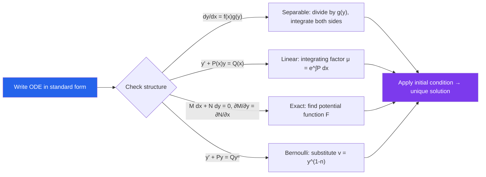

# 📐 First Order ODEs

> [!abstract] TL;DR
> A first-order ODE relates a function $y(x)$ to its derivative $y'$. Four main solution strategies — separable, linear, exact, and Bernoulli — handle the vast majority of cases encountered in physics and engineering. The right method depends on recognizing the equation's structure.

## Intuition — analogy FIRST

Think of a first-order ODE as a rule that tells you the *slope* of a curve at every point — like a GPS that continuously tells you your heading but never your position. Solving the ODE means reconstructing the full path from only slope information. Just as there are many roads through a city, there are infinitely many solution curves (a family); specifying an initial condition pins down the unique route you actually took.

---

## How It Works

---

## Key Concepts / Details

### Definitions

An **ordinary differential equation (ODE)** of order $n$ has the form $F(x, y, y', \ldots, y^{(n)}) = 0$. The **order** is the highest derivative present; the **degree** is the power of that highest derivative (when polynomial). An **initial value problem (IVP)** appends a condition $y(x_0) = y_0$.

### Separable Equations

A separable ODE has the form $\dfrac{dy}{dx} = f(x)\,g(y)$. Rearranging:

$$\frac{dy}{g(y)} = f(x)\,dx \implies \int \frac{dy}{g(y)} = \int f(x)\,dx + C$$

**Example.** $\dfrac{dy}{dx} = xy$: separate to get $\dfrac{dy}{y} = x\,dx$, integrate to get $\ln|y| = \tfrac{x^2}{2} + C$, so $y = Ae^{x^2/2}$.

### Linear First-Order Equations

Standard form: $y' + P(x)y = Q(x)$. The **integrating factor** is $\mu(x) = e^{\int P(x)\,dx}$. Multiplying through:

$$\frac{d}{dx}\bigl[\mu(x)\,y\bigr] = \mu(x)\,Q(x)$$

Integrate both sides and solve for $y$.

### Exact Equations

$M(x,y)\,dx + N(x,y)\,dy = 0$ is **exact** when $\dfrac{\partial M}{\partial y} = \dfrac{\partial N}{\partial x}$. Then $\exists F$ with $F_x = M$, $F_y = N$, and the solution is $F(x,y) = C$.

### Bernoulli Equation

$y' + P(x)y = Q(x)y^n$ ($n \neq 0,1$). Substitution $v = y^{1-n}$ transforms it into a linear equation in $v$:

$$v' + (1-n)P(x)\,v = (1-n)Q(x)$$

### Homogeneous Equations

$\dfrac{dy}{dx} = F\!\left(\dfrac{y}{x}\right)$. Substitution $v = y/x$ (so $y = vx$, $y' = v + xv'$) reduces to a separable equation in $v(x)$.

### Existence and Uniqueness (Picard-Lindelöf)

If $f(x,y)$ and $\partial f/\partial y$ are continuous on a rectangle containing $(x_0, y_0)$, then the IVP $y' = f(x,y)$, $y(x_0) = y_0$ has a **unique** local solution. The theorem guarantees existence but does not provide the solution explicitly.

### Direction Fields and Autonomous Equations

A **direction field** plots the slope $f(x,y)$ at each point — solution curves are tangent to these slopes. **Autonomous equations** $y' = f(y)$ have slopes depending only on $y$. **Equilibrium solutions** satisfy $f(y^*) = 0$; stability is determined by the sign of $f'(y^*)$: negative → stable, positive → unstable.

---

## Real-World Notes

- **Newton's Law of Cooling**: $T' = k(T - T_\text{env})$ is separable; solution $T(t) = T_\text{env} + (T_0 - T_\text{env})e^{kt}$ with $k < 0$. Used in forensics to estimate time of death.
- **RC Circuits**: $Q' + Q/(RC) = V/R$ is a linear first-order ODE. The integrating factor gives $Q(t) = CV(1 - e^{-t/RC})$, modeling how a capacitor charges.
- **Logistic Growth**: $P' = rP(1 - P/K)$ is separable; the solution $P(t) = K/(1 + Ae^{-rt})$ models populations approaching a carrying capacity.
- **Terminal Velocity**: $mv' = mg - bv$ is linear; solution shows velocity approaching $mg/b$ exponentially — the drag force balances gravity at steady state.

---

## Common Pitfalls

- **Forgetting the constant of integration**: Every indefinite integral introduces a constant $C$; dropping it produces an incomplete family of solutions, and the initial condition cannot then be satisfied.
- **Division by zero in separation**: Dividing by $g(y)$ is only valid when $g(y) \neq 0$; the roots of $g$ give singular/equilibrium solutions that must be checked separately.
- **Domain issues with implicit solutions**: An implicit solution $F(x,y) = C$ may define $y$ only locally. Always verify that the branch you extract actually satisfies the ODE and initial condition.
- **Checking exactness before assuming it**: Applying the exact-equation method without verifying $\partial M/\partial y = \partial N/\partial x$ leads to incorrect potential functions. Always verify first.

---

## Related Concepts

- [[_MOC_Differential_Equations|↑ Differential Equations MOC]]
- [[Second_Order_Linear_ODEs]] — extends methods to higher-order equations
- [[Laplace_Transform]] — transforms ODEs to algebraic equations
- [[Systems_of_ODEs]] — multiple coupled first-order equations

---

## Review Questions

1. Solve the IVP $\dfrac{dy}{dx} = \dfrac{x}{y}$, $y(0) = 3$. On what interval is the solution defined?
2. Find the general solution of $y' - 2xy = x$ using an integrating factor. Verify by substitution.
3. State the Picard-Lindelöf theorem. Give an example where its hypotheses fail and non-uniqueness occurs.
4. For the autonomous equation $y' = y(1-y)(y-2)$, identify all equilibria and classify each as stable or unstable using the direction field.

---

## Sources

- Boyce & DiPrima, *Elementary Differential Equations*, Ch. 1–2
- Tenenbaum & Pollard, *Ordinary Differential Equations*, Ch. 2
- Simmons, *Differential Equations with Applications and Historical Notes*, Ch. 2

#differential-equations #ODEs #first-order #mathematics
