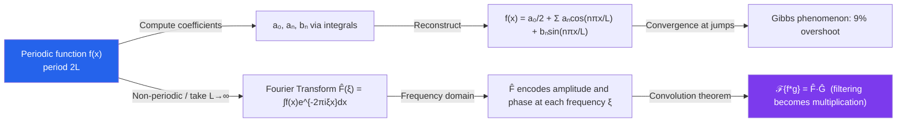

# 📐 Fourier Analysis

> [!abstract] TL;DR
> Fourier analysis decomposes functions into sines and cosines — nature's building blocks. Fourier series handle periodic functions as infinite sums; the Fourier transform extends this to all integrable functions, revealing the frequency content of signals. The convolution theorem makes filtering and signal processing algebraically tractable.

## Intuition — analogy FIRST

A musical chord is a mixture of pure tones — frequencies that your ear automatically separates. Fourier analysis is the mathematical version of this: any periodic signal, no matter how complex, is a sum of pure sine waves at harmonically related frequencies. The "Fourier coefficients" tell you how loud each frequency is. A square wave — the harsh buzz of a clarinet — is revealed to be the sum of infinitely many sine waves; the higher frequencies create the sharp edges. This frequency-domain view turns differential equations (which mix derivatives) into simple multiplication, because derivatives of sines and cosines just multiply by frequency.

---

## How It Works

---

## Key Concepts / Details

### Fourier Series

For a function $f(x)$ with period $2L$:

$$f(x) = \frac{a_0}{2} + \sum_{n=1}^\infty \left[a_n\cos\!\left(\frac{n\pi x}{L}\right) + b_n\sin\!\left(\frac{n\pi x}{L}\right)\right]$$

**Coefficients** are computed via orthogonality:

$$a_n = \frac{1}{L}\int_{-L}^{L} f(x)\cos\!\left(\frac{n\pi x}{L}\right)dx, \qquad b_n = \frac{1}{L}\int_{-L}^{L} f(x)\sin\!\left(\frac{n\pi x}{L}\right)dx$$

For $n=0$: $a_0 = \frac{1}{L}\int_{-L}^L f(x)\,dx$ (twice the mean).

**Even functions** ($f(-x) = f(x)$) have only cosine terms ($b_n = 0$). **Odd functions** have only sine terms ($a_n = 0$).

### Orthogonality Relations

The key identities underlying the formulas:

$$\int_{-L}^{L}\sin\!\left(\frac{m\pi x}{L}\right)\cos\!\left(\frac{n\pi x}{L}\right)dx = 0 \quad \forall m,n$$
$$\int_{-L}^{L}\cos\!\left(\frac{m\pi x}{L}\right)\cos\!\left(\frac{n\pi x}{L}\right)dx = L\,\delta_{mn}$$

The functions $\{1, \cos(n\pi x/L), \sin(n\pi x/L)\}_{n\geq 1}$ form an **orthogonal basis** of $L^2([-L,L])$.

### Convergence

**Dirichlet's theorem**: If $f$ is piecewise smooth (finitely many jumps and corners on $[-L,L]$), then the Fourier series converges to $f(x)$ at points of continuity, and to $\tfrac{1}{2}[f(x^-) + f(x^+)]$ at jumps.

**Gibbs phenomenon**: Near a jump discontinuity, partial sums overshoot by approximately 9% of the jump height, regardless of how many terms are included.

### Parseval's Identity (Energy Conservation)

$$\frac{1}{L}\int_{-L}^{L}|f(x)|^2\,dx = \frac{a_0^2}{2} + \sum_{n=1}^\infty (a_n^2 + b_n^2)$$

The total energy of $f$ equals the sum of squared Fourier coefficients — energy is conserved in the frequency domain.

### Complex Form

Using $e^{in\pi x/L} = \cos(n\pi x/L) + i\sin(n\pi x/L)$:

$$f(x) = \sum_{n=-\infty}^{\infty} c_n e^{in\pi x/L}, \qquad c_n = \frac{1}{2L}\int_{-L}^{L}f(x)e^{-in\pi x/L}\,dx$$

### Fourier Transform

For non-periodic functions (or $L \to \infty$):

$$\hat{f}(\xi) = \int_{-\infty}^{\infty} f(x)\,e^{-2\pi i\xi x}\,dx, \qquad f(x) = \int_{-\infty}^{\infty} \hat{f}(\xi)\,e^{2\pi i\xi x}\,d\xi$$

**Key properties:**
- **Linearity**: $\widehat{af + bg} = a\hat{f} + b\hat{g}$
- **Time-frequency duality**: $\hat{\hat{f}}(x) = f(-x)$
- **Derivative rule**: $\widehat{f'}(\xi) = 2\pi i\xi\,\hat{f}(\xi)$ (derivative → multiplication by $\xi$)
- **Convolution**: $\widehat{f*g} = \hat{f}\cdot\hat{g}$ (convolution becomes pointwise multiplication)
- **Plancherel/Parseval**: $\int|f|^2 = \int|\hat{f}|^2$

### Uncertainty Principle

You cannot simultaneously localize a function in both time and frequency. Formally:

$$\left(\int t^2|f(t)|^2\,dt\right)\!\!\left(\int\xi^2|\hat{f}(\xi)|^2\,d\xi\right) \geq \frac{\|f\|^4}{16\pi^2}$$

The Gaussian $f(t) = e^{-\pi t^2}$ is its own Fourier transform and achieves equality — it is the minimizer.

### Discrete Fourier Transform and FFT

For $N$ sampled values $x_0, \ldots, x_{N-1}$:

$$X_k = \sum_{n=0}^{N-1} x_n e^{-2\pi i kn/N}$$

The **FFT** computes this in $O(N\log N)$ rather than $O(N^2)$ by exploiting symmetry (Cooley-Tukey algorithm).

---

## Real-World Notes

- **MP3 Compression**: Audio is transformed to the frequency domain (using the modified discrete cosine transform, a Fourier variant); frequencies below the hearing threshold or masked by louder tones are discarded, reducing file size by 10× with minimal perceptible loss.
- **MRI Imaging**: The scanner collects data in "k-space" — the Fourier transform of the image. An inverse 2D Fourier transform reconstructs the anatomical image. Faster sampling trajectories through k-space reduce scan time.
- **Signal Filtering**: A low-pass filter in the frequency domain simply zeros out $\hat{f}(\xi)$ for $|\xi| > \xi_{\text{cutoff}}$. In the time domain this would require convolving with a sinc function — multiplying in frequency domain is far simpler.
- **Heat Equation**: Fourier series diagonalizes the heat equation $u_t = \alpha^2 u_{xx}$: each Fourier mode $\sin(n\pi x/L)$ evolves independently as $e^{-\alpha^2 n^2\pi^2 t/L^2}$, with higher frequencies decaying faster.

---

## Common Pitfalls

- **Confusing Fourier series and transform**: The series applies to periodic functions (or functions on a finite interval); the transform applies to functions on all of $\mathbb{R}$. They are related by $L \to \infty$ but require different formulas.
- **Convention inconsistency**: Different fields use different normalizations ($2\pi i\xi$ vs $i\omega$, symmetric vs asymmetric). Always specify your convention; mixing conventions produces factors of $2\pi$ in unexpected places.
- **Truncating the series and ignoring Gibbs**: For a function with jump discontinuities, adding more Fourier terms does not remove the overshoot near jumps — it just moves the overshoot closer to the jump. Smoothing methods (e.g., Cesàro summation, sigma factors) are needed.
- **Assuming fast decay in both domains**: The uncertainty principle forbids a function from being concentrated in both time and frequency. A very short pulse in time has a very wide spectrum — engineers must account for this in pulse-shaping.

---

## Related Concepts

- [[_MOC_Differential_Equations|↑ Differential Equations MOC]]
- [[Laplace_Transform]] — the Laplace transform is $\mathcal{F}$ restricted to $s = \sigma + i\omega$; the Fourier transform is the case $\sigma = 0$
- [[Introduction_to_PDEs]] — Fourier series is the primary tool for solving the heat and wave equations

---

## Review Questions

1. Compute the Fourier series of $f(x) = x$ on $[-\pi, \pi]$. What is the value of the series at $x = \pi$? Use Parseval's identity to sum $\sum_{n=1}^\infty 1/n^2$.
2. Explain the Gibbs phenomenon. Why does it not go away as we add more terms? Sketch the partial sum $S_5(x)$ for the square wave.
3. State and prove the convolution theorem for the Fourier transform. Why does this make filtering computationally efficient?
4. A Gaussian pulse $f(t) = e^{-at^2}$ is transmitted. Compute $\hat{f}(\xi)$ and describe how increasing $a$ (making the pulse narrower) affects the bandwidth.

---

## Sources

- Stein & Shakarchi, *Fourier Analysis: An Introduction*, Ch. 1–3
- Kreyszig, *Advanced Engineering Mathematics*, Ch. 11
- Bracewell, *The Fourier Transform and Its Applications*, Ch. 1–4

#differential-equations #fourier-series #fourier-transform #mathematics
