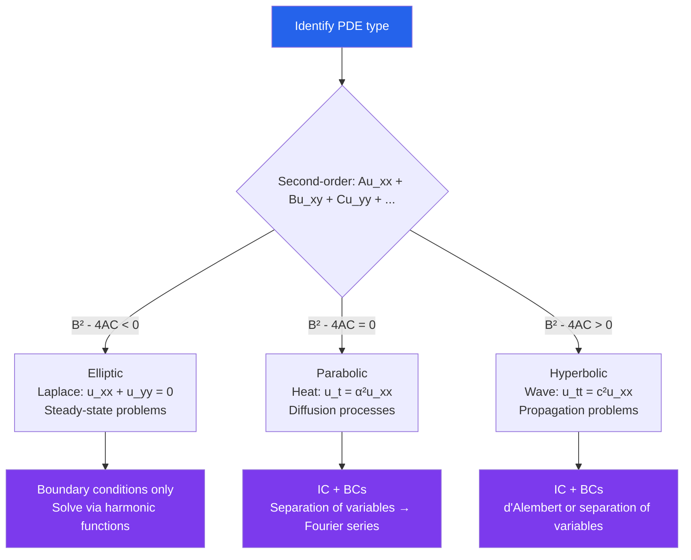

# 📐 Introduction to PDEs

> [!abstract] TL;DR
> PDEs involve partial derivatives with respect to multiple variables (space and time). The three canonical second-order PDEs — heat, wave, and Laplace — arise throughout physics and are solved by separation of variables combined with Fourier series. Classification as hyperbolic, parabolic, or elliptic determines which solution techniques apply.

## Intuition — analogy FIRST

An ODE describes a single particle's trajectory over time. A PDE describes a *field* — temperature at every point in a room, pressure at every point in a fluid, voltage across a circuit board. The challenge is that the unknown function depends on multiple variables simultaneously: temperature depends on both *where* and *when*. The key insight of separation of variables is that many solutions are products $u(x,t) = X(x)T(t)$ — the spatial and temporal parts decouple. It is like saying: "the shape of the heat distribution is fixed; only its amplitude changes with time." Fourier series then builds the general solution by superposing these special product solutions.

---

## How It Works

---

## Key Concepts / Details

### Definition and Classification

A PDE of order $n$ involves partial derivatives of a function $u(x_1,\ldots,x_k)$ up to order $n$. For **second-order** linear PDEs in two variables:

$$Au_{xx} + Bu_{xy} + Cu_{yy} + Du_x + Eu_y + Fu = G$$

The **discriminant** $\Delta = B^2 - 4AC$ classifies the equation:
- $\Delta < 0$: **Elliptic** (Laplace, Poisson) — like a circle equation
- $\Delta = 0$: **Parabolic** (heat/diffusion equation) — like a parabola
- $\Delta > 0$: **Hyperbolic** (wave equation) — like a hyperbola

### The Heat Equation

$$u_t = \alpha^2 u_{xx}, \quad 0 < x < L,\; t > 0$$

Models diffusion of heat. **Separation of variables**: assume $u(x,t) = X(x)T(t)$:

$$\frac{T'}{T} = \alpha^2\frac{X''}{X} = -\lambda^2 \quad\text{(separation constant)}$$

With Dirichlet BCs $u(0,t) = u(L,t) = 0$, the eigenfunctions are $X_n(x) = \sin(n\pi x/L)$ with $\lambda_n = n\pi/L$. Each mode decays: $T_n(t) = e^{-\alpha^2 n^2\pi^2 t/L^2}$. General solution:

$$u(x,t) = \sum_{n=1}^\infty b_n \sin\!\left(\frac{n\pi x}{L}\right)e^{-\alpha^2 n^2\pi^2 t/L^2}$$

Coefficients $b_n$ are determined by the initial condition $u(x,0) = f(x)$ via Fourier sine series.

### The Wave Equation

$$u_{tt} = c^2 u_{xx}, \quad c = \text{wave speed}$$

**d'Alembert's solution** on $\mathbb{R}$: any solution has the form

$$u(x,t) = f(x - ct) + g(x + ct)$$

where $f$ is a right-traveling wave and $g$ is a left-traveling wave. Initial conditions $u(x,0) = \phi(x)$, $u_t(x,0) = \psi(x)$ give:

$$u(x,t) = \frac{\phi(x-ct)+\phi(x+ct)}{2} + \frac{1}{2c}\int_{x-ct}^{x+ct}\psi(s)\,ds$$

On a bounded interval with fixed endpoints, use separation of variables to get standing wave solutions (vibrating string modes).

### Laplace's Equation

$$u_{xx} + u_{yy} = 0$$

Solutions are called **harmonic functions**. Key properties:
- **Mean value property**: $u(x_0, y_0) = $ average of $u$ on any circle centered at $(x_0, y_0)$.
- **Maximum principle**: $u$ attains its maximum (and minimum) on the boundary — never in the interior.
- Unique solution given boundary values (Dirichlet problem).

In polar coordinates, solutions take the form $r^n\cos(n\theta)$ and $r^n\sin(n\theta)$.

### Boundary Conditions

- **Dirichlet**: specify $u$ on the boundary (fixed temperature).
- **Neumann**: specify $\partial u/\partial n$ (heat flux, or insulated boundary when $= 0$).
- **Robin (mixed)**: linear combination $\alpha u + \beta \partial u/\partial n = g$.

Well-posedness (Hadamard): a PDE problem should have a unique solution that depends continuously on data. Elliptic equations require BCs on all boundaries; parabolic and hyperbolic require ICs plus BCs.

### Green's Functions

A **Green's function** $G(x,\xi)$ for an operator $L$ satisfies $LG = \delta(x-\xi)$ with homogeneous BCs. The solution to $Lu = f$ is then $u(x) = \int G(x,\xi)f(\xi)\,d\xi$. Green's functions are the fundamental inversion tool for linear PDEs.

---

## Real-World Notes

- **Heat Diffusion**: The heat equation governs temperature evolution in rods, fins, and electronic chips. The Fourier series solution shows that high spatial-frequency temperature variations (sharp gradients) smooth out exponentially fast — higher modes decay faster.
- **Sound and Light Waves**: The wave equation $u_{tt} = c^2\nabla^2 u$ (3D) governs acoustic pressure and electromagnetic fields. d'Alembert's solution explains why sound from a point source travels outward at speed $c$ without distortion.
- **Electrostatics**: Laplace's equation $\nabla^2 V = 0$ governs the electric potential in free space. The maximum principle ensures that the field has no local maxima away from charges — relevant to designing shielded devices.
- **Black-Scholes in Finance**: The option pricing equation $V_t + \tfrac{1}{2}\sigma^2 S^2 V_{SS} + rSV_S - rV = 0$ is a parabolic PDE (backward heat equation), solved with terminal conditions (option payoff) rather than initial conditions.

---

## Common Pitfalls

- **Applying ODE intuition**: Unlike ODEs, the general solution to a PDE cannot be described with a finite number of arbitrary constants — it requires arbitrary functions. The "general solution" is the full Fourier series.
- **Wrong type of boundary condition**: Elliptic PDEs need BCs on the entire boundary; specifying values on only part of the boundary leads to an ill-posed problem. Hyperbolic PDEs need Cauchy data (values and normal derivative) on a non-characteristic curve.
- **Ignoring convergence**: Term-by-term differentiation of a Fourier series is valid for $t > 0$ but may fail at $t = 0$. The heat equation solution is smooth for all $t > 0$ even for discontinuous initial data — but you cannot differentiate at $t = 0$.
- **Confusing d'Alembert and separation of variables**: d'Alembert applies to the wave equation on $\mathbb{R}$ (no boundaries); separation of variables applies on bounded domains $[0,L]$ with BCs. Using d'Alembert on a bounded domain requires the method of images.

---

## Related Concepts

- [[_MOC_Differential_Equations|↑ Differential Equations MOC]]
- [[Fourier_Analysis]] — Fourier series is the key tool for solving heat and wave equations
- [[Second_Order_Linear_ODEs]] — separation of variables reduces PDEs to ODEs
- [[Systems_of_ODEs]] — PDEs in multiple space dimensions discretize to large ODE systems

---

## Review Questions

1. Classify the PDE $u_{xx} + 4u_{xy} + 4u_{yy} + u_x = 0$. Find and solve the characteristic equations.
2. Solve the heat equation $u_t = u_{xx}$, $u(0,t) = u(\pi,t) = 0$, $u(x,0) = \sin(x) + \tfrac{1}{2}\sin(3x)$. Describe qualitatively how the solution evolves for large $t$.
3. Use d'Alembert's formula to solve the wave equation $u_{tt} = u_{xx}$ with $u(x,0) = \sin(x)$, $u_t(x,0) = 0$. Verify your answer satisfies the PDE and initial conditions.
4. State the maximum principle for Laplace's equation and explain its physical interpretation for a steady-state temperature distribution in a plate.

---

## Sources

- Strauss, *Partial Differential Equations: An Introduction*, Ch. 1–4
- Evans, *Partial Differential Equations*, Ch. 1–2
- Haberman, *Applied Partial Differential Equations*, Ch. 1–3

#differential-equations #PDEs #partial-differential-equations #mathematics
