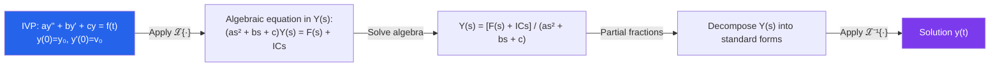

# 📐 Laplace Transform

> [!abstract] TL;DR
> The Laplace transform converts a differential equation in $t$-space into an algebraic equation in $s$-space, where differentiation becomes multiplication by $s$. This turns IVPs into algebra: transform, solve algebraically, then invert. It handles discontinuous forcing functions elegantly using Heaviside and Dirac delta functions.

## Intuition — analogy FIRST

Logarithms turn multiplication into addition — a hard operation into an easy one. The Laplace transform does the same for differential equations: derivatives (hard) become multiplications by $s$ (easy). You solve what is now an algebra problem in the "$s$-world", then invert back to the real "$t$-world." Engineers love it because initial conditions are automatically baked in, and switched-on/switched-off forcing (like flipping a switch at $t=1$) is handled naturally by the Heaviside function.

---

## How It Works

---

## Key Concepts / Details

### Definition and Domain

$$\mathcal{L}\{f(t)\}(s) = F(s) = \int_0^\infty e^{-st} f(t)\,dt$$

The transform exists for $s > \sigma_0$ (abscissa of convergence), where $\sigma_0$ depends on $f$'s growth rate. The original function $f$ must be piecewise continuous on $[0,\infty)$ and of **exponential order**: $|f(t)| \leq Me^{at}$ for some $M, a$.

### Transform Table

| $f(t)$ | $F(s) = \mathcal{L}\{f\}$ | Requires |
|---|---|---|
| $1$ | $\dfrac{1}{s}$ | $s > 0$ |
| $t^n$ | $\dfrac{n!}{s^{n+1}}$ | $s > 0$ |
| $e^{at}$ | $\dfrac{1}{s-a}$ | $s > a$ |
| $\sin(bt)$ | $\dfrac{b}{s^2+b^2}$ | $s > 0$ |
| $\cos(bt)$ | $\dfrac{s}{s^2+b^2}$ | $s > 0$ |
| $e^{at}\sin(bt)$ | $\dfrac{b}{(s-a)^2+b^2}$ | $s > a$ |

### Key Properties

**Linearity**: $\mathcal{L}\{af + bg\} = aF(s) + bG(s)$

**Derivative rule** (the key property for ODEs):
$$\mathcal{L}\{f'(t)\} = sF(s) - f(0), \quad \mathcal{L}\{f''(t)\} = s^2F(s) - sf(0) - f'(0)$$

Initial conditions are automatically incorporated. More generally, $\mathcal{L}\{f^{(n)}\} = s^n F(s) - \sum_{k=0}^{n-1} s^{n-1-k}f^{(k)}(0)$.

**$s$-shift (first shifting theorem)**: $\mathcal{L}\{e^{at}f(t)\} = F(s-a)$

**$t$-shift (second shifting theorem)**: $\mathcal{L}\{f(t-a)u(t-a)\} = e^{-as}F(s)$

**Convolution theorem**: $\mathcal{L}\{(f * g)(t)\} = F(s)G(s)$ where $(f*g)(t) = \int_0^t f(\tau)g(t-\tau)\,d\tau$

### Heaviside Step Function

$u(t-a) = \begin{cases}0 & t < a \\ 1 & t \geq a\end{cases}$ models a switch turned on at $t = a$. A piecewise-defined forcing $f$ can be written as a linear combination of shifted Heaviside functions.

### Dirac Delta Function

$\delta(t-a)$ represents an instantaneous impulse at $t=a$: $\mathcal{L}\{\delta(t-a)\} = e^{-as}$. It models hammer blows, electrical spikes, and instantaneous momentum transfers.

### Solving IVPs: Workflow

1. Apply $\mathcal{L}$ to both sides; use linearity and derivative rules to get $Y(s)$.
2. Incorporate initial conditions algebraically.
3. Solve for $Y(s) = \text{rational function of } s$.
4. Decompose via partial fractions into recognizable pieces.
5. Apply $\mathcal{L}^{-1}$ term by term using the transform table.

### Transfer Functions

In engineering, write the ODE as $P(D)y = Q(D)f$ (with $D = d/dt$). The **transfer function** is $H(s) = Q(s)/P(s)$ and satisfies $Y(s) = H(s)F(s)$ (zero initial conditions). $H(s)$ encapsulates the system's frequency response; poles of $H$ determine stability.

---

## Real-World Notes

- **Control Systems**: PID controllers use the transfer function framework. The Laplace transform lets engineers design feedback loops by manipulating poles and zeros in the $s$-plane — pole placement is a standard design technique.
- **Circuit Analysis**: $\mathcal{L}$ converts circuit element relationships ($V = L\,dI/dt$, $I = C\,dV/dt$) into algebraic impedances: $Z_L = Ls$, $Z_C = 1/(Cs)$. Complex circuits become linear algebra problems.
- **Signal Processing**: The Laplace transform is the continuous analog of the $z$-transform for discrete signals. Filters are designed by specifying where poles and zeros of $H(s)$ should lie.
- **Mechanical Vibrations**: Solving the spring-mass-damper equation with an impulsive force $F_0\delta(t)$ gives the **impulse response** $h(t)$; any forcing $f(t)$ is then handled via $y = h * f$ (convolution).

---

## Common Pitfalls

- **Applying the transform to $t < 0$**: The standard Laplace transform assumes $f(t) = 0$ for $t < 0$ (causal functions). If $f$ has activity for negative $t$, the bilateral transform is needed.
- **Partial fraction errors with repeated roots**: A double pole $(s-a)^2$ requires terms $A/(s-a) + B/(s-a)^2$ separately. Using only $A/(s-a)$ leads to an incorrect inversion.
- **Forgetting the Heaviside when inverting shifted transforms**: $\mathcal{L}^{-1}\{e^{-as}F(s)\} = f(t-a)u(t-a)$. The Heaviside factor $u(t-a)$ ensures the function is zero for $t < a$.
- **Using the table without checking the ROC**: The transform $1/(s-2)$ inverts to $e^{2t}$ (growing exponential), not $e^{-2t}$. Match the sign in the exponent carefully with the $s$-shift formula.

---

## Related Concepts

- [[_MOC_Differential_Equations|↑ Differential Equations MOC]]
- [[First_Order_ODEs]] — Laplace handles IVPs for any linear ODE order
- [[Second_Order_Linear_ODEs]] — primary application target
- [[Fourier_Analysis]] — Fourier transform is $\mathcal{L}$ evaluated on the imaginary axis $s = i\omega$

---

## Review Questions

1. Use the Laplace transform to solve $y'' + 4y = \sin(2t)$, $y(0) = 0$, $y'(0) = 1$. Identify the resonance in $Y(s)$.
2. Compute $\mathcal{L}\{t^2 e^{-3t}\cos(t)\}$ using $s$-shifting and the derivative rule. Simplify fully.
3. A system's transfer function is $H(s) = (s+1)/((s+2)(s^2+4))$. Find the response $Y(s)$ to a unit step $u(t)$ and invert to find $y(t)$.
4. Explain why $\mathcal{L}\{\delta(t)\} = 1$ (the impulse response transforms to a constant). What does this imply about a system whose transfer function is $H(s) = 1$?

---

## Sources

- Boyce & DiPrima, *Elementary Differential Equations*, Ch. 6
- Kreyszig, *Advanced Engineering Mathematics*, Ch. 6
- Oppenheim & Willsky, *Signals and Systems*, Ch. 9

#differential-equations #laplace-transform #mathematics
