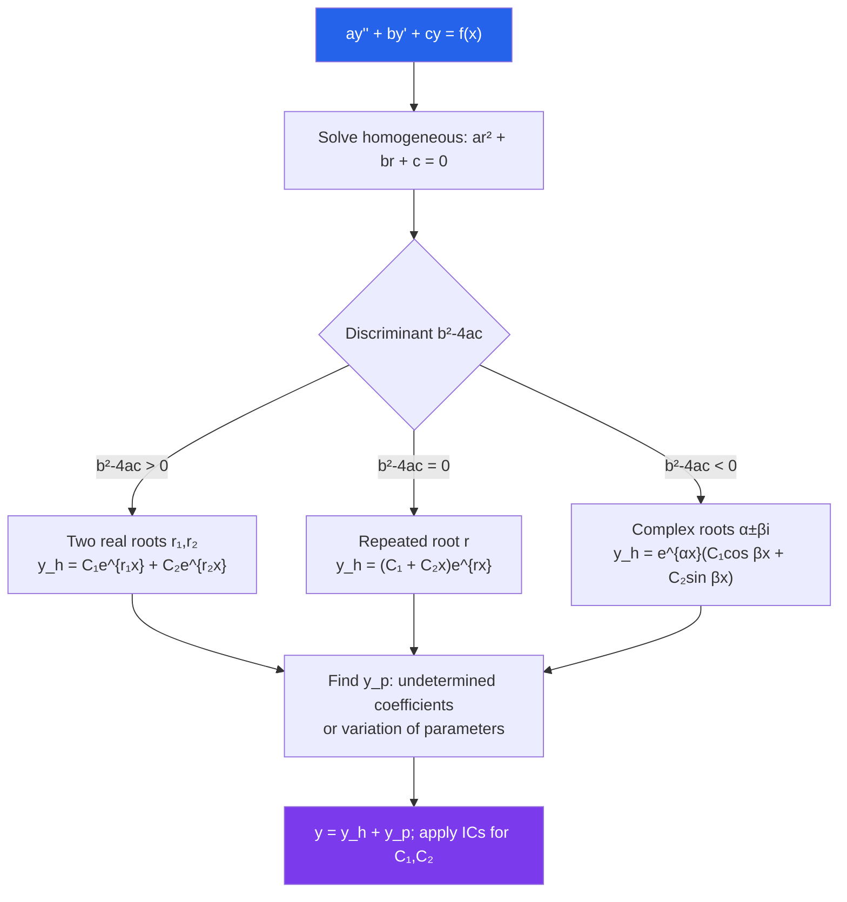

# 📐 Second Order Linear ODEs

> [!abstract] TL;DR
> A second-order linear ODE $ay'' + by' + cy = f(x)$ models vibrations, circuits, and beams. The homogeneous solution comes from the characteristic equation's roots (real, repeated, or complex), and a particular solution is added for the non-homogeneous case via undetermined coefficients or variation of parameters.

## Intuition — analogy FIRST

Imagine a mass on a spring inside a viscous fluid, being pushed by an external force. The mass's position $y(t)$ satisfies a second-order ODE: the spring pulls it back (the $cy$ term), the fluid resists motion (the $by'$ term), inertia resists acceleration (the $ay''$ term), and the external push is $f(t)$. Solving the ODE tells you whether the mass oscillates, damps out, or resonates catastrophically — the Tacoma Narrows Bridge collapsed because its ODE had an undamped resonant forcing term.

---

## How It Works

---

## Key Concepts / Details

### Structure of the General Solution

For the homogeneous equation $ay'' + by' + cy = 0$, the **superposition principle** guarantees that any linear combination of solutions is also a solution. The general solution is $y_h = C_1 y_1 + C_2 y_2$ where $y_1, y_2$ are **linearly independent** solutions.

### Wronskian and Linear Independence

The **Wronskian** of two solutions $y_1, y_2$ is:

$$W(y_1, y_2) = \begin{vmatrix} y_1 & y_2 \\ y_1' & y_2' \end{vmatrix} = y_1 y_2' - y_1' y_2$$

$W \neq 0$ on an interval $\iff$ $y_1, y_2$ are linearly independent there. Abel's theorem: $W(x) = W(x_0)\exp\!\left(-\int_{x_0}^x \frac{b}{a}\,dt\right)$ — the Wronskian never changes sign on an interval of analyticity.

### Characteristic Equation

Substituting $y = e^{rx}$ into $ay'' + by' + cy = 0$ gives the **characteristic equation** $ar^2 + br + c = 0$. Its roots $r = \dfrac{-b \pm \sqrt{b^2 - 4ac}}{2a}$ determine the solution form:

| Discriminant | Roots | Homogeneous solution |
|---|---|---|
| $b^2 - 4ac > 0$ | $r_1 \neq r_2 \in \mathbb{R}$ | $C_1 e^{r_1 x} + C_2 e^{r_2 x}$ |
| $b^2 - 4ac = 0$ | $r_1 = r_2 = r$ | $(C_1 + C_2 x)e^{rx}$ |
| $b^2 - 4ac < 0$ | $\alpha \pm \beta i$ | $e^{\alpha x}(C_1\cos\beta x + C_2\sin\beta x)$ |

### Method of Undetermined Coefficients

When $f(x)$ is a polynomial, exponential, sine, cosine, or their products, guess a **particular solution** $y_p$ of the same form with unknown coefficients, substitute, and solve. Key rule: if the guess overlaps with a term in $y_h$, multiply by $x$ (or $x^2$ if repeated overlap).

| $f(x)$ | Trial $y_p$ |
|---|---|
| $P_n(x)$ (degree $n$ poly) | $A_nx^n + \cdots + A_0$ |
| $e^{ax}$ | $Ae^{ax}$ |
| $\sin(bx)$ or $\cos(bx)$ | $A\cos(bx) + B\sin(bx)$ |
| $e^{ax}\sin(bx)$ | $e^{ax}(A\cos bx + B\sin bx)$ |

### Variation of Parameters

Given solutions $y_1, y_2$ to the homogeneous equation, a particular solution is:

$$y_p = -y_1\int\frac{y_2 f}{a W}\,dx + y_2\int\frac{y_1 f}{a W}\,dx$$

This works for **any** continuous $f(x)$, not just the special forms above.

### Reduction of Order

Given one solution $y_1$, substitute $y_2 = v(x)y_1$ and solve for $v'$ — the ODE for $v'$ is first-order. This always yields the second independent solution.

### Spring-Mass System and Damping

The model $my'' + by' + ky = F(t)$ describes a mass $m$ on a spring (constant $k$) with damping $b$. The natural frequency is $\omega_0 = \sqrt{k/m}$. Cases:
- **Underdamped** ($b^2 < 4mk$): oscillations decay — complex conjugate roots.
- **Critically damped** ($b^2 = 4mk$): fastest return to rest — repeated real root.
- **Overdamped** ($b^2 > 4mk$): slow, no oscillation — two distinct negative real roots.

### Resonance

When $F(t) = F_0\cos(\omega_0 t)$ (driving at the natural frequency) and $b=0$, the particular solution contains a term $\sim t\sin(\omega_0 t)$ — amplitude grows without bound. This is **pure resonance**.

---

## Real-World Notes

- **RLC Circuits**: $L\,Q'' + R\,Q' + Q/C = E(t)$ is exactly the spring-mass analogy: $L \leftrightarrow m$, $R \leftrightarrow b$, $1/C \leftrightarrow k$. Underdamped circuits oscillate; overdamped ones charge slowly.
- **Suspension Systems**: Car suspensions are designed to be slightly underdamped — oscillations die out quickly but not abruptly. Critical damping gives the smoothest response.
- **Acoustic Resonance**: Musical instruments are designed so that their resonant frequencies (characteristic equation roots) match desired pitches; resonance amplifies those frequencies.
- **Structural Engineering**: Engineers ensure that bridge natural frequencies do not coincide with wind or traffic frequencies, avoiding the resonance that destroyed the Tacoma Narrows Bridge in 1940.

---

## Common Pitfalls

- **Forgetting the modification rule**: If the trial function for $y_p$ duplicates a term in $y_h$, you must multiply by $x$ (once for simple overlap, $x^2$ for repeated roots). Omitting this makes the system of equations inconsistent.
- **Sign errors in complex roots**: When $r = \alpha \pm \beta i$, write $e^{\alpha x}\cos(\beta x)$ — not $e^{i\beta x}$ directly. Use Euler's formula $e^{i\theta} = \cos\theta + i\sin\theta$ carefully.
- **Applying initial conditions too early**: Apply $y(x_0) = y_0$ and $y'(x_0) = y_0'$ only after forming the *complete* general solution $y = y_h + y_p$, not just to $y_h$.
- **Confusing order and degree**: Degree refers to the power of the highest derivative when written as a polynomial; a nonlinear ODE like $(y'')^2 + y = 0$ has order 2 but degree 2 — the characteristic equation method does not apply.

---

## Related Concepts

- [[_MOC_Differential_Equations|↑ Differential Equations MOC]]
- [[First_Order_ODEs]] — foundational methods; reduction of order links both
- [[Systems_of_ODEs]] — a second-order ODE can be rewritten as a 2×2 system
- [[Laplace_Transform]] — converts the ODE to an algebraic equation directly

---

## Review Questions

1. Solve $y'' - 5y' + 6y = 0$ with $y(0) = 1$, $y'(0) = 0$. Identify the type of damping.
2. Find the general solution of $y'' + 4y = \cos(2x)$. Explain why modification is needed and write the corrected trial function.
3. Use variation of parameters to find a particular solution of $y'' + y = \sec(x)$, which cannot be solved by undetermined coefficients.
4. A spring-mass system has $m = 1$, $k = 9$, $b = 6$. Classify the damping and describe the qualitative behavior of solutions.

---

## Sources

- Boyce & DiPrima, *Elementary Differential Equations*, Ch. 3–4
- Kreyszig, *Advanced Engineering Mathematics*, Ch. 2
- Simmons, *Differential Equations with Applications and Historical Notes*, Ch. 3–4

#differential-equations #ODEs #second-order #mathematics
