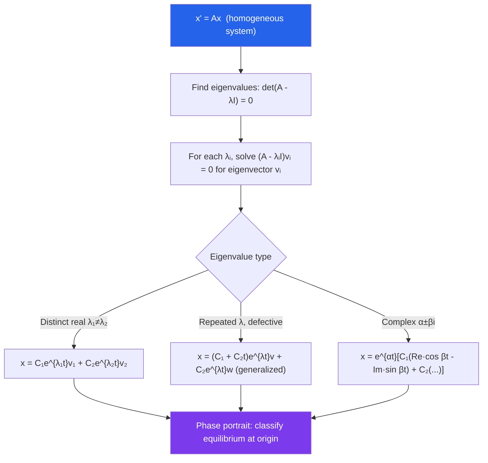

# 📐 Systems of ODEs

> [!abstract] TL;DR
> A system of ODEs $\mathbf{x}' = A\mathbf{x}$ generalizes the single-equation case using linear algebra: eigenvalues replace the characteristic equation's roots, and eigenvectors provide the solution directions. The phase plane reveals qualitative behavior — spirals, saddles, nodes — without solving explicitly.

## Intuition — analogy FIRST

Imagine two populations — rabbits and foxes — each changing at rates that depend on both populations simultaneously. You cannot study rabbits in isolation; their dynamics are coupled. A system of ODEs captures exactly this interdependence. The **phase plane** is the map of all possible states $(x,y)$, and trajectories on it are the "roads" the system travels — no clocks, just shape. By classifying the equilibrium point at the origin, you immediately know whether populations oscillate indefinitely, one species drives the other to extinction, or coexistence is stable.

---

## How It Works

---

## Key Concepts / Details

### Matrix Form

A first-order system of $n$ equations:

$$\mathbf{x}' = A\mathbf{x} + \mathbf{b}(t), \quad \mathbf{x}(t) = \begin{pmatrix}x_1(t)\\\vdots\\x_n(t)\end{pmatrix}, \quad A \in \mathbb{R}^{n\times n}$$

Any $n$th-order ODE reduces to a first-order system of size $n$ by introducing $x_1 = y$, $x_2 = y'$, $\ldots$, $x_n = y^{(n-1)}$.

### Solving Homogeneous Systems

The general solution of $\mathbf{x}' = A\mathbf{x}$ is:

$$\mathbf{x}(t) = \sum_{i=1}^n C_i e^{\lambda_i t}\mathbf{v}_i$$

where $(\lambda_i, \mathbf{v}_i)$ are eigenvalue-eigenvector pairs. When $A$ has **complex eigenvalues** $\lambda = \alpha \pm \beta i$ with eigenvector $\mathbf{v} = \mathbf{p} + i\mathbf{q}$, the real-valued solutions are $e^{\alpha t}(\mathbf{p}\cos\beta t - \mathbf{q}\sin\beta t)$ and $e^{\alpha t}(\mathbf{p}\sin\beta t + \mathbf{q}\cos\beta t)$.

### Phase Plane Analysis

The **phase plane** (for 2D systems) plots $(x_1, x_2)$ trajectories. **Nullclines** are curves where $x_1' = 0$ (vertical nullcline) or $x_2' = 0$ (horizontal nullcline); their intersections are **equilibrium points**.

### Classification of Equilibria (2D)

| Eigenvalues | Equilibrium Type | Stability |
|---|---|---|
| $\lambda_1, \lambda_2 < 0$ (real) | Stable node | Asymptotically stable |
| $\lambda_1, \lambda_2 > 0$ (real) | Unstable node | Unstable |
| $\lambda_1 < 0 < \lambda_2$ (real) | Saddle point | Unstable |
| $\alpha \pm \beta i$, $\alpha < 0$ | Stable spiral | Asymptotically stable |
| $\alpha \pm \beta i$, $\alpha > 0$ | Unstable spiral | Unstable |
| $\pm \beta i$ (pure imaginary) | Center | Lyapunov stable (not asymptotic) |

### Stability — Lyapunov's Criterion

For the linear system $\mathbf{x}' = A\mathbf{x}$:
- **Asymptotically stable**: $\text{Re}(\lambda_i) < 0$ for all $i$
- **Lyapunov stable**: $\text{Re}(\lambda_i) \leq 0$ with semisimple zero eigenvalues
- **Unstable**: any $\text{Re}(\lambda_i) > 0$

### Linearization of Nonlinear Systems

Near an equilibrium $\mathbf{x}^*$ of $\mathbf{x}' = \mathbf{f}(\mathbf{x})$, the **Jacobian** $J = \partial\mathbf{f}/\partial\mathbf{x}\big|_{\mathbf{x}^*}$ gives the linearized system. For hyperbolic equilibria (no eigenvalue on the imaginary axis), the phase portrait of the nonlinear system near $\mathbf{x}^*$ is topologically equivalent to that of the linearization (Hartman-Grobman theorem).

### Predator-Prey (Lotka-Volterra)

$$\frac{dx}{dt} = ax - bxy, \quad \frac{dy}{dt} = -cy + dxy$$

The nontrivial equilibrium $(c/d, a/b)$ has purely imaginary eigenvalues — a center in the linearization. The nonlinear system has closed periodic orbits around it (populations oscillate indefinitely).

---

## Real-World Notes

- **Predator-Prey Dynamics**: Lotka-Volterra equations explain why rabbit and fox populations oscillate out of phase — as rabbits increase, foxes thrive; as foxes peak, rabbits crash, then foxes decline.
- **SIR Epidemic Model**: $S' = -\beta SI$, $I' = \beta SI - \gamma I$, $R' = \gamma I$ is a nonlinear 3D system. The phase portrait determines whether an epidemic dies out or reaches a threshold.
- **Coupled Oscillators**: Two pendulums connected by a spring form a 4D linear system. Its eigenmodes give the "in-phase" and "out-of-phase" oscillation frequencies.
- **Neural Firing (Hodgkin-Huxley)**: Neuron action potentials are governed by a 4D nonlinear ODE system; equilibrium classification predicts whether a neuron fires tonically or in bursts.

---

## Common Pitfalls

- **Defective matrices**: When eigenvalues repeat but there are not enough eigenvectors, you need **generalized eigenvectors** satisfying $(A - \lambda I)\mathbf{w} = \mathbf{v}$. Forgetting this gives an incomplete solution.
- **Phase plane vs time plot**: The phase plane shows all trajectories simultaneously but hides time information. A spiral toward the origin in the phase plane means oscillations *with* decay — not an indefinitely oscillating trajectory.
- **Linearization failure at non-hyperbolic equilibria**: If the Jacobian has purely imaginary eigenvalues, the linearization says "center" but the nonlinear system may be a stable or unstable spiral. Always check higher-order terms or use a Lyapunov function.
- **Forgetting to convert back**: When rewriting a 2nd-order ODE as a system, the initial condition $y(0) = y_0$, $y'(0) = v_0$ becomes $x_1(0) = y_0$, $x_2(0) = v_0$. Mixing these up gives the wrong particular solution.

---

## Related Concepts

- [[_MOC_Differential_Equations|↑ Differential Equations MOC]]
- [[Second_Order_Linear_ODEs]] — a 2nd-order ODE is equivalent to a 2D system
- [[First_Order_ODEs]] — building blocks of each component equation
- [[Introduction_to_PDEs]] — PDEs become ODE systems after discretization

---

## Review Questions

1. Find the general solution of $x' = \begin{pmatrix}2 & 1\\0 & 2\end{pmatrix}x$. What type of equilibrium does the origin represent?
2. For the system $x' = -y$, $y' = x$, classify the equilibrium at the origin and sketch the phase portrait. What physical system does this model?
3. Write the Lotka-Volterra equations, find all equilibria, and determine the Jacobian at the nontrivial equilibrium. What do the eigenvalues imply about population dynamics?
4. Explain why the Hartman-Grobman theorem fails to classify a center (purely imaginary eigenvalues) as stable or unstable for nonlinear systems. Give an example of each case.

---

## Sources

- Boyce & DiPrima, *Elementary Differential Equations*, Ch. 7
- Strogatz, *Nonlinear Dynamics and Chaos*, Ch. 2–6
- Hirsch, Smale & Devaney, *Differential Equations, Dynamical Systems, and an Introduction to Chaos*, Ch. 2–4

#differential-equations #systems #phase-plane #mathematics
