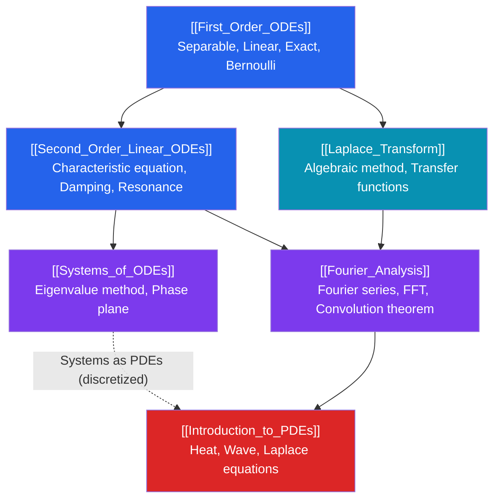

# 📐 Differential Equations — Map of Content

> [!abstract] Overview
> Differential equations from first-order methods through systems, Laplace and Fourier transforms, and an introduction to PDEs — essential for physics, engineering, and mathematical modeling. This section bridges pure calculus and applied mathematics, providing tools used daily in control theory, signal processing, fluid dynamics, and quantitative finance.

---

## Knowledge Graph

---

## Learning Path

| Step | Note | Difficulty | Core Idea |
|------|------|-----------|-----------|
| 1 | [[First_Order_ODEs]] | Intermediate | Separation, integrating factor, Picard-Lindelöf theorem |
| 2 | [[Second_Order_Linear_ODEs]] | Intermediate | Characteristic roots, undetermined coefficients, variation of parameters |
| 3 | [[Laplace_Transform]] | Intermediate | Transform to algebra, Heaviside/Dirac, transfer functions |
| 4 | [[Systems_of_ODEs]] | Advanced | Eigenvalue method, phase portraits, stability |
| 5 | [[Fourier_Analysis]] | Advanced | Orthogonality, Fourier series, Fourier transform, FFT |
| 6 | [[Introduction_to_PDEs]] | Advanced | Heat/wave/Laplace, separation of variables, d'Alembert |

---

## Notes in This Section

### [[First_Order_ODEs]]
Methods for $y' = f(x,y)$: separable, linear (integrating factor), exact (potential function), Bernoulli (substitution). Existence/uniqueness via Picard-Lindelöf. Direction fields for geometric insight.

### [[Second_Order_Linear_ODEs]]
General theory: Wronskian, superposition, characteristic equation (3 root cases). Particular solutions via undetermined coefficients and variation of parameters. Spring-mass system, resonance.

### [[Systems_of_ODEs]]
Matrix form $\mathbf{x}' = A\mathbf{x}$; eigenvalue-eigenvector solutions. Phase plane analysis; equilibrium classification (nodes, spirals, saddles, centers). Linearization of nonlinear systems via Jacobian.

### [[Laplace_Transform]]
Definition $\mathcal{L}\{f\} = \int_0^\infty e^{-st}f\,dt$. Key properties: derivative rule, shifting theorems, convolution. Heaviside step and Dirac delta. Full IVP workflow. Transfer functions in control.

### [[Fourier_Analysis]]
Fourier series: coefficients, orthogonality, convergence, Gibbs phenomenon, Parseval. Fourier transform: properties, convolution theorem, uncertainty principle. DFT and FFT overview.

### [[Introduction_to_PDEs]]
Classification: hyperbolic/parabolic/elliptic. Heat equation (separation of variables + Fourier series), wave equation (d'Alembert solution), Laplace equation (harmonic functions, max principle). Green's functions preview.

---

## Prerequisites

- [[Calculus_Integration_Techniques]] — integration by parts, substitution, partial fractions (needed in every solution method)
- [[Linear_Algebra_Eigenvalues]] — eigenvalues/eigenvectors for Systems of ODEs
- [[Real_Numbers_and_Completeness]] — theoretical underpinning for existence theorems

---

## Key Theorems at a Glance

| Theorem | Statement |
|---------|-----------|
| Picard-Lindelöf | If $f$ and $\partial f/\partial y$ continuous near $(x_0,y_0)$, IVP $y'=f$, $y(x_0)=y_0$ has unique local solution |
| Superposition | Linear combination of solutions to a homogeneous linear ODE is a solution |
| Abel's Theorem | Wronskian satisfies $W(x) = W(x_0)e^{-\int P}$; either always zero or never zero |
| Hartman-Grobman | Near hyperbolic equilibrium, nonlinear system is topologically conjugate to its linearization |
| Dirichlet | Piecewise smooth periodic function equals its Fourier series at continuity points |
| d'Alembert | Wave equation solution: $u = f(x-ct) + g(x+ct)$ |

---

## Common Application Domains

- **Physics**: Newton's laws → 2nd-order ODE; Maxwell's equations → PDEs; quantum mechanics → Schrödinger (PDE)
- **Engineering**: Control systems (Laplace), vibrations (2nd-order ODE), heat transfer (heat PDE)
- **Biology**: Population models (logistic, Lotka-Volterra systems), epidemic models (SIR system)
- **Finance**: Black-Scholes option pricing (parabolic PDE), interest rate models (SDEs)
- **Signal Processing**: Fourier transform, filtering, FFT for all digital signal work

---

## Sources

- Boyce & DiPrima, *Elementary Differential Equations and Boundary Value Problems*
- Strogatz, *Nonlinear Dynamics and Chaos*
- Strauss, *Partial Differential Equations: An Introduction*
- Kreyszig, *Advanced Engineering Mathematics*

#differential-equations #MOC #mathematics
