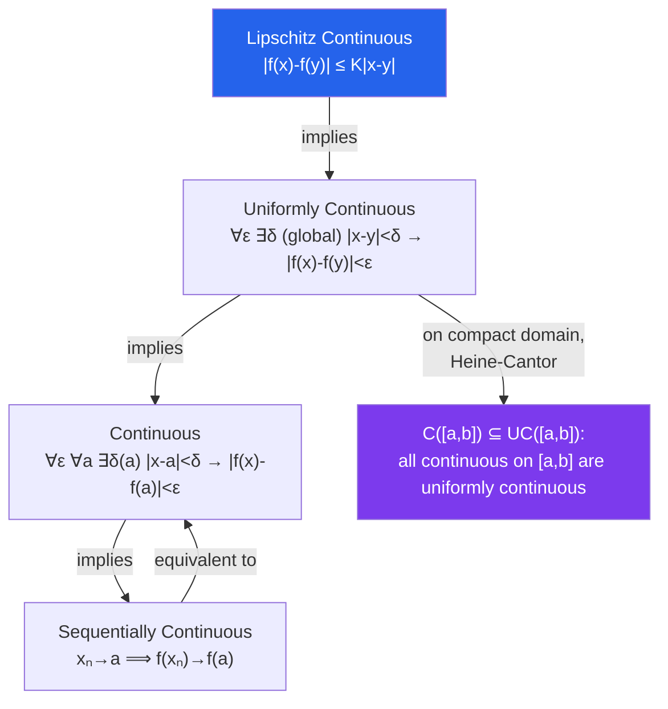

# ε Continuity and Uniform Continuity

> [!abstract] TL;DR
> Continuity at a point is captured by the $\varepsilon$-$\delta$ definition: small changes in input produce small changes in output. Uniform continuity strengthens this so that a single $\delta$ works everywhere on the domain simultaneously. On compact sets, every continuous function is automatically uniformly continuous — a profound link between topology and analysis.

## Intuition — analogy FIRST

Continuity at a point says: "if you stand near $a$ and measure the output, it won't jump suddenly." Uniform continuity is stricter: "everywhere on the domain, the same resolution $\delta$ in input always produces at most $\varepsilon$ variation in output — no matter where you look." The function $f(x) = 1/x$ on $(0,1)$ is continuous but *not* uniformly continuous: near $x = 0$, even tiny changes in $x$ cause huge changes in $f(x)$, so no single $\delta$ works. But $f(x) = x^2$ on $[0,1]$ is uniformly continuous — the compact domain prevents the function from "running away."

---

## How It Works

---

## Key Concepts / Details

### Epsilon-Delta Definition

$f: D \to \mathbb{R}$ is **continuous at** $a \in D$ if:

$$\forall \varepsilon > 0,\; \exists \delta > 0:\; x \in D,\; |x - a| < \delta \implies |f(x) - f(a)| < \varepsilon$$

Equivalently (sequential characterization): for every sequence $(x_n)$ in $D$ with $x_n \to a$, we have $f(x_n) \to f(a)$.

$f$ is **continuous on $D$** if it is continuous at every point of $D$.

### Operations on Continuous Functions

If $f, g: D \to \mathbb{R}$ are continuous at $a$:
- $f + g$, $cf$, $fg$ are continuous at $a$
- $f/g$ is continuous at $a$ provided $g(a) \neq 0$
- $g \circ f$ is continuous at $a$ (composition)

Polynomials, rational functions (off their poles), trigonometric functions, exponential and logarithm are all continuous on their domains.

### Intermediate Value Theorem (IVT)

If $f: [a,b] \to \mathbb{R}$ is continuous, and $y$ lies strictly between $f(a)$ and $f(b)$, then there exists $c \in (a,b)$ such that $f(c) = y$.

*Proof sketch using completeness*: Let $S = \{x \in [a,b] : f(x) < y\}$; then $c = \sup S$ exists by the LUB property. Show $f(c) = y$ by ruling out $f(c) < y$ and $f(c) > y$ using continuity.

**Corollary**: Every odd-degree polynomial has a real root. Every continuous function on $[a,b]$ with $f(a)f(b) < 0$ has a zero in $(a,b)$ (bisection method foundation).

### Extreme Value Theorem (EVT)

If $f: [a,b] \to \mathbb{R}$ is continuous, then $f$ **attains** its maximum and minimum: $\exists c, d \in [a,b]$ such that $f(d) \leq f(x) \leq f(c)$ for all $x \in [a,b]$.

*Proof requires*: (1) continuous image of compact set is compact — uses Bolzano-Weierstrass; (2) a compact subset of $\mathbb{R}$ is closed and bounded — attains its sup.

### Uniform Continuity

$f: D \to \mathbb{R}$ is **uniformly continuous** on $D$ if:

$$\forall \varepsilon > 0,\; \exists \delta > 0:\; x, y \in D,\; |x - y| < \delta \implies |f(x) - f(y)| < \varepsilon$$

The key distinction: $\delta$ depends only on $\varepsilon$, not on the specific point $x$.

**Not uniformly continuous**: $f(x) = 1/x$ on $(0,1)$ — near $x = 0$, slopes become unbounded, requiring ever-smaller $\delta$.

**Uniformly continuous**: $f(x) = \sqrt{x}$ on $[0,1]$ — bounded domain controls behavior.

### Heine-Cantor Theorem

If $f: [a,b] \to \mathbb{R}$ is continuous on a **closed bounded** (compact) interval, then $f$ is **uniformly continuous** on $[a,b]$.

This fails for open intervals: $f(x) = 1/x$ is continuous on $(0,1)$ but not uniformly continuous there.

### Lipschitz Continuity

$f$ is **Lipschitz** on $D$ if $\exists K \geq 0$ such that $|f(x) - f(y)| \leq K|x-y|$ for all $x, y \in D$.

Lipschitz $\Rightarrow$ uniformly continuous (take $\delta = \varepsilon/K$). Differentiable functions with bounded derivative are Lipschitz (by the Mean Value Theorem).

### Types of Discontinuities

| Type | Description | Example |
|---|---|---|
| **Removable** | $\lim_{x\to a} f(x)$ exists but $\neq f(a)$ | $\sin(x)/x$ at $x=0$ |
| **Jump** | One-sided limits exist but differ | $\text{sgn}(x)$ at $x=0$ |
| **Essential** | At least one one-sided limit DNE or $= \pm\infty$ | $\sin(1/x)$ at $x=0$ |

**Monotone functions**: a monotone function on $[a,b]$ has at most **countably many** discontinuities (all jump discontinuities). This foreshadows Riemann integrability.

---

## Real-World Notes

- **Numerical Root-Finding**: The Bisection method is justified by IVT. If $f$ is continuous and changes sign on $[a,b]$, a root exists; bisection converges by halving the interval at each step.
- **Optimization**: The EVT guarantees that a continuous cost function on a compact feasible set attains its minimum — foundational for rigorous optimization theory. Without compactness, an infimum may not be achieved.
- **Control Theory**: Continuity of a transfer function prevents sudden output jumps for smooth inputs. Lipschitz continuity of a vector field guarantees unique ODE solutions (Picard-Lindelöf).
- **Machine Learning**: Lipschitz constants of neural network layers bound the sensitivity of outputs to input perturbations, relevant to adversarial robustness. Weight clipping (Wasserstein GANs) enforces a Lipschitz constraint explicitly.

---

## Common Pitfalls

- **Mixing up the quantifier order**: Continuity is $\forall\varepsilon\,\forall a\,\exists\delta\ldots$ — $\delta$ depends on both $\varepsilon$ and $a$. Uniform continuity is $\forall\varepsilon\,\exists\delta\,\forall x,y\ldots$ — $\delta$ depends only on $\varepsilon$. The difference is subtle but crucial.
- **Assuming open interval implies non-uniform**: $f(x) = \sin(x)$ is uniformly continuous on all of $\mathbb{R}$ despite the domain being open and unbounded, because its derivative is bounded ($|\cos x| \leq 1$). Compactness is sufficient but not necessary for uniform continuity.
- **Forgetting the IVT requires continuity**: The IVT conclusion fails for discontinuous functions (e.g., $f(x) = 0$ for $x \leq 0$, $f(x) = 1$ for $x > 0$ has $f(-1) = 0 < 1/2 < 1 = f(1)$ but never equals $1/2$).
- **Applying EVT to open intervals**: $f(x) = x$ on $(0,1)$ is continuous but never attains its supremum $1$. The EVT requires a *closed bounded* (compact) domain.

---

## Related Concepts

- [[_MOC_Real_Analysis|↑ Real Analysis MOC]]
- [[Sequences_and_Limits_in_Analysis]] — sequential definition of continuity; Bolzano-Weierstrass for compactness
- [[Differentiation_Real_Analysis]] — differentiability implies continuity (not conversely)
- [[Metric_Spaces]] — continuity and uniform continuity generalize to arbitrary metric spaces

---

## Review Questions

1. Prove from the $\varepsilon$-$\delta$ definition that $f(x) = x^2$ is continuous at $x = 3$. Find an explicit $\delta$ for $\varepsilon = 0.1$.
2. Show that $f(x) = 1/x$ is not uniformly continuous on $(0,1)$ by finding sequences $x_n, y_n$ with $|x_n - y_n| \to 0$ but $|f(x_n) - f(y_n)| \not\to 0$.
3. Use the IVT to prove that $x^5 - 3x = 1$ has at least one solution in $[1,2]$. Does it have exactly one? Justify.
4. State and prove the Heine-Cantor theorem. Which step uses compactness of $[a,b]$?

---

## Sources

- Rudin, *Principles of Mathematical Analysis*, Ch. 4
- Abbott, *Understanding Analysis*, Ch. 4
- Bartle & Sherbert, *Introduction to Real Analysis*, Ch. 5

#real-analysis #continuity #mathematics
