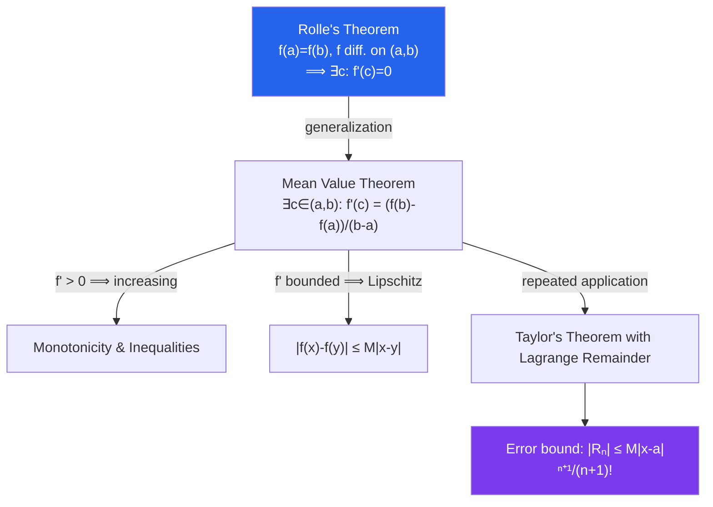

# ε Differentiation in Real Analysis

> [!abstract] TL;DR
> Differentiability is a strong form of local linearity: $f'(a)$ is the unique slope making $f(a+h) \approx f(a) + f'(a)h$ with error $o(h)$. The Mean Value Theorem links local slope to global behavior and is the engine behind inequalities, error bounds, and Taylor approximations. The Weierstrass function demolishes the intuition that "continuous means mostly differentiable."

## Intuition — analogy FIRST

Continuity says a function does not jump; differentiability says it has a well-defined slope at every point — no corners, no cusps, no infinite steepness. The surprise of analysis is that continuity does not imply differentiability at all. The Weierstrass function is continuous everywhere (you can draw it without lifting your pen) yet has a sharp corner at *every single point* — you can never place a tangent line anywhere. The Mean Value Theorem is more intuitive: if you drive from city A to city B in two hours and the distance is 120 km, then at some moment your speed was exactly 60 km/h. The theorem says this must happen, but does not say when.

---

## How It Works

---

## Key Concepts / Details

### Definition of the Derivative

$f: (a,b) \to \mathbb{R}$ is **differentiable** at $x \in (a,b)$ if the limit

$$f'(x) = \lim_{h \to 0} \frac{f(x+h) - f(x)}{h}$$

exists (as a finite number). Differentiability $\Rightarrow$ continuity (converse **false**). Proof: $f(x+h) - f(x) = h \cdot \frac{f(x+h)-f(x)}{h} \to 0 \cdot f'(x) = 0$.

### The Weierstrass Function

$$W(x) = \sum_{n=0}^\infty a^n \cos(b^n \pi x), \quad 0 < a < 1,\; b\text{ odd integer},\; ab > 1 + \tfrac{3}{2}\pi$$

$W$ is continuous everywhere (uniform convergence of continuous functions) but **differentiable nowhere** (rapid oscillations at all scales cancel any potential slope). This refuted the 19th-century belief that continuous functions are "generically" differentiable.

### Differentiation Rules (Rigorous)

All standard rules follow from the limit definition:
- **Sum/product rules**: straightforward limit algebra.
- **Chain rule**: if $g$ is differentiable at $a$ and $f$ at $g(a)$, then $(f \circ g)'(a) = f'(g(a))\cdot g'(a)$.
  Proof: use the increment formulation $f(g(a+h)) - f(g(a)) = [f'(g(a)) + \varepsilon(h)](g(a+h)-g(a))$.

### Rolle's Theorem

If $f:[a,b]\to\mathbb{R}$ is continuous on $[a,b]$, differentiable on $(a,b)$, and $f(a) = f(b)$, then $\exists c \in (a,b)$ with $f'(c) = 0$.

*Proof*: By EVT, $f$ attains its max and min. If both occur at endpoints, $f$ is constant and $f' \equiv 0$. Otherwise, an interior extremum $c$ satisfies $f'(c) = 0$ (necessary condition for interior extremum).

### Mean Value Theorem (MVT)

If $f:[a,b]\to\mathbb{R}$ is continuous on $[a,b]$ and differentiable on $(a,b)$, then $\exists c \in (a,b)$ such that:

$$f'(c) = \frac{f(b) - f(a)}{b - a}$$

*Proof*: Apply Rolle's theorem to $g(x) = f(x) - f(a) - \frac{f(b)-f(a)}{b-a}(x-a)$, which satisfies $g(a) = g(b) = 0$.

**Consequences**:
- $f' \equiv 0$ on $(a,b)$ $\Rightarrow$ $f$ is constant.
- $f' > 0$ on $(a,b)$ $\Rightarrow$ $f$ is strictly increasing.
- $|f'(x)| \leq M$ $\Rightarrow$ $|f(x) - f(y)| \leq M|x-y|$ (Lipschitz with constant $M$).

### Taylor's Theorem with Remainder

If $f$ has $n+1$ continuous derivatives on $[a,b]$, then for $x \in [a,b]$:

$$f(x) = \sum_{k=0}^{n} \frac{f^{(k)}(a)}{k!}(x-a)^k + R_n(x)$$

**Lagrange remainder**: $R_n(x) = \dfrac{f^{(n+1)}(\xi)}{(n+1)!}(x-a)^{n+1}$ for some $\xi$ between $a$ and $x$.

This is a quantitative version of MVT (recovered when $n=0$). The error bound $|R_n| \leq \dfrac{M_{n+1}}{(n+1)!}|x-a|^{n+1}$ (where $M_{n+1} = \max|f^{(n+1)}|$) controls approximation quality.

### L'Hôpital's Rule

If $f(a) = g(a) = 0$ (or both $\to\infty$), and $g'(x) \neq 0$ near $a$, and $\lim_{x\to a} f'(x)/g'(x)$ exists, then:

$$\lim_{x\to a}\frac{f(x)}{g(x)} = \lim_{x\to a}\frac{f'(x)}{g'(x)}$$

*Proof*: Follows from Cauchy's generalized MVT: $\exists c$ between $a$ and $x$ such that $\frac{f(x)}{g(x)} = \frac{f(x)-f(a)}{g(x)-g(a)} = \frac{f'(c)}{g'(c)}$.

### Darboux's Theorem

The **derivative** $f'$ has the intermediate value property: if $f$ is differentiable on $[a,b]$ and $f'(a) < v < f'(b)$, then $\exists c \in (a,b)$ with $f'(c) = v$.

This holds even if $f'$ is **not continuous**. Consequence: derivatives cannot have jump discontinuities (only oscillatory/essential discontinuities like $\sin(1/x)$).

---

## Real-World Notes

- **Error Analysis in Numerics**: Taylor's theorem with Lagrange remainder quantifies the error in numerical approximations (e.g., finite difference formulas). The truncation error of the forward difference $f'(x) \approx (f(x+h)-f(x))/h$ is exactly $-hf''(\xi)/2$.
- **Optimization**: First-order necessary conditions ($f'(c) = 0$ at a local extremum) and second-order sufficient conditions ($f''(c) > 0$ for local min) both rest on Taylor's theorem. Newton's method uses the quadratic approximation directly.
- **Economics (Marginal Analysis)**: The derivative $f'(x)$ is "marginal cost" or "marginal utility." The MVT ensures that if total cost increases by $\Delta C$ over $\Delta q$ units, the marginal cost equals the average increase at some production level.
- **Physics (Taylor Expansion)**: The small-angle approximation $\sin\theta \approx \theta$ is the first-order Taylor expansion of $\sin$ at $0$. The Lagrange remainder bounds the error, justifying the approximation for $|\theta| \leq 0.1$ rad with error $< 0.02\%$.

---

## Common Pitfalls

- **Differentiability $\not\Rightarrow$ continuous derivative**: A function can be differentiable everywhere but with a derivative that is discontinuous (Darboux: only oscillatory discontinuities, not jumps). Do not assume $f' \in C^0$ without checking.
- **L'Hôpital misapplication**: L'Hôpital applies to $0/0$ or $\infty/\infty$ forms only. Applying it to $0 \cdot \infty$, $\infty - \infty$, etc., requires algebraic manipulation first. Also, the rule fails if $\lim f'/g'$ does not exist (the original limit may still exist).
- **MVT direction**: The MVT gives $f'(c) = (f(b)-f(a))/(b-a)$ for some $c$ — it does not say for all $c$, nor does it give the value of $c$. Using "the" MVT value of $c$ as if it were unique is wrong.
- **Forgetting smoothness in Taylor's theorem**: The Lagrange remainder formula assumes $f^{(n+1)}$ is continuous. For functions with merely $n$ continuous derivatives, the remainder is $o(|x-a|^n)$ (Peano form) but the Lagrange bound does not apply.

---

## Related Concepts

- [[_MOC_Real_Analysis|↑ Real Analysis MOC]]
- [[Continuity_and_Uniform_Continuity]] — differentiability implies continuity; Rolle's theorem uses EVT
- [[Riemann_Integration_Analysis]] — FTC Part 1 gives a differentiable function from an integral; Part 2 evaluates integrals using antiderivatives
- [[Sequences_and_Limits_in_Analysis]] — the limit definition of $f'$ is a special sequence limit

---

## Review Questions

1. Prove that if $f'(x) = 0$ for all $x \in (a,b)$, then $f$ is constant on $(a,b)$. Which theorem is the key step?
2. Use Taylor's theorem to find the best quadratic approximation to $f(x) = e^x$ near $x = 0$, and bound the error on $[-1,1]$.
3. Prove that $|\sin x - \sin y| \leq |x - y|$ for all $x, y \in \mathbb{R}$ using the MVT.
4. Construct an explicit example of a function differentiable at $x = 0$ but whose derivative is not continuous at $0$. Verify using Darboux's theorem that the derivative still satisfies IVP.

---

## Sources

- Rudin, *Principles of Mathematical Analysis*, Ch. 5
- Abbott, *Understanding Analysis*, Ch. 5
- Spivak, *Calculus*, Ch. 11

#real-analysis #differentiation #mean-value-theorem #mathematics
