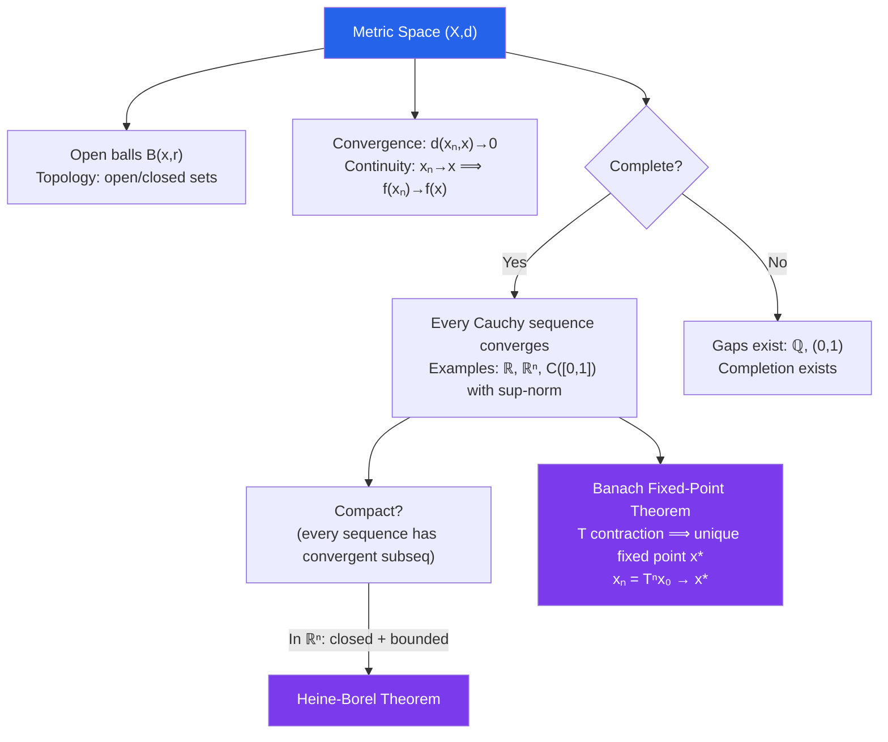

# ε Metric Spaces

> [!abstract] TL;DR
> A metric space $(X, d)$ abstracts "distance" from $\mathbb{R}^n$ to arbitrary sets, enabling the concepts of convergence, continuity, and completeness in full generality. The Banach fixed-point theorem — every contraction on a complete metric space has a unique fixed point — unifies ODE existence theorems, iterative algorithms, and fractal construction.

## Intuition — analogy FIRST

In $\mathbb{R}$, "close" means $|x - y|$ is small. A metric space replaces this single number line with any set equipped with a notion of distance: the space of continuous functions where "distance" is the maximum discrepancy, the space of DNA sequences where "distance" is the number of differing positions, or the space of probability distributions where "distance" is measured by how much mass must be moved. Once you have a distance function satisfying basic rules (non-negative, zero only for equal elements, symmetric, triangle inequality), all the machinery of analysis — limits, open sets, completeness — transfers immediately. The Banach fixed-point theorem is the payoff: apply the same map repeatedly, and if each application brings the result strictly closer to itself, the process must converge to a unique fixed point.

---

## How It Works

---

## Key Concepts / Details

### Metric Space Axioms

A **metric** on a set $X$ is a function $d: X \times X \to [0,\infty)$ satisfying:
1. **Positivity**: $d(x,y) \geq 0$, and $d(x,y) = 0 \iff x = y$
2. **Symmetry**: $d(x,y) = d(y,x)$
3. **Triangle inequality**: $d(x,z) \leq d(x,y) + d(y,z)$

### Examples of Metric Spaces

| Space | Metric | Notes |
|---|---|---|
| $\mathbb{R}^n$ | $d(x,y) = \|x-y\|_2 = \sqrt{\sum(x_i-y_i)^2}$ | Euclidean |
| $\mathbb{R}^n$ | $d_\infty(x,y) = \max_i|x_i - y_i|$ | Sup-norm (equivalent to $\ell^2$) |
| Any set $X$ | $d(x,y) = 0$ if $x=y$, $1$ otherwise | Discrete metric |
| $C([0,1])$ | $d(f,g) = \sup_{x\in[0,1]}|f(x)-g(x)|$ | Sup-norm on functions |
| $\ell^2$ | $d(x,y) = \sqrt{\sum_{n=1}^\infty(x_n-y_n)^2}$ | Square-summable sequences |

### Open and Closed Sets

The **open ball** $B(x,r) = \{y \in X : d(x,y) < r\}$. A set $U$ is **open** if $\forall x \in U$, $\exists r > 0: B(x,r) \subseteq U$. A set $F$ is **closed** if its complement is open, equivalently if it contains all its limit points.

**Interior** $A^\circ$: largest open set $\subseteq A$. **Closure** $\overline{A}$: smallest closed set $\supseteq A$. **Boundary** $\partial A = \overline{A} \setminus A^\circ$.

### Convergence and Continuity

$(x_n)$ **converges** to $x$ in $(X,d)$ if $d(x_n, x) \to 0$. Limits are unique (same argument as in $\mathbb{R}$).

$f: (X, d_X) \to (Y, d_Y)$ is **continuous** at $x$ if $d_X(x_n, x) \to 0 \Rightarrow d_Y(f(x_n), f(x)) \to 0$. Equivalent: $\forall\varepsilon>0$, $\exists\delta>0: d_X(x,y)<\delta \Rightarrow d_Y(f(x),f(y))<\varepsilon$.

### Completeness

$(X,d)$ is **complete** if every Cauchy sequence in $X$ converges to a point in $X$.

- $\mathbb{R}^n$ with any equivalent norm: complete.
- $\mathbb{Q}$: not complete.
- $(0,1)$: not complete ($1/n$ is Cauchy but converges to $0 \notin (0,1)$).
- $C([0,1])$ with sup-norm: complete — the uniform limit of continuous functions is continuous.
- $C([0,1])$ with $L^2$-norm: not complete — $L^2$ limits of continuous functions need not be continuous.

Every metric space $(X,d)$ has a **completion** $(\tilde{X}, \tilde{d})$: a complete metric space containing an isometric dense copy of $X$.

### Compactness

$(X,d)$ is **sequentially compact** if every sequence has a convergent subsequence. In metric spaces, this is equivalent to:
- **Total boundedness** (can be covered by finitely many balls of any radius) plus **completeness**
- **Heine-Borel in $\mathbb{R}^n$**: compact $\iff$ closed and bounded

Continuous functions on compact spaces attain their extrema (EVT generalizes), and compact metric spaces are complete.

### Banach Fixed-Point Theorem (Contraction Mapping Theorem)

$T: X \to X$ is a **contraction** if $\exists 0 \leq k < 1$: $d(Tx, Ty) \leq k\,d(x,y)$ for all $x,y \in X$.

**Theorem**: If $(X,d)$ is complete and $T$ is a contraction, then $T$ has a **unique fixed point** $x^*$ (where $T(x^*) = x^*$), and the iteration $x_{n+1} = T(x_n)$ converges to $x^*$ from any starting point $x_0$.

*Proof sketch*: $(x_n)$ is Cauchy because $d(x_{n+1}, x_n) \leq k^n d(x_1, x_0) \to 0$; the geometric series bound gives $d(x_n, x^*) \leq \frac{k^n}{1-k}d(x_1,x_0)$.

**Applications**:
- **Picard-Lindelöf**: The integral operator $T[y](x) = y_0 + \int_{x_0}^x f(t,y(t))\,dt$ is a contraction on $C([x_0-h, x_0+h])$ for small $h$, proving existence and uniqueness of ODE solutions.
- **Iterative solvers**: Gauss-Seidel and Jacobi iterations for linear systems are contractions when the matrix is strictly diagonally dominant.
- **Fractal geometry**: Hutchinson's theorem: a collection of contractions on a complete metric space has a unique compact fixed set — the **attractor** (e.g., the Sierpinski triangle).

### Connectedness

$(X,d)$ is **connected** if it cannot be split into two disjoint nonempty open sets. Equivalently: no continuous function $f: X \to \{0,1\}$ is surjective. Connected subsets of $\mathbb{R}$ are exactly intervals.

---

## Real-World Notes

- **Kernel Methods in ML (RKHS)**: Support vector machines operate in a **reproducing kernel Hilbert space** — a complete inner product space (hence a special metric space). The kernel trick exploits the metric structure to perform nonlinear classification in infinite-dimensional space.
- **Algorithm Convergence Proofs**: Showing that a learning algorithm converges often reduces to verifying it is a contraction on a suitable complete metric space (e.g., policy iteration in reinforcement learning).
- **DNA/String Metrics**: The edit distance (Levenshtein) on strings is a metric. Algorithms for sequence alignment and biological database search exploit triangle inequality to prune search spaces.
- **Optimal Transport**: The Wasserstein distance between probability distributions is a metric on the space of probability measures. It metrizes weak convergence and is central to generative modeling (Wasserstein GANs).

---

## Common Pitfalls

- **Complete $\neq$ bounded**: $\mathbb{R}$ is complete but unbounded; $(0,1)$ is bounded but not complete. Completeness is about Cauchy sequences, not about spatial extent.
- **Closed $\neq$ compact**: $\mathbb{R}$ is closed in itself but not compact. In infinite-dimensional spaces, closed bounded sets are generally not compact (the closed unit ball in $\ell^2$ is not compact — Riesz's theorem).
- **Contraction requires the constant $k < 1$**: The condition $d(Tx, Ty) < d(x,y)$ (strict but not uniform) does not guarantee a fixed point. Counterexample: $T(x) = x + 1/x$ on $(0,\infty)$ is a strict non-expansion with no fixed point.
- **Metric equivalence vs topological equivalence**: Two metrics on $X$ are **equivalent** if they generate the same open sets (topology). This does not require $d_1 \leq Cd_2$ globally — only that the balls are nested. Completeness, however, is metric-dependent: $\mathbb{R}$ with the standard metric is complete; $\mathbb{R}$ with the metric $d(x,y) = |\arctan x - \arctan y|$ is not (though the topologies are the same).

---

## Related Concepts

- [[_MOC_Real_Analysis|↑ Real Analysis MOC]]
- [[Real_Numbers_and_Completeness]] — $\mathbb{R}$ is the prototypical complete metric space
- [[Sequences_and_Limits_in_Analysis]] — Cauchy sequences and completeness in $\mathbb{R}$ carry over directly
- [[Continuity_and_Uniform_Continuity]] — $\varepsilon$-$\delta$ continuity is the metric space version

---

## Review Questions

1. Prove that $C([0,1])$ with the sup-norm $d(f,g) = \sup|f-g|$ is a complete metric space. Where does the proof require the sup-norm specifically?
2. Show that $T(x) = \cos(x)$ is a contraction on $[0,1]$ (with the usual metric). Estimate after how many iterations the fixed point is determined to within $10^{-4}$.
3. Let $X = (0,1)$ and $d(x,y) = |x-y|$. Exhibit a Cauchy sequence in $X$ that does not converge in $X$. Then describe the completion of $(X,d)$.
4. Prove the Banach fixed-point theorem in full. What role does completeness play, and where does the proof break down for a mere strict contraction ($d(Tx,Ty) < d(x,y)$) without the uniform constant $k < 1$?

---

## Sources

- Rudin, *Principles of Mathematical Analysis*, Ch. 2
- Kreyszig, *Introductory Functional Analysis with Applications*, Ch. 1
- Sutherland, *Introduction to Metric and Topological Spaces*, Ch. 1–5

#real-analysis #metric-spaces #topology #mathematics
