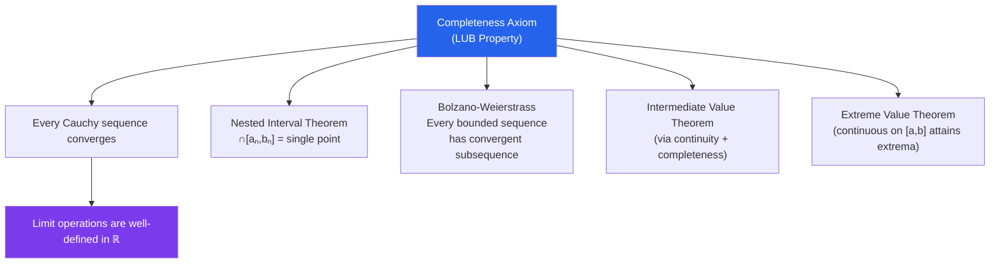

# ε Real Numbers and Completeness

> [!abstract] TL;DR
> The real numbers $\mathbb{R}$ form a complete ordered field — the only one up to isomorphism. Completeness, formalized as the least upper bound (supremum) property, is what separates $\mathbb{R}$ from $\mathbb{Q}$: it guarantees that limits of convergent sequences actually land somewhere in $\mathbb{R}$, making all of calculus and analysis possible.

## Intuition — analogy FIRST

The rationals $\mathbb{Q}$ are like a number line with holes punched in it: $\sqrt{2}$ is missing, as are $\pi$, $e$, and uncountably many other numbers. You can get arbitrarily close to $\sqrt{2}$ using rationals (e.g., $1.41, 1.414, 1.4142, \ldots$), but you never arrive. The real numbers $\mathbb{R}$ fill in all the holes: every sequence of rationals that is "trying to converge" actually converges to something in $\mathbb{R}$. This is **completeness** — the universe has no gaps. Without it, calculus breaks: a sequence could approach a limit that does not exist.

---

## How It Works

---

## Key Concepts / Details

### Ordered Field Axioms

$\mathbb{R}$ is an **ordered field**: it satisfies the field axioms (addition, multiplication, inverses, distributive law) plus an order compatible with arithmetic:
- $a < b \implies a + c < b + c$
- $a > 0, b > 0 \implies ab > 0$

$\mathbb{Q}$ also satisfies these axioms but is **not** complete.

### The Completeness Axiom (LUB Property)

> Every nonempty subset $S \subseteq \mathbb{R}$ that is bounded above has a **least upper bound** (supremum) in $\mathbb{R}$.

The **supremum** $\sup S$ satisfies:
1. $s \leq \sup S$ for all $s \in S$ (upper bound)
2. If $M < \sup S$, then $\exists s \in S: s > M$ ($\sup S$ is the *least* upper bound)

The **infimum** $\inf S$ is the greatest lower bound (for sets bounded below).

**Failure in $\mathbb{Q}$**: Let $S = \{q \in \mathbb{Q}: q^2 < 2\}$. This is bounded above (e.g., by $2$), but $\sup S = \sqrt{2} \notin \mathbb{Q}$.

### Key Consequences of Completeness

**Archimedean Property**: For any $x, y > 0$, there exists $n \in \mathbb{N}$ such that $nx > y$. Equivalently, $\mathbb{N}$ is unbounded in $\mathbb{R}$; there is no infinitely large real number.

**Density of $\mathbb{Q}$**: Between any two distinct reals $a < b$, there exists a rational $q$ with $a < q < b$. Similarly, there exists an irrational. Both $\mathbb{Q}$ and $\mathbb{R} \setminus \mathbb{Q}$ are dense in $\mathbb{R}$.

**Nested Interval Theorem**: If $[a_1, b_1] \supseteq [a_2, b_2] \supseteq \cdots$ with $b_n - a_n \to 0$, then $\bigcap_{n=1}^\infty [a_n, b_n]$ consists of exactly one point.

*Proof*: $a_n \nearrow$ and is bounded above by $b_1$, so $\alpha = \sup\{a_n\}$ exists; similarly $\beta = \inf\{b_n\}$ exists. One shows $\alpha = \beta$ using $b_n - a_n \to 0$.

### Dedekind Cuts (Brief)

One rigorous construction of $\mathbb{R}$ from $\mathbb{Q}$: a **Dedekind cut** is a pair $(A, B)$ partitioning $\mathbb{Q}$ into two nonempty sets with $a < b$ for all $a \in A$, $b \in B$, and $A$ having no maximum. The cut $(A, B)$ represents the real number $\sup A$ (which may not be in $\mathbb{Q}$). The set of all Dedekind cuts, equipped with order and arithmetic, is $\mathbb{R}$.

### Cantor's Diagonal Argument

$\mathbb{R}$ is **uncountable**: no list $r_1, r_2, r_3, \ldots$ can exhaust all reals in $[0,1]$. Given any such list, construct $r = 0.d_1 d_2 d_3 \ldots$ where $d_n \neq$ the $n$th decimal digit of $r_n$ — then $r \neq r_n$ for all $n$. Thus $\mathbb{R}$ has strictly larger cardinality than $\mathbb{N}$ or $\mathbb{Q}$.

### Supremum Computation

To verify $M = \sup S$: (1) show $M$ is an upper bound, (2) show that for any $\varepsilon > 0$, there exists $s \in S$ with $s > M - \varepsilon$. The second part uses the characterization directly.

---

## Real-World Notes

- **Floating-Point Arithmetic**: Computers store numbers in $\mathbb{Q}$ (finite binary expansions). Iterative algorithms converging to irrational numbers like $\sqrt{2}$ accumulate rounding error because the true limit is not representable. Completeness fails computationally.
- **Cauchy Completion**: The construction $\mathbb{R}$ from $\mathbb{Q}$ generalizes to any metric space. $p$-adic numbers $\mathbb{Q}_p$ are a different completion of $\mathbb{Q}$ using a different metric, important in number theory.
- **Analysis Foundations**: Every major theorem of calculus — IVT, EVT, MVT — relies ultimately on completeness. The proof that a continuous function on $[a,b]$ attains a maximum requires Bolzano-Weierstrass, which requires completeness.
- **Measure Theory**: Completeness of $\mathbb{R}$ underlies the completeness of $L^2$ spaces, enabling Fourier series to converge in the $L^2$ sense — essential for signal processing and quantum mechanics.

---

## Common Pitfalls

- **Confusing sup with max**: $\sup S$ need not be in $S$ (e.g., $\sup(0,1) = 1 \notin (0,1)$). It is the max only when the set is closed and bounded and the sup is achieved.
- **Assuming density implies completeness**: $\mathbb{Q}$ is dense in itself, but it is not complete. Density (between any two points lies another) and completeness (no gaps) are independent properties.
- **Misapplying the Archimedean property**: The Archimedean property guarantees $\mathbb{N}$ is unbounded, but does not say consecutive naturals are the only integers — it is a statement about growth, not structure.
- **Forgetting open sets**: The nested interval theorem requires *closed* intervals. For open intervals, $\bigcap (0, 1/n) = \emptyset$ — a striking failure that shows why closed-ness matters.

---

## Related Concepts

- [[_MOC_Real_Analysis|↑ Real Analysis MOC]]
- [[Sequences_and_Limits_in_Analysis]] — completeness ↔ Cauchy sequences converge
- [[Continuity_and_Uniform_Continuity]] — IVT and EVT are direct consequences of completeness
- [[Metric_Spaces]] — completeness generalizes to any metric space

---

## Review Questions

1. Prove that $\sup\{1 - 1/n : n \in \mathbb{N}\} = 1$. Is $1$ in the set? Why does this not contradict the definition of supremum?
2. Show directly from the LUB axiom that $\sqrt{2} \in \mathbb{R}$. (Hint: let $S = \{x \geq 0 : x^2 \leq 2\}$ and show $\sup S$ satisfies $(\sup S)^2 = 2$.)
3. Prove the Archimedean property using the completeness axiom. Where exactly is completeness used?
4. Explain Cantor's diagonal argument. Why does the constructed number differ from every number on the list?

---

## Sources

- Rudin, *Principles of Mathematical Analysis*, Ch. 1
- Abbott, *Understanding Analysis*, Ch. 1
- Tao, *Analysis I*, Ch. 5–6

#real-analysis #real-numbers #completeness #mathematics
