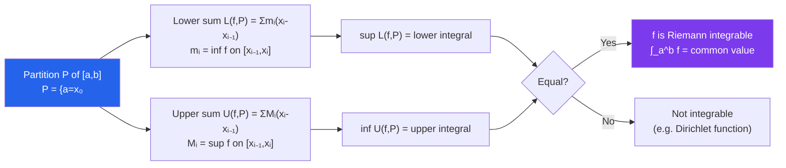

# ε Riemann Integration in Analysis

> [!abstract] TL;DR
> The Riemann integral is defined via upper and lower Darboux sums: a function is integrable if and only if these sums can be made arbitrarily close by refining the partition. The Fundamental Theorem of Calculus provides the bridge between integration and differentiation, while the Lebesgue criterion characterizes exactly which bounded functions are Riemann integrable.

## Intuition — analogy FIRST

Computing area under a curve by inscribing rectangles is an ancient idea. The analysis version asks: when does this process converge, and how do you prove it rigorously? The answer is the **squeeze**: build a lower bound by taking the minimum function value on each subinterval (lower sums), and an upper bound by taking the maximum (upper sums). If you can force these two bounds together by cutting the interval into tiny enough pieces, the area is well-defined. A function with too many violent oscillations — like Dirichlet's function, which is $1$ on rationals and $0$ on irrationals — cannot be squeezed: lower sums are always $0$, upper sums are always $1$, no matter how fine the partition.

---

## How It Works

---

## Key Concepts / Details

### Darboux Sums

For a bounded function $f: [a,b] \to \mathbb{R}$ and a partition $P = \{a = x_0 < x_1 < \cdots < x_n = b\}$:

$$L(f,P) = \sum_{i=1}^n m_i (x_i - x_{i-1}), \quad m_i = \inf_{[x_{i-1},x_i]} f$$
$$U(f,P) = \sum_{i=1}^n M_i (x_i - x_{i-1}), \quad M_i = \sup_{[x_{i-1},x_i]} f$$

Always $L(f,P) \leq U(f,P)$, and refining a partition increases $L$ and decreases $U$.

### Riemann Integrability

$f$ is **Riemann integrable** on $[a,b]$ if $\sup_P L(f,P) = \inf_P U(f,P)$. The common value is $\int_a^b f(x)\,dx$.

**Riemann's criterion**: $f$ is integrable $\iff$ $\forall\varepsilon > 0$, $\exists$ partition $P$ such that $U(f,P) - L(f,P) < \varepsilon$.

### Integrable Function Classes

- **Continuous functions**: $f \in C([a,b])$ is integrable. (Proof: uniform continuity gives small oscillations on small subintervals.)
- **Monotone functions**: $f$ monotone on $[a,b]$ is integrable. (Proof: oscillation sum telescopes to $(f(b)-f(a))\cdot\|P\|$.)
- **Bounded functions with finitely many discontinuities**: integrable.

**Not integrable**: Dirichlet function $\mathbf{1}_\mathbb{Q}$ on $[0,1]$ — every subinterval has dense rationals and irrationals, so $m_i = 0$, $M_i = 1$, giving $L = 0$, $U = 1$ regardless of partition.

### Properties of the Integral

For integrable $f, g$ on $[a,b]$:
- **Linearity**: $\int(af + bg) = a\int f + b\int g$
- **Monotonicity**: $f \leq g \implies \int f \leq \int g$
- **Absolute value**: $\left|\int_a^b f\right| \leq \int_a^b |f|$
- **Subinterval additivity**: $\int_a^b f = \int_a^c f + \int_c^b f$ for $c \in [a,b]$
- **Integral of $f \cdot g$**: product of integrable functions is integrable

### Fundamental Theorem of Calculus

**Part 1 (antiderivative from integral)**: If $f$ is integrable on $[a,b]$ and $F(x) = \int_a^x f(t)\,dt$, then $F$ is continuous on $[a,b]$ and differentiable at every point where $f$ is continuous, with $F'(x) = f(x)$.

*Proof*: For $|h|$ small, $F(x+h) - F(x) = \int_x^{x+h} f(t)\,dt$. By continuity of $f$ at $x$, $f(t) \approx f(x)$ for $t \in [x, x+h]$, so $(F(x+h)-F(x))/h \to f(x)$.

**Part 2 (evaluation theorem)**: If $f$ is integrable and $G$ is any antiderivative ($G' = f$) on $[a,b]$, then $\int_a^b f(x)\,dx = G(b) - G(a)$.

*Proof*: By MVT, $G(b) - G(a) = \sum G(x_i) - G(x_{i-1}) = \sum G'(\xi_i)(x_i - x_{i-1})$; these Riemann sums converge to $\int f$.

### Improper Integrals

$$\int_a^\infty f(x)\,dx = \lim_{R\to\infty} \int_a^R f(x)\,dx$$

**Absolute vs conditional convergence**: $\int_1^\infty \sin(x)/x\,dx$ converges conditionally but not absolutely. Absolutely convergent improper integrals ($\int|f| < \infty$) are interchangeable with limits and rearrangements; conditionally convergent ones are not.

**Comparison test**: if $0 \leq f(x) \leq g(x)$ and $\int g < \infty$, then $\int f < \infty$.

### Lebesgue's Integrability Criterion

A bounded function $f: [a,b] \to \mathbb{R}$ is Riemann integrable if and only if the set of discontinuities of $f$ has **measure zero** (is a "null set").

A set $E$ has measure zero if $\forall\varepsilon > 0$, $E$ can be covered by countably many intervals of total length $< \varepsilon$.

*Consequence*: The Cantor set has measure zero despite being uncountable — a function discontinuous on the Cantor set can still be Riemann integrable.

### Preview of Lebesgue Integration

The Riemann integral fails for pointwise limits of functions: if $f_n \to f$ pointwise, $\int f_n$ need not converge to $\int f$. The **Lebesgue integral** fixes this: it measures sets directly (via measure theory), handles vastly more functions, and satisfies the **Dominated Convergence Theorem** — if $|f_n| \leq g$ and $\int g < \infty$, then $\int f_n \to \int f$.

---

## Real-World Notes

- **Numerical Integration (Quadrature)**: The Riemann sum with equal-width partitions is the rectangle rule; the trapezoidal and Simpson's rules use more sophisticated evaluations of $f$ on each subinterval. Error bounds come from the Riemann criterion via smoothness of $f$.
- **Probability Theory**: The Lebesgue integral (which extends Riemann) is essential for rigorous probability: expected values of continuous random variables are Lebesgue integrals, and convergence theorems handle limits of distributions.
- **Fourier Analysis and $L^2$ Spaces**: The condition $\int_0^{2\pi}|f|^2 < \infty$ (square-integrability) defines the function space where Fourier series converge in the mean-square sense. Lebesgue integration makes this space complete (a Hilbert space).
- **Physics (Path Integrals)**: Classical mechanics reformulates dynamics as minimizing an action integral $S = \int_a^b L(q,q')\,dt$. The Euler-Lagrange equations are FTC applied to the variation of $S$.

---

## Common Pitfalls

- **Confusing Darboux and Riemann sums**: Darboux sums use inf/sup on each subinterval (yielding the *tightest* bounds). Riemann sums use arbitrary sample points. They give the same integral but the proofs differ; interchanging them without justification is an error.
- **Assuming FTC Part 1 applies to all integrable $f$**: $F(x) = \int_a^x f$ is always continuous, but $F'(x) = f(x)$ holds only at points where $f$ is continuous. At a jump discontinuity of $f$, $F$ may be non-differentiable.
- **Integrating conditionally convergent improper integrals without care**: Unlike absolutely convergent integrals, conditionally convergent ones cannot be split as $\int_0^\infty = \int_0^1 + \int_1^\infty$ and computed separately — the split integrals may both diverge. Fresnel integrals $\int_0^\infty \sin(x^2)\,dx$ are a classic example.
- **Claiming discontinuous functions are not integrable**: Many discontinuous functions are Riemann integrable (e.g., any bounded function with only jump discontinuities). The Lebesgue criterion gives the exact boundary: discontinuities on a null set are the allowable exceptions.

---

## Related Concepts

- [[_MOC_Real_Analysis|↑ Real Analysis MOC]]
- [[Differentiation_Real_Analysis]] — FTC connects differentiation and integration
- [[Continuity_and_Uniform_Continuity]] — continuous functions are the primary class of Riemann-integrable functions
- [[Metric_Spaces]] — $L^p$ spaces extend integration to complete metric/normed spaces

---

## Review Questions

1. Use the Riemann criterion to prove that $f(x) = x$ is Riemann integrable on $[0,1]$ and $\int_0^1 x\,dx = 1/2$.
2. Define $f(x) = 0$ for $x$ irrational and $f(x) = 1/q$ when $x = p/q$ in lowest terms. Prove $f$ is Riemann integrable on $[0,1]$ by showing the discontinuities form a null set.
3. State both parts of the FTC precisely. Give an example showing Part 1 can fail when $f$ is discontinuous at the upper limit.
4. Determine whether $\int_1^\infty x^p e^{-x}\,dx$ converges absolutely or conditionally (or both) for all $p \in \mathbb{R}$. Justify using comparison.

---

## Sources

- Rudin, *Principles of Mathematical Analysis*, Ch. 6
- Abbott, *Understanding Analysis*, Ch. 7
- Royden & Fitzpatrick, *Real Analysis*, Ch. 4

#real-analysis #riemann-integration #mathematics
