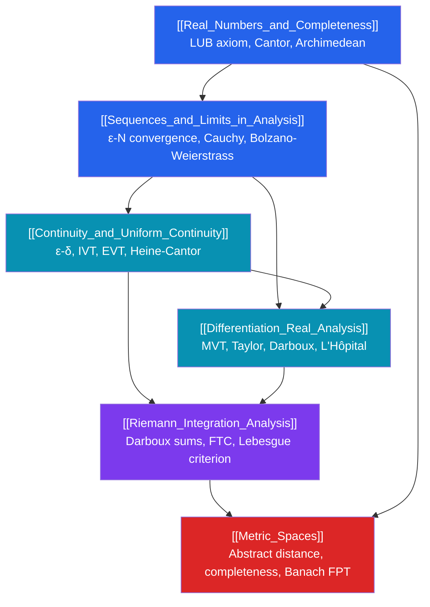

# ε Real Analysis — Map of Content

> [!abstract] Overview
> Real analysis establishes the rigorous foundations of calculus: $\varepsilon$-$\delta$ proofs, completeness, and the theory of integration — the prerequisite for graduate mathematics. This section replaces intuitive notions of "infinitely small" with precise logical quantifiers, proving that the theorems of calculus are true, under exactly what conditions, and why. It is the gateway to functional analysis, measure theory, probability theory, and PDEs.

---

## Knowledge Graph

---

## Learning Path

| Step | Note | Difficulty | Core Idea |
|------|------|-----------|-----------|
| 1 | [[Real_Numbers_and_Completeness]] | Advanced | LUB axiom, sup/inf, nested intervals, uncountability of $\mathbb{R}$ |
| 2 | [[Sequences_and_Limits_in_Analysis]] | Advanced | $\varepsilon$-$N$ definition, Cauchy criterion, Bolzano-Weierstrass |
| 3 | [[Continuity_and_Uniform_Continuity]] | Advanced | $\varepsilon$-$\delta$, IVT, EVT, Lipschitz, uniform continuity |
| 4 | [[Differentiation_Real_Analysis]] | Advanced | MVT, Rolle, Taylor remainder, Weierstrass function |
| 5 | [[Riemann_Integration_Analysis]] | Advanced | Darboux sums, integrability criterion, FTC, Lebesgue |
| 6 | [[Metric_Spaces]] | Graduate | Abstract metric, completeness, compactness, Banach FPT |

---

## Notes in This Section

### [[Real_Numbers_and_Completeness]]
The ordered field axioms for $\mathbb{R}$ and what distinguishes it from $\mathbb{Q}$. The completeness axiom (LUB property), supremum and infimum, Archimedean property, density of rationals, nested interval theorem, Dedekind cuts, Cantor's diagonalization proof.

### [[Sequences_and_Limits_in_Analysis]]
Rigorous $\varepsilon$-$N$ convergence, algebra of limits, squeeze theorem. Monotone convergence theorem, Bolzano-Weierstrass, Cauchy sequences and their equivalence to convergence in $\mathbb{R}$. Infinite series, absolute vs conditional convergence, Riemann rearrangement theorem.

### [[Continuity_and_Uniform_Continuity]]
$\varepsilon$-$\delta$ and sequential characterization of continuity. IVT (proof via completeness), EVT (proof via Bolzano-Weierstrass). Uniform continuity, Heine-Cantor theorem, Lipschitz continuity. Types of discontinuities; monotone functions have countably many jumps.

### [[Differentiation_Real_Analysis]]
Differentiability as local linearity; differentiable $\Rightarrow$ continuous (not conversely — Weierstrass function). Product, quotient, chain rules. Rolle's theorem and MVT with full proofs. Taylor's theorem with Lagrange remainder. L'Hôpital's rule. Darboux's theorem.

### [[Riemann_Integration_Analysis]]
Upper and lower Darboux sums; Riemann integrability criterion. Classes of integrable functions. Properties of the integral. FTC Parts 1 and 2 with proofs. Improper integrals. Lebesgue's criterion: integrable $\iff$ discontinuities form a null set. Preview of Lebesgue integration.

### [[Metric_Spaces]]
Metric axioms and examples (Euclidean, discrete, function spaces). Open/closed sets, convergence, continuity in abstract metric spaces. Completeness: Cauchy sequences, complete vs incomplete spaces. Compactness, Heine-Borel. Banach fixed-point theorem with proof and applications.

---

## Key Theorems at a Glance

| Theorem | Statement |
|---------|-----------|
| LUB Property | Every nonempty bounded-above $S \subseteq \mathbb{R}$ has a supremum in $\mathbb{R}$ |
| Bolzano-Weierstrass | Every bounded sequence in $\mathbb{R}$ has a convergent subsequence |
| Cauchy Criterion | $(a_n)$ converges in $\mathbb{R}$ $\iff$ $(a_n)$ is Cauchy |
| IVT | $f$ continuous on $[a,b]$, $f(a) \leq v \leq f(b)$ $\Rightarrow$ $\exists c: f(c) = v$ |
| EVT | $f$ continuous on $[a,b]$ attains its maximum and minimum |
| Heine-Cantor | $f$ continuous on compact $[a,b]$ $\Rightarrow$ $f$ uniformly continuous |
| MVT | $f$ diff. on $(a,b)$ $\Rightarrow$ $\exists c: f'(c) = (f(b)-f(a))/(b-a)$ |
| FTC (Part 1) | $F(x) = \int_a^x f$, $f$ continuous at $x$ $\Rightarrow$ $F'(x) = f(x)$ |
| FTC (Part 2) | $G' = f$, $f$ integrable $\Rightarrow$ $\int_a^b f = G(b) - G(a)$ |
| Lebesgue Criterion | $f$ Riemann integrable $\iff$ discontinuities have measure zero |
| Heine-Borel | $K \subseteq \mathbb{R}^n$ compact $\iff$ closed and bounded |
| Banach FPT | Contraction on complete metric space has unique fixed point |

---

## What Real Analysis Unlocks

- **Functional Analysis**: Banach and Hilbert spaces are complete normed/inner product spaces. The metric space framework here is the entry point.
- **Measure Theory and Lebesgue Integration**: The Lebesgue integral repairs the limitations of Riemann, enabling dominated convergence, Fubini, and $L^p$ spaces.
- **Probability Theory (Rigorous)**: Probability measures, random variables, and convergence of distributions rest on Lebesgue integration and metric space completeness.
- **PDE Theory**: Sobolev spaces, weak solutions, and existence/uniqueness for PDEs require functional analysis built on the real analysis foundation here.

---

## Prerequisites

- Single-variable calculus (informal): derivatives, integrals, limits
- Basic proof-writing: quantifier logic, proof by contradiction, induction

---

## Sources

- Rudin, *Principles of Mathematical Analysis* — the canonical rigorous text
- Abbott, *Understanding Analysis* — gentler introduction with motivation
- Tao, *Analysis I & II* — builds from first principles, highly detailed
- Bartle & Sherbert, *Introduction to Real Analysis* — balanced for a first course
- Kreyszig, *Introductory Functional Analysis* — bridge to metric spaces and beyond

#real-analysis #MOC #mathematics
