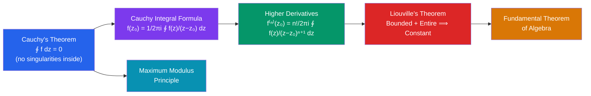

# ℂ Cauchy's Theorem and Integral Formula

> [!abstract] TL;DR
> Cauchy's theorem says that integrating a holomorphic function around a closed loop gives zero — topology controls the integral. The Cauchy Integral Formula then gives something miraculous: the value of a function anywhere inside a contour is completely determined by its values on the boundary. This leads to the stunning fact that holomorphic functions are infinitely differentiable.

## Intuition — analogy FIRST
Imagine walking around a park (closed contour) while monitoring altitude (the function). If the terrain is perfectly smooth (holomorphic, no singularities), your net altitude change is zero regardless of the path — that's Cauchy's theorem. Now the integral formula says something even stranger: if you know the altitude values only on the park boundary, you can compute the altitude at any interior point exactly. In real analysis this would be impossible; complex analysis is that much more rigid.

---

## How It Works

## Key Concepts

### Contour Integrals
A **contour** is a piecewise smooth curve $\gamma: [a,b] \to \mathbb{C}$. The **contour integral** is:
$$\int_\gamma f(z)\,dz = \int_a^b f(\gamma(t))\,\gamma'(t)\,dt$$
This is just a line integral, computable once you parameterize the curve. For a closed contour $\gamma$, we write $\oint_\gamma f\,dz$.

**Example**: integrate $f(z) = 1/z$ around the unit circle $\gamma(t) = e^{it}$, $t \in [0, 2\pi]$:
$$\oint_{|z|=1} \frac{dz}{z} = \int_0^{2\pi} \frac{1}{e^{it}} \cdot ie^{it}\,dt = 2\pi i$$
This nonzero value comes from the singularity at $z=0$ inside the contour.

### Cauchy's Theorem
If $f$ is holomorphic on a simply connected domain $D$ (no holes) and $\gamma$ is any closed contour in $D$, then:
$$\oint_\gamma f(z)\,dz = 0$$

**Consequence — Path Independence**: For holomorphic $f$ in a simply connected domain, $\int_\gamma f\,dz$ depends only on the endpoints, not the path. Holomorphic functions have antiderivatives locally.

**Why "simply connected" matters**: $f(z) = 1/z$ is holomorphic on $\mathbb{C}\setminus\{0\}$ (not simply connected), and its integral around the origin is $2\pi i \neq 0$.

### Cauchy's Integral Formula
If $f$ is holomorphic on and inside a simple closed contour $\gamma$ (oriented counterclockwise), and $z_0$ is inside $\gamma$:
$$\boxed{f(z_0) = \frac{1}{2\pi i} \oint_\gamma \frac{f(z)}{z - z_0}\,dz}$$

**Proof idea**: shrink $\gamma$ to a small circle $C_\epsilon$ around $z_0$. On $C_\epsilon$, $f(z) \approx f(z_0)$ (continuous), so the integral becomes $f(z_0) \cdot \frac{1}{2\pi i}\oint \frac{dz}{z-z_0} = f(z_0) \cdot 1$.

### Higher Derivatives Formula
Differentiating the integral formula under the integral sign $n$ times:
$$f^{(n)}(z_0) = \frac{n!}{2\pi i} \oint_\gamma \frac{f(z)}{(z-z_0)^{n+1}}\,dz$$

**Corollary**: A holomorphic function is *infinitely* differentiable — there is no analogue of $f(x) = x|x|$ (differentiable once but not twice) in complex analysis.

**Cauchy's Estimate**: if $|f| \leq M$ on a circle of radius $r$ around $z_0$, then:
$$|f^{(n)}(z_0)| \leq \frac{n!\,M}{r^n}$$

### Liouville's Theorem
If $f$ is entire (holomorphic on all of $\mathbb{C}$) and bounded ($|f(z)| \leq M$ for all $z$), then $f$ is constant.

**Proof**: Cauchy's estimate with $r \to \infty$ gives $|f'(z_0)| \leq M/r \to 0$, so $f' = 0$ everywhere.

### Fundamental Theorem of Algebra
Every non-constant polynomial $p(z) \in \mathbb{C}[z]$ has at least one root in $\mathbb{C}$.

**Proof via Liouville**: if $p$ has no root, then $1/p$ is entire and bounded (since $|p(z)| \to \infty$), hence constant — contradiction.

### Maximum Modulus Principle
If $f$ is holomorphic on a domain $D$, then $|f|$ cannot attain its maximum at an interior point (unless $f$ is constant).

Geometrically: holomorphic functions are open maps — they don't "compress" neighborhoods to points.

---

## Real-World Notes
- **Mean value property**: $f(z_0) = \frac{1}{2\pi}\int_0^{2\pi} f(z_0 + re^{i\theta})\,d\theta$ — the value at the center equals the average over any circle. Harmonic functions (temperatures, potentials) satisfy this.
- **Control theory**: the stability of a linear system is determined by poles of a transfer function; Cauchy's argument principle counts poles inside a contour, directly applicable.
- **Numerical methods**: contour integrals appear in inverse Laplace transforms; the Cauchy formula gives coefficients of power series via integration.
- **Physics**: propagator integrals in quantum mechanics are contour integrals; shifting contours to avoid poles corresponds to choosing boundary conditions.

---

## Common Pitfalls
- Cauchy's theorem requires *simply connected* domain. The classic mistake: applying it to $1/z$ and concluding $\oint 1/z\,dz = 0$ even when $z=0$ is enclosed.
- Orientation matters: counterclockwise is positive. Clockwise gives a minus sign.
- The integral formula requires $z_0$ to be *strictly inside* the contour — boundary points or exterior points give different results.
- Do not confuse the integral formula with a statement about residues; Cauchy's formula is the special case where the "pole" is of order 1.

---

## Related Concepts
- [[_MOC_Complex_Analysis|↑ Complex Analysis MOC]]
- [[Holomorphic_Functions]] — the functions to which Cauchy applies
- [[Laurent_Series_and_Singularities]] — what happens when singularities are inside the contour
- [[Residue_Theorem_and_Applications]] — the general version with singularities

---

## Review Questions
1. Evaluate $\oint_{|z|=2} \frac{e^z}{z-1}\,dz$ using the Cauchy Integral Formula.
2. Prove that a holomorphic function that is real-valued on a domain must be constant.
3. State and prove Cauchy's estimate, and use it to prove Liouville's theorem.

---

## Sources
- Ahlfors, *Complex Analysis*, Ch. 4
- Stein & Shakarchi, *Complex Analysis*, Ch. 2
- Conway, *Functions of One Complex Variable*, Ch. IV

#complex-analysis #cauchy-theorem #contour-integrals #liouville #mathematics
