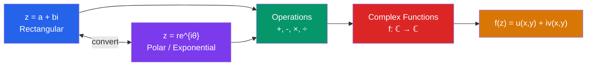

# ℂ Complex Numbers and Functions

> [!abstract] TL;DR
> Complex numbers extend the reals by introducing $i = \sqrt{-1}$, allowing every polynomial to have roots. The polar form $z = re^{i\theta}$ reveals beautiful geometry: multiplication rotates and scales, and Euler's identity $e^{i\pi}+1=0$ links the five most fundamental constants in mathematics.

## Intuition — analogy FIRST
Think of real numbers as points on a line. Complex numbers are points on a *plane* — you gain an extra dimension. The real part is the x-coordinate, the imaginary part is the y-coordinate. Multiplying two complex numbers is secretly *rotating and scaling*: multiplying by $i$ rotates 90° counterclockwise. This geometric view transforms algebra into geometry and makes complex analysis the most visual branch of mathematics.

---

## How It Works

## Key Concepts

### Basic Structure
A complex number $z = a + bi$ where $a, b \in \mathbb{R}$ and $i^2 = -1$:
- **Real part**: $\text{Re}(z) = a$
- **Imaginary part**: $\text{Im}(z) = b$
- **Complex conjugate**: $\bar{z} = a - bi$ (reflect across real axis)
- **Modulus**: $|z| = \sqrt{a^2 + b^2}$; note $|z|^2 = z\bar{z}$
- **Argument**: $\arg(z) = \arctan(b/a)$ (angle from positive real axis)

### Polar and Exponential Form
$$z = r(\cos\theta + i\sin\theta) = re^{i\theta}$$
where $r = |z|$ and $\theta = \arg(z)$.

**Euler's formula** (the bridge between exponentials and trigonometry):
$$e^{i\theta} = \cos\theta + i\sin\theta$$

**Euler's identity** (the most beautiful equation in mathematics):
$$e^{i\pi} + 1 = 0$$

### De Moivre's Theorem
For integer $n$:
$$(cos\theta + i\sin\theta)^n = \cos(n\theta) + i\sin(n\theta)$$
Equivalently $(e^{i\theta})^n = e^{in\theta}$. This makes computing powers trivial in polar form and gives formulas for $\cos(n\theta)$ in terms of $\cos\theta$.

### Arithmetic
- **Addition**: $(a+bi) + (c+di) = (a+c) + (b+d)i$
- **Multiplication**: $(a+bi)(c+di) = (ac-bd) + (ad+bc)i$; in polar form: $|z_1||z_2|e^{i(\theta_1+\theta_2)}$ — multiply moduli, add arguments
- **Division**: $\frac{z_1}{z_2} = \frac{z_1\bar{z_2}}{|z_2|^2}$; divide moduli, subtract arguments

### Complex Functions
A function $f: \mathbb{C} \to \mathbb{C}$ can be written as:
$$f(z) = f(x+iy) = u(x,y) + iv(x,y)$$
where $u, v: \mathbb{R}^2 \to \mathbb{R}$ are real-valued functions. For example, $f(z) = z^2 = x^2 - y^2 + 2xyi$, so $u = x^2-y^2$, $v = 2xy$.

### Multi-valued Functions and Branch Cuts
The complex logarithm: $\log(z) = \ln|z| + i\arg(z)$ is **multi-valued** because $\arg(z)$ is defined only up to multiples of $2\pi$. The **principal branch** restricts $\arg(z) \in (-\pi, \pi]$, creating a discontinuity along the negative real axis — the **branch cut**.
$$\text{Log}(z) = \ln|z| + i\,\text{Arg}(z), \quad \text{Arg}(z) \in (-\pi, \pi]$$

### Riemann Sphere
The **one-point compactification** adds $\infty$ to $\mathbb{C}$, giving $\hat{\mathbb{C}} = \mathbb{C} \cup \{\infty\}$. Geometrically, this is a sphere: the plane maps to the sphere via stereographic projection, with the north pole representing $\infty$.

---

## Real-World Notes
- **Electrical engineering**: impedance $Z = R + i\omega L - \frac{i}{\omega C}$; complex exponentials $e^{i\omega t}$ model AC circuits far more cleanly than sines and cosines
- **Quantum mechanics**: wave functions are complex-valued; $|\psi|^2$ gives probability; interference requires complex amplitudes
- **Signal processing**: Fourier transforms use $e^{i\omega t}$; the complex frequency plane separates growth/decay (real part) from oscillation (imaginary part)
- **Fractals**: the Mandelbrot set is defined by iteration of $z \mapsto z^2 + c$ in $\mathbb{C}$; the complex plane gives it two degrees of freedom

---

## Common Pitfalls
- $\arg(z)$ is multi-valued; always specify which branch you mean. The principal argument $\text{Arg}(z)$ uses $(-\pi, \pi]$.
- $|z_1 + z_2| \leq |z_1| + |z_2|$ (triangle inequality) — equality only when arguments match (same direction).
- $\sqrt{z}$ is also multi-valued: every non-zero complex number has two square roots.
- Division by zero extends differently: in $\hat{\mathbb{C}}$, $1/0 = \infty$ is allowed in some contexts, but $0/0$ and $\infty/\infty$ are still undefined.

---

## Related Concepts
- [[_MOC_Complex_Analysis|↑ Complex Analysis MOC]]
- [[Holomorphic_Functions]] — when can we differentiate complex functions?
- [[Laurent_Series_and_Singularities]] — power series centered at singular points

---

## Review Questions
1. Convert $z = -1 + i$ to polar form $re^{i\theta}$. What is $z^8$?
2. Use Euler's formula to derive the double-angle identities $\cos(2\theta)$ and $\sin(2\theta)$.
3. Why does the complex logarithm require a branch cut? What goes wrong without one?

---

## Sources
- Ahlfors, *Complex Analysis*, Ch. 1
- Needham, *Visual Complex Analysis*, Ch. 1–2
- Brown & Churchill, *Complex Variables and Applications*, Ch. 1

#complex-analysis #complex-numbers #euler-formula #mathematics
