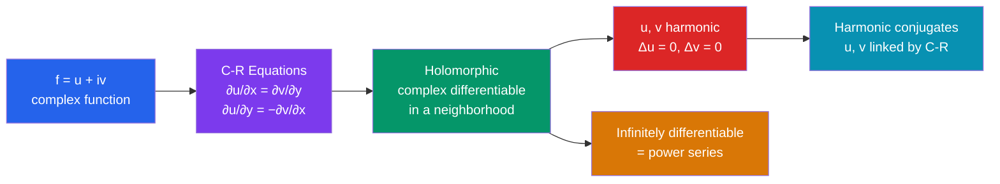

# ℂ Holomorphic Functions

> [!abstract] TL;DR
> A function is holomorphic if it's complex-differentiable in a neighborhood — a much stronger condition than real differentiability. The Cauchy-Riemann equations are the key test, and holomorphic functions turn out to be infinitely differentiable and equal to their Taylor series, a fact with no real-analysis analogue.

## Intuition — analogy FIRST
Real differentiability asks: "does $f(x+h) \approx f(x) + f'(x)h$ as $h \to 0$ along the real line?" Complex differentiability asks the same thing, but $h$ can approach zero from *any direction in the plane*. Demanding that the limit be the same no matter the direction is an enormous constraint — it forces the function to be extremely rigid and well-behaved. This rigidity is what makes complex analysis so powerful: once you know a function is holomorphic, you know almost everything about it.

---

## How It Works

## Key Concepts

### Complex Differentiability
The derivative of $f$ at $z_0$ is:
$$f'(z_0) = \lim_{\Delta z \to 0} \frac{f(z_0 + \Delta z) - f(z_0)}{\Delta z}$$
where $\Delta z \in \mathbb{C}$ can approach zero from any direction. If this limit exists, $f$ is **complex differentiable** at $z_0$.

### Cauchy-Riemann Equations
Writing $f = u + iv$ and $z = x + iy$, the C-R equations are the **necessary condition** for complex differentiability:
$$\frac{\partial u}{\partial x} = \frac{\partial v}{\partial y}, \qquad \frac{\partial u}{\partial y} = -\frac{\partial v}{\partial x}$$
**Sufficient condition**: if $u, v$ have continuous partial derivatives satisfying C-R, then $f$ is differentiable. In that case:
$$f'(z) = \frac{\partial u}{\partial x} + i\frac{\partial v}{\partial x} = \frac{\partial v}{\partial y} - i\frac{\partial u}{\partial y}$$

**Derivation sketch**: approaching along the real axis gives $f' = u_x + iv_x$; approaching along the imaginary axis gives $f' = v_y - iu_y$. Setting these equal yields C-R.

### Holomorphic Functions
A function $f$ is **holomorphic** (or analytic) on an open set $U$ if it is complex differentiable at every point of $U$ — differentiability in a *neighborhood*, not just at a point. This is the crucial distinction.

**Examples** (entire = holomorphic on all of $\mathbb{C}$):
- $f(z) = z^n$, polynomials — entire
- $e^z = e^x(\cos y + i\sin y)$ — entire
- $\sin z = \frac{e^{iz} - e^{-iz}}{2i}$, $\cos z$ — entire
- $\frac{1}{z}$, $\frac{1}{z^2+1}$ — holomorphic away from poles

**Non-examples** (fail C-R everywhere or almost everywhere):
- $f(z) = \bar{z} = x - iy$: $u_x = 1 \neq -1 = v_y$
- $f(z) = |z|^2 = x^2 + y^2$: C-R fail except at $z=0$
- $f(z) = \text{Re}(z) = x$: $u_x = 1$, $v_y = 0$ — fails

### Harmonic Functions
If $f = u + iv$ is holomorphic, then both $u$ and $v$ satisfy **Laplace's equation**:
$$\Delta u = \frac{\partial^2 u}{\partial x^2} + \frac{\partial^2 u}{\partial y^2} = 0, \qquad \Delta v = 0$$
**Proof**: Differentiate the first C-R equation with respect to $x$, the second with respect to $y$, add them.

The functions $u$ and $v$ are called **harmonic conjugates**. Given a harmonic function $u$, we can recover $v$ (up to a constant) using the C-R equations.

### Power Series and Infinite Differentiability
A holomorphic function has a convergent **Taylor series** centered at any point in its domain:
$$f(z) = \sum_{n=0}^{\infty} \frac{f^{(n)}(z_0)}{n!}(z - z_0)^n$$
The radius of convergence equals the distance from $z_0$ to the nearest singularity. This means:
- Holomorphic $\Rightarrow$ analytic (equal to power series)
- Holomorphic $\Rightarrow$ infinitely differentiable (no real-analysis counterpart!)

### Identity Theorem
If two holomorphic functions agree on any set with an accumulation point in a connected domain, they agree everywhere on that domain. This is why complex functions are so rigid.

---

## Real-World Notes
- **Fluid dynamics**: for 2D irrotational, incompressible flow, the velocity potential $\phi$ and stream function $\psi$ satisfy C-R. The complex potential $w = \phi + i\psi$ is holomorphic. Streamlines and equipotentials are perpendicular — a consequence of C-R.
- **Electrostatics**: in 2D, electric potential $\phi$ is harmonic ($\Delta\phi = 0$). Its harmonic conjugate gives the electric field lines. Conformal mappings let you solve complex geometries by transforming to simpler ones.
- **Heat conduction**: steady-state temperature in 2D satisfies Laplace's equation, so harmonic functions model it directly.
- **Image processing**: conformal maps (holomorphic bijections) preserve local angles, used in cartography and certain geometric transformations.

---

## Common Pitfalls
- C-R equations are necessary but not sufficient by themselves — you also need continuity of partial derivatives (or some equivalent regularity).
- "Differentiable at a point" is much weaker than "holomorphic in a neighborhood." The function $|z|^2$ is differentiable at $z=0$ only but is not holomorphic there.
- Do not confuse $\mathbb{R}$-differentiability (differentiable as a map $\mathbb{R}^2 \to \mathbb{R}^2$) with complex differentiability — $f(z) = \bar{z}$ is $\mathbb{R}$-differentiable everywhere but never $\mathbb{C}$-differentiable.
- The exponential $e^z$ is periodic with period $2\pi i$: $e^{z+2\pi i} = e^z$. Don't apply real-variable intuition without checking.

---

## Related Concepts
- [[_MOC_Complex_Analysis|↑ Complex Analysis MOC]]
- [[Complex_Numbers_and_Functions]] — foundations of complex numbers
- [[Cauchy_Theorem_and_Integral_Formula]] — the central theorem for holomorphic functions
- [[Laurent_Series_and_Singularities]] — extending power series past singularities

---

## Review Questions
1. Verify that $f(z) = e^z$ satisfies the Cauchy-Riemann equations everywhere.
2. Show that $u(x,y) = x^2 - y^2$ is harmonic and find its harmonic conjugate $v(x,y)$.
3. Why is a bounded entire function constant? (Hint: use Cauchy's estimate on the derivatives.)

---

## Sources
- Ahlfors, *Complex Analysis*, Ch. 2
- Stein & Shakarchi, *Complex Analysis*, Ch. 1–2
- Needham, *Visual Complex Analysis*, Ch. 4

#complex-analysis #holomorphic #cauchy-riemann #harmonic-functions #mathematics
