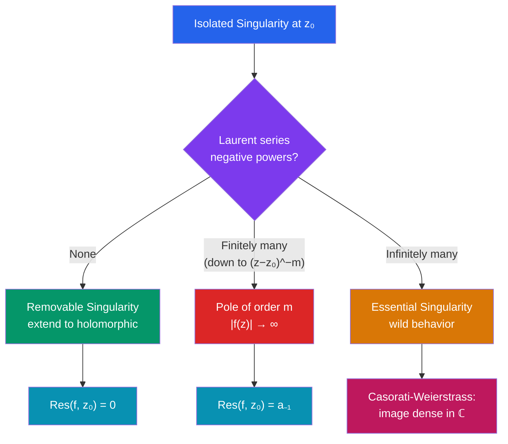

# ℂ Laurent Series and Singularities

> [!abstract] TL;DR
> When a function has an isolated singularity, Taylor series fail but Laurent series — with negative powers allowed — still converge in an annulus around the singularity. The coefficient of $(z-z_0)^{-1}$ (the **residue**) carries deep topological information, and the classification of singularities into removable, poles, and essential determines the function's local and global behavior.

## Intuition — analogy FIRST
Taylor series are like polynomial approximations around a regular point. Near a singularity, the function blows up, so we need negative powers too — like saying "it looks like $\frac{1}{z}$ near $z=0$, plus corrections." The Laurent series provides this expansion. The residue is the single most important coefficient: it measures the "winding" of the function around the singularity and is what the Residue Theorem computes. Think of it as the "charge" at the singularity that the contour integral detects.

---

## How It Works

## Key Concepts

### Taylor Series for Holomorphic Functions
If $f$ is holomorphic at $z_0$, it has a convergent Taylor series:
$$f(z) = \sum_{n=0}^{\infty} a_n (z - z_0)^n, \quad a_n = \frac{f^{(n)}(z_0)}{n!}$$
The radius of convergence $R$ equals the distance from $z_0$ to the nearest singularity.

### Laurent Series
If $f$ has an isolated singularity at $z_0$, we expand in an **annulus** $r < |z-z_0| < R$:
$$f(z) = \sum_{n=-\infty}^{\infty} a_n (z - z_0)^n = \underbrace{\sum_{n=0}^{\infty} a_n(z-z_0)^n}_{\text{analytic part}} + \underbrace{\sum_{n=1}^{\infty} \frac{a_{-n}}{(z-z_0)^n}}_{\text{principal part}}$$
The **principal part** contains the negative powers; it encodes the singularity type.

The coefficients are given by:
$$a_n = \frac{1}{2\pi i} \oint_\gamma \frac{f(z)}{(z-z_0)^{n+1}}\,dz$$
for any simple closed contour $\gamma$ in the annulus.

### Classification of Isolated Singularities

**1. Removable Singularity**
The principal part vanishes: no negative powers. The function may be undefined at $z_0$ but $\lim_{z \to z_0} f(z)$ exists and is finite. Define $f(z_0) = \lim_{z \to z_0} f(z)$ to make $f$ holomorphic.

Example: $f(z) = \frac{\sin z}{z}$ at $z=0$. Laurent series: $1 - z^2/6 + z^4/120 - \cdots$ (no negative powers). Removing the singularity gives $f(0) = 1$.

**Riemann's theorem on removable singularities**: if $f$ is holomorphic near $z_0$ and bounded, then $z_0$ is removable.

**2. Pole of Order $m$**
The principal part has finitely many terms, down to $(z-z_0)^{-m}$:
$$f(z) = \frac{a_{-m}}{(z-z_0)^m} + \cdots + \frac{a_{-1}}{z-z_0} + a_0 + a_1(z-z_0) + \cdots, \quad a_{-m} \neq 0$$
Key property: $|f(z)| \to \infty$ as $z \to z_0$.

Equivalently, $z_0$ is a pole of order $m$ iff $(z-z_0)^m f(z)$ has a removable singularity with nonzero limit at $z_0$.

Example: $f(z) = \frac{1}{(z-1)^3}$ has a pole of order 3 at $z = 1$.

**3. Essential Singularity**
The principal part has infinitely many terms. The function oscillates wildly near $z_0$ — no limit, not even $\infty$.

Example: $f(z) = e^{1/z}$ at $z = 0$. Laurent series: $\sum_{n=0}^{\infty} \frac{1}{n!\,z^n}$. As $z \to 0$ along the real axis from the right, $e^{1/z} \to \infty$; from the left, $e^{1/z} \to 0$.

**Casorati-Weierstrass Theorem**: near an essential singularity, $f$ takes values arbitrarily close to *every* complex number.

**Picard's Great Theorem** (deeper): $f$ actually takes *every* complex value, with at most one exception, in any punctured neighborhood of an essential singularity.

### Residues
The **residue** of $f$ at $z_0$ is the Laurent coefficient $a_{-1}$:
$$\text{Res}(f, z_0) = a_{-1} = \frac{1}{2\pi i} \oint_{|z-z_0|=\epsilon} f(z)\,dz$$

**Computing residues**:
- **Simple pole** ($m=1$): $\text{Res}(f, z_0) = \lim_{z \to z_0}(z-z_0)f(z)$
- **Simple pole** of $p(z)/q(z)$ where $q(z_0)=0$, $p(z_0)\neq 0$: $\text{Res} = p(z_0)/q'(z_0)$
- **Pole of order $m$**: $\text{Res}(f,z_0) = \frac{1}{(m-1)!}\lim_{z\to z_0} \frac{d^{m-1}}{dz^{m-1}}\left[(z-z_0)^m f(z)\right]$

---

## Real-World Notes
- **Signal processing**: a transfer function $H(s)$ with a pole at $s = s_0$ signals a resonance or instability at frequency $\text{Im}(s_0)$; pole locations determine system stability
- **Quantum field theory**: Feynman propagators have poles corresponding to particle masses; residues give probability amplitudes at resonances
- **Control engineering**: poles of a closed-loop system must be in the left half-plane for stability; Laurent analysis near a pole gives the system's transient behavior
- **Thermodynamics / statistical mechanics**: partition functions viewed as complex functions have singularities corresponding to phase transitions

---

## Common Pitfalls
- A **removable** singularity requires extending the function — don't leave it undefined just because the original formula blows up (e.g., $\sin(z)/z$ at $z=0$ is fine).
- Essential singularities cannot be "fixed" — the Casorati-Weierstrass behavior is intrinsic.
- The residue is the $a_{-1}$ coefficient, not some other $a_{-n}$. For a pole of order $m > 1$, you still need the coefficient of $(z-z_0)^{-1}$, not $(z-z_0)^{-m}$.
- Different annuli around $z_0$ can give different Laurent series (if there are multiple singularities). Always specify which annulus.

---

## Related Concepts
- [[_MOC_Complex_Analysis|↑ Complex Analysis MOC]]
- [[Holomorphic_Functions]] — holomorphic away from isolated singularities
- [[Cauchy_Theorem_and_Integral_Formula]] — integral formula from which Laurent coefficients follow
- [[Residue_Theorem_and_Applications]] — applying residues to compute integrals

---

## Review Questions
1. Find the Laurent series of $f(z) = \frac{1}{z(z-1)}$ in the region $0 < |z| < 1$ and $1 < |z| < \infty$.
2. Classify the singularity of $e^{1/z^2}$ at $z=0$ and find the residue.
3. Prove that if $f$ has a pole of order $m$ at $z_0$, then $g(z) = (z-z_0)^m f(z)$ has a removable singularity at $z_0$.

---

## Sources
- Ahlfors, *Complex Analysis*, Ch. 5
- Stein & Shakarchi, *Complex Analysis*, Ch. 3
- Marsden & Hoffman, *Basic Complex Analysis*, Ch. 4

#complex-analysis #laurent-series #singularities #poles #residues #mathematics
