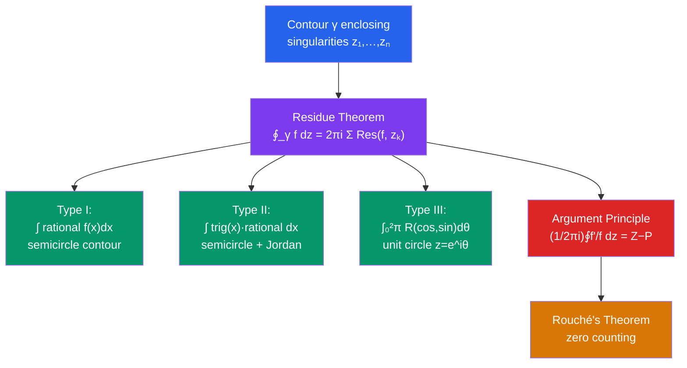

# ℂ Residue Theorem and Applications

> [!abstract] TL;DR
> The Residue Theorem is the culmination of complex analysis: a contour integral around singularities equals $2\pi i$ times the sum of residues inside. This elegant formula turns many impossible-looking real integrals into routine exercises by embedding them in the complex plane and choosing a clever contour.

## Intuition — analogy FIRST
Think of each singularity as a "drain" in a river (the complex plane). Cauchy's theorem says that if there are no drains, the water circulates without net flow. The Residue Theorem quantifies the drains: each one contributes exactly $2\pi i \times \text{residue}$ to the total circulation. To evaluate a real integral like $\int_{-\infty}^{\infty} \frac{dx}{1+x^2}$, we close the path with a large semicircle in the upper half-plane — the semicircle contributes nothing as its radius grows, leaving only the residue contribution, which gives us the answer.

---

## How It Works

## Key Concepts

### Residue Theorem
Let $f$ be holomorphic on and inside a simple closed contour $\gamma$ (counterclockwise) except for isolated singularities $z_1, z_2, \ldots, z_n$ inside $\gamma$. Then:
$$\oint_\gamma f(z)\,dz = 2\pi i \sum_{k=1}^n \text{Res}(f, z_k)$$

**Proof idea**: by Cauchy's theorem, deform $\gamma$ to small circles $C_k$ around each $z_k$. Each circle contributes $2\pi i \cdot \text{Res}(f, z_k)$ by the Laurent series calculation.

### Application I — Integrals of Rational Functions
For $\int_{-\infty}^{\infty} R(x)\,dx$ where $R = p/q$ is rational with $\deg q \geq \deg p + 2$:

1. Close with a large semicircle in the upper half-plane
2. **Jordan's lemma** / ML inequality shows the semicircular arc contributes 0 as radius $\to \infty$
3. Collect residues of $R(z)$ in the upper half-plane

**Worked example**:
$$\int_{-\infty}^{\infty} \frac{dx}{1+x^2}$$
Poles of $\frac{1}{1+z^2} = \frac{1}{(z-i)(z+i)}$ at $z = \pm i$. Upper half-plane has $z = i$:
$$\text{Res}\left(\frac{1}{1+z^2}, i\right) = \frac{1}{z+i}\bigg|_{z=i} = \frac{1}{2i}$$
Therefore: $\int_{-\infty}^{\infty} \frac{dx}{1+x^2} = 2\pi i \cdot \frac{1}{2i} = \pi$. ✓

### Application II — Trigonometric Integrals via Unit Circle
For $\int_0^{2\pi} R(\cos\theta, \sin\theta)\,d\theta$, substitute $z = e^{i\theta}$:
$$\cos\theta = \frac{z+z^{-1}}{2}, \quad \sin\theta = \frac{z-z^{-1}}{2i}, \quad d\theta = \frac{dz}{iz}$$
The integral becomes a contour integral over $|z|=1$, evaluated by residues inside the unit disk.

### Application III — Jordan's Lemma
For integrals like $\int_{-\infty}^{\infty} \frac{e^{iax} p(x)}{q(x)}\,dx$ with $a > 0$: the arc $\int_{C_R} e^{iaz} f(z)\,dz \to 0$ as $R \to \infty$ when $f(z) \to 0$ uniformly (without needing $\deg q \geq \deg p + 2$).

This handles Fourier-type integrals: $\int_{-\infty}^{\infty} \frac{\cos(ax)}{1+x^2}\,dx = \pi e^{-a}$ for $a > 0$.

### Argument Principle
If $f$ is meromorphic (holomorphic except for poles) inside and on $\gamma$, with $Z$ zeros and $P$ poles (counted with multiplicity) inside $\gamma$, then:
$$\frac{1}{2\pi i} \oint_\gamma \frac{f'(z)}{f(z)}\,dz = Z - P$$
The left side is the **winding number** of $f(\gamma)$ around the origin. Geometrically: as $z$ traverses $\gamma$, $f(z)$ winds $Z - P$ times around 0.

### Rouché's Theorem
If $f$ and $g$ are holomorphic inside and on $\gamma$, and $|g(z)| < |f(z)|$ for all $z$ on $\gamma$, then $f$ and $f + g$ have the same number of zeros inside $\gamma$.

**Application**: show $z^5 + 3z + 1$ has exactly 1 root inside $|z| < 1$ (take $f = 3z$, $g = z^5 + 1$; on $|z|=1$: $|g| \leq 2 < 3 = |f|$).

### Conformal Mappings (Brief)
A holomorphic function with nonzero derivative is **conformal** (angle-preserving). **Möbius transformations** $f(z) = \frac{az+b}{cz+d}$ map circles/lines to circles/lines and form a group $\text{PSL}(2,\mathbb{C})$.

---

## Real-World Notes
- **Inverse Laplace transform**: the Bromwich integral $f(t) = \frac{1}{2\pi i} \int_{c-i\infty}^{c+i\infty} e^{st} F(s)\,ds$ is evaluated by closing the contour and summing residues; each pole contributes a decaying exponential term
- **Quantum field theory**: Feynman diagrams are translated into integrals over loop momenta; computing these Feynman integrals via residues (Wick rotation, contour closing) is central to perturbative QFT
- **Digital signal processing**: the $z$-transform is a discrete analogue; poles inside/outside the unit circle determine filter stability, directly mirroring the complex analytic theory
- **Aerodynamics**: the Joukowski transformation (conformal map) converts flow around a circle to flow around an airfoil; residue calculations give lift (Kutta-Joukowski theorem)

---

## Common Pitfalls
- The semicircular contour must close in the correct half-plane: for $e^{iaz}$ with $a > 0$, close in the upper half-plane (where $e^{iaz} = e^{-a\,\text{Im}(z)}$ decays).
- Poles on the real axis (boundary) require indentation — small semicircular detours contribute $\pi i \cdot \text{Res}$ (half the full residue).
- Count residues with multiplicity: a pole of order $m$ at $z_0$ has one residue (still $a_{-1}$), but the computation uses the order-$m$ formula.
- Rouché's theorem requires *strict* inequality $|g| < |f|$ on the contour; equality allows zeros to appear/disappear.

---

## Related Concepts
- [[_MOC_Complex_Analysis|↑ Complex Analysis MOC]]
- [[Laurent_Series_and_Singularities]] — residues come from Laurent coefficients
- [[Cauchy_Theorem_and_Integral_Formula]] — the special case with no singularities

---

## Review Questions
1. Evaluate $\displaystyle\int_{-\infty}^{\infty} \frac{x^2}{(x^2+1)(x^2+4)}\,dx$ using residues.
2. Use the unit circle substitution to compute $\displaystyle\int_0^{2\pi} \frac{d\theta}{2 + \cos\theta}$.
3. Use Rouché's theorem to show that $z^7 - 5z^3 + z - 2$ has exactly 3 zeros in the disk $|z| < 1$.

---

## Sources
- Ahlfors, *Complex Analysis*, Ch. 4–5
- Stein & Shakarchi, *Complex Analysis*, Ch. 3
- Brown & Churchill, *Complex Variables and Applications*, Ch. 7–8

#complex-analysis #residue-theorem #contour-integration #applications #mathematics
