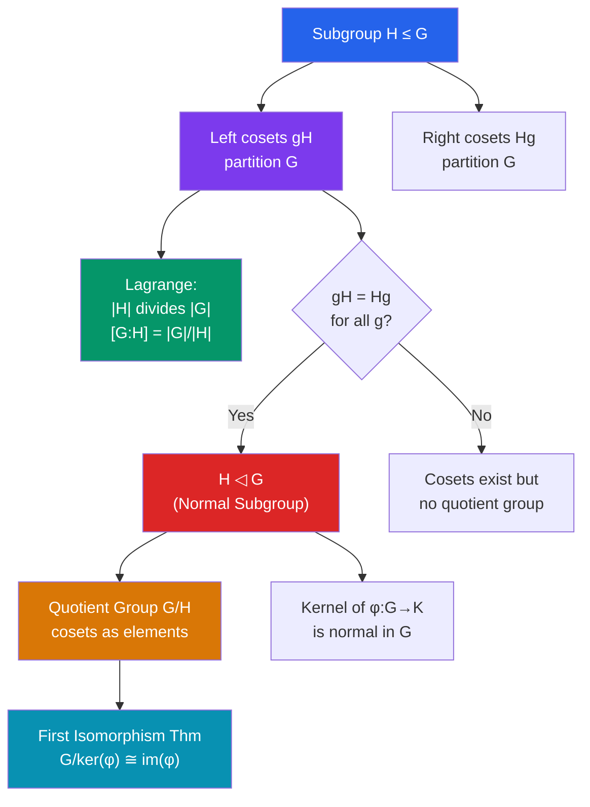

# 🔮 Cosets and Lagrange's Theorem

> [!abstract] TL;DR
> Cosets partition a group into equal-sized pieces — left or right translates of a subgroup. Lagrange's theorem follows immediately: subgroup order must divide group order. Normal subgroups (where left = right cosets) are the "kernels" of group homomorphisms and the only ones that allow building a quotient group. The First Isomorphism Theorem ties these threads together.

## Intuition — analogy FIRST
If you have a group of 24 people and want to split them into teams of equal size, each team size must divide 24. Lagrange's theorem is the group-theoretic version: subgroups "tile" the group perfectly, so their size must divide the total size. Cosets are the tiles. The tile you get by starting from element $g$ is the coset $gH$ — all products $gh$ as $h$ ranges over $H$. Normal subgroups are the special ones where left tiles and right tiles coincide.

---

## How It Works

## Key Concepts

### Cosets
For a subgroup $H \leq G$ and element $g \in G$:
- **Left coset**: $gH = \{gh : h \in H\}$
- **Right coset**: $Hg = \{hg : h \in H\}$

**Key properties**:
- $gH = kH$ iff $k^{-1}g \in H$; cosets are either equal or disjoint
- Every element belongs to exactly one left coset (and one right coset)
- All cosets have the same size: $|gH| = |H|$
- Left cosets **partition** $G$: $G = \bigsqcup_{g} gH$ (disjoint union)

**Index**: $[G:H]$ = number of distinct left cosets of $H$ in $G$.

### Lagrange's Theorem
For finite groups:
$$|G| = [G:H] \cdot |H|$$
In particular, **$|H|$ divides $|G|$** and $[G:H] = |G|/|H|$.

**Proof**: the left cosets of $H$ partition $G$ into $[G:H]$ pieces, each of size $|H|$. Counting: $|G| = [G:H] \cdot |H|$. $\square$

**Corollaries**:
1. $\text{ord}(g)$ divides $|G|$ for any $g \in G$ (since $|\langle g \rangle|$ divides $|G|$)
2. $g^{|G|} = e$ for all $g$ in a finite group (**Fermat's little theorem** is the case $G = (\mathbb{Z}/p\mathbb{Z})^*$)
3. A group of prime order $p$ is cyclic (its only subgroups are $\{e\}$ and itself, so any $g \neq e$ generates all of $G$)

> [!warning] Converse is FALSE
> Lagrange's theorem says orders of subgroups *divide* $|G|$, not that every divisor gives a subgroup. Example: $A_4$ has order 12 but no subgroup of order 6.

### Normal Subgroups
$H \trianglelefteq G$ (read "H normal in G") if $gH = Hg$ for all $g \in G$, equivalently $gHg^{-1} = H$ for all $g$.

**Examples of normal subgroups**:
- $\{e\}$ and $G$ itself are always normal
- Every subgroup of an abelian group is normal
- $A_n \trianglelefteq S_n$ (even permutations)
- The center $Z(G) = \{g \in G : gx = xg \text{ for all } x\} \trianglelefteq G$
- Kernel of any homomorphism $\ker(\varphi) \trianglelefteq G$

**Example of non-normal subgroup**: $H = \{e, (12)\} \leq S_3$. Then $(123)H = \{(123),(123)(12)\} = \{(123),(23)\}$ but $H(123) = \{(123),(12)(123)\} = \{(123),(13)\} \neq (123)H$.

### Quotient Groups
If $N \trianglelefteq G$, define $G/N$ = set of all left cosets of $N$, with multiplication:
$$(gN)(kN) = (gk)N$$
This is **well-defined** (independent of coset representatives) precisely because $N$ is normal. $(G/N, \cdot)$ is a group with identity $eN = N$ and $(gN)^{-1} = g^{-1}N$.

**Canonical projection**: $\pi: G \to G/N$ defined by $\pi(g) = gN$ is a surjective homomorphism with kernel $N$.

**Example**: $\mathbb{Z}/n\mathbb{Z} = \mathbb{Z}/\langle n \rangle$ is the quotient of $(\mathbb{Z},+)$ by the subgroup $n\mathbb{Z} = \{\ldots, -2n, -n, 0, n, 2n, \ldots\}$.

### Group Homomorphisms
A **homomorphism** $\varphi: G \to H$ satisfies $\varphi(ab) = \varphi(a)\varphi(b)$ for all $a,b \in G$.

- **Kernel**: $\ker(\varphi) = \{g \in G : \varphi(g) = e_H\} \trianglelefteq G$
- **Image**: $\text{im}(\varphi) = \{\varphi(g) : g \in G\} \leq H$
- An **isomorphism** is a bijective homomorphism; then $G \cong H$

### First Isomorphism Theorem
$$G/\ker(\varphi) \cong \text{im}(\varphi)$$
The map $\tilde{\varphi}: G/\ker(\varphi) \to \text{im}(\varphi)$ defined by $\tilde{\varphi}(g\ker(\varphi)) = \varphi(g)$ is a well-defined isomorphism.

**Example**: $\varphi: \mathbb{Z} \to \mathbb{Z}/n\mathbb{Z}$, $\varphi(k) = k \bmod n$. $\ker\varphi = n\mathbb{Z}$, $\text{im}\varphi = \mathbb{Z}/n\mathbb{Z}$. Theorem gives $\mathbb{Z}/n\mathbb{Z} \cong \mathbb{Z}/n\mathbb{Z}$. ✓

---

## Real-World Notes
- **Error-correcting codes**: cosets of a linear code are used in coset decoding; a received word and all its coset members are "closest" to the same codeword
- **Modular arithmetic**: $\mathbb{Z}/n\mathbb{Z}$ is the prototypical quotient group; it underlies clocks (mod 12), days (mod 7), and all of number theory
- **Crystallography**: the 32 crystallographic point groups arise as quotients and subgroups of the full rotation group; coset structure describes symmetry-related atomic positions
- **Cryptography**: the discrete log problem in $(\mathbb{Z}/p\mathbb{Z})^*$ (a cyclic group of order $p-1$) underlies Diffie-Hellman; Fermat's little theorem ($a^{p-1} \equiv 1$) is Lagrange's theorem for this group

---

## Common Pitfalls
- Lagrange's theorem applies to finite groups only in its divisibility form; infinite groups can have subgroups of any cardinality.
- $gH$ is not a subgroup in general — it's only a subgroup when $g \in H$ (in which case $gH = H$).
- Normal subgroups require $gNg^{-1} = N$ (the whole set equals itself), not just $gng^{-1} \in N$ for each element (that's the same thing, but the set equality is the right way to think about it).
- The First Isomorphism Theorem gives $G/\ker \cong \text{im}$, not $G \cong H$.

---

## Related Concepts
- [[_MOC_Abstract_Algebra|↑ Abstract Algebra MOC]]
- [[Groups_and_Subgroups]] — foundations: group axioms and examples
- [[Rings_and_Ideals]] — analogous structure: ideals as "normal subgroups" for rings

---

## Review Questions
1. Prove: if $[G:H] = 2$, then $H \trianglelefteq G$.
2. Let $\varphi: S_3 \to \mathbb{Z}/2\mathbb{Z}$ be the sign homomorphism. Identify the kernel and apply the First Isomorphism Theorem.
3. Show that a group of order 15 must be cyclic (hint: Lagrange + Sylow or just order counting).

---

## Sources
- Dummit & Foote, *Abstract Algebra*, Ch. 3–4
- Herstein, *Topics in Algebra*, Ch. 2
- Artin, *Algebra*, Ch. 2

#abstract-algebra #cosets #lagrange #normal-subgroups #quotient-groups #mathematics
