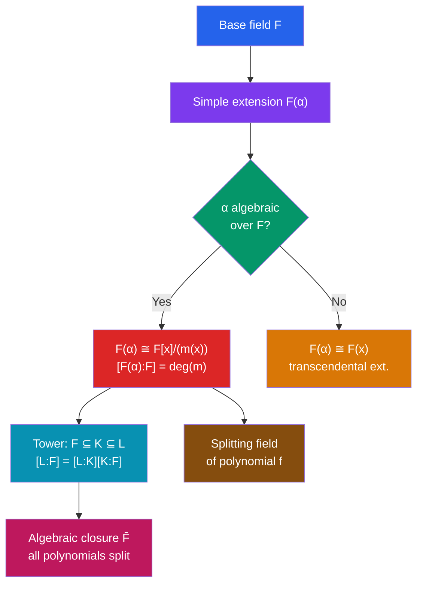

# 🔮 Fields and Field Extensions

> [!abstract] TL;DR
> A field is where addition, subtraction, multiplication, and division all work. Field extensions ask: what new elements can we adjoin while maintaining field structure? This framework precisely captures "the smallest field containing $\mathbb{Q}$ and $\sqrt{2}$" and underpins Galois theory's resolution of which polynomial equations can be solved by radicals.

## Intuition — analogy FIRST
$\mathbb{Q}$ contains the rationals but not $\sqrt{2}$. If we want a field that contains both, we adjoin $\sqrt{2}$: the result $\mathbb{Q}(\sqrt{2}) = \{a + b\sqrt{2} : a,b \in \mathbb{Q}\}$ is the smallest field containing $\mathbb{Q}$ and $\sqrt{2}$. This "smallest field containing $F$ and $\alpha$" construction is a field extension. The dimension of the extension as a vector space over $F$ (here it's 2) measures how much $\alpha$ "adds" to $F$ — and this dimension controls everything about solvability of polynomial equations.

---

## How It Works

## Key Concepts

### Fields Revisited
A **field** $F$ is a commutative ring with $1 \neq 0$ where every nonzero element is a unit.

**Examples**: $\mathbb{Q}$, $\mathbb{R}$, $\mathbb{C}$; $\mathbb{Z}/p\mathbb{Z} = \mathbb{F}_p$ for prime $p$; $\mathbb{Q}(\sqrt{2})$.

**Prime fields**: every field contains a unique smallest subfield — either $\mathbb{Q}$ (characteristic 0) or $\mathbb{F}_p$ (characteristic $p$).

### Characteristic
The **characteristic** $\text{char}(F)$ is the smallest positive integer $n$ with $n \cdot 1 = \underbrace{1 + \cdots + 1}_{n} = 0$, or $0$ if no such $n$ exists.

- $\text{char}(\mathbb{Q}) = \text{char}(\mathbb{R}) = \text{char}(\mathbb{C}) = 0$
- $\text{char}(\mathbb{F}_p) = p$

**Theorem**: the characteristic is always $0$ or a prime. (If $n = ab$ were composite, $n\cdot 1 = 0$ would give a zero divisor.)

### Field Extensions
$K$ is a **field extension** of $F$, written $F \subseteq K$ or $K/F$, if $F$ is a subfield of $K$.

$K$ is a vector space over $F$; its dimension is the **degree** $[K:F]$.

**Tower law**: for $F \subseteq K \subseteq L$:
$$[L:F] = [L:K] \cdot [K:F]$$

**Example**: $[\mathbb{C} : \mathbb{Q}] = \infty$; $[\mathbb{C} : \mathbb{R}] = 2$; $[\mathbb{R} : \mathbb{Q}] = \infty$.

### Algebraic Elements and Minimal Polynomial
$\alpha \in K$ is **algebraic over $F$** if $f(\alpha) = 0$ for some nonzero $f \in F[x]$.
$\alpha$ is **transcendental over $F$** if no such polynomial exists.

The **minimal polynomial** $m_\alpha(x) \in F[x]$ is the unique monic irreducible polynomial with $m_\alpha(\alpha) = 0$. It generates the kernel of the evaluation map $\text{ev}_\alpha: F[x] \to K$.

**Example**: $\sqrt{2}$ over $\mathbb{Q}$: minimal polynomial $x^2 - 2$ (irreducible over $\mathbb{Q}$).

**Example**: $\zeta = e^{2\pi i/5}$ over $\mathbb{Q}$: minimal polynomial $\Phi_5(x) = x^4+x^3+x^2+x+1$ (degree 4).

### Simple Extensions
$$F(\alpha) \cong F[x]/(m_\alpha(x))$$
where $m_\alpha$ is the minimal polynomial of $\alpha$.

**Degree formula**: $[F(\alpha):F] = \deg(m_\alpha)$.

**Basis**: $\{1, \alpha, \alpha^2, \ldots, \alpha^{n-1}\}$ is an $F$-basis for $F(\alpha)$, where $n = \deg(m_\alpha)$.

**Concrete example**: $\mathbb{Q}(\sqrt{2}) \cong \mathbb{Q}[x]/(x^2-2)$; every element is $a + b\sqrt{2}$; $[{\mathbb{Q}(\sqrt{2})}:\mathbb{Q}] = 2$.

### Algebraic Closures
$F$ is **algebraically closed** if every non-constant polynomial in $F[x]$ has a root in $F$. Examples: $\mathbb{C}$ (Fundamental Theorem of Algebra).

Every field has an **algebraic closure** $\bar{F}$: the smallest algebraically closed extension of $F$. $\bar{\mathbb{Q}}$ is the field of all algebraic numbers.

### Splitting Fields
The **splitting field** of $f \in F[x]$ is the smallest extension $K/F$ where $f$ factors completely into linear factors:
$$f(x) = c(x - \alpha_1)(x - \alpha_2) \cdots (x - \alpha_n) \in K[x]$$

$K = F(\alpha_1, \ldots, \alpha_n)$. Splitting fields are unique up to isomorphism.

**Example**: splitting field of $x^3-2$ over $\mathbb{Q}$ is $\mathbb{Q}(\sqrt[3]{2}, \omega)$ where $\omega = e^{2\pi i/3}$; degree $= 6$.

### Finite Fields
For any prime power $q = p^n$, there is a unique (up to isomorphism) field $\mathbb{F}_q = \mathbb{F}_{p^n}$ with $q$ elements.

**Construction**: $\mathbb{F}_{p^n} = \mathbb{F}_p[x]/(m(x))$ for any irreducible $m$ of degree $n$ over $\mathbb{F}_p$.

**Structure**: $\mathbb{F}_{p^n}$ is the splitting field of $x^{p^n} - x$ over $\mathbb{F}_p$; its multiplicative group $\mathbb{F}_{p^n}^\times$ is cyclic of order $p^n - 1$.

**Transcendental extensions**: $e$ and $\pi$ are transcendental over $\mathbb{Q}$ (Hermite 1873, Lindemann 1882).

---

## Real-World Notes
- **AES encryption**: operates in $\mathbb{F}_{2^8} = \mathbb{F}_2[x]/(x^8+x^4+x^3+x+1)$; field arithmetic enables the MixColumns step; security depends on irreducibility of the modulus
- **Elliptic curve cryptography**: defined over $\mathbb{F}_p$ or $\mathbb{F}_{2^n}$; the group law on points is what makes discrete logarithm hard
- **GPS and CDMA**: use $\mathbb{F}_{2^n}$ for spreading codes; the field structure allows fast decoding of errors
- **Algebraic geometry**: affine varieties over algebraically closed fields satisfy much nicer theorems; the algebraic closure $\bar{k}$ is always assumed in the foundational theory

---

## Common Pitfalls
- Transcendence requires proof — most numbers "look" algebraic but aren't. $e + \pi$ is conjectured transcendental but unproven.
- The degree $[K:F]$ measures dimension over $F$, NOT the degree of any particular polynomial.
- $\mathbb{F}_4 \neq \mathbb{Z}/4\mathbb{Z}$: the latter is a ring but not a field ($2 \cdot 2 = 0$ in $\mathbb{Z}/4\mathbb{Z}$). Finite fields have prime power order, not arbitrary order.
- $F(\alpha, \beta)$ is NOT always $F(\alpha+\beta)$; the primitive element theorem guarantees it for separable extensions but requires care.

---

## Related Concepts
- [[_MOC_Abstract_Algebra|↑ Abstract Algebra MOC]]
- [[Polynomial_Rings_and_Factorization]] — $F(\alpha) \cong F[x]/(m(x))$; Eisenstein checks irreducibility of $m$
- [[Galois_Theory]] — automorphisms of field extensions; the Galois group measures symmetries of the splitting field

---

## Review Questions
1. Show $[\mathbb{Q}(\sqrt{2}, \sqrt{3}):\mathbb{Q}] = 4$ by finding a basis and showing $\sqrt{6} \in \mathbb{Q}(\sqrt{2},\sqrt{3})$.
2. Prove that $\mathbb{F}_{p^n}$ has exactly $p^n$ elements by constructing it as a splitting field.
3. Why is there no field with 6 elements? (Hint: use the characteristic argument.)

---

## Sources
- Dummit & Foote, *Abstract Algebra*, Ch. 13–14
- Lang, *Algebra*, Ch. V
- Artin, *Algebra*, Ch. 13

#abstract-algebra #fields #field-extensions #algebraic #finite-fields #mathematics
