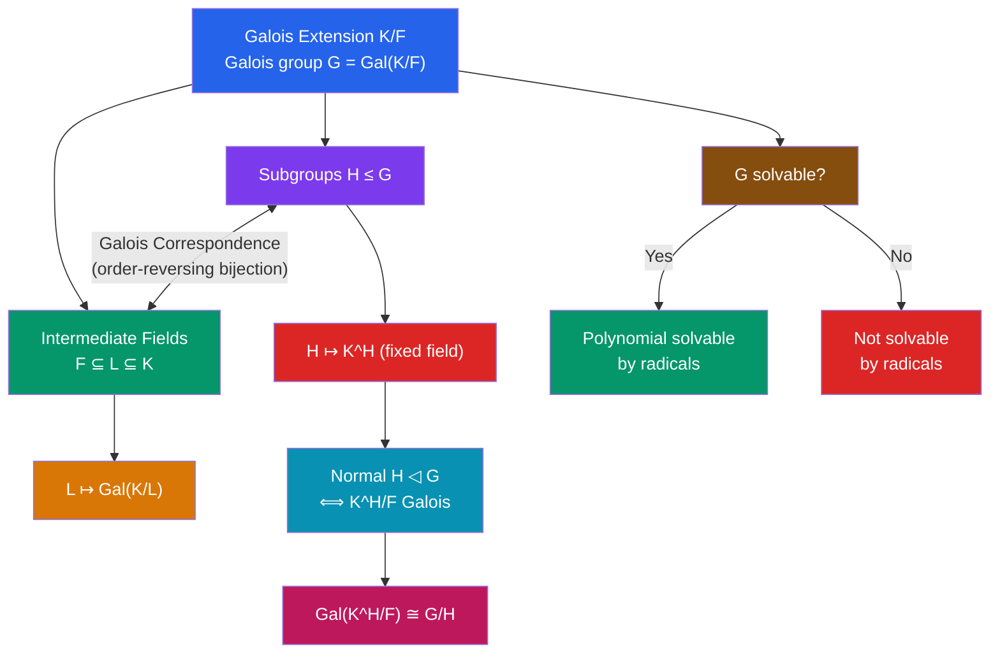

# 🔮 Galois Theory

> [!abstract] TL;DR
> Galois theory establishes a perfect correspondence between intermediate fields of a field extension and subgroups of its automorphism group. This dictionary translates field-theoretic questions (can a polynomial be solved by radicals?) into group-theoretic ones (is the Galois group solvable?), culminating in the proof that no general formula exists for degree-5 polynomials.

## Intuition — analogy FIRST
Consider the roots of $x^2 - 2$: they are $\pm\sqrt{2}$. The "symmetry" that swaps them ($\sqrt{2} \mapsto -\sqrt{2}$) is an automorphism of $\mathbb{Q}(\sqrt{2})$ fixing $\mathbb{Q}$. These symmetries form a group — the Galois group. The fundamental insight is that intermediate fields (between $\mathbb{Q}$ and the splitting field) correspond *perfectly* to subgroups: the fixed field of a subgroup gives an intermediate field, and vice versa. Galois leveraged this to determine when equations are solvable: if the Galois group has the right structure (solvable), radicals suffice; if not (like $S_5$ for the quintic), no radical formula exists.

---

## How It Works

## Key Concepts

### Automorphisms of Field Extensions
An **automorphism** of $K/F$ is a field isomorphism $\sigma: K \to K$ fixing $F$ pointwise: $\sigma(a) = a$ for all $a \in F$.

The set of all such automorphisms forms a group under composition: the **Galois group** $\text{Gal}(K/F)$.

**Example**: $\text{Gal}(\mathbb{Q}(\sqrt{2})/\mathbb{Q}) = \{id, \sigma\}$ where $\sigma(\sqrt{2}) = -\sqrt{2}$. This group is $\mathbb{Z}/2\mathbb{Z}$.

**Example**: $\text{Gal}(\mathbb{Q}(\sqrt{2},\sqrt{3})/\mathbb{Q}) \cong \mathbb{Z}/2\mathbb{Z} \times \mathbb{Z}/2\mathbb{Z}$, with generators swapping each radical independently.

### Galois Extensions
$K/F$ is a **Galois extension** if $K$ is the splitting field of a separable polynomial over $F$, equivalently if:
$$|\text{Gal}(K/F)| = [K:F]$$

In characteristic 0 (e.g., subfields of $\mathbb{C}$): every irreducible polynomial is separable (distinct roots), so splitting fields are always Galois.

### Fixed Fields
For $H \leq \text{Gal}(K/F)$, the **fixed field** is:
$$K^H = \{x \in K : \sigma(x) = x \text{ for all } \sigma \in H\}$$
This is a subfield with $F \subseteq K^H \subseteq K$, and $[K : K^H] = |H|$.

### Fundamental Theorem of Galois Theory
Let $K/F$ be a Galois extension with $G = \text{Gal}(K/F)$. There is an **order-reversing bijection**:

$$\left\{\begin{array}{c}\text{Subgroups } H \leq G\end{array}\right\} \xleftrightarrow{\;\;1:1\;\;} \left\{\begin{array}{c}\text{Intermediate fields} \\ F \subseteq L \subseteq K\end{array}\right\}$$

given by $H \mapsto K^H$ and $L \mapsto \text{Gal}(K/L)$.

**Properties**:
- $[K^H : F] = [G:H]$ and $[K:K^H] = |H|$
- $H \trianglelefteq G$ iff $K^H/F$ is a Galois extension
- When $H \trianglelefteq G$: $\text{Gal}(K^H/F) \cong G/H$

**Example**: $K = \mathbb{Q}(\sqrt{2},\sqrt{3})$, $G \cong (\mathbb{Z}/2)^2$. Subgroups: $\{e\}$, $\langle\sigma_1\rangle$, $\langle\sigma_2\rangle$, $\langle\sigma_1\sigma_2\rangle$, $G$. Corresponding fixed fields: $K$, $\mathbb{Q}(\sqrt{3})$, $\mathbb{Q}(\sqrt{2})$, $\mathbb{Q}(\sqrt{6})$, $\mathbb{Q}$.

### Solvable Groups
A group $G$ is **solvable** if there exists a subnormal series:
$$G = G_0 \trianglerighteq G_1 \trianglerighteq G_2 \trianglerighteq \cdots \trianglerighteq G_k = \{e\}$$
with each $G_i/G_{i+1}$ abelian.

**Solvable**: $\mathbb{Z}/n\mathbb{Z}$, any abelian group, $S_n$ for $n \leq 4$, $A_4$ (using $V_4 \trianglelefteq A_4$).

**Not solvable**: $A_5$ (simple, non-abelian); $S_n$ for $n \geq 5$ (contains $A_n$ which is simple non-abelian).

### Solvability by Radicals
A polynomial $f \in F[x]$ is **solvable by radicals** over $F$ if its roots can be expressed using $+, -, \times, \div, \sqrt[n]{\cdot}$ applied to elements of $F$.

**Theorem (Galois)**: $f$ is solvable by radicals over $F$ iff the Galois group $\text{Gal}(K/F)$ (where $K$ is the splitting field) is a solvable group.

**Corollaries**:
- Degree $\leq 4$: $\text{Gal}(K/F) \leq S_4$ (always solvable) — cubic formula and quartic formula exist
- Degree 5 (general): $\text{Gal} = S_5$ (not solvable) — **Abel-Ruffini theorem**: no general radical formula for degree $\geq 5$

**Why $S_5$ is not solvable**: $A_5$ is simple non-abelian, so its only normal subgroups are $\{e\}$ and $A_5$ itself; the derived series cannot reach $\{e\}$.

### Classical Impossibility Results
Using Galois theory, three ancient problems are shown impossible by ruler and compass:

**Constructibility criterion**: $\alpha$ is constructible from $\mathbb{Q}$ iff $[\mathbb{Q}(\alpha):\mathbb{Q}]$ is a power of 2.

1. **Doubling the cube** ($\sqrt[3]{2}$): $[\mathbb{Q}(\sqrt[3]{2}):\mathbb{Q}] = 3 \neq 2^k$ — impossible
2. **Trisecting a general angle**: $\cos(20°)$ satisfies $8x^3 - 6x - 1 = 0$ (irreducible over $\mathbb{Q}$), degree 3 — impossible
3. **Squaring the circle** ($\sqrt{\pi}$): $\pi$ is transcendental (Lindemann 1882), so $[\mathbb{Q}(\sqrt{\pi}):\mathbb{Q}] = \infty$ — impossible

---

## Real-World Notes
- **Understanding classical formulas**: the quadratic formula corresponds to $\text{Gal} \cong \mathbb{Z}/2$; the cubic to $S_3$ (solvable); the quartic to $S_4$ (solvable via the resolvent cubic). Galois theory explains *why* these formulas exist.
- **Coding theory**: the structure of finite field extensions $\mathbb{F}_{p^n}/\mathbb{F}_p$ is governed by the Galois group (cyclic, generated by the Frobenius $x \mapsto x^p$); this explains the cyclotomic structure of BCH codes
- **Number theory**: the absolute Galois group $\text{Gal}(\bar{\mathbb{Q}}/\mathbb{Q})$ is one of the central objects of modern mathematics; the Langlands program attempts to understand it via $L$-functions
- **Cryptography**: isogeny-based cryptography relies on the arithmetic of elliptic curves over finite fields, where Galois theory controls the field of definition of torsion points

---

## Common Pitfalls
- Not every polynomial of degree $\geq 5$ is insolvable — specific polynomials can have solvable Galois groups (e.g., $x^5 - 2$ has Galois group of order 20, which is solvable). The *general* degree-5 polynomial has Galois group $S_5$.
- The Galois correspondence is *order-reversing*: larger subgroups correspond to smaller fields. $H_1 \leq H_2 \Rightarrow K^{H_1} \supseteq K^{H_2}$.
- Galois extensions require both *normal* and *separable*. Over characteristic 0, separability is automatic. Over characteristic $p$, inseparable extensions exist (e.g., $\mathbb{F}_p(t^{1/p})/\mathbb{F}_p(t)$).
- A group being non-abelian does not make it non-solvable — $S_3$ is non-abelian but solvable. Non-solvability requires the group to contain $A_5$ as a composition factor.

---

## Related Concepts
- [[_MOC_Abstract_Algebra|↑ Abstract Algebra MOC]]
- [[Fields_and_Field_Extensions]] — the field theory input to Galois theory
- [[Groups_and_Subgroups]] — the group theory input; solvable groups are key
- [[Cosets_and_Lagrange_Theorem]] — normal subgroups and the correspondence theorem

---

## Review Questions
1. Compute $\text{Gal}(\mathbb{Q}(\zeta_8)/\mathbb{Q})$ where $\zeta_8 = e^{2\pi i/8}$, and draw the full Galois correspondence.
2. Show that $f(x) = x^5 - 6x + 3$ is irreducible over $\mathbb{Q}$ (Eisenstein, $p=3$) and has Galois group $S_5$, hence is not solvable by radicals.
3. Why is a degree-4 polynomial always solvable by radicals? Sketch the argument using $S_4$ and its solvable subnormal series.

---

## Sources
- Dummit & Foote, *Abstract Algebra*, Ch. 14
- Artin, *Galois Theory* (Notre Dame Lectures)
- Stewart, *Galois Theory*, Ch. 8–13

#abstract-algebra #galois-theory #solvable-groups #field-extensions #mathematics
