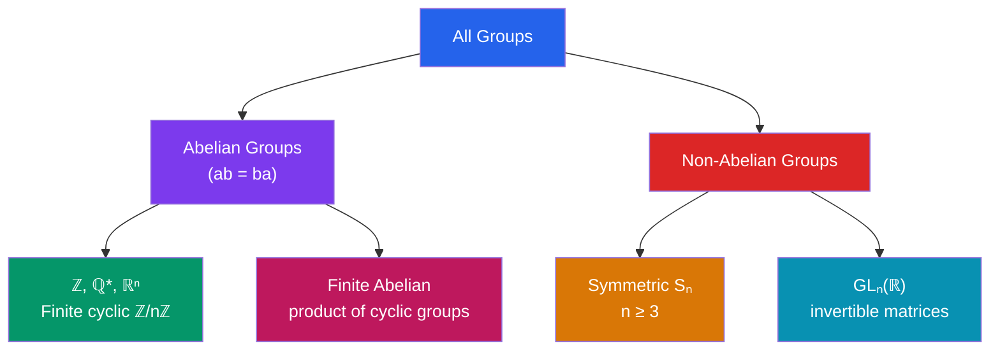

# 🔮 Groups and Subgroups

> [!abstract] TL;DR
> A group is the minimal algebraic structure capturing the notion of "symmetry": a set with an associative operation, an identity, and inverses. Groups appear everywhere from Rubik's cubes to particle physics. The key idea is that studying the symmetries of an object (rotations, reflections, permutations) often reveals more about the object than direct analysis would.

## Intuition — analogy FIRST
Imagine all the ways you can rearrange the letters of "MATH": permute them. Composition of two rearrangements gives another rearrangement; there's a "do nothing" rearrangement (identity); every rearrangement can be undone (inverse). This is the symmetric group $S_4$. Groups formalize exactly this structure of "do, then do again, and undo" — the algebra of reversible transformations.

---

## How It Works

## Key Concepts

### Group Axioms
A **group** $(G, \cdot)$ is a set $G$ with a binary operation $\cdot$ satisfying:
1. **Closure**: $a, b \in G \Rightarrow a \cdot b \in G$
2. **Associativity**: $(a \cdot b) \cdot c = a \cdot (b \cdot c)$ for all $a,b,c \in G$
3. **Identity**: $\exists\, e \in G$ such that $e \cdot a = a \cdot e = a$ for all $a \in G$
4. **Inverses**: $\forall\, a \in G$, $\exists\, a^{-1} \in G$ such that $a \cdot a^{-1} = a^{-1} \cdot a = e$

An **abelian** (commutative) group additionally satisfies $a \cdot b = b \cdot a$.

### Key Examples

| Group | Operation | Abelian? | Finite? |
|-------|-----------|----------|---------|
| $(\mathbb{Z}, +)$ | addition | Yes | No |
| $(\mathbb{Q}\setminus\{0\}, \times)$ | multiplication | Yes | No |
| $(\mathbb{Z}/n\mathbb{Z}, +)$ | mod $n$ addition | Yes | Yes, $n$ |
| $(\mathbb{Z}/n\mathbb{Z})^\times$ | mod $n$ mult. | Yes | Yes, $\phi(n)$ |
| $S_n$ (permutations of $n$ elements) | composition | No ($n\geq 3$) | Yes, $n!$ |
| $GL_n(\mathbb{R})$ (invertible matrices) | matrix mult. | No | No |
| $A_n$ (even permutations) | composition | No ($n\geq 4$) | Yes, $n!/2$ |

### Basic Properties
- **Uniqueness**: identity is unique; inverses are unique
- **Cancellation**: $ab = ac \Rightarrow b = c$ (left); $ba = ca \Rightarrow b = c$ (right)
- **Shoes-socks law**: $(ab)^{-1} = b^{-1}a^{-1}$
- **Powers**: $g^n$ for $n \in \mathbb{Z}$ (with $g^{-n} = (g^{-1})^n$)

### Order
- **Order of group**: $|G|$ = cardinality of $G$ (may be infinite)
- **Order of element**: $\text{ord}(g) = \min\{n \in \mathbb{N} : g^n = e\}$; if no such $n$ exists, $\text{ord}(g) = \infty$

### Symmetric Group $S_n$
The group of all permutations of $\{1, 2, \ldots, n\}$ under composition. $|S_n| = n!$.

**Cycle notation**: the permutation sending $1\mapsto 2\mapsto 3\mapsto 1$ and $4\mapsto 5\mapsto 4$ is written $(123)(45)$.

**Transpositions**: 2-cycles $(ij)$; every permutation factors into transpositions.

**Sign/parity**: a permutation is **even** if it's a product of an even number of transpositions; otherwise **odd**. The sign $\text{sgn}(\sigma) = \pm 1$ is well-defined.

**Alternating group** $A_n$: even permutations. $|A_n| = n!/2$. $A_n \leq S_n$.

### Subgroups
$H \leq G$ (read "$H$ is a subgroup of $G$") if $H \subseteq G$ and $H$ is a group under the same operation.

**Subgroup test**: $H \neq \emptyset$ and $a, b \in H \Rightarrow ab^{-1} \in H$. (One-step test.)

**Cyclic subgroup**: $\langle g \rangle = \{g^n : n \in \mathbb{Z}\}$ is the smallest subgroup containing $g$.

### Cyclic Groups
$G$ is **cyclic** if $G = \langle g \rangle$ for some $g$ (a generator). Cyclic groups are always abelian.
- Every infinite cyclic group is isomorphic to $(\mathbb{Z}, +)$
- Every finite cyclic group of order $n$ is isomorphic to $\mathbb{Z}/n\mathbb{Z}$
- Subgroups of cyclic groups are cyclic

---

## Real-World Notes
- **Rubik's cube**: the group of all reachable cube states has $\approx 4.3 \times 10^{19}$ elements; God's number (maximum moves needed) = 20; group theory reveals the structure of solutions
- **Crystallography**: the 230 space groups classify all possible crystal symmetry structures; every crystal belongs to one of these groups
- **Particle physics**: elementary particles are classified by representations of symmetry groups; $SU(3) \times SU(2) \times U(1)$ is the Standard Model gauge group
- **Public-key cryptography**: Diffie-Hellman and elliptic curve cryptography are based on the discrete logarithm problem in cyclic groups

---

## Common Pitfalls
- Associativity is required but commutativity is not — matrix multiplication is a group operation but not commutative.
- The subgroup test requires checking $ab^{-1} \in H$, not just $ab \in H$ — closure alone doesn't give a subgroup (you also need inverses).
- $\text{ord}(g)$ divides $|G|$ for finite groups (Lagrange) but this doesn't mean $g^{|G|/2} = e$ — the order divides $|G|$, not necessarily equals $|G|/2$.
- Don't confuse the order of the *group* $|G|$ with the order of an *element* $\text{ord}(g)$.

---

## Related Concepts
- [[_MOC_Abstract_Algebra|↑ Abstract Algebra MOC]]
- [[Cosets_and_Lagrange_Theorem]] — partitioning a group by a subgroup
- [[Rings_and_Ideals]] — algebraic structures with two operations
- [[Fields_and_Field_Extensions]] — fields as commutative rings where everything inverts

---

## Review Questions
1. Prove that the identity element in a group is unique.
2. Show that $\{1, -1, i, -i\}$ under multiplication forms a group isomorphic to $\mathbb{Z}/4\mathbb{Z}$.
3. How many subgroups does $\mathbb{Z}/12\mathbb{Z}$ have? List them, and identify which elements generate them.

---

## Sources
- Dummit & Foote, *Abstract Algebra*, Ch. 1–2
- Herstein, *Topics in Algebra*, Ch. 2
- Artin, *Algebra*, Ch. 2

#abstract-algebra #groups #group-theory #symmetric-group #mathematics
