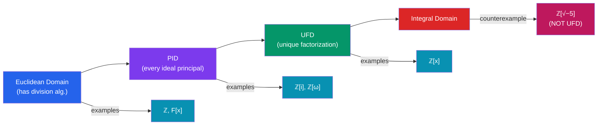

# 🔮 Polynomial Rings and Factorization

> [!abstract] TL;DR
> Polynomial rings $F[x]$ over a field behave remarkably like the integers: there's a division algorithm, every ideal is principal, and every polynomial factors uniquely into irreducibles. Gauss's lemma and Eisenstein's criterion provide powerful tools for proving irreducibility over $\mathbb{Q}$, with deep applications in coding theory and algebraic number theory.

## Intuition — analogy FIRST
Think of $\mathbb{Z}$ and how integers factor uniquely into primes. Polynomial rings over a field are the direct analogue: polynomials factor uniquely into irreducible factors, and the "division algorithm" for polynomials mimics long division for integers. The degree of a polynomial plays the role of the absolute value — it measures "size" and always decreases when you divide. This analogy is so strong that $F[x]$ and $\mathbb{Z}$ share almost all factorization properties (both are Euclidean domains).

---

## How It Works

## Key Concepts

### Polynomial Ring $R[x]$
For a commutative ring $R$, the **polynomial ring** $R[x]$ consists of formal polynomials:
$$f = a_n x^n + a_{n-1}x^{n-1} + \cdots + a_1 x + a_0, \quad a_i \in R$$
with componentwise addition and polynomial multiplication. $\deg(fg) = \deg(f) + \deg(g)$ when $R$ is a domain.

If $R$ is commutative (resp. a domain, field), then $R[x]$ is commutative (resp. a domain, but never a field).

### Division Algorithm in $F[x]$
For $F$ a field and $f, g \in F[x]$ with $g \neq 0$:
$$f = qg + r \quad \text{with } \deg(r) < \deg(g)$$
The quotient $q$ and remainder $r$ are **unique**. This is the analogue of integer division.

**Consequence**: $F[x]$ is a **Euclidean domain** (with degree as the Euclidean norm).

### Roots and Factors
**Factor theorem**: $(x - a) \mid f(x)$ iff $f(a) = 0$.

**Bound on roots**: a polynomial of degree $n$ over a domain has at most $n$ roots.

**Proof**: if $f(a) = 0$ then $f(x) = (x-a)q(x)$; then $f(b) = (b-a)q(b) = 0$ with $b \neq a$ forces $q(b) = 0$; induct.

### $F[x]$ is a PID
Since $F[x]$ is a Euclidean domain, every ideal in $F[x]$ is principal:
$$I = (f) = f \cdot F[x] \quad \text{for some } f \in F[x]$$
A generator of $I$ is the GCD of all elements in $I$, computable via the Euclidean algorithm.

**GCD via Euclidean algorithm**: works exactly as for integers, using polynomial division.

### Irreducible Polynomials
A non-constant $f \in F[x]$ is **irreducible** over $F$ if it cannot be written as $f = gh$ with $\deg(g), \deg(h) \geq 1$.

- Over $\mathbb{C}$: only degree-1 polynomials are irreducible (Fundamental Theorem of Algebra)
- Over $\mathbb{R}$: degree-1 and irreducible degree-2 (negative discriminant) polynomials
- Over $\mathbb{Q}$: much richer — $x^2 + 1$, $x^4 + 1$, $x^2 - 2$, etc.

### Unique Factorization
In $F[x]$, every polynomial $f$ factors uniquely (up to order and units = nonzero scalars) as:
$$f = c \cdot p_1^{e_1} p_2^{e_2} \cdots p_k^{e_k}$$
where $c \in F^\times$ and each $p_i$ is monic irreducible. $F[x]$ is a **UFD**.

### Gauss's Lemma
The content $\text{cont}(f)$ of $f \in \mathbb{Z}[x]$ is the GCD of its coefficients. A **primitive** polynomial has $\text{cont}(f) = 1$.

**Gauss's lemma**: if $f \in \mathbb{Z}[x]$ is primitive and $f = gh$ with $g, h \in \mathbb{Q}[x]$, then $g, h$ can be chosen in $\mathbb{Z}[x]$.

**Corollary**: if $f \in \mathbb{Z}[x]$ is irreducible over $\mathbb{Z}$ (and primitive), then $f$ is irreducible over $\mathbb{Q}$.

### Eisenstein's Criterion
Let $f = a_n x^n + \cdots + a_0 \in \mathbb{Z}[x]$. If there exists a prime $p$ such that:
- $p \mid a_0, a_1, \ldots, a_{n-1}$ (divides all but leading coefficient)
- $p \nmid a_n$ (doesn't divide leading coefficient)
- $p^2 \nmid a_0$ (doesn't divide constant term squared)

then $f$ is **irreducible over $\mathbb{Q}$**.

**Examples**:
- $x^2 - 2$: use $p=2$. Irreducible over $\mathbb{Q}$.
- $x^p - p$ (for prime $p$): Eisenstein with $p$. Irreducible over $\mathbb{Q}$.
- $x^4 + 1$: substitute $x \mapsto x+1$, get $x^4 + 4x^3 + 6x^2 + 4x + 2$; Eisenstein with $p=2$.
- $\Phi_p(x) = 1 + x + x^2 + \cdots + x^{p-1}$: substitute $x \mapsto x+1$, Eisenstein with $p$.

### $\mathbb{Z}[x]$ is a UFD
By combining Gauss's lemma: $\mathbb{Z}[x]$ is a UFD even though it is not a PID ($(2, x)$ is not principal).

---

## Real-World Notes
- **Error-correcting codes**: Reed-Solomon codes use polynomials over $\mathbb{F}_{2^m}$; a message is a polynomial, redundancy is added by multiplying by a generator polynomial, and errors are found via roots. The UFD structure guarantees unique decoding.
- **Cyclic codes**: in $\mathbb{F}_q[x]/(x^n - 1)$, each ideal is generated by a divisor of $x^n-1$; Hamming codes, BCH codes, and CRC checksums all arise this way
- **Cryptography**: irreducibility of $f(x)$ over $\mathbb{F}_2$ defines the field $\mathbb{F}_{2^n}$ used in AES (degree-8 polynomial $x^8+x^4+x^3+x+1$ is irreducible over $\mathbb{F}_2$)
- **Algebraic number theory**: $\mathbb{Z}[\alpha] \cong \mathbb{Z}[x]/(m(x))$ where $m$ is the minimal polynomial of an algebraic integer $\alpha$; factoring $p$ in this ring connects to Eisenstein's criterion

---

## Common Pitfalls
- Irreducibility depends on the ring/field! $x^2-2$ is irreducible over $\mathbb{Q}$ but factors as $(x-\sqrt{2})(x+\sqrt{2})$ over $\mathbb{R}$.
- Eisenstein gives *sufficient* but not *necessary* conditions. Failure of Eisenstein doesn't mean the polynomial is reducible (e.g., $x^4+1$: Eisenstein fails directly but the substitution trick works).
- $\mathbb{Z}[x]$ is a UFD but not a PID — unique factorization holds, but not every ideal is principal. The ideal $(2, x)$ is the canonical example.
- Over $\mathbb{Z}$, "irreducible" includes the condition that the polynomial can't be written as a product of two lower-degree polynomials with integer coefficients; units are $\pm 1$.

---

## Related Concepts
- [[_MOC_Abstract_Algebra|↑ Abstract Algebra MOC]]
- [[Rings_and_Ideals]] — general ring theory; polynomial rings as key examples
- [[Fields_and_Field_Extensions]] — $F[x]/(p(x))$ builds field extensions

---

## Review Questions
1. Use the Eisenstein criterion to show $x^5 - 6x + 3$ is irreducible over $\mathbb{Q}$.
2. Factor $x^4 - 1$ completely over $\mathbb{Q}$, $\mathbb{R}$, and $\mathbb{C}$.
3. Show that $\mathbb{Q}[x]/(x^2+1) \cong \mathbb{C}$ by constructing an explicit isomorphism.

---

## Sources
- Dummit & Foote, *Abstract Algebra*, Ch. 9
- Lang, *Algebra*, Ch. IV–V
- Artin, *Algebra*, Ch. 12

#abstract-algebra #polynomial-rings #factorization #ufd #pid #eisenstein #mathematics
