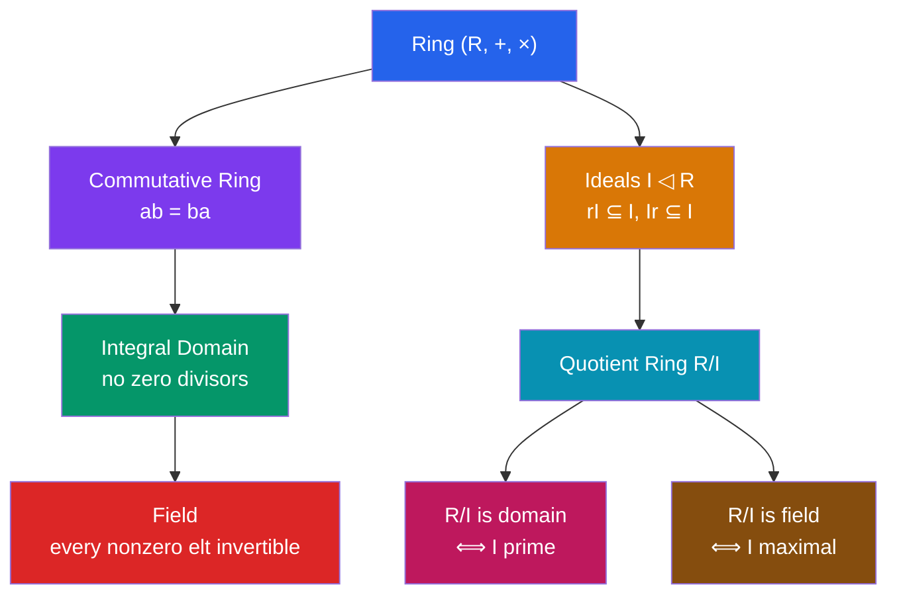

# 🔮 Rings and Ideals

> [!abstract] TL;DR
> A ring adds a second operation (multiplication) to an abelian group, subject to distributivity. Rings generalize integers: you have addition, subtraction, and multiplication, but not necessarily division. Ideals are the "subobjects" that allow building quotient rings — they absorb multiplication from the ring, just as normal subgroups absorb conjugation.

## Intuition — analogy FIRST
Integers $\mathbb{Z}$ are the prototype: add, subtract, multiply freely, but $2/3 \notin \mathbb{Z}$ so division fails. A ring captures this setting abstractly. An ideal is a special subset that "swallows" any ring element multiplied into it — even multiples of 3 stay multiples of 3 after multiplying by anything. This lets us form quotient rings like $\mathbb{Z}/6\mathbb{Z}$ where $6 = 0$, collapsing the structure in a controlled way.

---

## How It Works

## Key Concepts

### Ring Axioms
A **ring** $(R, +, \cdot)$ satisfies:
1. $(R, +)$ is an abelian group (with identity $0$)
2. Multiplication is associative: $a(bc) = (ab)c$
3. Distributive laws: $a(b+c) = ab + ac$ and $(b+c)a = ba + ca$

A ring has **unity** (or **1**) if there is a multiplicative identity: $1 \cdot a = a \cdot 1 = a$. A **commutative ring** has $ab = ba$ for all $a,b$.

### Examples

| Ring | Commutative? | Unity? | Domain? | Field? |
|------|-------------|--------|---------|--------|
| $\mathbb{Z}$ | Yes | Yes | Yes | No |
| $\mathbb{Q}, \mathbb{R}, \mathbb{C}$ | Yes | Yes | Yes | Yes |
| $\mathbb{Z}[x]$ | Yes | Yes | Yes | No |
| $\mathbb{Z}/n\mathbb{Z}$ | Yes | Yes | iff $n$ prime | iff $n$ prime |
| $M_n(\mathbb{R})$ ($n\geq 2$) | No | Yes | No | No |
| $\mathbb{Z}[i] = \{a+bi : a,b\in\mathbb{Z}\}$ | Yes | Yes | Yes | No |

### Zero Divisors and Domains
A **zero divisor** is a nonzero $a \in R$ with $ab = 0$ for some nonzero $b$.

An **integral domain** is a commutative ring with $1 \neq 0$ and no zero divisors. Key example: $\mathbb{Z}$.

In $\mathbb{Z}/6\mathbb{Z}$: $2 \cdot 3 = 6 = 0$, so $2$ and $3$ are zero divisors — it's not a domain.
In $\mathbb{Z}/5\mathbb{Z}$ ($5$ prime): no zero divisors — it's a field.

**Cancellation in domains**: $ab = ac$ and $a \neq 0$ imply $b = c$ (no such guarantee in general rings).

### Units and Fields
A **unit** in a ring with unity is an element with a multiplicative inverse. The set of units $R^\times$ forms a group under multiplication.

A **field** is a commutative ring with $1 \neq 0$ where every nonzero element is a unit.

Examples: $\mathbb{Q}, \mathbb{R}, \mathbb{C}, \mathbb{Z}/p\mathbb{Z}$ (for $p$ prime), $\mathbb{F}_{p^n}$ (finite fields).

### Ideals
A subset $I \subseteq R$ is an **ideal** (written $I \trianglelefteq R$ or $I \unlhd R$) if:
1. $(I, +)$ is a subgroup of $(R, +)$
2. For all $r \in R$ and $a \in I$: $ra \in I$ and $ar \in I$ (absorbs multiplication)

**Examples**:
- $n\mathbb{Z} = \{nk : k \in \mathbb{Z}\} \trianglelefteq \mathbb{Z}$ for any $n$
- $\ker(\varphi) \trianglelefteq R$ for any ring homomorphism $\varphi: R \to S$
- In a field $F$: only ideals are $\{0\}$ and $F$ itself — fields are "simple"

**Principal ideals**: $(a) = Ra = \{ra : r \in R\}$. In $\mathbb{Z}$: $(n) = n\mathbb{Z}$.

In $\mathbb{Z}$, **every ideal is principal**: if $I \neq (0)$, let $d$ be the smallest positive element; then $I = (d)$ (using the division algorithm). $\mathbb{Z}$ is a **principal ideal domain (PID)**.

### Quotient Rings
For $I \trianglelefteq R$, the **quotient ring** $R/I$ has:
- Elements: cosets $r + I = \{r + a : a \in I\}$
- Addition: $(r+I) + (s+I) = (r+s)+I$
- Multiplication: $(r+I)(s+I) = rs + I$

This is well-defined because $I$ is an ideal (absorbs multiplication).

**Example**: $\mathbb{Z}/6\mathbb{Z}$ has elements $\{0,1,2,3,4,5\}$ with arithmetic mod 6.

**Example**: $\mathbb{R}[x]/(x^2+1) \cong \mathbb{C}$: adjoining a root of $x^2+1 = 0$ to $\mathbb{R}$ gives the complex numbers.

### Prime and Maximal Ideals
- **Prime ideal** $P$: $ab \in P \Rightarrow a \in P$ or $b \in P$ (for commutative rings). Equivalently, $R/P$ is an integral domain.
- **Maximal ideal** $M$: no ideal strictly between $M$ and $R$. Equivalently, $R/M$ is a field.

Every maximal ideal is prime. In $\mathbb{Z}$: prime ideals are $(0)$ and $(p)$ for primes $p$; all $(p)$ are also maximal.

### Ring Homomorphisms and Isomorphism Theorem
A **ring homomorphism** $\varphi: R \to S$ satisfies $\varphi(a+b) = \varphi(a)+\varphi(b)$ and $\varphi(ab) = \varphi(a)\varphi(b)$.

**First Isomorphism Theorem for Rings**: $R/\ker(\varphi) \cong \text{im}(\varphi)$.

---

## Real-World Notes
- **Modular arithmetic / cryptography**: $\mathbb{Z}/n\mathbb{Z}$ is the ring underlying RSA and modular arithmetic; when $n = p$ is prime it's a field, crucial for key security
- **Polynomial rings in coding theory**: Reed-Solomon codes are defined via polynomials over finite fields; the ring $\mathbb{F}_q[x]/(p(x))$ defines the symbol alphabet
- **Algebraic geometry**: affine varieties correspond to quotient rings $k[x_1,\ldots,x_n]/I$ via Hilbert's Nullstellensatz; prime ideals correspond to irreducible varieties
- **Number theory**: rings of integers in number fields (like $\mathbb{Z}[i]$, $\mathbb{Z}[\omega]$) generalize $\mathbb{Z}$; unique factorization may fail (e.g., $\mathbb{Z}[\sqrt{-5}]$), leading to ideal theory

---

## Common Pitfalls
- An ideal must be closed under addition AND absorb multiplication from both sides (left and right ideals differ in non-commutative rings; a two-sided ideal satisfies both).
- Not every ring has unity ($1$); technically the integers with even numbers form a ring without a multiplicative identity.
- In $\mathbb{Z}/n\mathbb{Z}$: it's a field iff $n$ is prime. $\mathbb{Z}/6\mathbb{Z}$ has zero divisors ($2 \cdot 3 = 0$), so it's not a domain.
- Every ideal in a field is $\{0\}$ or the whole field — ideals of fields are trivial, which is why field theory focuses on field extensions rather than ideals.

---

## Related Concepts
- [[_MOC_Abstract_Algebra|↑ Abstract Algebra MOC]]
- [[Groups_and_Subgroups]] — rings add multiplication to the abelian group structure
- [[Polynomial_Rings_and_Factorization]] — $R[x]$ is the canonical example of a ring
- [[Fields_and_Field_Extensions]] — fields are the richest type of commutative ring

---

## Review Questions
1. Show that $\mathbb{Z}[i]/(1+i) \cong \mathbb{Z}/2\mathbb{Z}$ by constructing an explicit surjective homomorphism with kernel $(1+i)$.
2. Prove that a finite integral domain is a field.
3. In $\mathbb{Z}[x]$, show that $(2, x)$ (the ideal generated by 2 and $x$) is maximal but not principal.

---

## Sources
- Dummit & Foote, *Abstract Algebra*, Ch. 7–8
- Herstein, *Topics in Algebra*, Ch. 3
- Artin, *Algebra*, Ch. 11

#abstract-algebra #rings #ring-theory #ideals #quotient-rings #mathematics
