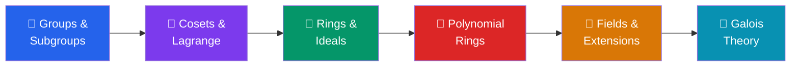
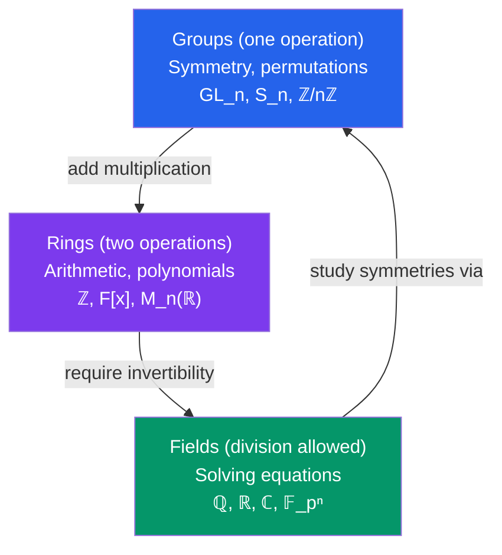

# 🔮 Abstract Algebra — Map of Content

> [!abstract] Overview
> Abstract algebra studies algebraic structures — groups, rings, fields — defined by axioms rather than specific number systems. Starting from the symmetry-capturing notion of a group, through the arithmetic-generalizing notion of a ring, to the richly structured notion of a field, the subject culminates in Galois theory: a perfect dictionary between field extensions and groups that resolves centuries-old questions about polynomial equations.

---

## Learning Path

---

## Notes in This Section

| Note | Difficulty | Key Concepts |
|------|-----------|--------------|
| [[Groups_and_Subgroups]] | Advanced | Group axioms, $S_n$, cyclic groups, subgroup test |
| [[Cosets_and_Lagrange_Theorem]] | Advanced | Cosets, Lagrange, normal subgroups, quotient groups, isomorphism theorems |
| [[Rings_and_Ideals]] | Advanced | Ring axioms, ideals, quotient rings, prime/maximal ideals |
| [[Polynomial_Rings_and_Factorization]] | Advanced | Division algorithm, UFD, PID, Gauss, Eisenstein |
| [[Fields_and_Field_Extensions]] | Graduate | Characteristic, algebraic/transcendental, splitting fields, finite fields |
| [[Galois_Theory]] | Graduate | Galois group, Galois correspondence, solvability, Abel-Ruffini |

---

## Conceptual Architecture

### The Three Pillars

### Key Theorems at a Glance

| Theorem | Statement |
|---------|-----------|
| Lagrange's Theorem | $|H|$ divides $|G|$ for finite groups |
| First Isomorphism Theorem | $G/\ker\varphi \cong \text{im}\,\varphi$ (for groups and rings) |
| Cauchy's Theorem | If $p \mid |G|$ (prime), then $G$ has an element of order $p$ |
| Division Algorithm | In $F[x]$: $f = qg + r$ with $\deg r < \deg g$ |
| Eisenstein Criterion | Sufficient condition for irreducibility over $\mathbb{Q}$ |
| Fundamental Theorem of Galois Theory | Bijection: subgroups $\leftrightarrow$ intermediate fields |
| Abel-Ruffini Theorem | No radical formula for general degree $\geq 5$ polynomial |

### Domain Hierarchy

$$\text{Euclidean Domain} \subsetneq \text{PID} \subsetneq \text{UFD} \subsetneq \text{Integral Domain}$$

**Examples**:
- Euclidean: $\mathbb{Z}$, $F[x]$, $\mathbb{Z}[i]$
- PID not Euclidean: $\mathbb{Z}[\frac{1+\sqrt{-19}}{2}]$
- UFD not PID: $\mathbb{Z}[x]$ ($(2,x)$ not principal)
- Domain not UFD: $\mathbb{Z}[\sqrt{-5}]$ ($6 = 2 \cdot 3 = (1+\sqrt{-5})(1-\sqrt{-5})$)

---

## Prerequisites
- Set theory (functions, bijections, equivalence relations)
- Linear algebra (vector spaces, dimension — for field extensions)
- Some real analysis or number theory helpful but not required

## What Comes Next
- **Representation theory** — groups acting on vector spaces; character theory
- **Commutative algebra** — rings, modules, localization; foundation of algebraic geometry
- **Algebraic number theory** — rings of integers in number fields, Dedekind domains, class groups
- **Homological algebra** — exact sequences, derived functors; connecting algebra and topology
- **Algebraic geometry** — varieties as solution sets of polynomial systems; Spec of a ring

---

## Quick Reference: The Galois Solvability Criterion

| Degree | Galois group (general) | Solvable? | Formula exists? |
|--------|----------------------|-----------|-----------------|
| 1 | $\{e\}$ | Yes | $x = -b/a$ |
| 2 | $\mathbb{Z}/2\mathbb{Z}$ | Yes | Quadratic formula |
| 3 | $S_3$ | Yes | Cardano's formula |
| 4 | $S_4$ | Yes | Ferrari's formula |
| $\geq 5$ | $S_n$ | No | **No general formula** |

---

#abstract-algebra #moc #mathematics
