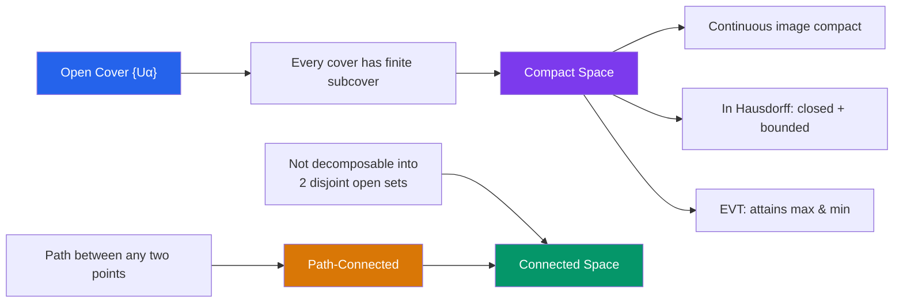

# 🔄 Compactness and Connectedness

> [!abstract] TL;DR
> Compactness generalizes "closed and bounded" to arbitrary topological spaces — every open cover has a finite subcover — ensuring that limit processes always produce results. Connectedness says a space cannot be split into two disjoint nonempty open pieces, capturing the idea of being "in one piece."

## Intuition — analogy FIRST

**Compactness**: imagine you need to guard every point of a city with watchmen, each responsible for an open neighborhood. Compactness means you can always dismiss all but finitely many watchmen and still cover the city. This finiteness is the key — it lets you transfer local properties (which each watchman handles) into global conclusions.

**Connectedness**: a space is connected if you cannot partition it into two "islands" with open water between them. Path-connectedness is the stronger, more intuitive version: you can draw a continuous path from any point to any other without leaving the space.

---

## How It Works

## Key Concepts

### Compactness

An **open cover** of $X$ is a collection $\{U_\alpha\}_{\alpha \in I}$ of open sets with $\bigcup_\alpha U_\alpha = X$. A **subcover** is a subcollection that still covers $X$.

> **Definition**: $X$ is **compact** if every open cover has a finite subcover.

**Heine-Borel theorem** (the key theorem for $\mathbb{R}^n$): A subset $K \subseteq \mathbb{R}^n$ is compact if and only if it is **closed and bounded**.

This fails in infinite-dimensional spaces: the closed unit ball of an infinite-dimensional Banach space is not compact.

### Properties of Compact Spaces

| Property | Statement |
|---|---|
| Closed subsets | Closed subsets of compact spaces are compact |
| Hausdorff | Compact subsets of Hausdorff spaces are closed |
| Continuous image | If $f: X \to Y$ continuous and $X$ compact, then $f(X)$ is compact |
| Extreme value theorem | Continuous $f: K \to \mathbb{R}$ on compact $K$ attains its maximum and minimum |
| Finite intersection | A family of closed sets with the finite intersection property has nonempty intersection |

### Sequential Compactness

$X$ is **sequentially compact** if every sequence in $X$ has a convergent subsequence. For metric spaces, compactness $\Leftrightarrow$ sequential compactness $\Leftrightarrow$ complete and totally bounded. In general topological spaces these notions differ.

### Connectedness

> **Definition**: $X$ is **connected** if the only subsets that are both open and closed (clopen) are $\emptyset$ and $X$ itself. Equivalently, $X$ cannot be written as $U \sqcup V$ with $U, V$ nonempty and open.

> **Definition**: $X$ is **path-connected** if for any $x, y \in X$ there exists a continuous path $\gamma: [0,1] \to X$ with $\gamma(0) = x$, $\gamma(1) = y$.

Path-connected $\Rightarrow$ connected, but **not** conversely. The classic counterexample is the **topologist's sine curve**: $\{(x, \sin(1/x)) : x > 0\} \cup \{(0,0)\}$ — connected but not path-connected.

### Connected Components

The **connected component** of $x \in X$ is the largest connected subspace containing $x$. Components partition $X$. A space is **locally connected** if every point has a neighborhood basis of connected sets.

### The Cantor Set

The **Cantor set** $C$ is constructed by repeatedly removing middle thirds from $[0,1]$. Properties:
- **Compact**: closed and bounded in $\mathbb{R}$
- **Perfect**: closed with no isolated points
- **Totally disconnected**: connected components are single points
- **Uncountable**: despite having Lebesgue measure zero

The Cantor set is homeomorphic to the product $\{0,1\}^{\mathbb{N}}$ (infinite binary sequences with product topology).

---

## Real-World Notes

- **Optimization in ML**: loss functions on compact parameter spaces (e.g., constrained to a ball) are guaranteed to attain minima by the extreme value theorem, which is why adding $L^2$ regularization ensures well-posedness.
- **Image processing**: connected components in binary images correspond directly to topological connectedness; flood fill algorithms exploit this structure.
- **Economics**: compact strategy spaces in game theory guarantee the existence of Nash equilibria via the Kakutani fixed-point theorem.
- **Numerical analysis**: compact operators on Hilbert spaces have discrete spectra, enabling finite-dimensional approximation of infinite-dimensional problems.

---

## Common Pitfalls

- **Closed $\not\Rightarrow$ compact**: $\mathbb{R}$ is closed in itself but not compact (the cover $\{(-n,n)\}_{n \in \mathbb{N}}$ has no finite subcover).
- **Connected $\not\Rightarrow$ path-connected**: the topologist's sine curve is the go-to counterexample; always specify which notion you're using.
- **Product of compact sets**: the Tychonoff theorem says any product of compact spaces is compact (requires axiom of choice for infinite products) — this is non-obvious and very powerful.
- **Sequential compactness in non-metric spaces**: in general topological spaces, sequential compactness and compactness are independent. Always verify the space is metric (or first-countable) before using sequential arguments.

---

## Related Concepts

- [[_MOC_Topology|↑ Topology MOC]]
- [[Topological_Spaces]] — the foundation: open sets and continuity
- [[Separation_Axioms]] — Hausdorff axiom interacts crucially with compactness
- [[Fundamental_Group]] — connectedness is a prerequisite for well-defined fundamental group

---

## Review Questions

1. Prove that the continuous image of a compact space is compact (use the definition with open covers).
2. Let $K \subseteq \mathbb{R}^2$ be the closed unit disk. Prove it is compact using Heine-Borel. Then prove any continuous $f: K \to \mathbb{R}$ attains its maximum.
3. Is the space $\mathbb{Q}$ (rationals with subspace topology from $\mathbb{R}$) connected? Compact? Justify both answers.
4. Prove that if $X$ is compact and $f: X \to Y$ is a continuous bijection with $Y$ Hausdorff, then $f$ is a homeomorphism.

---

## Sources

- Munkres, *Topology*, Ch. 3–4
- Rudin, *Principles of Mathematical Analysis*, Ch. 2–4
- Hatcher, *Algebraic Topology*, Appendix A

#topology #compactness #connectedness #heine-borel #mathematics
