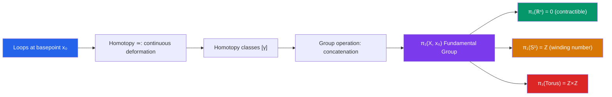

# 🔄 Fundamental Group

> [!abstract] TL;DR
> The fundamental group $\pi_1(X, x_0)$ is the group of loops at a basepoint $x_0$, up to continuous deformation (homotopy). It is the first and most computable algebraic invariant of a topological space — $\pi_1(\mathbb{R}^n) = 0$, $\pi_1(S^1) = \mathbb{Z}$, $\pi_1(\text{torus}) = \mathbb{Z} \times \mathbb{Z}$.

## Intuition — analogy FIRST

Imagine you are a hiker exploring a mountain range. You start at a base camp $x_0$ and walk loops that return to camp. Two loops are "homotopic" if one can be continuously deformed into the other without leaving the terrain. The fundamental group counts the distinct loop types: if you live on a flat plane, every loop can be shrunk to a point (trivial group). If you live on a terrain with a mountain in the center (i.e., a punctured plane), loops that wind around the mountain cannot be deformed into loops that don't — the winding number is an integer, giving $\pi_1 = \mathbb{Z}$.

---

## How It Works

## Key Concepts

### Homotopy

A **homotopy** between maps $f, g: X \to Y$ is a continuous map $F: X \times [0,1] \to Y$ with $F(x,0) = f(x)$ and $F(x,1) = g(x)$. We write $f \simeq g$.

Two spaces $X$ and $Y$ are **homotopy equivalent** ($X \simeq Y$) if there exist continuous maps $f: X \to Y$ and $g: Y \to X$ with $g \circ f \simeq \text{id}_X$ and $f \circ g \simeq \text{id}_Y$. Homotopy equivalence is coarser than homeomorphism — $\mathbb{R}$ and a single point are homotopy equivalent (both contractible).

### Loops and the Fundamental Group

A **path** in $X$ from $x$ to $y$ is a continuous $\gamma: [0,1] \to X$ with $\gamma(0) = x$, $\gamma(1) = y$. A **loop** based at $x_0$ satisfies $\gamma(0) = \gamma(1) = x_0$.

The set of homotopy classes of loops at $x_0$ forms a **group** $\pi_1(X, x_0)$ under concatenation:

$$[\gamma] \cdot [\delta] = [\gamma * \delta], \quad (\gamma * \delta)(t) = \begin{cases} \gamma(2t) & 0 \leq t \leq 1/2 \\ \delta(2t-1) & 1/2 \leq t \leq 1 \end{cases}$$

The identity is the constant loop; inverses are reverse traversals.

### Fundamental Groups of Key Spaces

| Space | $\pi_1$ | Intuition |
|---|---|---|
| $\mathbb{R}^n$, contractible spaces | $0$ (trivial) | Every loop shrinks to a point |
| $S^1$ (circle) | $\mathbb{Z}$ | Winding number is an integer |
| $S^n$ for $n \geq 2$ | $0$ | Higher spheres have no 1-dimensional holes |
| Torus $T^2 = S^1 \times S^1$ | $\mathbb{Z} \times \mathbb{Z}$ | Two independent loops |
| Figure-eight $S^1 \vee S^1$ | $\mathbb{Z} * \mathbb{Z}$ (free group) | Loops around each circle, no commutativity |
| $\mathbb{R}^2 \setminus \{0\}$ | $\mathbb{Z}$ | Winding around origin |

### Simply Connected Spaces

A path-connected space is **simply connected** if $\pi_1(X) = 0$ — every loop is contractible. Simply connected = "no 1-dimensional holes." Examples: $\mathbb{R}^n$, $S^n$ for $n \geq 2$, convex sets.

### Van Kampen's Theorem

Let $X = A \cup B$ with $A, B, A \cap B$ open and path-connected, and choose basepoint $x_0 \in A \cap B$. Then:

$$\pi_1(X, x_0) \cong \pi_1(A, x_0) *_{\pi_1(A \cap B)} \pi_1(B, x_0)$$

the **amalgamated free product**. This is the main computational tool: it allows computing $\pi_1$ by decomposing a space into simpler pieces. Example: $\pi_1(S^1 \vee S^1) = \mathbb{Z} * \mathbb{Z}$ (free product).

### Covering Spaces

A **covering space** is a map $p: \tilde{X} \to X$ such that every point of $X$ has an evenly covered neighborhood. The **universal cover** $\tilde{X}$ is the unique (up to isomorphism) simply connected covering space. Deck transformations form a group isomorphic to $\pi_1(X)$:

- Universal cover of $S^1$ is $\mathbb{R}$, with deck transformations $n \mapsto n+1$ (integer shifts), matching $\pi_1(S^1) = \mathbb{Z}$.

### Higher Homotopy Groups

$\pi_n(X, x_0)$ = homotopy classes of maps $S^n \to X$. $\pi_n$ is abelian for $n \geq 2$ (Eckmann-Hilton argument). Higher homotopy groups are notoriously difficult: $\pi_3(S^2) = \mathbb{Z}$ (Hopf fibration) — surprising and deep.

---

## Real-World Notes

- **Robot motion planning**: the configuration space of a robot (positions avoiding obstacles) has nontrivial fundamental group; loops in configuration space correspond to cyclic motions. Topological analysis identifies plan classes.
- **Condensed matter physics**: topological phases of matter are classified by homotopy groups; the quantum Hall effect and topological insulators rely on nontrivial $\pi_1$ and higher homotopy groups.
- **Data analysis**: the fundamental group (and higher homotopy groups) can be approximated from point cloud data, detecting "holes" in data geometry.
- **Network routing**: circular dependencies in networks correspond to non-contractible loops; their homotopy class is an obstruction to global scheduling.

---

## Common Pitfalls

- **Basepoint dependence**: $\pi_1(X, x_0)$ depends on $x_0$, but for path-connected $X$ the groups for different basepoints are isomorphic (though not canonically so — the isomorphism depends on the path chosen).
- **$\pi_1$ abelian $\neq$ common**: $\pi_1$ is generally non-abelian. The fundamental group of the figure-eight is the non-abelian free group $\mathbb{Z} * \mathbb{Z}$.
- **Homotopy equivalence vs. homeomorphism**: homotopy equivalent spaces have the same $\pi_1$, but the converse fails — $S^1$ and $S^1 \times [0,1]$ have the same $\pi_1$ but are not homeomorphic (one has boundary).
- **Van Kampen requires open sets**: the theorem requires $A$ and $B$ to be open (or satisfy a cofibration condition). The version for NDR pairs is more general but also more technical.

---

## Related Concepts

- [[_MOC_Topology|↑ Topology MOC]]
- [[Topological_Spaces]] — continuity, the foundation of homotopy
- [[Homology_and_Cohomology]] — algebraic invariants complementary to homotopy groups
- [[Compactness_and_Connectedness]] — path-connectedness is a prerequisite

---

## Review Questions

1. Compute $\pi_1(S^1 \times S^1)$ using Van Kampen's theorem by decomposing the torus into two open cylinders whose intersection is a pair of cylinders.
2. Show that if $f: X \to Y$ is a homotopy equivalence, the induced map $f_*: \pi_1(X) \to \pi_1(Y)$ is an isomorphism.
3. Describe the universal cover of the torus $T^2$. What are the deck transformations?
4. Explain why $\pi_1(S^2) = 0$ intuitively (any loop on a sphere can be contracted), and use this to compute $\pi_1(\mathbb{R}^3 \setminus \{0\})$.

---

## Sources

- Hatcher, *Algebraic Topology*, Ch. 1 (free online at pi.math.cornell.edu)
- Munkres, *Topology*, Ch. 9
- Bredon, *Topology and Geometry*, Ch. 3

#topology #algebraic-topology #fundamental-group #homotopy #mathematics
