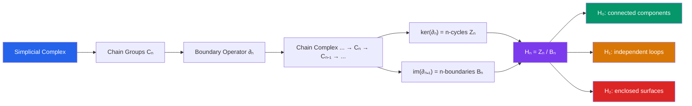

# 🔄 Homology and Cohomology

> [!abstract] TL;DR
> Homology groups $H_n(X)$ count $n$-dimensional "holes" in a topological space: $H_0$ counts connected components, $H_1$ counts loops, $H_2$ counts enclosed voids. Cohomology $H^n(X)$ is the dual theory with additional multiplicative structure. Together they form the most computable algebraic invariants of topology.

## Intuition — analogy FIRST

Think of a space as a mesh of building blocks. A 1-cycle is a closed loop of edges (a cycle in the graph theory sense). A 1-boundary is a loop that bounds a filled face. Homology $H_1 = \text{cycles}/\text{boundaries}$ counts loops that are "genuine holes" — not bounding any surface inside the space. A donut has one such genuine loop around the hole and one around the tube: $H_1(\text{torus}) = \mathbb{Z}^2$. The key algebraic miracle is $\partial \circ \partial = 0$: the boundary of a boundary is always empty, making this quotient well-defined.

---

## How It Works

## Key Concepts

### Simplicial Complexes

A **simplicial complex** is built from:
- **0-simplices** (vertices $v_0$)
- **1-simplices** (edges $[v_0, v_1]$)
- **2-simplices** (triangles $[v_0, v_1, v_2]$)
- **$n$-simplices** $[v_0, \ldots, v_n]$ (oriented)

### The Boundary Operator

For an $n$-simplex $\sigma = [v_0, v_1, \ldots, v_n]$:

$$\partial_n(\sigma) = \sum_{i=0}^{n} (-1)^i [v_0, \ldots, \hat{v}_i, \ldots, v_n]$$

where $\hat{v}_i$ means $v_i$ is omitted. The alternating signs ensure:

$$\partial_{n-1} \circ \partial_n = 0$$

This is the fundamental identity of homological algebra — the boundary of a boundary is empty.

### Chain Complex and Homology Groups

The **chain complex** is the sequence:

$$\cdots \xrightarrow{\partial_{n+1}} C_n \xrightarrow{\partial_n} C_{n-1} \xrightarrow{\partial_{n-1}} \cdots \xrightarrow{\partial_1} C_0 \xrightarrow{\partial_0} 0$$

Since $\partial^2 = 0$, we have $\text{im}(\partial_{n+1}) \subseteq \ker(\partial_n)$, making the quotient valid:

$$H_n = \ker(\partial_n) / \text{im}(\partial_{n+1}) = \frac{\text{$n$-cycles}}{\text{$n$-boundaries}}$$

### Geometric Interpretation of $H_n$

| Group | Geometric meaning |
|---|---|
| $H_0(X)$ | $\mathbb{Z}^k$ where $k$ = number of connected components |
| $H_1(X)$ | Free abelian part = number of independent loops (1-dimensional holes) |
| $H_2(X)$ | Counts enclosed 2-dimensional voids (e.g., interior of a sphere) |

**Examples**:
- $H_n(S^k) = \mathbb{Z}$ for $n = 0, k$; $= 0$ otherwise
- $H_1(\text{torus}) = \mathbb{Z}^2$, $H_2(\text{torus}) = \mathbb{Z}$
- $H_n(\mathbb{R}^n) = 0$ for $n \geq 1$ (contractible)

### Betti Numbers and Euler Characteristic

**Betti numbers**: $\beta_n = \text{rank}(H_n)$ (free part, ignoring torsion).

**Euler characteristic**: $\chi(X) = \sum_n (-1)^n \beta_n$. For a polyhedron: $\chi = V - E + F$ (Euler's formula). For the torus: $\chi = 0$; for $S^2$: $\chi = 2$.

### Cohomology

**Cohomology** $H^n(X; R)$ is defined by dualizing: apply $\text{Hom}(\cdot, R)$ to the chain complex to get cochain groups $C^n$ with coboundary $\delta_n: C^n \to C^{n+1}$, then $H^n = \ker(\delta_n)/\text{im}(\delta_{n-1})$.

The **Universal Coefficient Theorem** relates $H^n$ to $H_n$. The key advantage of cohomology: it carries a **cup product** making $H^*(X) = \bigoplus_n H^n(X)$ into a ring — a finer invariant.

### de Rham Cohomology

On a smooth manifold $M$, the **de Rham cohomology** uses differential forms:

$$H^k_{\text{dR}}(M) = \frac{\ker(d: \Omega^k \to \Omega^{k+1})}{\text{im}(d: \Omega^{k-1} \to \Omega^k)} = \frac{\text{closed $k$-forms}}{\text{exact $k$-forms}}$$

**de Rham's theorem**: $H^k_{\text{dR}}(M) \cong H^k(M; \mathbb{R})$ — differential forms compute the same cohomology as topology. This bridges calculus and topology.

### Topological Data Analysis

**Persistent homology** tracks how homology groups change as a parameter (e.g., radius of balls in a point cloud) varies, producing a **persistence diagram** that encodes the "birth" and "death" of topological features across scales.

---

## Real-World Notes

- **Hole detection in sensor networks**: if sensor nodes form a coverage network, $H_1$ of the Rips complex detects coverage holes — loops in homology correspond to unmonitored regions.
- **Computational biology**: shape analysis of protein structures uses Betti numbers to characterize molecular topology; $H_1$ detects binding pockets.
- **Materials science**: persistent homology analyzes the structure of amorphous materials (glasses, foams) to detect void geometries invisible to traditional crystallography.
- **Computer graphics**: mesh processing uses discrete differential forms (discrete exterior calculus) based on the chain complex structure.

---

## Common Pitfalls

- **Homology vs. homotopy**: they are different invariants. $\pi_1$ is the fundamental group (non-abelian in general); $H_1$ is its abelianization. Homotopy groups carry more information but are harder to compute.
- **Torsion is important**: $H_1(\mathbb{RP}^2) = \mathbb{Z}_2$ — the torsion part detects non-orientability. Betti numbers only capture the free part; the full homology group also matters.
- **Simplicial vs. singular homology**: for "nice" spaces (CW complexes), they agree. Singular homology is defined for all topological spaces but is harder to compute directly.
- **$\partial^2 = 0$ requires the sign convention**: the alternating signs in the boundary formula are essential. Forgetting them breaks the chain complex property.

---

## Related Concepts

- [[_MOC_Topology|↑ Topology MOC]]
- [[Fundamental_Group]] — $H_1 =$ abelianization of $\pi_1$
- [[Topological_Spaces]] — homology is a topological invariant
- [[Compactness_and_Connectedness]] — $H_0$ encodes connected components

---

## Review Questions

1. Compute the homology groups of the circle $S^1$ using a triangulation with 3 vertices, 3 edges, and verify $H_0 = \mathbb{Z}$, $H_1 = \mathbb{Z}$, $H_n = 0$ for $n \geq 2$.
2. Use the Mayer-Vietoris sequence to compute $H_*(S^2)$ by decomposing $S^2$ into two hemispheres.
3. Show that the Euler characteristic $\chi = V - E + F$ equals $\beta_0 - \beta_1 + \beta_2$ for a compact surface without boundary.
4. What does persistent homology detect in a 2D point cloud sampled from a circle with noise? Sketch what the persistence diagram would look like.

---

## Sources

- Hatcher, *Algebraic Topology*, Ch. 2 (free online)
- Edelsbrunner & Harer, *Computational Topology*, Ch. 4–5
- Bott & Tu, *Differential Forms in Algebraic Topology*, Ch. 1

#topology #algebraic-topology #homology #cohomology #euler-characteristic #mathematics
