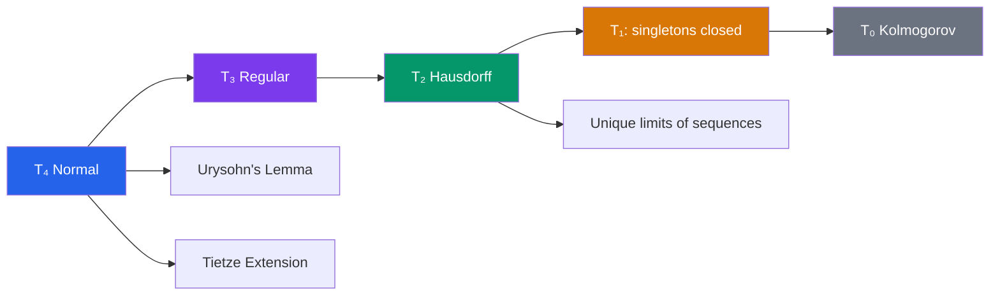

# 🔄 Separation Axioms

> [!abstract] TL;DR
> Separation axioms ($T_0$ through $T_4$) measure how well a topology can distinguish points and sets using open sets. The Hausdorff ($T_2$) axiom is the minimum for serious analysis; normality ($T_4$) enables Urysohn's lemma, the key tool for constructing continuous functions, and is satisfied by all metric spaces.

## Intuition — analogy FIRST

Think of the separation axioms as a privacy policy for topological spaces. At the weakest level ($T_0$), two people in a room can always find at least one window (open set) that one sees but not the other. Hausdorff ($T_2$) means they can each retreat to private rooms with no overlap. Normal ($T_4$) means even two entire groups can be placed in non-overlapping buildings — powerful enough to build continuous "interpolating" functions between them.

---

## How It Works

## Key Concepts

### The Axiom Hierarchy

**$T_0$ (Kolmogorov)**: For any $x \neq y$, there exists an open set containing one but not the other.

**$T_1$**: For any $x \neq y$, each has an open neighborhood not containing the other. Equivalently, **every singleton $\{x\}$ is a closed set**. This is the minimum for interesting point-set topology.

**$T_2$ (Hausdorff)**: For any $x \neq y$, there exist **disjoint** open sets $U \ni x$ and $V \ni y$. This is the most important axiom — virtually all spaces arising in analysis are Hausdorff.

Key consequence: limits of sequences (and nets) are **unique** in Hausdorff spaces.

**$T_3$ (Regular)**: $T_1$ plus: for any closed set $C$ and point $x \notin C$, there exist disjoint open sets separating $x$ from $C$.

**$T_4$ (Normal)**: $T_1$ plus: for any two **disjoint closed sets** $A$ and $B$, there exist disjoint open sets $U \supseteq A$ and $V \supseteq B$.

### The Hierarchy is Strict

$$T_4 \implies T_3 \implies T_2 \implies T_1 \implies T_0$$

None of these implications reverses without additional hypotheses. Every metric space is $T_4$ (normal) — the open balls $B(x, d(x,C)/2)$ furnish the separating neighborhoods explicitly.

### Urysohn's Lemma — the Master Tool

> **Urysohn's Lemma**: $X$ is normal ($T_4$) $\Longleftrightarrow$ for every pair of disjoint closed sets $A, B \subseteq X$, there exists a continuous function $f: X \to [0,1]$ with $f(A) = \{0\}$ and $f(B) = \{1\}$.

The proof constructs $f$ by inductively assigning rational-indexed open sets $U_r$ (for $r \in \mathbb{Q} \cap [0,1]$) between $A$ and $B$, then defining $f(x) = \inf\{r : x \in U_r\}$. This is one of the most elegant constructions in topology.

Urysohn's lemma is the reason normality matters: it converts a set-separation condition into a function-construction capability.

### Tietze Extension Theorem

> **Tietze Extension**: If $X$ is normal and $A \subseteq X$ is closed, then every continuous function $f: A \to \mathbb{R}$ extends to a continuous $F: X \to \mathbb{R}$.

This is the topological version of the fact that continuous functions on closed subsets of $\mathbb{R}^n$ can always be extended — the key tool in constructing global functions from local data.

### Completely Regular Spaces ($T_{3\frac{1}{2}}$, Tychonoff)

Between $T_3$ and $T_4$: $X$ is **completely regular** if points can be separated from closed sets by continuous functions. These are the spaces that embed into $[0,1]^I$ for some index set $I$ — and every compact Hausdorff space is completely regular.

---

## Real-World Notes

- **Functional analysis**: all normed spaces are metric spaces, hence normal — so Urysohn and Tietze apply freely. Partition of unity arguments (crucial in differential geometry) require normality.
- **Probability theory**: the standard Borel space $(\mathbb{R}, \mathcal{B})$ is built on a normal space, enabling regular conditional probabilities.
- **Algebraic geometry**: the Zariski topology is $T_1$ but generally not $T_2$; this is why algebraic geometers use schemes and sheaves rather than classical topology.
- **Computer science**: the Scott topology (used in domain theory and denotational semantics) is typically only $T_0$, which is why fixpoint theorems there look different.

---

## Common Pitfalls

- **Hausdorff ≠ regular**: a $T_2$ space need not be $T_3$; there exist Hausdorff spaces that are not regular (the rational sequence topology is one example).
- **Compact + Hausdorff = Normal**: this important theorem is often forgotten — it means all compact Hausdorff spaces (e.g., $[0,1]$, $S^n$) are normal without extra work.
- **$T_1$ is weaker than it looks**: cofinite topology on an infinite set is $T_1$ but not $T_2$; sequences can converge to every point simultaneously.
- **Urysohn ↔ normality**: the lemma is a biconditional, not just a consequence. Normal spaces are precisely those where Urysohn functions exist.

---

## Related Concepts

- [[_MOC_Topology|↑ Topology MOC]]
- [[Topological_Spaces]] — separation axioms add structure to basic topology
- [[Compactness_and_Connectedness]] — compact Hausdorff spaces are automatically normal
- [[Fundamental_Group]] — covering space theory uses Hausdorff spaces

---

## Review Questions

1. Show that every metric space is $T_4$ (normal). Hint: use the distance function $d(x, A) = \inf_{a \in A} d(x,a)$ to construct separating open sets.
2. Use Urysohn's lemma to prove the Tietze extension theorem for $f: A \to [0,1]$ on a closed subset $A$ of a normal space (sketch the dyadic approximation argument).
3. Give an example of a topological space that is $T_1$ but not $T_2$. Verify both properties for your example.
4. Prove that a compact Hausdorff space is normal. (Hint: first show compact + Hausdorff $\Rightarrow$ regular, then iterate.)

---

## Sources

- Munkres, *Topology*, Ch. 4 (Normal Spaces and Urysohn's Lemma)
- Kelley, *General Topology*, Ch. 4
- Willard, *General Topology*, Ch. 14–15

#topology #separation-axioms #hausdorff #urysohn #mathematics
