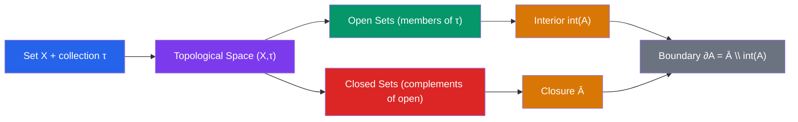

# 🔄 Topological Spaces

> [!abstract] TL;DR
> A topological space $(X, \tau)$ is a set $X$ equipped with a collection $\tau$ of "open" subsets satisfying three axioms, generalizing the notion of nearness and continuity from Euclidean space to arbitrary sets. Every concept of limits, continuity, and convergence can be rephrased purely in terms of open sets.

## Intuition — analogy FIRST

Think of a city where "open sets" are neighborhoods: a neighborhood of your house includes every point that is "close enough" to you. The topology axioms encode the idea that the whole city is a neighborhood, the empty region is trivially a neighborhood, you can always combine neighborhoods (unions stay neighborhoods), and overlapping neighborhoods produce a neighborhood (finite intersections). The magic is that this minimal structure is enough to define continuity, convergence, and connectedness — without any ruler or distance needed.

---

## How It Works

## Key Concepts

### The Three Axioms

A **topological space** is a pair $(X, \tau)$ where $\tau \subseteq \mathcal{P}(X)$ satisfies:

1. $\emptyset, X \in \tau$ (empty set and whole space are open)
2. Arbitrary unions: if $\{U_\alpha\} \subseteq \tau$, then $\bigcup_\alpha U_\alpha \in \tau$
3. Finite intersections: if $U_1, \ldots, U_n \in \tau$, then $U_1 \cap \cdots \cap U_n \in \tau$

### Standard Examples

| Topology | Definition | Notes |
|---|---|---|
| Discrete | $\tau = \mathcal{P}(X)$ | Every subset is open; finest topology |
| Indiscrete | $\tau = \{\emptyset, X\}$ | Only trivial open sets; coarsest topology |
| Euclidean on $\mathbb{R}^n$ | Unions of open balls $B(x,r)$ | Standard topology of analysis |
| Cofinite | $\tau = \{U : X \setminus U \text{ is finite}\} \cup \{\emptyset\}$ | Important counterexample |

### Basis for a Topology

A collection $\mathcal{B} \subseteq \tau$ is a **basis** if every open set is a union of basis elements. The basis condition requires: for $x \in B_1 \cap B_2$ ($B_1, B_2 \in \mathcal{B}$), there exists $B_3 \in \mathcal{B}$ with $x \in B_3 \subseteq B_1 \cap B_2$. Open balls $B(x, r)$ form a basis for the Euclidean topology.

### Closed Sets and Derived Notions

**Closed set**: complement of an open set. Closed sets are closed under arbitrary intersections and finite unions.

For $A \subseteq X$:
- **Interior** $\text{int}(A)$: largest open set contained in $A$ — the "deep inside" points
- **Closure** $\bar{A}$: smallest closed set containing $A$ — $A$ plus its "limit points"
- **Boundary** $\partial A = \bar{A} \setminus \text{int}(A)$: points on the "edge"

### Continuity and Homeomorphism

$f: X \to Y$ is **continuous** if and only if $f^{-1}(V) \in \tau_X$ for every $V \in \tau_Y$. This purely open-set definition generalizes the $\varepsilon$-$\delta$ definition.

A **homeomorphism** is a bijection $f: X \to Y$ where both $f$ and $f^{-1}$ are continuous. Homeomorphic spaces are topologically indistinguishable — the famous punchline: a coffee mug and a donut are homeomorphic (both have one hole).

### Subspace, Product, and Quotient Topologies

**Subspace**: for $A \subseteq X$, the subspace topology is $\tau_A = \{U \cap A : U \in \tau\}$.

**Product**: on $X \times Y$, the basis is $\{U \times V : U \in \tau_X,\, V \in \tau_Y\}$.

**Quotient**: given equivalence $\sim$ on $X$, the quotient topology on $X/{\sim}$ declares $V$ open iff $\pi^{-1}(V)$ is open in $X$.

---

## Real-World Notes

- **Network topology** uses open sets to define adjacency and reachability; disconnected components correspond to non-path-connected subspaces.
- **Topological data analysis (TDA)** uses persistent homology to detect topological features (holes, connected components) in data clouds modeled as topological spaces.
- **General relativity**: spacetime is a 4-dimensional topological manifold; the topology constrains global causal structure even before introducing the metric.
- **Machine learning**: function spaces in deep learning are analyzed using topological properties; loss landscape connectivity affects optimization.

---

## Common Pitfalls

- **Confusing open and closed**: in the indiscrete topology, $X$ is both open and closed. "Open" and "closed" are not opposites — sets can be neither or both (clopen).
- **Infinite intersections**: the infinite intersection of open sets need not be open. Example in $\mathbb{R}$: $\bigcap_{n=1}^\infty (-1/n, 1/n) = \{0\}$, which is closed.
- **Basis vs. topology**: a basis is not itself a topology unless it is closed under finite intersections. Always verify the basis condition.
- **Continuity at a point vs. globally**: in topology, continuity is a global condition (preimages of all open sets). Pointwise continuity uses a local version but they are equivalent.

---

## Related Concepts

- [[_MOC_Topology|↑ Topology MOC]]
- [[Compactness_and_Connectedness]] — key topological properties built on open sets
- [[Separation_Axioms]] — additional axioms distinguishing points by open sets
- [[Fundamental_Group]] — algebraic invariants of topological spaces

---

## Review Questions

1. Verify that the cofinite topology on an infinite set $X$ satisfies all three axioms. Is it Hausdorff?
2. Let $f: \mathbb{R} \to \mathbb{R}$ be defined by $f(x) = x^2$. Use the open-set definition of continuity to show $f$ is continuous (hint: show $f^{-1}((a,b))$ is open).
3. Prove that $\partial A = \emptyset$ if and only if $A$ is both open and closed (clopen).
4. If $\mathcal{B}$ is a basis for topology $\tau$, show that every $U \in \tau$ can be written as a union of elements of $\mathcal{B}$.

---

## Sources

- Munkres, *Topology*, Ch. 2–3
- Willard, *General Topology*, Ch. 1–4
- Hatcher, *Algebraic Topology* (free online), Appendix

#topology #topological-spaces #open-sets #mathematics
