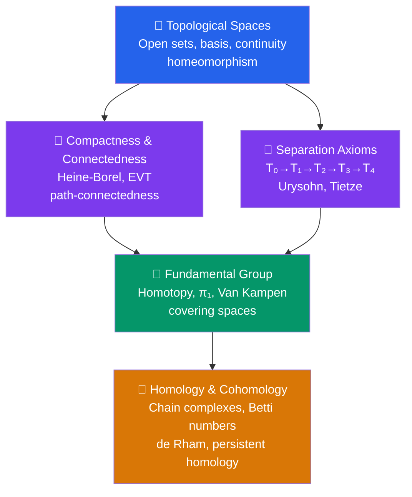

# 🔄 Topology — Map of Content

> [!abstract] Overview
> Topology: the study of spaces up to continuous deformation, from point-set axioms through algebraic invariants — the language of modern geometry and data analysis. It answers the question: what properties of a space survive if you bend, stretch, and deform it continuously, but never cut or glue?

## Section Structure

## Notes in This Section

| Note | Core Idea | Key Results |
|---|---|---|
| [[Topological_Spaces]] | $(X, \tau)$: open sets, continuity, homeomorphism | Basis, subspace/product/quotient topologies |
| [[Compactness_and_Connectedness]] | Finite subcover; cannot split into two open pieces | Heine-Borel, EVT, Tychonoff, Cantor set |
| [[Separation_Axioms]] | How well topology separates points/sets | $T_0$–$T_4$ hierarchy, Urysohn lemma, Tietze extension |
| [[Fundamental_Group]] | Loops up to homotopy; first algebraic invariant | $\pi_1(S^1) = \mathbb{Z}$, Van Kampen, covering spaces |
| [[Homology_and_Cohomology]] | Counting holes by dimension | Betti numbers, Euler characteristic, de Rham theorem |

## Recommended Learning Path

1. **[[Topological_Spaces]]** — Master the axioms, examples (discrete/indiscrete/Euclidean), and the open-set definition of continuity. This is the entire foundation.
2. **[[Separation_Axioms]]** — Understand why Hausdorff is the baseline for analysis. Memorize Urysohn's lemma as the key theorem.
3. **[[Compactness_and_Connectedness]]** — The two most important global properties. Know Heine-Borel cold; understand why finite subcovers matter.
4. **[[Fundamental_Group]]** — Your first taste of algebraic topology. Compute $\pi_1(S^1) = \mathbb{Z}$ from first principles.
5. **[[Homology_and_Cohomology]]** — The machinery for systematic hole-counting. Focus on geometric intuition for $H_0$, $H_1$, $H_2$ first.

## Key Theorems to Know

- **Heine-Borel**: Compact in $\mathbb{R}^n$ $\Leftrightarrow$ closed and bounded
- **Tychonoff**: Arbitrary product of compact spaces is compact
- **Urysohn's Lemma**: Normal $\Leftrightarrow$ disjoint closed sets separated by continuous function
- **Van Kampen**: $\pi_1(A \cup B) \cong \pi_1(A) *_{\pi_1(A\cap B)} \pi_1(B)$
- **de Rham**: Smooth cohomology via differential forms equals singular cohomology
- **Brouwer Fixed Point**: Every continuous $f: D^n \to D^n$ has a fixed point (proved via homology)

## Connections to Other Domains

- **Measure Theory**: Borel $\sigma$-algebra generated by the topology; topological measure theory
- **Differential Geometry**: Manifolds are topological spaces with smooth structure
- **Functional Analysis**: Weak topology, operator topology on Banach/Hilbert spaces
- **Data Science**: Topological data analysis, persistent homology for ML

---

## Sources

- Munkres, *Topology* (2nd ed.) — standard graduate reference for point-set
- Hatcher, *Algebraic Topology* — free online; standard for algebraic topology
- Bredon, *Topology and Geometry* — unified treatment
- Edelsbrunner & Harer, *Computational Topology* — TDA applications

#topology #moc #mathematics #algebraic-topology
