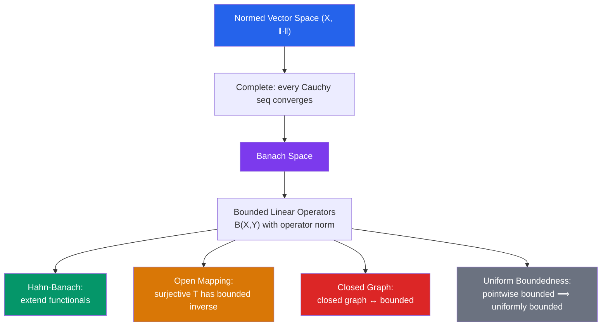

# ∫ Banach Spaces

> [!abstract] TL;DR
> A Banach space is a complete normed vector space — the natural infinite-dimensional setting for analysis. The four fundamental theorems (Hahn-Banach, open mapping, closed graph, uniform boundedness) form the backbone of functional analysis, governing the behavior of bounded linear operators and providing existence/uniqueness for linear equations.

## Intuition — analogy FIRST

Think of a Banach space as the "right" infinite-dimensional generalization of $\mathbb{R}^n$ for linear algebra. In finite dimensions, all norms are equivalent and all linear maps are continuous. In infinite dimensions, these fail — norms can be inequivalent and linear maps can be unbounded. The four fundamental theorems restore just enough structure to do analysis: they tell you when you can extend, invert, and control linear operators. Without completeness (the Banach property), even these theorems break down.

---

## How It Works

## Key Concepts

### Normed and Banach Spaces

A **normed vector space** is a pair $(X, \|\cdot\|)$ where $\|\cdot\|: X \to [0,\infty)$ satisfies:
1. $\|x\| = 0 \Leftrightarrow x = 0$
2. $\|\lambda x\| = |\lambda| \|x\|$
3. $\|x + y\| \leq \|x\| + \|y\|$ (triangle inequality)

A **Banach space** is a normed space that is **complete**: every Cauchy sequence converges (in the norm).

| Space | Norm | Complete? |
|---|---|---|
| $\mathbb{R}^n$ | $\|x\|_2 = \sqrt{\sum x_i^2}$ | Yes |
| $C([a,b])$ | $\|f\|_\infty = \max|f|$ | Yes (Banach) |
| $L^p(\mu)$, $1 \leq p \leq \infty$ | $\|f\|_p$ | Yes (Riesz-Fischer) |
| $\ell^p$ | $\|(a_n)\|_p = (\sum|a_n|^p)^{1/p}$ | Yes |
| Polynomials on $[0,1]$ | $\|\cdot\|_\infty$ | No (not complete) |

### Bounded Linear Operators

A linear map $T: X \to Y$ is **bounded** if there exists $C < \infty$ with $\|Tx\|_Y \leq C\|x\|_X$ for all $x$. The **operator norm** is:

$$\|T\| = \sup_{\|x\| \leq 1} \|Tx\|_Y = \sup_{x \neq 0} \frac{\|Tx\|_Y}{\|x\|_X}$$

Bounded $\Leftrightarrow$ continuous (as a map between normed spaces). The space $B(X,Y)$ of all bounded linear operators is itself a Banach space (under $\|T\|$).

### The Four Fundamental Theorems

**1. Hahn-Banach Theorem**:
> Let $f: M \to \mathbb{R}$ be a bounded linear functional on a subspace $M \subseteq X$. Then $f$ extends to a bounded functional $F: X \to \mathbb{R}$ with $\|F\| = \|f\|$.

Consequence: the dual space $X^* = B(X, \mathbb{R})$ is "large enough" to separate points — if $x \neq y$, there exists $\varphi \in X^*$ with $\varphi(x) \neq \varphi(y)$.

**2. Open Mapping Theorem**:
> A surjective bounded linear operator $T: X \to Y$ between Banach spaces is an **open map** (maps open sets to open sets). Equivalently, if $T$ is also injective, then $T^{-1}$ is bounded.

This is the **Banach isomorphism theorem**: a bijective bounded operator between Banach spaces has a bounded inverse. You get the inverse for free.

**3. Closed Graph Theorem**:
> A linear operator $T: X \to Y$ with a **closed graph** $\{(x, Tx)\} \subseteq X \times Y$ is necessarily bounded.

The graph is closed means: if $x_n \to x$ and $Tx_n \to y$, then $Tx = y$. This converts a topological condition (closed graph) into an analytic one (bounded).

**4. Uniform Boundedness Principle (Banach-Steinhaus)**:
> If a family $\{T_\alpha\} \subseteq B(X,Y)$ is **pointwise bounded** — $\sup_\alpha \|T_\alpha x\| < \infty$ for each $x$ — then it is **uniformly bounded**: $\sup_\alpha \|T_\alpha\| < \infty$.

Application: if a sequence of bounded operators converges pointwise ($T_n x \to Tx$ for all $x$), then $\sup_n \|T_n\| < \infty$ and $T$ is bounded.

### Dual Spaces and Reflexivity

The **dual space** $X^* = B(X, \mathbb{F})$ consists of all bounded linear functionals. The **double dual** $X^{**} = (X^*)^*$ contains $X$ via the canonical embedding $\iota: x \mapsto (\varphi \mapsto \varphi(x))$.

$X$ is **reflexive** if $\iota$ is surjective (i.e., $X \cong X^{**}$). Examples: $L^p(\mu)$ for $1 < p < \infty$ is reflexive; $L^1$ and $L^\infty$ are not.

### Weak Topology

The **weak topology** on $X$ is the coarsest topology making all $\varphi \in X^*$ continuous. A sequence $x_n \rightharpoonup x$ **weakly** if $\varphi(x_n) \to \varphi(x)$ for all $\varphi \in X^*$.

Weak convergence $\subsetneq$ norm convergence in general. Reflexive Banach spaces have the Banach-Alaoglu property: bounded sequences have weakly convergent subsequences.

---

## Real-World Notes

- **PDE theory**: existence of weak solutions to elliptic PDEs is proved via the Lax-Milgram theorem (an operator version of Riesz representation) in Sobolev spaces — Banach/Hilbert spaces of weakly differentiable functions.
- **Optimization**: duality theory in convex optimization (Lagrangians, KKT conditions) mirrors Hahn-Banach; the separating hyperplane theorem is Hahn-Banach for convex sets.
- **Machine learning theory**: Rademacher complexity and generalization bounds use properties of function classes in Banach/Hilbert spaces; margin bounds relate to operator norms.
- **Numerical linear algebra**: the condition number of a matrix is $\|A\| \cdot \|A^{-1}\|$ — the ratio of operator norms. The open mapping theorem guarantees invertibility is stable for Banach space isomorphisms.

---

## Common Pitfalls

- **Weak convergence $\neq$ norm convergence**: in infinite dimensions, $x_n \rightharpoonup x$ (weak) does not imply $\|x_n\| \to \|x\|$ or $x_n \to x$ in norm. $e_n$ (standard basis vectors in $\ell^2$) converge weakly to 0 but $\|e_n\| = 1$ always.
- **Closed subspace $\neq$ dense subspace**: in Banach spaces, a proper closed subspace $M \subsetneq X$ has $M^\perp \neq \{0\}$ (from Hahn-Banach). Proper dense subspaces also exist — quite different from finite dimensions.
- **Open mapping requires surjectivity**: the theorem fails without surjectivity. A bounded injective operator need not have a bounded inverse ($T: \ell^2 \to \ell^2$, $T(a_1, a_2, \ldots) = (0, a_1, a_2, \ldots)$ is bounded bijective onto a proper subspace — not an open map).
- **Banach-Steinhaus fails without completeness**: pointwise boundedness does not imply uniform boundedness in incomplete normed spaces. Completeness is essential.

---

## Related Concepts

- [[_MOC_Measure_Theory_and_Functional_Analysis|↑ Measure Theory & FA MOC]]
- [[Hilbert_Spaces]] — Hilbert spaces are special Banach spaces with inner products
- [[Lp_Spaces]] — canonical examples of Banach spaces
- [[Spectral_Theory]] — spectral theory on Banach and Hilbert spaces

---

## Review Questions

1. Use Hahn-Banach to prove that $X^*$ separates points: for any $x \neq y$ in a normed space, there exists a functional $\varphi \in X^*$ with $\varphi(x) \neq \varphi(y)$.
2. Apply the open mapping theorem to show that if two Banach space norms $\|\cdot\|_1$ and $\|\cdot\|_2$ on $X$ satisfy $\|x\|_1 \leq C\|x\|_2$, then the norms are equivalent (i.e., also $\|x\|_2 \leq D\|x\|_1$).
3. Use the Banach-Steinhaus theorem to prove: if $T_n x \to Tx$ for all $x$ in a Banach space, then $T$ is a bounded linear operator and $\|T\| \leq \liminf \|T_n\|$.
4. Show that $\ell^1$ is not reflexive by finding a bounded functional on $\ell^1$ that is not represented by an element of $\ell^1$ (hint: consider $(\ell^1)^* = \ell^\infty$ and then $(\ell^\infty)^* \supsetneq \ell^1$).

---

## Sources

- Rudin, *Functional Analysis*, Ch. 3–5
- Conway, *A Course in Functional Analysis*, Ch. 3–4
- Brezis, *Functional Analysis, Sobolev Spaces and PDEs*, Ch. 1–2

#functional-analysis #banach-spaces #hahn-banach #open-mapping #mathematics
