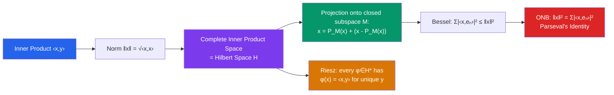

# ∫ Hilbert Spaces

> [!abstract] TL;DR
> A Hilbert space is a complete inner product space — an infinite-dimensional generalization of Euclidean geometry where angles, orthogonality, and projections all make sense. The Riesz representation theorem identifies every bounded linear functional with an inner product, and the spectral theorem for self-adjoint operators generalizes eigendecomposition to infinite dimensions.

## Intuition — analogy FIRST

$\mathbb{R}^n$ is the finite-dimensional prototype: vectors have lengths (norm), angles (inner product), and you can decompose any vector into components along an orthogonal basis. A Hilbert space does all of this in infinite dimensions, where the "coordinates" become sequences or function coefficients. The Fourier series of a periodic function is exactly the decomposition of that function into its components along the orthonormal basis $\{e^{in\theta}\}$ — Parseval's identity says the sum of squared Fourier coefficients equals the $L^2$ norm squared, mirroring Pythagoras in infinite dimensions.

---

## How It Works

## Key Concepts

### Inner Product Spaces

An **inner product** on a vector space $H$ over $\mathbb{F}$ ($= \mathbb{R}$ or $\mathbb{C}$) is $\langle \cdot, \cdot \rangle: H \times H \to \mathbb{F}$ satisfying:
1. **Conjugate symmetry**: $\langle x, y \rangle = \overline{\langle y, x \rangle}$
2. **Linearity in first argument**: $\langle ax+bz, y \rangle = a\langle x,y\rangle + b\langle z,y\rangle$
3. **Positive definiteness**: $\langle x, x \rangle \geq 0$, with equality iff $x = 0$

The **induced norm** is $\|x\| = \sqrt{\langle x, x \rangle}$. The **Cauchy-Schwarz inequality** holds:
$$|\langle x, y \rangle| \leq \|x\| \|y\|$$

A **Hilbert space** is an inner product space that is complete with respect to this norm.

### Key Examples

| Space | Inner Product | Description |
|---|---|---|
| $\mathbb{R}^n$ | $\langle x, y \rangle = \sum x_i y_i$ | Euclidean space |
| $L^2(\mu)$ | $\langle f, g \rangle = \int f \bar{g} \, d\mu$ | Square-integrable functions |
| $\ell^2(\mathbb{N})$ | $\langle a, b \rangle = \sum_{n=1}^\infty a_n \bar{b}_n$ | Square-summable sequences |
| $H^1(\Omega)$ | $\langle u, v \rangle = \int (uv + \nabla u \cdot \nabla v)$ | First Sobolev space |

### Orthogonality and the Projection Theorem

$x \perp y$ means $\langle x, y \rangle = 0$. **Pythagoras**: if $x \perp y$, then $\|x + y\|^2 = \|x\|^2 + \|y\|^2$.

> **Projection Theorem**: For any closed subspace $M \subseteq H$ and any $x \in H$, there exists a unique element $P_M(x) \in M$ such that $\|x - P_M(x)\| = d(x, M)$. Moreover, $x - P_M(x) \perp M$.

The decomposition $x = P_M(x) + (x - P_M(x))$ is the orthogonal decomposition $H = M \oplus M^\perp$.

### Orthonormal Sequences and Bases

A sequence $\{e_n\}$ is **orthonormal** if $\langle e_m, e_n \rangle = \delta_{mn}$.

**Bessel's inequality**:
$$\sum_{n=1}^\infty |\langle x, e_n \rangle|^2 \leq \|x\|^2$$

An orthonormal sequence is a **complete orthonormal basis** (or Hilbert basis) if equality holds:

$$\|x\|^2 = \sum_{n=1}^\infty |\langle x, e_n \rangle|^2 \quad \text{(Parseval's identity)}$$

and equivalently, $x = \sum_{n=1}^\infty \langle x, e_n \rangle e_n$ (convergent in norm). Every separable Hilbert space has a countable orthonormal basis (constructed via Gram-Schmidt).

### Riesz Representation Theorem

> **Riesz Representation**: Every bounded linear functional $\varphi: H \to \mathbb{F}$ has the form $\varphi(x) = \langle x, y \rangle$ for a unique $y \in H$, with $\|\varphi\| = \|y\|$.

This identifies $H^* \cong H$ — a Hilbert space is self-dual. Proof: $y = P_{\ker(\varphi)^\perp}(\text{anything with } \varphi \neq 0)$, normalized.

### Self-Adjoint Operators and Spectral Theorem

An operator $A: H \to H$ is **self-adjoint** if $\langle Ax, y \rangle = \langle x, Ay \rangle$ for all $x, y$.

**Spectral theorem for compact self-adjoint operators**:
> If $A$ is compact and self-adjoint, then $H$ has an orthonormal basis $\{e_n\}$ of eigenvectors: $Ae_n = \lambda_n e_n$, with $\lambda_n \in \mathbb{R}$ and $\lambda_n \to 0$.

This is the infinite-dimensional generalization of symmetric matrix diagonalization. The eigenvalues are real (self-adjointness), accumulate only at 0 (compactness), and the eigenvectors form a complete basis.

---

## Real-World Notes

- **Quantum mechanics**: the state space of a quantum system is a Hilbert space (usually $L^2(\mathbb{R}^3)$ for a particle). Observables are self-adjoint operators; measurement outcomes are eigenvalues; the Born rule is the inner product squared.
- **Signal processing**: the Fourier transform is an isometric isomorphism $L^2(\mathbb{R}) \to L^2(\mathbb{R})$ (Plancherel theorem). Orthogonal wavelet bases provide alternative complete orthonormal bases adapted to scale.
- **Machine learning**: kernel methods (SVMs, Gaussian processes) use reproducing kernel Hilbert spaces (RKHS) where functions are represented as inner products $\langle f, K_x \rangle = f(x)$.
- **Numerical methods**: the Galerkin method for PDEs projects the solution onto a finite-dimensional subspace — this is exactly the projection theorem at work.

---

## Common Pitfalls

- **Hilbert $\neq$ Banach**: every Hilbert space is Banach, but not vice versa. $L^1$ is Banach but not Hilbert (no inner product satisfying the parallelogram law).
- **Orthonormal basis is not a Hamel basis**: a Hilbert (orthonormal) basis $\{e_n\}$ represents $x = \sum \langle x, e_n \rangle e_n$ as an infinite series (convergent in norm). A Hamel basis represents everything as a finite linear combination — they are different.
- **Closed subspace required for projection**: the projection theorem requires $M$ to be closed. In infinite dimensions, "subspace" is not enough; you must check closure.
- **Self-adjoint $\neq$ symmetric for unbounded operators**: for bounded operators on Hilbert spaces, self-adjoint = symmetric. For unbounded operators (important for quantum mechanics), they differ — domain issues matter.

---

## Related Concepts

- [[_MOC_Measure_Theory_and_Functional_Analysis|↑ Measure Theory & FA MOC]]
- [[Lp_Spaces]] — $L^2$ is the key Hilbert space
- [[Banach_Spaces]] — Hilbert spaces are special Banach spaces
- [[Spectral_Theory]] — eigendecomposition on Hilbert spaces

---

## Review Questions

1. Verify that $L^2([0,1])$ satisfies the parallelogram law $\|f+g\|^2 + \|f-g\|^2 = 2(\|f\|^2 + \|g\|^2)$, which characterizes inner product spaces among normed spaces.
2. Apply the projection theorem to show that the best $L^2$ approximation of $f \in L^2([0,1])$ by polynomials of degree $\leq n$ is given by the first $n+1$ Legendre polynomial coefficients.
3. Use the Riesz representation theorem to identify the dual of $L^2(\mu)$ explicitly. Why does this not contradict the fact that $(L^p)^* = L^q$ for $p \neq 2$?
4. State and sketch the proof of Parseval's identity: if $\{e_n\}$ is a complete ONB, then $\|x\|^2 = \sum |\langle x, e_n \rangle|^2$.

---

## Sources

- Rudin, *Real and Complex Analysis*, Ch. 4
- Conway, *A Course in Functional Analysis*, Ch. 1–2
- Reed & Simon, *Methods of Modern Mathematical Physics*, Vol. 1

#functional-analysis #hilbert-spaces #inner-products #spectral-theory #mathematics
