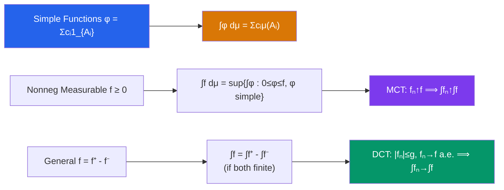

# ∫ Lebesgue Integration

> [!abstract] TL;DR
> The Lebesgue integral extends Riemann integration by measuring the range rather than the domain — grouping $x$-values where $f(x)$ is near a fixed level. The three convergence theorems (MCT, DCT, Fatou) are the workhorses of analysis, making it safe to interchange limits and integrals under mild conditions.

## Intuition — analogy FIRST

The Riemann integral is like counting money by denomination in the order you received it. The Lebesgue integral is like sorting all the coins by value first, then counting. Sorting doesn't change the total, but it lets you handle far more complicated collections (functions) without getting confused by the order. The result: you can integrate functions that oscillate wildly, functions defined only almost everywhere, and you can safely take limits under the integral sign — the three convergence theorems make this rigorous.

---

## How It Works

## Key Concepts

### Simple Functions

A **simple function** is $\varphi = \sum_{i=1}^n c_i \mathbf{1}_{A_i}$ where $A_i$ are disjoint measurable sets and $c_i \geq 0$. Its integral is defined directly:

$$\int \varphi \, d\mu = \sum_{i=1}^n c_i \mu(A_i)$$

Every nonnegative measurable function is the pointwise limit of an increasing sequence of nonneg simple functions.

### The Lebesgue Integral

**Step 1** (nonneg $f \geq 0$):
$$\int f \, d\mu = \sup\left\{ \int \varphi \, d\mu : 0 \leq \varphi \leq f,\, \varphi \text{ simple} \right\}$$

**Step 2** (general $f$): Write $f = f^+ - f^-$ where $f^+ = \max(f,0)$, $f^- = \max(-f,0)$. Then:
$$\int f \, d\mu = \int f^+ \, d\mu - \int f^- \, d\mu$$

$f$ is **integrable** (Lebesgue) if $\int |f| \, d\mu < \infty$.

### Lebesgue vs. Riemann

| Feature | Riemann | Lebesgue |
|---|---|---|
| Slicing direction | Horizontal (domain) | Vertical (range level sets) |
| Dirichlet function $\mathbf{1}_\mathbb{Q}$ | Not integrable | Integrable (= 0, since $\lambda(\mathbb{Q}) = 0$) |
| Interchange $\lim$ and $\int$ | Requires uniform convergence | Much weaker conditions (MCT, DCT) |
| Riemann integrable $\Rightarrow$ | — | Lebesgue integrable, same value |

A bounded function on $[a,b]$ is Riemann integrable $\Leftrightarrow$ it is continuous **almost everywhere** (Lebesgue's criterion).

### The Three Convergence Theorems

These are the central results that make Lebesgue integration powerful.

**Monotone Convergence Theorem (MCT)**:
> If $0 \leq f_1 \leq f_2 \leq \cdots$ are measurable and $f_n \to f$ pointwise, then:
$$\int f_n \, d\mu \uparrow \int f \, d\mu$$

No uniform convergence needed. Allows proving $\int \sum_{n=1}^\infty g_n = \sum \int g_n$ for nonneg series.

**Fatou's Lemma**:
> For nonneg measurable $\{f_n\}$:
$$\int \liminf_{n\to\infty} f_n \, d\mu \leq \liminf_{n\to\infty} \int f_n \, d\mu$$

This is the "budget" inequality: the integral of the limit can be smaller than the limit of the integrals (mass can escape to $\pm\infty$).

**Dominated Convergence Theorem (DCT)**:
> If $f_n \to f$ **almost everywhere** and $|f_n| \leq g$ for some integrable $g$, then:
$$\lim_{n\to\infty} \int f_n \, d\mu = \int f \, d\mu$$

The dominating function $g$ prevents mass from escaping. This is the workhorse for differentiating under the integral sign.

### Almost Everywhere (a.e.)

A property holds **almost everywhere** if the set where it fails has measure zero. $f = g$ a.e. means $\mu(\{x : f(x) \neq g(x)\}) = 0$. Lebesgue integration is indifferent to a.e. changes: $\int f = \int g$ whenever $f = g$ a.e.

### Fubini's Theorem

For $\sigma$-finite measure spaces $(X, \mathcal{F}, \mu)$ and $(Y, \mathcal{G}, \nu)$ and $f: X \times Y \to \mathbb{R}$ integrable:

$$\int_{X \times Y} f \, d(\mu \times \nu) = \int_X \left(\int_Y f(x,y) \, d\nu(y)\right) d\mu(x) = \int_Y \left(\int_X f(x,y) \, d\mu(x)\right) d\nu(y)$$

**Tonelli's theorem**: for nonneg measurable $f$ (possibly $+\infty$), all three integrals are equal (may be $\infty$).

**Warning**: Fubini requires $\int |f| < \infty$. Switching order without integrability can give different (wrong) answers.

---

## Real-World Notes

- **Probability**: expectations $E[X] = \int X \, dP$ are Lebesgue integrals. DCT justifies $E[\lim X_n] = \lim E[X_n]$ under uniform integrability.
- **Fourier analysis**: the Fourier transform $\hat{f}(\xi) = \int f(x) e^{-2\pi i \xi x} dx$ is a Lebesgue integral; DCT justifies differentiation under the integral sign to show $\widehat{f'} = 2\pi i \xi \hat{f}$.
- **PDEs**: weak solutions use Lebesgue integrals; the variational formulation $\int_\Omega \nabla u \cdot \nabla v \, dx = \int_\Omega fv \, dx$ requires $L^2$ integrability.
- **Numerical analysis**: convergence of quadrature rules (numerical integration) is proved using DCT — if quadrature weights converge pointwise with a bound, the integrals converge.

---

## Common Pitfalls

- **Forgetting the dominating function**: DCT requires an integrable dominator $g$. Without it, $\int f_n \, d\mu \not\to \int f \, d\mu$ in general (example: $f_n = \mathbf{1}_{[n, n+1]}$, which converges to 0 pointwise but has $\int f_n = 1$ for all $n$).
- **Fatou is one-directional**: $\int \liminf \leq \liminf \int$. The reverse inequality fails in general; you need DCT for equality.
- **Fubini requires integrability**: iterated integrals can exist and differ when the double integral is not absolutely convergent. The classic example: $\int_0^1 \int_0^1 \frac{x^2 - y^2}{(x^2+y^2)^2} \, dx \, dy$ gives different values in each order.
- **Lebesgue measure zero but uncountable**: sets of measure zero (like Cantor sets) can be uncountable. "a.e." is about measure, not cardinality.

---

## Related Concepts

- [[_MOC_Measure_Theory_and_Functional_Analysis|↑ Measure Theory & FA MOC]]
- [[Measure_Theory]] — the $\sigma$-algebra and measure framework
- [[Lp_Spaces]] — $L^p$ spaces measure integrability exponents
- [[Hilbert_Spaces]] — $L^2$ with the inner product $\langle f, g \rangle = \int fg$

---

## Review Questions

1. Use the MCT to prove that $\int \sum_{n=1}^\infty g_n \, d\mu = \sum_{n=1}^\infty \int g_n \, d\mu$ for nonneg measurable $g_n$.
2. Give an example where Fatou's inequality is strict: find $\{f_n\}$ with $\int \liminf f_n < \liminf \int f_n$.
3. Use DCT to show that if $f \in L^1(\mathbb{R})$, then $F(t) = \int_{-\infty}^t f(x) \, dx$ is continuous.
4. Apply Fubini's theorem to compute $\int_0^\infty e^{-tx} \, dt$ for $x > 0$, then integrate over $x \in [a,b]$ to derive a formula for $\int_a^b \frac{1}{x} \, dx$ (verify it gives $\ln(b/a)$).

---

## Sources

- Rudin, *Real and Complex Analysis*, Ch. 1–2
- Folland, *Real Analysis*, Ch. 2
- Stein & Shakarchi, *Real Analysis*, Ch. 2

#measure-theory #lebesgue-integration #convergence-theorems #fubini #mathematics
