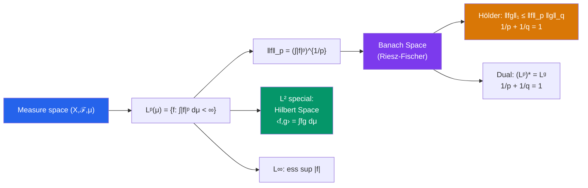

# ∫ $L^p$ Spaces

> [!abstract] TL;DR
> $L^p(\mu)$ spaces are the natural function spaces of analysis: functions whose $p$-th power is integrable, normed by $\|f\|_p = (\int |f|^p)^{1/p}$. They are Banach spaces (complete) for all $1 \leq p \leq \infty$, with $L^2$ being special — a Hilbert space. Hölder's inequality, duality, and embeddings make them the essential framework for PDEs, signal processing, and optimization.

## Intuition — analogy FIRST

Think of signals (functions) and how you measure their "size." The $L^1$ norm measures total variation (total energy over time). The $L^2$ norm measures root-mean-square energy (like RMS voltage). The $L^\infty$ norm measures the peak amplitude. Each choice captures a different aspect of "large" — and the Hölder inequality says different sizes are multiplicatively compatible. Engineers routinely switch between these depending on whether they want to penalize rare spikes ($L^\infty$), total magnitude ($L^1$), or energy ($L^2$).

---

## How It Works

## Key Concepts

### Definition of $L^p$

For $1 \leq p < \infty$:
$$L^p(\mu) = \left\{ f \text{ measurable} : \int_X |f|^p \, d\mu < \infty \right\}, \quad \|f\|_p = \left(\int |f|^p \, d\mu\right)^{1/p}$$

Elements are equivalence classes of functions equal $\mu$-a.e. (otherwise $\|\cdot\|_p$ is only a semi-norm).

For $p = \infty$:
$$\|f\|_\infty = \text{ess sup}_{x \in X} |f(x)| = \inf\{M : \mu(\{|f| > M\}) = 0\}$$

### Hölder's and Minkowski's Inequalities

**Hölder's inequality**: for $1/p + 1/q = 1$ (conjugate exponents):

$$\|fg\|_1 = \int |fg| \, d\mu \leq \|f\|_p \, \|g\|_q$$

Special case $p = q = 2$: **Cauchy-Schwarz inequality** $|\int fg| \leq \|f\|_2 \|g\|_2$.

**Minkowski's inequality** (triangle inequality for $L^p$):

$$\|f + g\|_p \leq \|f\|_p + \|g\|_p, \quad 1 \leq p \leq \infty$$

This is what makes $\|\cdot\|_p$ a norm. For $p < 1$, Minkowski fails — those "spaces" are metric but not normed.

### Completeness: Riesz-Fischer Theorem

> Every Cauchy sequence in $L^p(\mu)$ (for $1 \leq p \leq \infty$) converges in $L^p$ to an element of $L^p$.

This is one of the deepest facts: a sequence of functions that become "close" in $L^p$ actually converges to a function in the space. Without completeness, limits could be missing — making analysis impossible. Completeness = Banach space.

### Dense Subsets

In $L^p(\mathbb{R})$ for $1 \leq p < \infty$:
- **Simple functions** are dense
- **Continuous functions with compact support** $C_c(\mathbb{R})$ are dense
- **Smooth functions with compact support** $C_c^\infty(\mathbb{R})$ are dense

This allows approximation arguments: prove something for nice functions, extend by density.

### Duality

For $1 \leq p < \infty$, the **dual space** $(L^p(\mu))^*$ is isometrically isomorphic to $L^q(\mu)$ where $1/p + 1/q = 1$:

Every bounded linear functional $\Lambda: L^p \to \mathbb{R}$ has the form $\Lambda(f) = \int fg \, d\mu$ for a unique $g \in L^q$, and $\|\Lambda\| = \|g\|_q$.

For $p = 2$: $L^2$ is its own dual (self-dual) — matching the Hilbert space Riesz representation theorem.

For $p = \infty$: $(L^\infty)^* \supsetneq L^1$ (strictly larger — it includes finitely additive measures).

### Special Properties of $L^2$

$L^2(\mu)$ is a **Hilbert space** with inner product:
$$\langle f, g \rangle = \int_X f \overline{g} \, d\mu$$

This structure enables orthogonal projections, Fourier series, and spectral theory. See [[Hilbert_Spaces]] for details.

### Embeddings

On a **finite measure space** $(X, \mathcal{F}, \mu)$ with $\mu(X) < \infty$:

$$L^\infty \subseteq L^p \subseteq L^q \subseteq L^1 \quad \text{for } p \geq q \geq 1$$

This fails on infinite measure spaces: $\mathbb{R}$ with Lebesgue measure has no inclusion between $L^1$ and $L^2$.

### Role in Compressed Sensing and Sparsity

| Space | Signal interpretation |
|---|---|
| $L^1$ | Promotes sparsity (LASSO); minimizing $\|x\|_1$ finds sparse solutions |
| $L^2$ | Energy; ridge regression penalizes $\|x\|_2^2$; Fourier analysis |
| $L^\infty$ | Peak-amplitude control; minimax problems |

---

## Real-World Notes

- **Machine learning**: regularization is essentially a choice of $L^p$ norm. $L^2$ regularization (weight decay) shrinks all weights; $L^1$ regularization (LASSO) induces sparsity.
- **Signal processing**: the Parseval identity $\|f\|_{L^2}^2 = \|\hat{f}\|_{\ell^2}^2$ (Fourier) says the energy of a signal equals the sum of squared Fourier coefficients — both are $L^2$ norms.
- **PDEs**: Sobolev spaces $W^{k,p}$ are built on $L^p$ and encode $k$ weak derivatives, providing the functional-analytic framework for elliptic PDE theory.
- **Probability**: $L^p(\Omega, P)$ for a probability space captures moments: $f \in L^1 \Leftrightarrow E[|X|] < \infty$; $f \in L^2 \Leftrightarrow \text{Var}(X) < \infty$.

---

## Common Pitfalls

- **$p < 1$ is not a norm**: $\|\cdot\|_p$ for $p < 1$ satisfies $\|f+g\|_p^p \leq \|f\|_p^p + \|g\|_p^p$ (sub-additive on $p$-th powers) but not the triangle inequality. The space is metric but not a normed space.
- **Convergence in $L^p$ vs. pointwise**: $f_n \to f$ in $L^p$ does NOT imply $f_n(x) \to f(x)$ for every $x$. A subsequence converges a.e., but the full sequence may not.
- **Duality breaks for $p = \infty$**: $(L^\infty)^* \neq L^1$ — there are bounded functionals on $L^\infty$ not representable by $L^1$ functions (they correspond to finitely additive, not countably additive, measures).
- **Equivalence classes**: $L^p$ elements are a.e.-equivalence classes, not individual functions. Two functions equal a.e. are the same element of $L^p$.

---

## Related Concepts

- [[_MOC_Measure_Theory_and_Functional_Analysis|↑ Measure Theory & FA MOC]]
- [[Lebesgue_Integration]] — $L^p$ norms are defined via Lebesgue integrals
- [[Hilbert_Spaces]] — $L^2$ is the prototypical Hilbert space
- [[Banach_Spaces]] — $L^p$ spaces are complete: Banach spaces

---

## Review Questions

1. Prove Hölder's inequality from Young's inequality $ab \leq \frac{a^p}{p} + \frac{b^q}{q}$ (for $1/p + 1/q = 1$, $a,b \geq 0$).
2. Show that on $[0,1]$ with Lebesgue measure, $L^2([0,1]) \subsetneq L^1([0,1])$. Give an example of an $L^1$ function that is not $L^2$.
3. Prove that if $f_n \to f$ in $L^p$, then $\|f_n\|_p \to \|f\|_p$ (the norm is continuous).
4. Verify that the dual space correspondence $(L^p)^* = L^q$ works for $p = q = 2$: write $\Lambda f = \int fg$ for some $g \in L^2$ and identify $g$ in terms of $\Lambda$.

---

## Sources

- Rudin, *Real and Complex Analysis*, Ch. 3
- Folland, *Real Analysis*, Ch. 6
- Lieb & Loss, *Analysis*, Ch. 2 (detailed inequalities)

#functional-analysis #lp-spaces #holder-inequality #banach-space #mathematics
