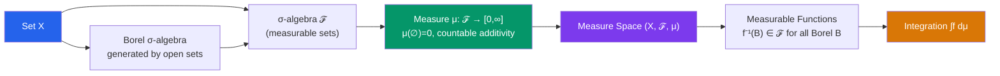

# ∫ Measure Theory

> [!abstract] TL;DR
> Measure theory assigns consistent "sizes" (measures) to sets in a way that respects countable additivity, solving the pathologies of the Riemann integral. A measure space $(X, \mathcal{F}, \mu)$ consists of a set, a $\sigma$-algebra of measurable sets, and a measure — the foundation of modern integration, probability, and analysis.

## Intuition — analogy FIRST

Measure theory is the science of "size." The Riemann integral tries to measure area by slicing horizontally (domain partitions), but it chokes on wild functions like $\mathbf{1}_\mathbb{Q}$ (1 on rationals, 0 on irrationals). Lebesgue's insight was to slice vertically instead: group together all $x$-values where $f(x)$ is near some level $c$, and measure the size of that set. To make this work, you need a rigorous notion of "size" (a measure) for arbitrary sets — that's what $\sigma$-algebras and measures provide.

---

## How It Works

## Key Concepts

### $\sigma$-Algebras

A **$\sigma$-algebra** (sigma-algebra) $\mathcal{F}$ on a set $X$ is a collection of subsets satisfying:
1. $X \in \mathcal{F}$
2. If $A \in \mathcal{F}$, then $A^c \in \mathcal{F}$ (closed under complement)
3. If $A_1, A_2, \ldots \in \mathcal{F}$, then $\bigcup_{n=1}^\infty A_n \in \mathcal{F}$ (closed under countable union)

The pair $(X, \mathcal{F})$ is called a **measurable space**. The **Borel $\sigma$-algebra** $\mathcal{B}(\mathbb{R}^n)$ is generated by all open sets in $\mathbb{R}^n$.

### Measures

A **measure** on $(X, \mathcal{F})$ is a function $\mu: \mathcal{F} \to [0, \infty]$ satisfying:
1. $\mu(\emptyset) = 0$
2. **Countable additivity**: if $\{A_n\}$ are pairwise disjoint, then $\mu\!\left(\bigcup_{n=1}^\infty A_n\right) = \sum_{n=1}^\infty \mu(A_n)$

| Measure | Space | Definition |
|---|---|---|
| Counting measure | Any $X$ | $\mu(A) = |A|$ (cardinality) |
| Dirac delta $\delta_x$ | Any $X$ | $\delta_x(A) = 1$ if $x \in A$, else 0 |
| Lebesgue measure $\lambda$ | $\mathbb{R}^n$ | Extends length/area/volume |
| Probability measure $P$ | Any $X$ | $P(X) = 1$ |

### Lebesgue Outer Measure

For $A \subseteq \mathbb{R}$:

$$\lambda^*(A) = \inf\left\{ \sum_{n=1}^\infty (b_n - a_n) : A \subseteq \bigcup_{n=1}^\infty (a_n, b_n) \right\}$$

A set $E$ is **Lebesgue measurable** if for every $A \subseteq \mathbb{R}$: $\lambda^*(A) = \lambda^*(A \cap E) + \lambda^*(A \cap E^c)$ (Carathéodory's criterion). The Lebesgue measurable sets form a $\sigma$-algebra extending the Borel $\sigma$-algebra.

### Non-Measurable Sets

The **Vitali set** (constructed using the Axiom of Choice) is a subset of $[0,1]$ that is not Lebesgue measurable. Its existence shows measure theory cannot assign consistent sizes to all subsets of $\mathbb{R}$.

### Measurable Functions

$f: (X, \mathcal{F}) \to (\mathbb{R}, \mathcal{B}(\mathbb{R}))$ is **measurable** if $f^{-1}(B) \in \mathcal{F}$ for all Borel sets $B$. Equivalently, $\{x : f(x) > c\} \in \mathcal{F}$ for all $c \in \mathbb{R}$. Sums, products, pointwise limits of measurable functions are measurable.

### Probability Measure

A **probability space** $(\Omega, \mathcal{F}, P)$ has $P(\Omega) = 1$. Events are elements of $\mathcal{F}$; random variables are measurable functions. The entire edifice of modern probability theory rests on this framework.

### Complete Measure Spaces

A measure space is **complete** if every subset of a measure-zero set is measurable (and has measure zero). The Lebesgue measure space is complete; Borel measure is not (but its completion is Lebesgue). Completeness matters for convergence theorems.

---

## Real-World Notes

- **Probability theory**: every concept — random variables, expectations, conditional probability, independence — is a special case of measure theory. The modern axiomatization (Kolmogorov, 1933) unified probability and analysis.
- **Signal processing**: the Fourier transform is defined as a Lebesgue integral; the $L^2$ theory of signals requires measure-theoretic foundations.
- **Quantum mechanics**: quantum probability amplitudes are elements of $L^2$ Hilbert spaces; observables correspond to self-adjoint operators on these measure-theoretic spaces.
- **Financial mathematics**: stochastic processes (Brownian motion, martingales) live in probability spaces; risk measures use measure-theoretic tools.

---

## Common Pitfalls

- **Countable vs. uncountable**: $\sigma$-algebras are closed under countable (not arbitrary) unions. The rationals $\mathbb{Q}$ are measurable (countable union of singletons), but some uncountable sets may not be.
- **Measure zero $\neq$ empty**: a Cantor set has Lebesgue measure zero but is uncountable. "Almost everywhere" (a.e.) means "except on a set of measure zero," not "everywhere."
- **Borel $\subsetneq$ Lebesgue**: not all Lebesgue measurable sets are Borel; the Lebesgue $\sigma$-algebra is strictly larger. In practice, measurable sets encountered are all Borel.
- **Carathéodory's criterion is subtle**: it says $E$ is measurable if it "splits" every test set $A$ additively. This is not just $E \in$ some nice collection; it must hold for all $A$.

---

## Related Concepts

- [[_MOC_Measure_Theory_and_Functional_Analysis|↑ Measure Theory & FA MOC]]
- [[Lebesgue_Integration]] — integrating measurable functions against a measure
- [[Lp_Spaces]] — function spaces built using the measure
- [[Hilbert_Spaces]] — $L^2(\mu)$ is the primary Hilbert space of analysis

---

## Review Questions

1. Verify the three $\sigma$-algebra axioms for the Borel $\sigma$-algebra $\mathcal{B}(\mathbb{R})$. Is $\{x : f(x) > c\}$ always Borel for a continuous $f$?
2. Show that countable additivity implies monotonicity ($A \subseteq B \Rightarrow \mu(A) \leq \mu(B)$) and subadditivity ($\mu(A \cup B) \leq \mu(A) + \mu(B)$).
3. Explain why the Vitali set cannot be Lebesgue measurable (sketch the argument using translation invariance of Lebesgue measure).
4. A probability measure $P$ satisfies $P(A_n) \to 0$ whenever $A_1 \supseteq A_2 \supseteq \cdots$ and $\bigcap A_n = \emptyset$. Prove this from the countable additivity axiom.

---

## Sources

- Rudin, *Real and Complex Analysis*, Ch. 1–2
- Folland, *Real Analysis*, Ch. 1–2
- Royden & Fitzpatrick, *Real Analysis*, Part I

#measure-theory #sigma-algebras #lebesgue-measure #mathematics
