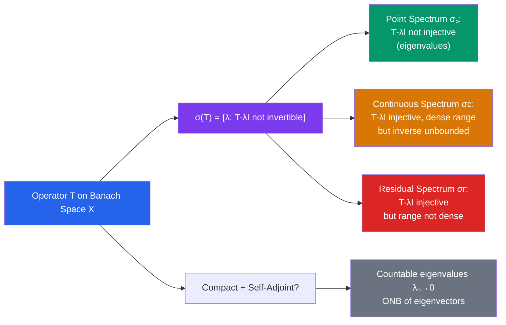

# ∫ Spectral Theory

> [!abstract] TL;DR
> Spectral theory generalizes eigenvalues from matrices to operators on Banach and Hilbert spaces. The spectrum $\sigma(T) = \{\lambda : T - \lambda I \text{ not invertible}\}$ replaces the finite set of eigenvalues; for compact self-adjoint operators the spectrum is a countable set accumulating only at 0, with eigenvectors forming an orthonormal basis — a complete infinite-dimensional analogue of matrix diagonalization.

## Intuition — analogy FIRST

For an $n \times n$ matrix $A$, eigenvalues are the values $\lambda$ where $A - \lambda I$ is not invertible (determinant = 0). In infinite dimensions, "not invertible" has three ways to fail: no inverse, unbounded inverse, or inverse defined only on a dense subspace — giving three spectral components. For "nice" operators (compact and self-adjoint), the full story collapses to something just as clean as matrices: discrete real eigenvalues, orthogonal eigenvectors, complete decomposition.

---

## How It Works

## Key Concepts

### The Spectrum

For a bounded operator $T: X \to X$ on a Banach space, the **resolvent set** is:
$$\rho(T) = \{\lambda \in \mathbb{C} : T - \lambda I \text{ is bijective with bounded inverse}\}$$

The **spectrum** is $\sigma(T) = \mathbb{C} \setminus \rho(T)$. The **resolvent operator** is $R(\lambda, T) = (T - \lambda I)^{-1}$.

**Key facts**:
- $\sigma(T)$ is a compact nonempty subset of $\mathbb{C}$ (for bounded $T$)
- **Spectral radius**: $r(T) = \sup\{|\lambda| : \lambda \in \sigma(T)\} = \lim_{n\to\infty} \|T^n\|^{1/n} \leq \|T\|$

### Three Components of the Spectrum

The spectrum decomposes as $\sigma(T) = \sigma_p(T) \cup \sigma_c(T) \cup \sigma_r(T)$:

| Component | Condition on $T - \lambda I$ | Interpretation |
|---|---|---|
| Point spectrum $\sigma_p$ | Not injective | Genuine eigenvalues: $Tx = \lambda x$ for $x \neq 0$ |
| Continuous spectrum $\sigma_c$ | Injective, dense range, unbounded inverse | Limits of eigenvalues approaching a continuum |
| Residual spectrum $\sigma_r$ | Injective, range not dense | Eigenvalues of $T^*$ (adjoint) |

For self-adjoint operators on Hilbert spaces: $\sigma_r(T) = \emptyset$.

### Compact Operators

An operator $T: X \to Y$ is **compact** if the image of the closed unit ball $\overline{T(B)}$ is compact in $Y$. Equivalently, every bounded sequence $\{x_n\}$ has a subsequence for which $\{Tx_n\}$ converges.

Properties:
- Compact operators are bounded
- Finite-rank operators (image is finite-dimensional) are compact
- Limits of compact operators (in operator norm) are compact
- The composition of a compact operator with any bounded operator is compact

### Spectral Theorem for Compact Self-Adjoint Operators

This is the main theorem of spectral theory for Hilbert spaces:

> **Theorem**: Let $T: H \to H$ be compact and self-adjoint (i.e., $\langle Tx, y \rangle = \langle x, Ty \rangle$). Then:
> 1. All eigenvalues $\lambda_n$ are **real**
> 2. Eigenvectors for distinct eigenvalues are **orthogonal**
> 3. The eigenvalues form a **countable sequence** $\lambda_1, \lambda_2, \ldots$ with $\lambda_n \to 0$
> 4. $H$ has an **orthonormal basis** of eigenvectors $\{e_n\}$ with $Te_n = \lambda_n e_n$
> 5. $T = \sum_{n=1}^\infty \lambda_n \langle \cdot, e_n \rangle e_n$ (spectral decomposition)

This is the infinite-dimensional analogue of diagonalizing a symmetric matrix.

### Spectral Theorem for Bounded Self-Adjoint Operators

For a bounded self-adjoint operator $T$ on a Hilbert space (not necessarily compact):

- $\sigma(T) \subseteq \mathbb{R}$
- **Functional calculus**: for any continuous $f: \sigma(T) \to \mathbb{R}$, one can define $f(T)$ as a bounded operator, with $\|f(T)\| = \|f\|_{\sigma(T)}$
- The spectral theorem: $T = \int_{\sigma(T)} \lambda \, dE(\lambda)$ where $E$ is a **spectral measure** (projection-valued measure)

This is the deepest theorem in operator theory.

### Fredholm Theory

A **Fredholm operator** is $T = I - K$ where $K$ is compact. Fredholm theory says:
- $\ker(T)$ is finite-dimensional
- $\text{im}(T)$ is closed with finite codimension
- **Fredholm index**: $\text{ind}(T) = \dim\ker(T) - \text{codim}(\text{im}(T))$ is stable under compact perturbations

### Unbounded Operators

In quantum mechanics, key operators (position, momentum, Hamiltonian) are **unbounded** — only defined on a dense subspace, not all of $H$. For unbounded operators:
- **Closed operator**: graph is closed (weaker than bounded)
- **Adjoint** $T^*$ defined on a domain that may differ from $T$
- **Self-adjoint** (for unbounded): $T = T^*$ including domains — crucial distinction from symmetric ($T \subseteq T^*$)
- **Self-adjoint extension problem**: when can a symmetric operator be extended to a self-adjoint one?

---

## Real-World Notes

- **Quantum mechanics**: the Hamiltonian $H = -\Delta + V(x)$ is a self-adjoint operator on $L^2(\mathbb{R}^3)$. Its spectrum $\sigma(H)$ gives the energy levels: point spectrum = bound state energies (discrete), continuous spectrum = scattering states (continuum).
- **Google PageRank**: the ranking vector is the dominant eigenvector of the Google matrix (a stochastic operator). Spectral gap between largest and second eigenvalue determines convergence speed of power iteration.
- **Vibration analysis**: natural frequencies of a structure are eigenvalues of the Laplacian operator on the relevant domain; mode shapes are eigenfunctions.
- **PCA and dimensionality reduction**: the sample covariance operator's eigenvectors (principal components) are the spectral decomposition of the empirical covariance matrix — spectral theory at finite scale.

---

## Common Pitfalls

- **Spectrum $\neq$ eigenvalues**: in infinite dimensions, the spectrum can have continuous components with no eigenvectors. Example: the shift operator on $\ell^2$ has no eigenvalues but $\sigma = \{|\lambda| \leq 1\}$.
- **Self-adjoint $\neq$ symmetric for unbounded operators**: on $L^2([0,1])$, $-d^2/dx^2$ with different boundary conditions gives different self-adjoint extensions — different spectra, different physics.
- **Compact operator has no bounded inverse**: if $T$ is compact and $X$ is infinite-dimensional, $T$ cannot be surjective onto $X$, so it has no bounded inverse and $0 \in \sigma(T)$.
- **Functional calculus requires self-adjoint**: you can define $f(T)$ for continuous $f$ and bounded self-adjoint $T$. For non-normal operators, functional calculus requires more care (or holomorphic functional calculus).

---

## Related Concepts

- [[_MOC_Measure_Theory_and_Functional_Analysis|↑ Measure Theory & FA MOC]]
- [[Hilbert_Spaces]] — spectral theorem lives here; self-adjoint operators
- [[Banach_Spaces]] — resolvent theory and spectral radius for general operators
- [[Lp_Spaces]] — integral operators on $L^2$ are typical compact operators

---

## Review Questions

1. Compute the spectrum of the right shift operator $S: \ell^2 \to \ell^2$, $S(a_1, a_2, \ldots) = (0, a_1, a_2, \ldots)$. Classify each part as point, continuous, or residual spectrum.
2. Show that a compact self-adjoint operator $T$ on an infinite-dimensional Hilbert space must have $0 \in \sigma(T)$. (Hint: show $T$ cannot be surjective.)
3. Let $T_f: L^2([0,1]) \to L^2([0,1])$ be multiplication by $f \in L^\infty([0,1])$: $(T_f g)(x) = f(x)g(x)$. Determine $\sigma(T_f)$ in terms of $f$.
4. Explain why, in quantum mechanics, the discreteness of atomic energy spectra is related to the compactness of the resolvent of the Hamiltonian for bound states.

---

## Sources

- Reed & Simon, *Methods of Modern Mathematical Physics*, Vol. 1 (Functional Analysis)
- Conway, *A Course in Functional Analysis*, Ch. 9–10
- Kato, *Perturbation Theory for Linear Operators*, Ch. 3

#functional-analysis #spectral-theory #compact-operators #hilbert-spaces #mathematics
