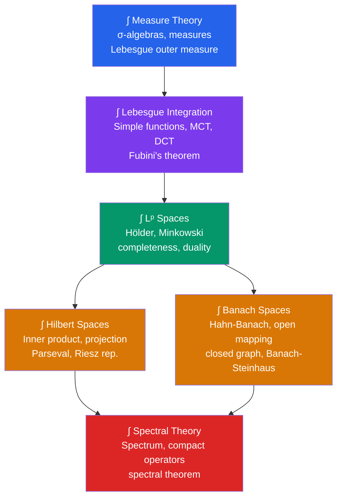

# ∫ Measure Theory & Functional Analysis — Map of Content

> [!abstract] Overview
> Measure theory and functional analysis: the rigorous foundation of integration and the study of infinite-dimensional spaces — underpins PDEs, quantum mechanics, and modern probability. Measure theory fixes the Riemann integral; functional analysis provides the tools to solve linear equations in infinite dimensions.

## Section Structure

## Notes in This Section

| Note | Core Idea | Key Results |
|---|---|---|
| [[Measure_Theory]] | $(X, \mathcal{F}, \mu)$: measuring sets rigorously | Lebesgue measure, Vitali sets, Carathéodory extension |
| [[Lebesgue_Integration]] | Integrate measurable functions against measures | MCT, DCT, Fatou's lemma, Fubini's theorem |
| [[Lp_Spaces]] | $\|f\|_p = (\int|f|^p)^{1/p}$; complete function spaces | Hölder, Minkowski, Riesz-Fischer, $(L^p)^* = L^q$ |
| [[Hilbert_Spaces]] | Complete inner product space; geometry in $\infty$ dims | Projection theorem, Parseval, Riesz representation |
| [[Banach_Spaces]] | Complete normed space; bounded operators | 4 fundamental theorems, dual spaces, reflexivity |
| [[Spectral_Theory]] | Generalized eigenvalues of operators | Spectral decomposition, compact self-adjoint theorem |

## Recommended Learning Path

1. **[[Measure_Theory]]** — Learn $\sigma$-algebras and Lebesgue measure. Understand why Riemann integration fails and what measurability means.
2. **[[Lebesgue_Integration]]** — Master the three convergence theorems. DCT is used constantly in analysis; know its hypotheses by heart.
3. **[[Lp_Spaces]]** — Understand Hölder's inequality and why $L^2$ is special. Learn the duality $(L^p)^* = L^q$.
4. **[[Banach_Spaces]]** — The four fundamental theorems. Hahn-Banach and uniform boundedness are used everywhere.
5. **[[Hilbert_Spaces]]** — Projection theorem and Riesz representation. The bridge between $L^2$ analysis and operator theory.
6. **[[Spectral_Theory]]** — The climax: eigendecomposition in infinite dimensions. Focus on the compact self-adjoint case first.

## Key Theorems Cheatsheet

| Theorem | Statement |
|---|---|
| **Monotone Convergence** | $0 \leq f_n \uparrow f$ $\Rightarrow$ $\int f_n \uparrow \int f$ |
| **Dominated Convergence** | $\|f_n\| \leq g \in L^1$, $f_n \to f$ a.e. $\Rightarrow$ $\int f_n \to \int f$ |
| **Fubini** | $\int_{X\times Y} f = \int_X \int_Y f$ (when $f \in L^1$) |
| **Hölder** | $\|fg\|_1 \leq \|f\|_p \|g\|_q$ for $1/p + 1/q = 1$ |
| **Riesz-Fischer** | $L^p$ is complete (Banach) |
| **Hahn-Banach** | Extend bounded functionals without increasing norm |
| **Open Mapping** | Surjective bounded operator is open; bijective $\Rightarrow$ isomorphism |
| **Uniform Boundedness** | Pointwise bounded family $\Rightarrow$ uniformly bounded |
| **Riesz Representation** | Every $\varphi \in H^*$ is $\varphi(\cdot) = \langle \cdot, y \rangle$ |
| **Spectral (compact SA)** | ONB of eigenvectors; eigenvalues real, $\to 0$ |

## Connections to Other Domains

- **Topology**: $\sigma$-algebras are generated by open sets; weak topologies on Banach spaces
- **Probability**: measure theory is the foundation; $L^p$ spaces encode moments
- **PDEs**: Sobolev spaces (subspaces of $L^p$) provide the functional-analytic framework for weak solutions
- **Quantum Mechanics**: Hilbert space of states; self-adjoint operators as observables; spectral theorem = measurement theory

---

## Sources

- Rudin, *Real and Complex Analysis* — canonical graduate text
- Folland, *Real Analysis: Modern Techniques* — comprehensive with applications
- Brezis, *Functional Analysis, Sobolev Spaces and PDEs* — operator theory with PDE focus
- Reed & Simon, *Methods of Modern Mathematical Physics*, Vol. 1 — physics-oriented spectral theory

#measure-theory #functional-analysis #moc #mathematics #lebesgue #hilbert #banach
