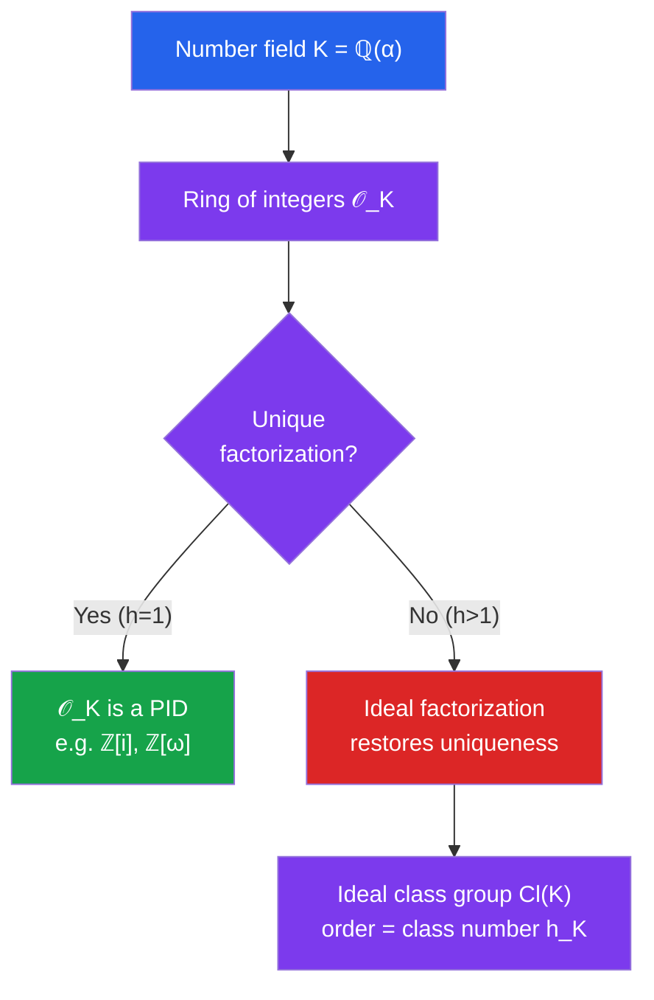

# 🔢 Algebraic Number Theory

> [!abstract] TL;DR
> Algebraic number theory extends classical number theory to number fields $K = \mathbb{Q}(\alpha)$ — field extensions of $\mathbb{Q}$ by algebraic numbers. The ring of integers $\mathcal{O}_K$ plays the role of $\mathbb{Z}$ inside $K$, but unique factorization can fail. The remedy: unique factorization is restored at the level of *ideals*, giving the theory of Dedekind domains and the ideal class group — whose size measures exactly how badly uniqueness fails.

## Intuition — analogy FIRST
Imagine you're working in $\mathbb{Z}[\sqrt{-5}]$ — integers enriched with $\sqrt{-5}$. You can factor $6 = 2 \cdot 3$, but also $6 = (1+\sqrt{-5})(1-\sqrt{-5})$. These are two genuinely different factorizations into irreducibles — unique factorization breaks! The fix, invented by Kummer and refined by Dedekind, is to work with *ideals* rather than elements. Every ideal factors uniquely into prime ideals, restoring order. The failure of unique factorization is measured by the **class number** $h_K$.

---

## How It Works

---

## Key Concepts

### Algebraic Numbers and Algebraic Integers
- $\alpha \in \mathbb{C}$ is **algebraic** over $\mathbb{Q}$ if it satisfies some polynomial $f(\alpha) = 0$ with $f \in \mathbb{Q}[x]$.
- $\alpha$ is an **algebraic integer** if it satisfies a **monic** polynomial with **integer** coefficients.

Examples of algebraic integers: $\sqrt{2}$ (satisfies $x^2 - 2$), $i$ (satisfies $x^2 + 1$), $\frac{1+\sqrt{5}}{2}$ (satisfies $x^2 - x - 1$). Note: $\frac{1}{2}$ is algebraic but not an algebraic integer.

### Number Fields
A **number field** $K$ is a finite extension of $\mathbb{Q}$:
$$K = \mathbb{Q}(\alpha) = \{a_0 + a_1\alpha + \cdots + a_{n-1}\alpha^{n-1} : a_i \in \mathbb{Q}\}$$
where $\alpha$ is algebraic of degree $n = [K:\mathbb{Q}]$ over $\mathbb{Q}$.

**Examples:**
- $\mathbb{Q}(i)$: Gaussian rationals, degree 2
- $\mathbb{Q}(\sqrt{d})$: quadratic fields, degree 2
- $\mathbb{Q}(\zeta_n)$ for $\zeta_n = e^{2\pi i/n}$: cyclotomic fields, degree $\varphi(n)$

### Ring of Integers $\mathcal{O}_K$
$$\mathcal{O}_K = \{\alpha \in K : \alpha \text{ is an algebraic integer}\}$$

This is a ring (closed under $+$ and $\times$). It generalizes $\mathbb{Z} \subseteq \mathbb{Q}$:
$$\mathbb{Z} = \mathcal{O}_\mathbb{Q}$$

**Key examples:**
- $\mathcal{O}_{\mathbb{Q}(i)} = \mathbb{Z}[i]$ (Gaussian integers): $a + bi$, $a,b \in \mathbb{Z}$
- $\mathcal{O}_{\mathbb{Q}(\omega)} = \mathbb{Z}[\omega]$ where $\omega = e^{2\pi i/3}$ (Eisenstein integers)
- $\mathcal{O}_{\mathbb{Q}(\sqrt{d})} = \mathbb{Z}[\sqrt{d}]$ if $d \equiv 2, 3 \pmod 4$; $= \mathbb{Z}\left[\frac{1+\sqrt{d}}{2}\right]$ if $d \equiv 1 \pmod 4$

### Failure of Unique Factorization: The Example
In $\mathbb{Z}[\sqrt{-5}]$:
$$6 = 2 \cdot 3 = (1+\sqrt{-5})(1-\sqrt{-5})$$
Each of $2, 3, 1 \pm \sqrt{-5}$ is *irreducible* in $\mathbb{Z}[\sqrt{-5}]$ (no non-trivial factorizations), yet these are two distinct factorizations into irreducibles. Unique factorization fails!

### Ideals and Dedekind Domains
$\mathcal{O}_K$ is a **Dedekind domain**: an integral domain that is:
1. Noetherian (every ideal is finitely generated)
2. Integrally closed (every algebraic integer in $K$ is in $\mathcal{O}_K$)
3. Dimension 1 (every nonzero prime ideal is maximal)

**Key theorem:** In a Dedekind domain, every nonzero ideal factors **uniquely** into prime ideals:
$$\mathfrak{a} = \mathfrak{p}_1^{e_1} \mathfrak{p}_2^{e_2} \cdots \mathfrak{p}_r^{e_r}$$

In $\mathbb{Z}[\sqrt{-5}]$: the ideal $(6) = \mathfrak{p}_1 \mathfrak{p}_2 \mathfrak{p}_3 \mathfrak{p}_4$ for prime ideals $\mathfrak{p}_i$, and the two "factorizations" of $6$ correspond to different groupings of these ideal factors.

### Ideal Class Group
Two ideals $\mathfrak{a}, \mathfrak{b}$ are **equivalent** ($\mathfrak{a} \sim \mathfrak{b}$) if $\exists \alpha, \beta \in \mathcal{O}_K \setminus \{0\}$: $(\alpha)\mathfrak{a} = (\beta)\mathfrak{b}$.

The **ideal class group** $\mathrm{Cl}(K)$ is the group of all fractional ideals modulo this equivalence. Its order is the **class number** $h_K$.

- $h_K = 1$ iff $\mathcal{O}_K$ is a PID iff unique factorization holds
- $h_K > 1$ measures failure of unique factorization

### Imaginary Quadratic Fields with $h=1$
The imaginary quadratic fields $\mathbb{Q}(\sqrt{-d})$ with class number 1 are precisely:
$$d = 1, 2, 3, 7, 11, 19, 43, 67, 163$$
This is the **Stark-Heegner theorem** (proved independently by Stark and Baker, 1966–67). The field $\mathbb{Q}(\sqrt{-163})$ produces the famous near-integer $e^{\pi\sqrt{163}} \approx 262537412640768743.99999999999925$.

### Ramification, Splitting, Inertness
For a prime $p \in \mathbb{Z}$ and a number field $K$:
$$p\mathcal{O}_K = \mathfrak{p}_1^{e_1} \cdots \mathfrak{p}_g^{e_g}$$
- **Splits:** $e_i = 1$ and $g = [K:\mathbb{Q}]$ (completely splits, many prime ideals)
- **Inert:** $g = 1$, $e_1 = 1$ (stays prime)
- **Ramifies:** some $e_i > 1$ (only finitely many primes ramify; they divide the discriminant)

For $K = \mathbb{Q}(i)$: $p$ splits iff $p \equiv 1 \pmod 4$; $p$ is inert iff $p \equiv 3 \pmod 4$; $2$ ramifies.

---

## Real-World Notes
- **Fermat's Last Theorem (historical motivation):** Kummer attempted to prove $x^n + y^n = z^n$ using unique factorization in $\mathbb{Z}[\zeta_p]$; unique factorization fails for $p \geq 23$, but Kummer's work on regular primes (those not dividing $h_{\mathbb{Q}(\zeta_p)}$) proved FLT for many $n$. Wiles's proof uses far deeper algebraic geometry.
- **Lattice-based cryptography:** Uses ideals in ring of integers of cyclotomic fields; ideal lattice problems (Ring-LWE, Ring-SIS) are presumed hard even for quantum computers.
- **L-functions and class numbers:** The Dedekind zeta function $\zeta_K(s) = \sum_{\mathfrak{a}} N(\mathfrak{a})^{-s}$ encodes $h_K$ in its residue at $s=1$ via the **class number formula**.
- **Diophantine equations:** Determining when $x^2 + ny^2 = m$ has solutions uses prime splitting in $\mathbb{Q}(\sqrt{-n})$.

---

## Common Pitfalls
- **Irreducible $\neq$ prime in general:** In $\mathbb{Z}[\sqrt{-5}]$, $2$ is irreducible (can't be factored further) but not prime ($2 \mid (1+\sqrt{-5})(1-\sqrt{-5})$ but $2 \nmid 1\pm\sqrt{-5}$). In a PID, irreducible iff prime.
- **$\mathcal{O}_K$ is not always $\mathbb{Z}[\alpha]$:** For $K = \mathbb{Q}(\sqrt{5})$, $\mathcal{O}_K = \mathbb{Z}[(1+\sqrt{5})/2]$ — the ring is larger than you might expect.
- **Class number computation is hard:** For large discriminants, $h_K$ is hard to compute and its behavior (Goldfeld, Cohen-Lenstra heuristics) is still partly conjectural.
- **Norm is multiplicative, not additive:** $N(\mathfrak{ab}) = N(\mathfrak{a})N(\mathfrak{b})$; this is key to showing prime ideals have prime norm (for most cases).

---

## Related Concepts
- [[_MOC_Number_Theory|↑ Number Theory MOC]]
- [[Modular_Arithmetic]] — $\mathcal{O}_K / \mathfrak{p} \cong \mathbb{F}_q$ links ideal quotients to modular arithmetic
- [[Quadratic_Residues_and_Reciprocity]] — prime splitting in quadratic fields determined by Legendre symbol
- [[Analytic_Number_Theory]] — Dedekind zeta function $\zeta_K(s)$, class number formula

---

## Review Questions
1. Show that $\mathbb{Z}[i]$ is a Euclidean domain (hence PID, hence UFD) using the Gaussian norm $N(a+bi) = a^2 + b^2$.
2. In $\mathbb{Z}[\sqrt{-5}]$, verify that $2$, $3$, $1+\sqrt{-5}$, $1-\sqrt{-5}$ are all irreducible using norms.
3. Describe how a rational prime $p$ factors in $\mathbb{Z}[i]$ based on $p \bmod 4$. What does this say about which primes are sums of two squares?
4. What is the class number of $\mathbb{Q}(\sqrt{-5})$? Exhibit two non-principal ideals and show they are inverses in $\mathrm{Cl}(K)$.

---

## Sources
- Neukirch, *Algebraic Number Theory*, Ch. 1
- Marcus, *Number Fields*, Ch. 1–3
- Stewart & Tall, *Algebraic Number Theory and Fermat's Last Theorem*, Ch. 1–6

#number-theory #algebraic-number-theory #number-fields #ring-of-integers #ideal-class-group #dedekind-domain
