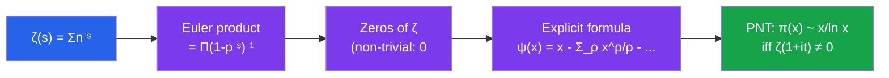

# 🔢 Analytic Number Theory

> [!abstract] TL;DR
> Analytic number theory applies the tools of complex analysis and calculus to questions about integers. Its crown jewel is the Prime Number Theorem: $\pi(x) \sim x/\ln x$, which describes how primes are distributed among integers. The Riemann zeta function $\zeta(s) = \sum n^{-s}$ encodes all information about primes via its zeros, and the Riemann Hypothesis — conjecturing all non-trivial zeros lie on $\operatorname{Re}(s) = 1/2$ — remains the most famous open problem in mathematics.

## Intuition — analogy FIRST
Think of arithmetic functions (like "how many divisors does $n$ have?") as signals, and Dirichlet series as their "frequency spectrum." Just as Fourier analysis lets you study a signal by its frequencies, Dirichlet series let you study arithmetic functions by their behavior as a complex variable $s$ moves through $\mathbb{C}$. The prime information is encoded in the poles and zeros of $\zeta(s)$ — like resonances in a musical instrument. The Riemann Hypothesis says all these resonances lie on a single line.

---

## How It Works

---

## Key Concepts

### Multiplicative Functions
A function $f: \mathbb{N} \to \mathbb{C}$ is **multiplicative** if $f(mn) = f(m)f(n)$ whenever $\gcd(m,n) = 1$.

**Completely multiplicative:** $f(mn) = f(m)f(n)$ for all $m, n$.

**Key examples:**
- $\varphi(n)$: Euler's totient — multiplicative
- $d(n) = \sum_{d \mid n} 1$: number of divisors — multiplicative
- $\sigma(n) = \sum_{d \mid n} d$: sum of divisors — multiplicative
- $\mu(n)$: Möbius function — $\mu(1)=1$; $\mu(n) = (-1)^k$ if $n = p_1 \cdots p_k$ squarefree; $0$ if $p^2 \mid n$
- $\lambda(n)$: Liouville function — completely multiplicative, $\lambda(p^k) = (-1)^k$
- Dirichlet characters $\chi$ mod $q$: completely multiplicative, periodic, zero on $\gcd(n,q) > 1$

### Dirichlet Series
$$F(s) = \sum_{n=1}^\infty \frac{f(n)}{n^s}$$

Converges absolutely for $\operatorname{Re}(s) > \sigma_a$ (abscissa of absolute convergence). Products of Dirichlet series correspond to Dirichlet convolution: if $h = f * g$ then $H(s) = F(s)G(s)$.

Multiplicative $f$ has an **Euler product**:
$$F(s) = \prod_p \left(1 + \frac{f(p)}{p^s} + \frac{f(p^2)}{p^{2s}} + \cdots\right)$$

### Riemann Zeta Function
$$\zeta(s) = \sum_{n=1}^\infty \frac{1}{n^s} = \prod_p \frac{1}{1 - p^{-s}}, \quad \operatorname{Re}(s) > 1$$

The **Euler product** encodes all prime information. Convergence for $\operatorname{Re}(s) > 1$; the product over primes shows $\zeta(s) \neq 0$ there.

**Analytic continuation:** $\zeta(s)$ extends to a meromorphic function on all of $\mathbb{C}$ with a **simple pole at $s=1$** (residue 1) and no other poles.

**Functional equation:** 
$$\xi(s) = \frac{1}{2}s(s-1)\pi^{-s/2}\Gamma(s/2)\zeta(s), \quad \xi(s) = \xi(1-s)$$

This shows $\zeta(-2n) = 0$ for $n = 1, 2, 3, \ldots$ (the **trivial zeros**) and $\zeta(s) = 0$ for $\operatorname{Re}(s) = 0$ only at those.

### Non-Trivial Zeros and the Riemann Hypothesis
The **non-trivial zeros** are the zeros with $0 < \operatorname{Re}(s) < 1$ (the **critical strip**).

The functional equation shows zeros come in pairs: if $\rho$ is a zero, so is $1-\bar{\rho}$.

**Riemann Hypothesis (1859):** All non-trivial zeros satisfy $\operatorname{Re}(\rho) = \frac{1}{2}$.

Computationally verified for the first $10^{13}$ zeros. One of the Clay Millennium Problems ($1 million prize). Implications for prime gaps, error terms in PNT, and countless other results.

### Prime Number Theorem
$$\pi(x) \sim \frac{x}{\ln x} \quad \text{as } x \to \infty$$

More precisely: $\pi(x) = \operatorname{Li}(x) + O(x e^{-c\sqrt{\ln x}})$ for some $c > 0$, where $\operatorname{Li}(x) = \int_2^x \frac{dt}{\ln t}$.

**Proof strategy (Hadamard and de la Vallée Poussin, 1896):**
1. Show $\zeta(1+it) \neq 0$ for all real $t \neq 0$ (zero-free region at the edge of critical strip)
2. Use the **explicit formula** (Perron's formula applied to $-\zeta'/\zeta$): $\psi(x) = x - \sum_\rho \frac{x^\rho}{\rho} - \frac{\zeta'(0)}{\zeta(0)} - \frac{1}{2}\ln(1-x^{-2})$
3. Show the sum over zeros $\sum_\rho x^\rho/\rho$ is $o(x)$ using the zero-free region

### Chebyshev Functions
The **von Mangoldt function**: $\Lambda(n) = \ln p$ if $n = p^k$; $0$ otherwise.

$$\psi(x) = \sum_{n \leq x} \Lambda(n) = \sum_{p^k \leq x} \ln p \quad \text{(second Chebyshev function)}$$

$$\theta(x) = \sum_{p \leq x} \ln p \quad \text{(first Chebyshev function)}$$

**PNT is equivalent to:** $\psi(x) \sim x$ (or equivalently $\theta(x) \sim x$).

The explicit formula gives the exact relationship between $\psi(x)$ and the zeros of $\zeta$.

### Dirichlet's Theorem on Primes in Arithmetic Progressions
If $\gcd(a, d) = 1$, there are **infinitely many primes** of the form $a + nd$ ($n \geq 0$).

**Proof sketch:** Introduce **Dirichlet characters** $\chi \pmod d$ and their $L$-functions:
$$L(s, \chi) = \sum_{n=1}^\infty \frac{\chi(n)}{n^s} = \prod_p \frac{1}{1-\chi(p)p^{-s}}$$

Show $L(1, \chi) \neq 0$ for non-trivial $\chi$ (the hard part), then:
$$\sum_{\substack{p \leq x \\ p \equiv a \pmod d}} 1 \sim \frac{1}{\varphi(d)} \cdot \frac{x}{\ln x}$$

Primes are **equidistributed** among all $\varphi(d)$ residue classes coprime to $d$.

### Special Values of $\zeta$
- $\zeta(2) = \pi^2/6$ (Basel problem, Euler 1734)
- $\zeta(4) = \pi^4/90$; $\zeta(2k) = (-1)^{k+1} \frac{(2\pi)^{2k}}{2(2k)!} B_{2k}$ (Bernoulli numbers)
- $\zeta(-1) = -1/12$ (by analytic continuation — the famous "sum" $1+2+3+\cdots = -1/12$)

---

## Real-World Notes
- **Complexity analysis:** The prime number theorem implies $p_n \sim n \ln n$ — the $n$-th prime is roughly $n \ln n$, used in bounds for RSA key sizes.
- **Random matrix theory:** Spacing statistics of Riemann zeros match those of eigenvalues of random Hermitian matrices (GUE conjecture, Montgomery-Odlyzko law) — an unexpected bridge to physics.
- **Cryptographic primality tests:** The generalized Riemann hypothesis (GRH) for Dirichlet $L$-functions implies deterministic polynomial-time primality testing (Miller's test becomes deterministic under GRH).
- **Sieve methods:** The Brun sieve, large sieve, and Selberg sieve use analytic techniques to bound prime gaps and prove results like Brun's theorem on twin primes ($\sum_{p, p+2 \text{ twin}} 1/p < \infty$).

---

## Common Pitfalls
- **$\zeta(1) = \infty$:** The series $\sum 1/n$ diverges; $\zeta(s)$ has a pole at $s=1$. The Euler product shows no zeros for $\operatorname{Re}(s)>1$, not for $s=1$.
- **PNT error terms:** $\pi(x) \approx x/\ln x$ is a rough approximation; $\operatorname{Li}(x)$ is far more accurate. The error depends on zero-free regions.
- **$L(1,\chi) \neq 0$ is non-trivial:** For real characters $\chi$, Dirichlet had to work hard (using the class number formula) to show $L(1,\chi) > 0$.
- **Analytic continuation ≠ limit:** $\zeta(-1) = -1/12$ is the value of the analytic continuation, not the sum of the divergent series $1+2+3+\cdots$ in any classical sense.

---

## Related Concepts
- [[_MOC_Number_Theory|↑ Number Theory MOC]]
- [[Divisibility_and_Primes]] — prime counting function $\pi(x)$, the object PNT describes
- [[Algebraic_Number_Theory]] — Dedekind zeta function $\zeta_K(s)$ generalizes Riemann zeta; class number formula
- [[Mathematical_Logic_and_Set_Theory]] — undecidability of RH would be a landmark if established

---

## Review Questions
1. Prove the Euler product formula $\zeta(s) = \prod_p (1-p^{-s})^{-1}$ for $\operatorname{Re}(s) > 1$ using the geometric series and unique factorization.
2. State precisely what it means for $\psi(x) \sim x$ to be equivalent to the Prime Number Theorem.
3. Why does the functional equation of $\zeta(s)$ imply that $\zeta(-2n) = 0$ for positive integers $n$?
4. The Riemann Hypothesis implies $|\pi(x) - \operatorname{Li}(x)| = O(\sqrt{x} \ln x)$. What does this say about the size of prime gaps?

---

## Sources
- Davenport, *Multiplicative Number Theory*, Ch. 1–14
- Apostol, *Introduction to Analytic Number Theory*, Ch. 1–11
- Titchmarsh, *The Theory of the Riemann Zeta-Function*, Ch. 1–3

#number-theory #analytic-number-theory #prime-number-theorem #riemann-zeta #riemann-hypothesis #dirichlet-series
