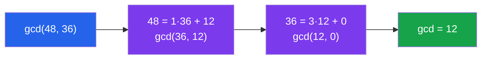

# 🔢 Divisibility and Primes

> [!abstract] TL;DR
> Divisibility is the foundational relation of number theory: $a \mid b$ means $b$ is a perfect multiple of $a$. Primes are the indivisible building blocks, and the Fundamental Theorem of Arithmetic guarantees every integer has a unique prime factorization — the "atomic decomposition" of the integers.

## Intuition — analogy FIRST
Think of integers as LEGO bricks. Primes are the smallest, irreducible bricks. Every structure you build (every integer greater than 1) decomposes into a unique collection of those primitive bricks. The Euclidean algorithm is just repeatedly asking: "what's the biggest brick that fits evenly into both structures?" — and cleverly reducing the problem each step.

---

## How It Works



---

## Key Concepts

### Divisibility
$a \mid b$ (read: "$a$ divides $b$") if and only if $\exists k \in \mathbb{Z}$ such that $b = ka$.

**Properties:**
- **Reflexive:** $a \mid a$
- **Transitive:** $a \mid b$ and $b \mid c$ implies $a \mid c$
- **Linearity:** $a \mid b$ and $a \mid c$ implies $a \mid (mb + nc)$ for any $m, n \in \mathbb{Z}$
- **Antisymmetric (positive):** $a \mid b$ and $b \mid a$ with $a,b > 0$ implies $a = b$

### Division Algorithm
For all $a, b \in \mathbb{Z}$ with $b > 0$, there exist **unique** $q, r \in \mathbb{Z}$ such that:
$$a = qb + r, \quad 0 \leq r < b$$
Here $q$ is the **quotient** and $r$ is the **remainder**.

### Greatest Common Divisor (GCD)
$$\gcd(a, b) = \max\{d \in \mathbb{Z}^+ : d \mid a \text{ and } d \mid b\}$$

**Key property:** $\gcd(a, b) = \gcd(b, a \bmod b)$

This recurrence is the heart of the **Euclidean Algorithm**:
```
gcd(a, b):
    if b = 0: return a
    return gcd(b, a mod b)
```
**Time complexity:** $O(\log(\min(a,b)))$ — the number of steps is bounded by the number of digits.

### Bézout's Identity
For any $a, b \in \mathbb{Z}$ (not both zero), there exist $x, y \in \mathbb{Z}$ such that:
$$ax + by = \gcd(a, b)$$
The **extended Euclidean algorithm** computes $x$ and $y$ by back-substituting through the Euclidean steps. These coefficients are essential for finding modular inverses.

### Least Common Multiple
$$\text{lcm}(a, b) = \frac{|ab|}{\gcd(a, b)}$$

### Primes
A **prime** $p > 1$ is divisible only by $1$ and $p$. The first primes: $2, 3, 5, 7, 11, 13, 17, 19, 23, 29, \ldots$

**Euclid's proof of infinitely many primes:** Suppose finitely many primes $p_1, \ldots, p_k$. Let $N = p_1 p_2 \cdots p_k + 1$. Then $N$ is not divisible by any $p_i$ (remainder 1), so $N$ has a prime factor not in our list — contradiction.

### Fundamental Theorem of Arithmetic
Every integer $n > 1$ can be written as a product of primes:
$$n = p_1^{a_1} p_2^{a_2} \cdots p_k^{a_k}$$
and this factorization is **unique up to the order of factors**.

**Proof sketch:**
- *Existence:* By strong induction. If $n$ is prime, done. Otherwise $n = ab$ with $1 < a, b < n$; by induction each has a prime factorization.
- *Uniqueness:* Uses **Euclid's Lemma**: if $p \mid ab$ then $p \mid a$ or $p \mid b$.

### Euclid's Lemma (key tool)
If $p$ is prime and $p \mid ab$, then $p \mid a$ or $p \mid b$.

*Proof:* If $p \nmid a$, then $\gcd(p, a) = 1$, so by Bézout's identity $\exists x, y: px + ay = 1$. Multiply by $b$: $pxb + aby = b$. Since $p \mid p$ and $p \mid ab$, we get $p \mid b$.

### Sieve of Eratosthenes
To find all primes up to $N$:
1. List integers $2$ to $N$
2. Mark $2$ as prime; cross out all multiples of $2$
3. Advance to next unmarked number $p$; mark prime; cross out multiples of $p$
4. Repeat until $p > \sqrt{N}$

Complexity: $O(N \log \log N)$.

### Prime Distribution
The **prime counting function** $\pi(x) = \#\{p \leq x : p \text{ prime}\}$.

Primes become sparser: $\pi(100) = 25$, $\pi(1000) = 168$, $\pi(10^6) = 78498$.

The **Prime Number Theorem** (proved in 1896): $\pi(x) \sim \dfrac{x}{\ln x}$ as $x \to \infty$.

Gaps between primes can be arbitrarily large (take $n! + 2, n! + 3, \ldots, n! + n$ — all composite), but there are also infinitely many prime pairs $p, p+2$ conjectured (twin prime conjecture, open).

---

## Real-World Notes
- **RSA cryptography:** Security rests on the hardness of factoring large semiprimes $N = pq$; Bézout's identity computes the decryption exponent.
- **Hash functions:** Modular arithmetic with prime moduli produces better distribution in hash tables (prime table sizes reduce collisions).
- **Primality testing:** Miller-Rabin test (probabilistic) and AKS test (deterministic polynomial time) are used in cryptographic key generation.
- **Computer algebra systems:** The Euclidean algorithm is a core subroutine in polynomial GCD computation, rational arithmetic, and symbolic integration.

---

## Common Pitfalls
- **$\gcd(a, 0) = a$, not $0$:** Every integer divides $0$, so the GCD is $a$ itself — the algorithm terminates correctly.
- **Uniqueness in FTA requires primeness:** In rings like $\mathbb{Z}[\sqrt{-5}]$, unique factorization fails because Euclid's Lemma depends on primeness, not just irreducibility.
- **$1$ is not prime:** By convention, $1$ is a unit, not prime — otherwise the FTA uniqueness statement would need modification.
- **The Euclidean algorithm may produce negative Bézout coefficients:** Both $x$ and $y$ in $ax + by = \gcd(a,b)$ can be negative or zero; this is normal.

---

## Related Concepts
- [[_MOC_Number_Theory|↑ Number Theory MOC]]
- [[Modular_Arithmetic]] — divisibility modulo $n$, building on GCD
- [[Quadratic_Residues_and_Reciprocity]] — quadratic structure among primes
- [[Analytic_Number_Theory]] — prime counting function, PNT, Riemann zeta

---

## Review Questions
1. Prove that $\gcd(a, b) = \gcd(b, a \bmod b)$ using the definition of divisibility.
2. Use the extended Euclidean algorithm to find integers $x, y$ such that $35x + 24y = 1$.
3. Prove Euclid's Lemma: if $p \mid ab$ and $p$ is prime, then $p \mid a$ or $p \mid b$.
4. How many steps does the Euclidean algorithm take on inputs $F_{n+1}$ and $F_n$ (consecutive Fibonacci numbers)? What does this say about worst-case complexity?

---

## Sources
- Hardy & Wright, *An Introduction to the Theory of Numbers*, Ch. 1–3
- Niven, Zuckerman & Montgomery, *An Introduction to the Theory of Numbers*, Ch. 1
- Knuth, *The Art of Computer Programming*, Vol. 2, §4.5.2

#number-theory #primes #divisibility #gcd #euclidean-algorithm #fundamental-theorem-of-arithmetic
