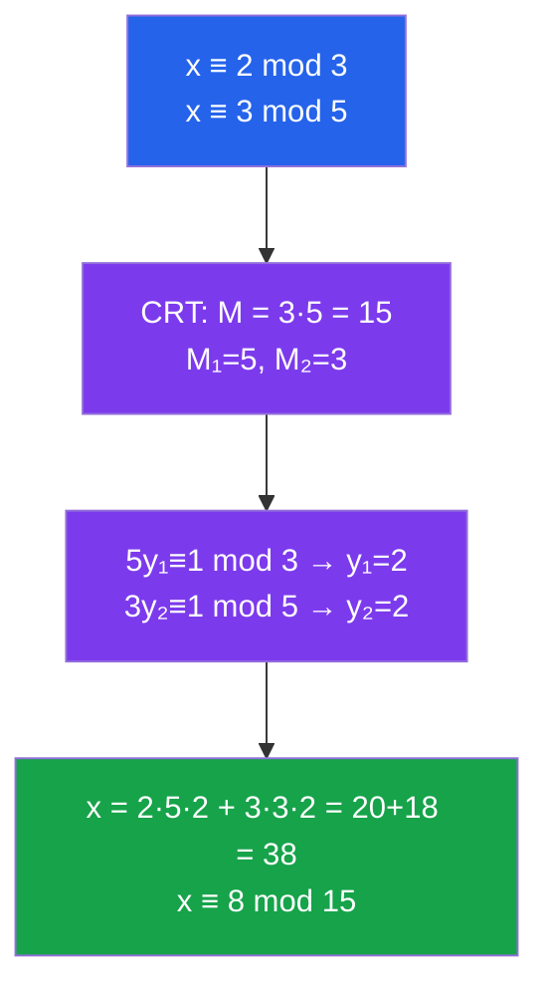

# 🔢 Modular Arithmetic

> [!abstract] TL;DR
> Modular arithmetic is "clock arithmetic" — numbers wrap around after reaching a modulus. Congruences $a \equiv b \pmod{n}$ form an equivalence relation, and residues $\{0, 1, \ldots, n-1\}$ form a ring $\mathbb{Z}/n\mathbb{Z}$ (a field when $n$ is prime). Euler's theorem and Fermat's little theorem govern powers in this system, forming the mathematical backbone of modern cryptography.

## Intuition — analogy FIRST
A clock shows 12 hours, so $13 \equiv 1 \pmod{12}$. After 13 hours from noon, it's 1 o'clock again. This "wrap-around" arithmetic is modular arithmetic. The key insight: many operations (addition, multiplication) respect this wrapping, so you can do arithmetic with *remainders* rather than full integers — often far more efficient. Division is the tricky part: dividing by $a$ requires that $a$ has no shared factors with the modulus.

---

## How It Works

---

## Key Concepts

### Congruence Relation
$$a \equiv b \pmod{n} \iff n \mid (a - b)$$

This is an **equivalence relation** on $\mathbb{Z}$: reflexive ($a \equiv a$), symmetric, and transitive. The equivalence class of $a$ is $[a] = \{a + kn : k \in \mathbb{Z}\}$, also written $\bar{a}$ or $a \bmod n$.

The **complete residue system** mod $n$ is $\{0, 1, 2, \ldots, n-1\}$.

### Arithmetic Mod $n$
Congruence is preserved under addition, subtraction, and multiplication:
- If $a \equiv a' \pmod{n}$ and $b \equiv b' \pmod{n}$, then $a + b \equiv a' + b' \pmod{n}$
- Similarly for subtraction and multiplication

The set $\mathbb{Z}/n\mathbb{Z} = \mathbb{Z}_n = \{[0], [1], \ldots, [n-1]\}$ forms a **commutative ring** under $+$ and $\times$ mod $n$.

### Division and Cancellation (Tricky!)
$$ax \equiv ay \pmod{n} \implies x \equiv y \pmod{n/\gcd(a,n)}$$

You **cannot** simply cancel $a$ unless $\gcd(a, n) = 1$. For example, $2 \cdot 3 \equiv 2 \cdot 7 \pmod{8}$ but $3 \not\equiv 7 \pmod{8}$ — only mod 4.

### Multiplicative Inverse
$a^{-1} \pmod{n}$ exists if and only if $\gcd(a, n) = 1$.

Found via the **extended Euclidean algorithm**: if $ax + ny = 1$ (Bézout), then $ax \equiv 1 \pmod{n}$, so $x \equiv a^{-1} \pmod{n}$.

### The Ring $\mathbb{Z}_n$ and Fields
- $\mathbb{Z}_n$ is a **field** if and only if $n$ is prime (every nonzero element is invertible)
- The **group of units** is $\mathbb{Z}_n^* = \{[a] : \gcd(a, n) = 1\}$ with $|\mathbb{Z}_n^*| = \varphi(n)$

### Euler's Totient Function $\varphi(n)$
$$\varphi(n) = \#\{k : 1 \leq k \leq n,\ \gcd(k,n) = 1\}$$

Key formulas:
- $\varphi(p) = p - 1$ for prime $p$
- $\varphi(p^k) = p^{k-1}(p-1)$
- $\varphi(mn) = \varphi(m)\varphi(n)$ when $\gcd(m,n) = 1$
- $\varphi(n) = n \prod_{p \mid n} \left(1 - \frac{1}{p}\right)$

### Euler's Theorem
If $\gcd(a, n) = 1$, then:
$$a^{\varphi(n)} \equiv 1 \pmod{n}$$

*Proof sketch:* The map $x \mapsto ax$ permutes $\mathbb{Z}_n^*$; multiply all elements and cancel.

### Fermat's Little Theorem
If $p$ is prime and $\gcd(a, p) = 1$, then:
$$a^{p-1} \equiv 1 \pmod{p}$$
Equivalently (for all $a$): $a^p \equiv a \pmod{p}$.

This is Euler's theorem with $\varphi(p) = p-1$. It is used for **fast modular exponentiation** and **primality testing**.

### Wilson's Theorem
$p$ is prime if and only if:
$$(p-1)! \equiv -1 \pmod{p}$$

Elegant but computationally impractical for large $p$ (factorial is huge). Useful in theoretical proofs.

### Chinese Remainder Theorem (CRT)
Let $n_1, n_2, \ldots, n_k$ be **pairwise coprime** (i.e., $\gcd(n_i, n_j) = 1$ for $i \neq j$). Then the system:
$$x \equiv a_1 \pmod{n_1},\quad x \equiv a_2 \pmod{n_2},\quad \ldots,\quad x \equiv a_k \pmod{n_k}$$
has a **unique** solution modulo $N = n_1 n_2 \cdots n_k$.

**Construction:** Let $M_i = N/n_i$ and $y_i = M_i^{-1} \pmod{n_i}$. Then:
$$x \equiv \sum_{i=1}^k a_i M_i y_i \pmod{N}$$

**Algebraic form:** $\mathbb{Z}/N\mathbb{Z} \cong \mathbb{Z}/n_1\mathbb{Z} \times \cdots \times \mathbb{Z}/n_k\mathbb{Z}$ (ring isomorphism).

### Fast Modular Exponentiation
To compute $a^b \pmod{n}$, use repeated squaring:
$$a^b = \begin{cases} 1 & b=0 \\ (a^{b/2})^2 & b \text{ even} \\ a \cdot a^{b-1} & b \text{ odd} \end{cases}$$
Complexity: $O(\log b)$ multiplications. Essential for RSA.

---

## Real-World Notes
- **RSA encryption:** Key generation uses Euler's theorem — encryption is $c = m^e \bmod n$, decryption is $m = c^d \bmod n$, where $ed \equiv 1 \pmod{\varphi(n)}$.
- **CRT speedup in RSA:** Instead of computing mod $N=pq$, compute mod $p$ and mod $q$ separately (both faster) then recombine via CRT — gives ~4× speedup.
- **Hash tables:** Table sizes chosen to be prime maximize uniform distribution and minimize collision chains.
- **Calendar arithmetic:** Day-of-week calculations use arithmetic mod 7; Zeller's congruence and Doomsday algorithm are examples.

---

## Common Pitfalls
- **$\varphi(1) = 1$:** The only integer in $[1,1]$ coprime to $1$ is $1$ itself — $\gcd(1,1)=1$.
- **Fermat's little theorem is NOT a primality proof:** A composite $n$ can satisfy $a^{n-1} \equiv 1 \pmod{n}$ for some $a$ (Carmichael numbers like $561 = 3 \cdot 11 \cdot 17$).
- **CRT requires pairwise coprimality:** For $x \equiv 1 \pmod{4}$ and $x \equiv 3 \pmod{6}$, since $\gcd(4,6) = 2 \neq 1$, the theorem doesn't directly apply.
- **Order of $a$ mod $n$ divides $\varphi(n)$, but need not equal it:** The multiplicative group $\mathbb{Z}_n^*$ may not be cyclic (e.g., $n=8$).

---

## Related Concepts
- [[_MOC_Number_Theory|↑ Number Theory MOC]]
- [[Divisibility_and_Primes]] — foundation: GCD and the Euclidean algorithm
- [[Quadratic_Residues_and_Reciprocity]] — quadratic congruences $x^2 \equiv a \pmod{p}$
- [[Algebraic_Number_Theory]] — rings $\mathcal{O}_K$ generalize $\mathbb{Z}/n\mathbb{Z}$

---

## Review Questions
1. Find all solutions to $17x \equiv 5 \pmod{31}$ using the extended Euclidean algorithm.
2. Prove Wilson's theorem using the pairing of elements with their inverses in $\mathbb{Z}_p^*$.
3. Use CRT to solve: $x \equiv 3 \pmod{7}$, $x \equiv 5 \pmod{11}$, $x \equiv 2 \pmod{13}$.
4. How does RSA decryption work? Why does $c^d \equiv m \pmod{n}$ when $ed \equiv 1 \pmod{\varphi(n)}$?

---

## Sources
- Ireland & Rosen, *A Classical Introduction to Modern Number Theory*, Ch. 3–4
- Hardy & Wright, *An Introduction to the Theory of Numbers*, Ch. 5–8
- Silverman, *A Friendly Introduction to Number Theory*, Ch. 11–16

#number-theory #modular-arithmetic #congruences #euler-theorem #fermat-little-theorem #chinese-remainder-theorem
