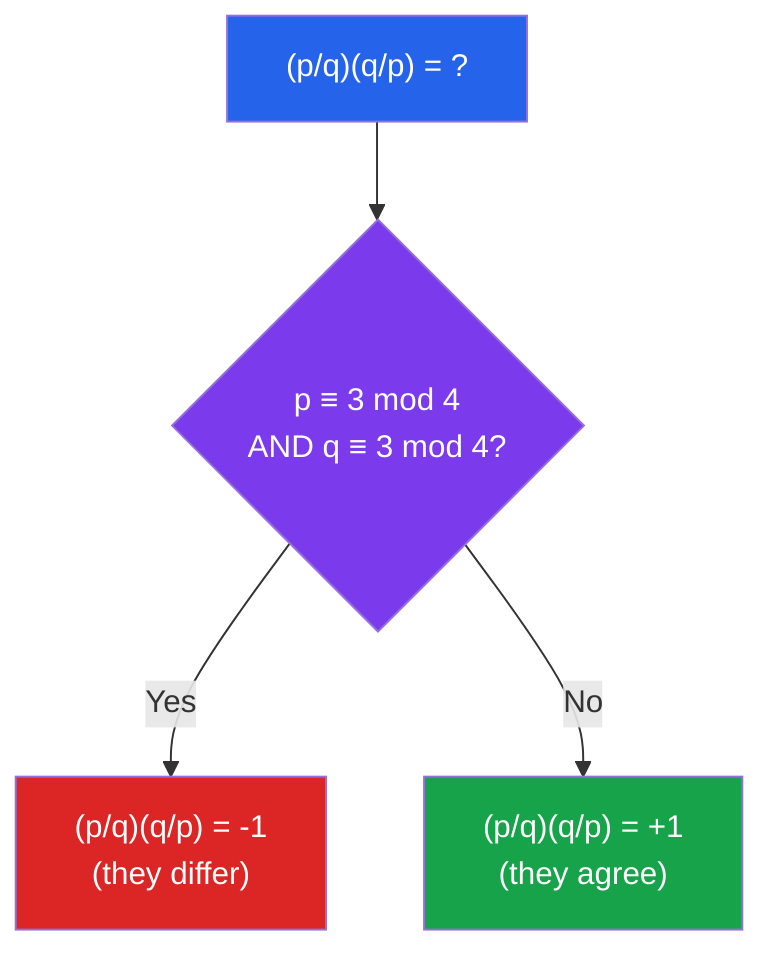

# 🔢 Quadratic Residues and Reciprocity

> [!abstract] TL;DR
> A quadratic residue mod $p$ is a number $a$ for which $x^2 \equiv a \pmod{p}$ has a solution. The Legendre symbol encodes this ±1 answer, and Gauss's quadratic reciprocity law — one of the most beautiful theorems in mathematics — links the solvability of $x^2 \equiv p \pmod{q}$ to $x^2 \equiv q \pmod{p}$ between different primes.

## Intuition — analogy FIRST
Asking "is $a$ a quadratic residue mod $p$?" is like asking "is $a$ a perfect square in the world of integers mod $p$?" Just as $9$ is a perfect square in $\mathbb{Z}$ (since $3^2=9$) but $7$ is not, the same question makes sense mod $p$ — but the answer depends on the prime. Quadratic reciprocity is the stunning revelation that whether $p$ is a square mod $q$ is almost always the same question as whether $q$ is a square mod $p$ — with a precise sign rule.

---

## How It Works

---

## Key Concepts

### Quadratic Residues
Let $p$ be an odd prime and $\gcd(a, p) = 1$.

- $a$ is a **quadratic residue (QR) mod $p$** if $x^2 \equiv a \pmod{p}$ has a solution.
- $a$ is a **quadratic non-residue (QNR)** otherwise.

Among $1, 2, \ldots, p-1$: there are exactly $\dfrac{p-1}{2}$ quadratic residues and $\dfrac{p-1}{2}$ non-residues.

*Why?* The map $x \mapsto x^2$ on $\mathbb{Z}_p^* = \{1, \ldots, p-1\}$ is exactly 2-to-1 (since $x^2 \equiv (-x)^2$), so the image has size $\frac{p-1}{2}$.

### The Legendre Symbol
$$\left(\frac{a}{p}\right) = \begin{cases} 0 & \text{if } p \mid a \\ +1 & \text{if } a \text{ is QR mod } p \\ -1 & \text{if } a \text{ is QNR mod } p \end{cases}$$

**Multiplicativity:** $\left(\dfrac{ab}{p}\right) = \left(\dfrac{a}{p}\right)\left(\dfrac{b}{p}\right)$

This makes the Legendre symbol a **group homomorphism** $\mathbb{Z}_p^* \to \{+1, -1\}$.

### Euler's Criterion
$$\left(\frac{a}{p}\right) \equiv a^{(p-1)/2} \pmod{p}$$

*Proof:* By Fermat's little theorem, $a^{p-1} \equiv 1$, so $a^{(p-1)/2} \equiv \pm 1$. It equals $+1$ iff $a$ is a QR (the element $a^{(p-1)/2}$ is the unique square root of $a^{p-1} = 1$ that lies in $\{1,-1\}$; tracing through shows it is $+1$ iff $x^2 = a$ is solvable).

### Supplementary Laws
$$\left(\frac{-1}{p}\right) = (-1)^{(p-1)/2} = \begin{cases} +1 & p \equiv 1 \pmod{4} \\ -1 & p \equiv 3 \pmod{4} \end{cases}$$

$$\left(\frac{2}{p}\right) = (-1)^{(p^2-1)/8} = \begin{cases} +1 & p \equiv \pm 1 \pmod{8} \\ -1 & p \equiv \pm 3 \pmod{8} \end{cases}$$

### Quadratic Reciprocity (Gauss, 1796)
For distinct odd primes $p$ and $q$:
$$\left(\frac{p}{q}\right)\left(\frac{q}{p}\right) = (-1)^{\frac{p-1}{2} \cdot \frac{q-1}{2}}$$

**Simplified statement:**
$$\left(\frac{p}{q}\right) = \left(\frac{q}{p}\right) \cdot (-1)^{\frac{p-1}{2} \cdot \frac{q-1}{2}}$$

The sign is $-1$ if and only if **both** $p \equiv 3 \pmod 4$ **and** $q \equiv 3 \pmod 4$. Otherwise the two Legendre symbols agree.

**Example:** Is $71$ a QR mod $73$?
$(71/73)(73/71) = (-1)^{35 \cdot 36} = (-1)^{0} = 1$ (since $36$ is even).
So $(71/73) = (73/71) = (2/71) = (-1)^{(71^2-1)/8} = (-1)^{630} = 1$. Yes, $71$ is a QR mod $73$.

### Algorithm: Computing Legendre Symbols
Using quadratic reciprocity + supplementary laws, one can compute $\left(\dfrac{a}{p}\right)$ similarly to the Euclidean algorithm — by repeatedly flipping and reducing. Runs in $O(\log^2 p)$ time.

### Jacobi Symbol
Generalizes Legendre to odd composite modulus $n = p_1^{e_1} \cdots p_k^{e_k}$:
$$\left(\frac{a}{n}\right) = \prod_{i=1}^k \left(\frac{a}{p_i}\right)^{e_i}$$

**Warning:** $\left(\dfrac{a}{n}\right) = 1$ does **not** imply $a$ is a QR mod $n$. It only means an even number of prime factors have $-1$ Legendre symbols. However, $\left(\dfrac{a}{n}\right) = -1$ does imply $a$ is a QNR.

Jacobi symbol satisfies the same reciprocity law as Legendre, making computation fast.

### Gaussian Integers and Two-Square Theorem
The **Gaussian integers** $\mathbb{Z}[i] = \{a + bi : a, b \in \mathbb{Z}\}$ provide a beautiful context:

- A prime $p \in \mathbb{Z}$ remains prime in $\mathbb{Z}[i]$ if and only if $p \equiv 3 \pmod{4}$
- A prime $p \equiv 1 \pmod{4}$ **splits**: $p = \pi \bar{\pi}$ in $\mathbb{Z}[i]$, i.e., $p = a^2 + b^2$

**Fermat's Two-Square Theorem:** An odd prime $p$ is the sum of two squares if and only if $p \equiv 1 \pmod{4}$.

*Connection:* $p = a^2 + b^2$ iff $-1$ is a QR mod $p$ iff $p \equiv 1 \pmod{4}$ (by the supplementary law for $(-1/p)$).

---

## Real-World Notes
- **Solovay-Strassen primality test:** Uses the Jacobi symbol to check $a^{(n-1)/2} \equiv \left(\dfrac{a}{n}\right) \pmod{n}$ for random $a$; failure detects compositeness with probability $\geq 1/2$.
- **Tonelli-Shanks algorithm:** Computes actual square roots mod $p$ (not just existence via Legendre symbol) — used in elliptic curve cryptography.
- **Diffie-Hellman key exchange:** Security relates to the discrete logarithm problem, which connects to the structure of quadratic residues in $\mathbb{Z}_p^*$.
- **Coding theory:** Quadratic residue codes are a family of cyclic error-correcting codes defined using QR sets mod $p$.

---

## Common Pitfalls
- **Legendre vs Jacobi:** Jacobi symbol $= 1$ does **not** mean QR when modulus is composite; only Legendre gives the definitive answer for prime modulus.
- **Euler's criterion gives $\pm 1$, not a solution:** It tells you whether a square root exists, not what it is; use Tonelli-Shanks for the actual root.
- **Quadratic reciprocity applies only to odd primes:** For $p=2$, use the supplementary law $(2/p)$.
- **Both $p \equiv 3$ and $q \equiv 3$ mod $4$ is the exceptional case:** In all other cases $(p/q) = (q/p)$; only both $\equiv 3$ flips the relationship.

---

## Related Concepts
- [[_MOC_Number_Theory|↑ Number Theory MOC]]
- [[Modular_Arithmetic]] — foundation: $\mathbb{Z}_p^*$, Euler's theorem, Fermat's little theorem
- [[Algebraic_Number_Theory]] — Gaussian integers $\mathbb{Z}[i]$, prime splitting in number fields
- [[Analytic_Number_Theory]] — character sums, Gauss sums connecting QRs to analytic methods

---

## Review Questions
1. Determine whether $7$ is a quadratic residue mod $41$ using both Euler's criterion and quadratic reciprocity. Do both methods agree?
2. Prove the supplementary law $(-1/p) = (-1)^{(p-1)/2}$ using Euler's criterion and Wilson's theorem.
3. For which primes $p$ does the congruence $x^2 \equiv 5 \pmod{p}$ have a solution? Express the condition using quadratic reciprocity.
4. Explain why the Jacobi symbol does not determine quadratic residuosity for composite moduli. Give a concrete counterexample.

---

## Sources
- Ireland & Rosen, *A Classical Introduction to Modern Number Theory*, Ch. 5–9
- Hardy & Wright, *An Introduction to the Theory of Numbers*, Ch. 6
- Cox, *Primes of the Form $x^2 + ny^2$*, Ch. 1

#number-theory #quadratic-residues #legendre-symbol #quadratic-reciprocity #jacobi-symbol #gaussian-integers
