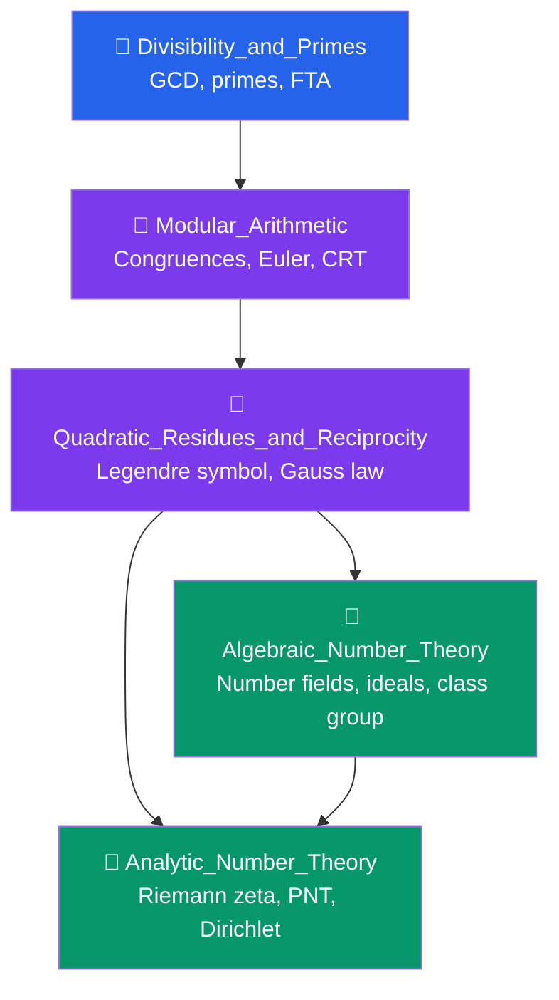

# 🔢 Number Theory — Map of Content

> [!abstract] Overview
> Number theory, the "queen of mathematics," studies the integers and their deep structure. This section spans from the foundational divisibility and prime numbers through the elegant machinery of modular arithmetic and quadratic reciprocity, up to the rich graduate-level theories — algebraic number theory (ideal factorization in number fields) and analytic number theory (prime distribution via complex analysis). Together these notes build from elementary school arithmetic to research-frontier mathematics.

---

## Learning Path

**Recommended order:** Start with [[Divisibility_and_Primes]] for the algorithmic foundation, then [[Modular_Arithmetic]] for the algebraic structure, then [[Quadratic_Residues_and_Reciprocity]] for its beautiful reciprocity law. Branch into [[Algebraic_Number_Theory]] (algebraic structures, ideal theory) or [[Analytic_Number_Theory]] (analysis applied to primes) according to your interests — both reward revisiting after the other.

---

## Notes in This Section

| Note | Difficulty | Core Ideas |
|------|-----------|------------|
| [[Divisibility_and_Primes]] | Intermediate | GCD, Euclidean algorithm, Bézout's identity, fundamental theorem of arithmetic, prime distribution |
| [[Modular_Arithmetic]] | Intermediate | Congruences, $\mathbb{Z}/n\mathbb{Z}$, Euler's theorem, Fermat's little theorem, Wilson's theorem, CRT |
| [[Quadratic_Residues_and_Reciprocity]] | Advanced | Legendre symbol, Euler's criterion, quadratic reciprocity law, Jacobi symbol, Gaussian integers |
| [[Algebraic_Number_Theory]] | Graduate | Number fields, ring of integers, Dedekind domains, ideal class group, class number, Stark-Heegner |
| [[Analytic_Number_Theory]] | Graduate | Multiplicative functions, Dirichlet series, Riemann zeta, PNT, Riemann hypothesis, Dirichlet theorem |

---

## Key Theorems at a Glance

**Fundamental Theorem of Arithmetic:** Every $n > 1$ is a unique product of primes.

**Bézout's Identity:** $\exists x, y \in \mathbb{Z}: ax + by = \gcd(a,b)$.

**Euler's Theorem:** $\gcd(a,n)=1 \Rightarrow a^{\varphi(n)} \equiv 1 \pmod{n}$.

**Chinese Remainder Theorem:** Pairwise coprime moduli give unique simultaneous solutions.

**Quadratic Reciprocity:** $\left(\dfrac{p}{q}\right)\left(\dfrac{q}{p}\right) = (-1)^{\frac{p-1}{2}\cdot\frac{q-1}{2}}$.

**Prime Number Theorem:** $\pi(x) \sim \dfrac{x}{\ln x}$ as $x \to \infty$.

---

## Connections to Other Vault Sections

- **Algebra** — Modular arithmetic connects to ring and field theory; $\mathbb{Z}/n\mathbb{Z}$ is a prototypical ring; $\mathbb{Z}_p$ is the canonical finite field
- **[[_MOC_Advanced_Topics]]** — Algebraic number theory uses [[Category_Theory]] language (functors on rings); [[Algebraic_Geometry]] over $\mathbb{Z}$ (arithmetic geometry) is the modern synthesis
- **Analysis** — Analytic number theory is complex analysis applied to primes; convergence of Dirichlet series; contour integration in the PNT proof
- **Cryptography** — RSA, Diffie-Hellman, elliptic curve crypto all rely directly on number theory

---

## Prerequisites

- Comfortable with proof by induction and proof by contradiction
- Basic algebra (groups, rings) helpful for the graduate notes
- Complex analysis (holomorphic functions, contour integrals) needed for analytic number theory

---

## Sources and Further Reading
- Hardy & Wright, *An Introduction to the Theory of Numbers* — classic comprehensive reference
- Ireland & Rosen, *A Classical Introduction to Modern Number Theory* — bridges elementary and algebraic
- Davenport, *Multiplicative Number Theory* — the analytic side
- Neukirch, *Algebraic Number Theory* — the definitive graduate text

#number-theory #moc #mathematics
