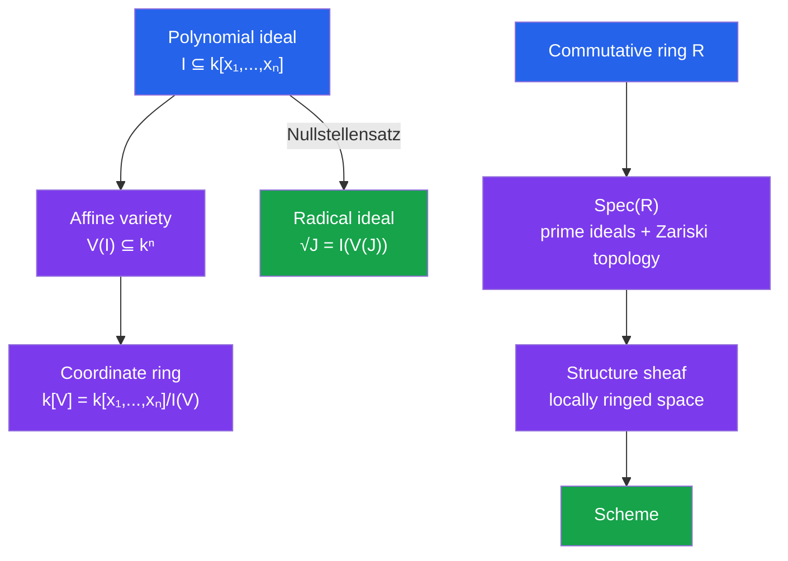

# 🎓 Algebraic Geometry

> [!abstract] TL;DR
> Algebraic geometry studies the geometry of solution sets of polynomial equations. Affine varieties are zero sets of polynomial ideals, governed by Hilbert's Nullstellensatz — a deep dictionary between geometry and algebra. Grothendieck's schemes vastly generalize this to work over any ring, enabling arithmetic geometry where number theory and geometry fuse. Elliptic curves, error-correcting codes, and string theory all live here.

## Intuition — analogy FIRST
A circle $x^2 + y^2 = 1$ is both a geometric object (a curve in the plane) and an algebraic object (solutions to a polynomial equation). Algebraic geometry makes this duality precise and powerful. The key insight: there is a perfect dictionary between geometric objects (varieties) and algebraic objects (ideals in polynomial rings). Grothendieck's revolution extended this dictionary to include "generalized spaces" — schemes — where geometry can be done over any ring, including $\mathbb{Z}$, giving a unified language for both classical geometry and number theory.

---

## How It Works

---

## Key Concepts

### Affine Varieties
Fix an algebraically closed field $k$ (e.g., $\mathbb{C}$ or $\overline{\mathbb{F}}_p$). The **affine $n$-space** is $\mathbb{A}^n = k^n$.

For an ideal $I \subseteq k[x_1, \ldots, x_n]$, the **affine variety** is:
$$V(I) = \{(a_1, \ldots, a_n) \in k^n : f(a_1, \ldots, a_n) = 0 \text{ for all } f \in I\}$$

**Examples:**
- $V(y - x^2) \subseteq \mathbb{A}^2$: a parabola
- $V(x^2 + y^2 - 1) \subseteq \mathbb{A}^2$: a circle (non-empty over $\mathbb{C}$ even if empty over $\mathbb{R}$)
- $V(xy) \subseteq \mathbb{A}^2$: union of the two coordinate axes (reducible variety)

### Zariski Topology
The **Zariski topology** on $\mathbb{A}^n$ has closed sets = affine varieties. Open sets are complements of varieties.

This topology is very coarse: in $\mathbb{A}^1$, the only closed sets are finite subsets and all of $\mathbb{A}^1$. It is $T_1$ but not Hausdorff.

The operations:
- $V(I) \cup V(J) = V(I \cap J) = V(IJ)$
- $V(I) \cap V(J) = V(I + J)$
- $V(I) \subseteq V(J) \iff J \subseteq \sqrt{I}$

### Hilbert's Nullstellensatz
Over an algebraically closed field $k$:

**Weak form:** For any proper ideal $I \subsetneq k[x_1,\ldots,x_n]$, $V(I) \neq \emptyset$.

**Strong form (the key dictionary):** For any ideal $J \subseteq k[x_1,\ldots,x_n]$:
$$I(V(J)) = \sqrt{J}$$
where $I(S) = \{f \in k[\mathbf{x}] : f(P) = 0 \text{ for all } P \in S\}$ and $\sqrt{J} = \{f : f^m \in J \text{ for some } m\}$.

**Consequence:** There is an inclusion-reversing bijection:
$$\{\text{radical ideals in } k[\mathbf{x}]\} \longleftrightarrow \{\text{affine varieties in } \mathbb{A}^n\}$$
$$\{\text{prime ideals}\} \longleftrightarrow \{\text{irreducible varieties}\}$$
$$\{\text{maximal ideals}\} \longleftrightarrow \{\text{points}\}$$

### Coordinate Ring
The **coordinate ring** of $V = V(I)$ is:
$$k[V] = k[x_1, \ldots, x_n] / I(V)$$
This is the ring of regular functions (polynomial functions) on $V$. The geometric properties of $V$ translate to algebraic properties of $k[V]$.

### Morphisms of Varieties
A **morphism** $\phi: V \to W$ of affine varieties is a map given by polynomials: $(a_1,\ldots,a_n) \mapsto (f_1(\mathbf{a}), \ldots, f_m(\mathbf{a}))$ where each $f_i \in k[x_1,\ldots,x_n]$ and the image lies in $W$.

Morphisms correspond to ring homomorphisms $\phi^*: k[W] \to k[V]$ (going backwards!). The category of affine varieties is **opposite** to the category of finitely generated reduced $k$-algebras.

### Projective Space and Projective Varieties
**Projective $n$-space** $\mathbb{P}^n = (k^{n+1} \setminus \{0\}) / k^*$: equivalence classes of nonzero vectors up to scaling. Points are lines through the origin in $\mathbb{A}^{n+1}$.

A **projective variety** $V \subseteq \mathbb{P}^n$ is the zero set of a **homogeneous** ideal in $k[x_0,\ldots,x_n]$.

Projective varieties are **compact** (in the classical topology for $k=\mathbb{C}$) — crucially better-behaved than affine varieties. Every projective variety over $\mathbb{C}$ is a compact complex manifold (if smooth).

### Smoothness and Dimension
A point $P \in V$ is **smooth** if the Jacobian matrix $(\partial f_i/\partial x_j)(P)$ has expected rank. Otherwise $P$ is **singular**.

The **dimension** of $V$ = Krull dimension of $k[V]$ = length of longest chain of irreducible subvarieties.

**Tangent space** at smooth $P$: the affine subspace $T_PV = \ker(J_P)$ in $\mathbb{A}^n$.

### Schemes (Grothendieck, 1960s)
For a commutative ring $R$, the **spectrum** $\operatorname{Spec}(R)$ is:
- **Underlying set:** prime ideals of $R$
- **Topology:** Zariski topology (closed sets $= V(I) = \{\mathfrak{p} : I \subseteq \mathfrak{p}\}$)
- **Structure sheaf** $\mathcal{O}$: $\mathcal{O}(D(f)) = R_f$ (localization)

A **scheme** is a locally ringed space $(X, \mathcal{O}_X)$ locally isomorphic to $\operatorname{Spec}(R)$ for some ring $R$.

**Power of schemes:**
- Allows nilpotents (key for intersection multiplicities)
- Works over $\mathbb{Z}$ (arithmetic geometry)
- $\operatorname{Spec}(\mathbb{Z})$: "arithmetic surface" — primes $p$ are closed points, $(0)$ is the generic point
- Elliptic curves can be defined over $\operatorname{Spec}(\mathbb{Z}[1/N])$, simultaneously doing geometry over $\mathbb{Q}$ and $\mathbb{F}_p$

### Cohomology
To go beyond local properties, one needs cohomology theories:
- **Sheaf cohomology** $H^i(X, \mathcal{F})$: global sections of a sheaf
- **Étale cohomology** (Grothendieck): $\ell$-adic cohomology over finite fields; satisfies Weil conjectures
- **de Rham cohomology**: algebraic differential forms; agrees with classical for smooth varieties over $\mathbb{C}$

---

## Real-World Notes
- **Elliptic curve cryptography (ECC):** An elliptic curve $y^2 = x^3 + ax + b$ over $\mathbb{F}_p$ is an algebraic variety; its group law (adding points) underlies ECC and Bitcoin's secp256k1.
- **Algebraic geometry codes (Goppa codes):** Error-correcting codes from curves over $\mathbb{F}_q$; the Tsfasman-Vladut-Zink codes beat the Gilbert-Varshamov bound using modular curves.
- **String theory:** Compactifications of extra dimensions use Calabi-Yau manifolds, which are complex algebraic varieties with trivial canonical bundle; mirror symmetry is a deep algebraic geometry phenomenon.
- **Wiles's proof of FLT:** Centrally uses modular curves, elliptic curves over $\mathbb{Q}$, and Galois representations — all objects of algebraic geometry.

---

## Common Pitfalls
- **Algebraic closure is essential for Nullstellensatz:** Over $\mathbb{R}$, $V(x^2+1) = \emptyset$ but the ideal $(x^2+1)$ is proper — Nullstellensatz fails over non-algebraically-closed fields.
- **Reduced vs non-reduced:** The schemes $\operatorname{Spec}(k[x]/(x^2))$ and $\operatorname{Spec}(k[x]/(x))$ both have one geometric point, but the former has nilpotents and remembers "tangent information."
- **Affine $\neq$ projective:** Affine varieties are not compact; results like Bezout's theorem require projective setting.
- **Sheaf condition is subtle:** A presheaf on $\operatorname{Spec}(R)$ is a sheaf iff it satisfies gluing — not all presheaves are sheaves.

---

## Related Concepts
- [[_MOC_Advanced_Topics|↑ Advanced Topics MOC]]
- [[Category_Theory]] — schemes form a category; morphisms of schemes are morphisms of locally ringed spaces; sheaves use the categorical notion of limit
- [[Differential_Geometry]] — smooth algebraic varieties are complex manifolds; GAGA theorem links algebraic and analytic geometry
- [[Algebraic_Number_Theory]] — arithmetic geometry = algebraic geometry over $\mathbb{Z}$; ideal theory in number fields lives in $\operatorname{Spec}(\mathcal{O}_K)$

---

## Review Questions
1. Prove that the Zariski topology on $\mathbb{A}^1$ is not Hausdorff. What are the irreducible closed subsets?
2. Use the Nullstellensatz to show that maximal ideals of $k[x_1,\ldots,x_n]$ (with $k$ algebraically closed) are exactly the ideals $(x_1 - a_1, \ldots, x_n - a_n)$.
3. What is the coordinate ring of $V(y^2 - x^3) \subseteq \mathbb{A}^2$? Is it a domain? Is it integrally closed?
4. Explain why the group law on an elliptic curve (geometric: chord-and-tangent) makes it an abelian variety. What axiom of group theory corresponds to the need for a "point at infinity" in $\mathbb{P}^2$?

---

## Sources
- Hartshorne, *Algebraic Geometry*, Ch. 1–3
- Vakil, *The Rising Sea: Foundations of Algebraic Geometry* (notes, freely available)
- Shafarevich, *Basic Algebraic Geometry*, Vol. 1–2

#algebraic-geometry #varieties #schemes #nullstellensatz #zariski-topology #elliptic-curves #grothendieck
