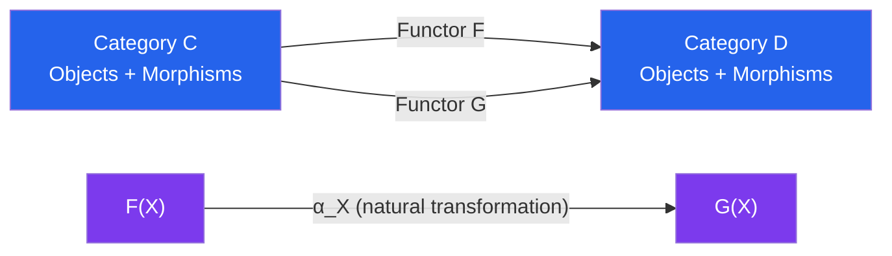

# 🎓 Category Theory

> [!abstract] TL;DR
> Category theory is mathematics of mathematics — it studies abstract structures by focusing entirely on the *relationships between objects* rather than their internal constitution. A category is objects + arrows + composition; functors map between categories; natural transformations map between functors. The Yoneda lemma reveals that an object is completely determined by how other objects relate to it — a profound "outside-in" philosophy that unifies all of mathematics.

## Intuition — analogy FIRST
Imagine you're a geographer who never looks inside buildings — you only study roads between them. Category theory is exactly this: you forget what objects *are* and only remember how morphisms *connect* them. A functor is a map between city-networks that preserves road structure. A natural transformation is a system of shuttles between two networks. The Yoneda lemma says: a building is completely identified by all the roads leading to it. This abstraction is so powerful that it captures groups, rings, topological spaces, and databases all in one language.

---

## How It Works

---

## Key Concepts

### Categories
A **category** $\mathcal{C}$ consists of:
- A collection of **objects** $\operatorname{ob}(\mathcal{C})$
- For each pair $X, Y$, a collection of **morphisms** $\operatorname{Hom}(X, Y)$
- **Composition:** $f: X \to Y$, $g: Y \to Z$ gives $g \circ f: X \to Z$
- **Identity:** $\operatorname{id}_X: X \to X$ for each object $X$

Satisfying: composition is **associative** and identities are **units**.

**Examples:**
- $\mathbf{Set}$: sets and functions
- $\mathbf{Grp}$: groups and group homomorphisms
- $\mathbf{Top}$: topological spaces and continuous maps
- $\mathbf{Vect}_k$: $k$-vector spaces and linear maps
- Any **preorder** $(P, \leq)$: objects = elements, unique morphism $x \to y$ iff $x \leq y$
- Any **monoid** $M$: one object, morphisms = elements, composition = multiplication

### Functors
A **functor** $F: \mathcal{C} \to \mathcal{D}$ assigns to each object $X \in \mathcal{C}$ an object $F(X) \in \mathcal{D}$ and to each morphism $f: X \to Y$ a morphism $F(f): F(X) \to F(Y)$, preserving composition and identities:
$$F(g \circ f) = F(g) \circ F(f), \quad F(\operatorname{id}_X) = \operatorname{id}_{F(X)}$$

**Covariant** (as above) vs **contravariant** ($F: \mathcal{C}^{\operatorname{op}} \to \mathcal{D}$, reverses arrows).

**Examples:**
- Forgetful functor $\mathbf{Grp} \to \mathbf{Set}$: forget group structure
- Free functor $\mathbf{Set} \to \mathbf{Grp}$: free group on a set
- $\pi_1: \mathbf{Top}_* \to \mathbf{Grp}$: fundamental group is a functor
- Representable functor $\operatorname{Hom}(X, -): \mathcal{C} \to \mathbf{Set}$

### Natural Transformations
A **natural transformation** $\alpha: F \Rightarrow G$ between functors $F, G: \mathcal{C} \to \mathcal{D}$ assigns to each $X \in \mathcal{C}$ a morphism $\alpha_X: F(X) \to G(X)$ such that for every $f: X \to Y$:
$$G(f) \circ \alpha_X = \alpha_Y \circ F(f) \quad \text{(naturality square commutes)}$$

Natural transformations are the "morphisms between functors." This gives categories of functors $[\mathcal{C}, \mathcal{D}]$.

### Yoneda Lemma
For any $X \in \mathcal{C}$ and any functor $F: \mathcal{C} \to \mathbf{Set}$:
$$\operatorname{Nat}(\operatorname{Hom}(X, -), F) \cong F(X)$$
Natural transformations from the representable functor $\operatorname{Hom}(X, -)$ to $F$ are in bijection with elements of $F(X)$.

**Corollary (Yoneda embedding):** The functor $\mathcal{C} \to [\mathcal{C}^{\operatorname{op}}, \mathbf{Set}]$, $X \mapsto \operatorname{Hom}(-, X)$, is **fully faithful**. An object is determined up to unique isomorphism by its morphisms. This is the "representability" philosophy: understand $X$ through its interactions.

### Universal Properties
A construction satisfies a **universal property** if it is the unique solution (up to unique isomorphism) to a certain mapping problem. Examples:
- **Product** $X \times Y$: object with projections $\pi_1, \pi_2$ such that every cone factors uniquely through it
- **Coproduct** $X \sqcup Y$: universal object with injections
- **Limit** and **colimit**: generalize products/coproducts to diagrams

Universal properties characterize objects without specifying internals — Yoneda lemma is the foundation.

### Adjunctions
$F \dashv G$ ($F$ is left adjoint to $G$) if there is a natural isomorphism:
$$\operatorname{Hom}_{\mathcal{D}}(F(X), Y) \cong \operatorname{Hom}_{\mathcal{C}}(X, G(Y))$$

**Examples:**
- Free $\dashv$ Forgetful: $\operatorname{Hom}_{\mathbf{Grp}}(F(S), G) \cong \operatorname{Hom}_{\mathbf{Set}}(S, U(G))$
- Tensor $\dashv$ Hom: $\operatorname{Hom}(A \otimes B, C) \cong \operatorname{Hom}(A, \operatorname{Hom}(B, C))$ (currying in programming)
- $\Sigma \dashv$ pullback $\dashv \Pi$ in dependent type theory

Adjunctions are ubiquitous — Mac Lane: "adjoint functors arise everywhere."

### Monads
A **monad** on $\mathcal{C}$ is a triple $(T, \eta, \mu)$ where $T: \mathcal{C} \to \mathcal{C}$ is a functor, $\eta: \operatorname{Id} \Rightarrow T$ (unit), $\mu: T^2 \Rightarrow T$ (multiplication), satisfying associativity and unit laws.

Every adjunction $F \dashv G$ gives a monad $T = G \circ F$.

**In Haskell:** `Monad` is exactly this — `return` = $\eta$, `>>=` encodes $\mu$. List monad, Maybe monad, IO monad are all monads in the categorical sense.

### Abelian Categories
A category is **abelian** if: it has a zero object, all finite products and coproducts, kernels and cokernels, and every mono is a kernel, every epi is a cokernel.

**Examples:** $\mathbf{Ab}$ (abelian groups), $R$-$\mathbf{Mod}$ (modules over ring $R$), $\mathbf{Vect}_k$.

In an abelian category, **exact sequences** make sense: $0 \to A \to B \to C \to 0$ is exact iff $A \to B$ is a kernel of $B \to C$. This is the setting for **homological algebra** (Ext, Tor, derived functors).

---

## Real-World Notes
- **Haskell's type system:** Functors, applicatives, and monads in Haskell are directly the categorical concepts — the language was designed around this.
- **Database theory:** A database schema is a category; a database instance is a functor into $\mathbf{Set}$; data migration is a functor between schemas (Spivak's categorical databases).
- **Quantum mechanics:** Monoidal categories describe quantum processes; symmetric monoidal categories model quantum circuits; the ZX-calculus is a graphical language for quantum computation.
- **Logic and type theory:** By the Curry-Howard-Lambek correspondence, propositions = types = objects, proofs = programs = morphisms. Dependent type theories correspond to locally cartesian closed categories.

---

## Common Pitfalls
- **Category $\neq$ set with structure:** Categories have *two* kinds of things (objects and morphisms); a monoid has *one* kind (elements). Don't conflate them.
- **Natural transformation naturality is a condition, not just assignment:** The square $G(f) \circ \alpha_X = \alpha_Y \circ F(f)$ must hold for *every* morphism $f$ — this is often the hard part to verify.
- **Yoneda: the bijection is natural in both $X$ and $F$:** Fixing one and varying the other still gives naturality; this double naturality is what makes the lemma powerful.
- **Size issues:** $\operatorname{ob}(\mathcal{C})$ may be a proper class (as in $\mathbf{Set}$); use "locally small" carefully; $[\mathcal{C}, \mathcal{D}]$ may require Grothendieck universes.

---

## Related Concepts
- [[_MOC_Advanced_Topics|↑ Advanced Topics MOC]]
- [[Algebraic_Geometry]] — schemes are the objects of a category; étale cohomology uses derived categories
- [[Representation_Theory]] — representations of $G$ form an abelian category $\operatorname{Rep}(G)$
- [[Mathematical_Logic_and_Set_Theory]] — categorical logic; toposes as generalized universes of sets

---

## Review Questions
1. Verify that the fundamental group $\pi_1$ is a functor from pointed topological spaces to groups.
2. State the Yoneda lemma and use it to show that if $\operatorname{Hom}(X,-) \cong \operatorname{Hom}(Y,-)$ naturally, then $X \cong Y$.
3. What is the monad corresponding to the free-forgetful adjunction between $\mathbf{Set}$ and $\mathbf{Mon}$ (monoids)? What does the Kleisli category look like?
4. Prove that right adjoints preserve limits (and left adjoints preserve colimits).

---

## Sources
- Mac Lane, *Categories for the Working Mathematician*, Ch. 1–5
- Riehl, *Category Theory in Context*, Ch. 1–4
- Awodey, *Category Theory*, Ch. 1–8

#category-theory #functors #natural-transformations #yoneda-lemma #adjunctions #monads #abelian-categories
