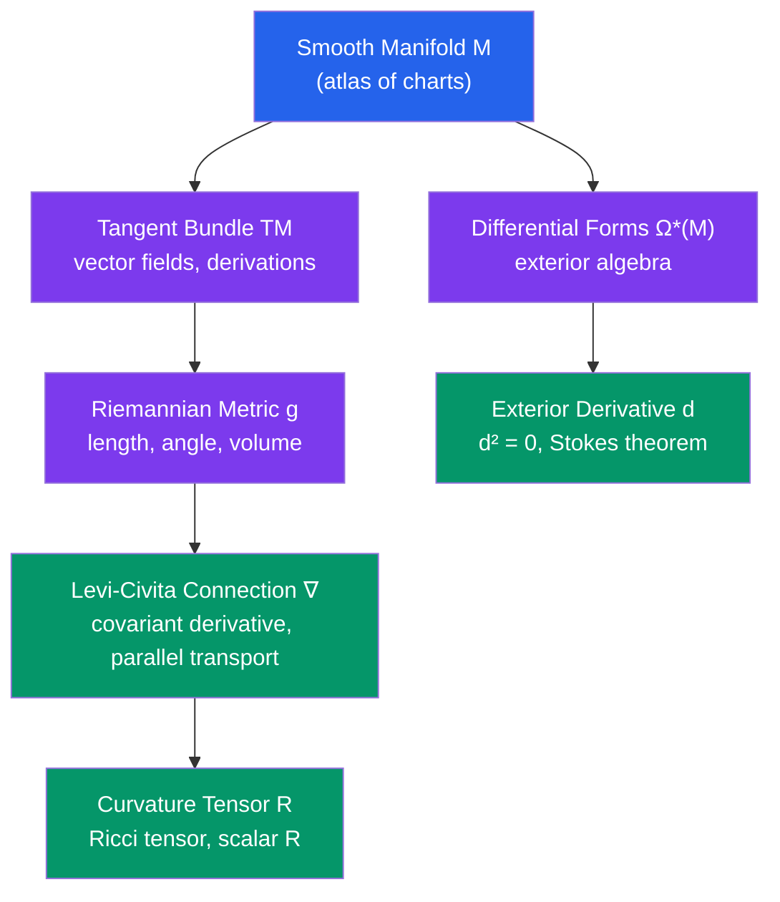

# 🎓 Differential Geometry

> [!abstract] TL;DR
> Differential geometry is the study of smooth manifolds — spaces that locally look like $\mathbb{R}^n$ but globally can be curved and topologically rich. Riemannian geometry adds a metric (notion of length) to a manifold, enabling curvature, geodesics, and parallel transport. The master theorem is Stokes' theorem $\int_M d\omega = \int_{\partial M} \omega$, unifying all fundamental theorems of calculus. Applications range from general relativity (spacetime as a 4-manifold) to robotics.

## Intuition — analogy FIRST
The surface of the Earth is a 2-dimensional manifold: locally it looks flat (your neighborhood looks like a plane), but globally it's a sphere. A Riemannian metric is like a map scale that varies across the surface — it tells you how to measure distances. Curvature is the feature that makes triangles on a sphere have angles summing to more than 180°. Differential forms generalize integrands: $\int_C f \, ds$ and $\iint_S \mathbf{F} \cdot d\mathbf{A}$ are all instances of $\int_M \omega$ for a differential form $\omega$.

---

## How It Works

---

## Key Concepts

### Smooth Manifolds
An $n$-dimensional **smooth manifold** $M$ is a topological space covered by an **atlas** of charts $\{(U_\alpha, \varphi_\alpha)\}$ where:
- $\{U_\alpha\}$ is an open cover of $M$
- $\varphi_\alpha: U_\alpha \to V_\alpha \subseteq \mathbb{R}^n$ are homeomorphisms
- **Transition maps** $\varphi_\beta \circ \varphi_\alpha^{-1}$ are $C^\infty$ (smooth)

**Examples:**
- $\mathbb{R}^n$: trivial atlas
- $S^n$: $n$-sphere (stereographic projection gives 2-chart atlas)
- $T^2 = S^1 \times S^1$: torus
- $\mathbb{RP}^n$: real projective space
- $\operatorname{GL}_n(\mathbb{R})$, $\operatorname{SO}(n)$, $\operatorname{SU}(n)$: **Lie groups** — manifolds with compatible group structure

### Tangent Space and Tangent Bundle
At each $p \in M$, the **tangent space** $T_pM$ is the space of **derivations** on smooth functions at $p$ — linear maps $v: C^\infty(M) \to \mathbb{R}$ satisfying $v(fg) = f(p)v(g) + g(p)v(f)$.

In local coordinates $(x^1,\ldots,x^n)$, $T_pM$ has basis $\left\{\dfrac{\partial}{\partial x^1}\bigg|_p, \ldots, \dfrac{\partial}{\partial x^n}\bigg|_p\right\}$.

The **tangent bundle** $TM = \bigsqcup_{p \in M} T_pM$ is itself a $2n$-dimensional manifold.

A **vector field** is a smooth section $X: M \to TM$ (assigns a tangent vector to each point). In coordinates: $X = \sum_i X^i \frac{\partial}{\partial x^i}$.

### Differential Forms
A **$k$-form** $\omega \in \Omega^k(M)$ is a smooth section of $\bigwedge^k T^*M$ — assigns to each point an alternating multilinear map on $k$ tangent vectors.

- 0-forms: smooth functions
- 1-forms: $\omega = \sum_i f_i \, dx^i$ (dual to vector fields)
- 2-forms: $\omega = \sum_{i<j} f_{ij} \, dx^i \wedge dx^j$

**Exterior derivative** $d: \Omega^k \to \Omega^{k+1}$: in coordinates $d(\sum f_I dx^I) = \sum_j \frac{\partial f_I}{\partial x^j} dx^j \wedge dx^I$.

**Key property:** $d^2 = 0$ (so $\operatorname{im}(d) \subseteq \ker(d)$, giving de Rham cohomology).

**Pullback:** $F^*\omega$ pulls a form on $N$ back to $M$ along $F: M \to N$.

### Stokes' Theorem
For a compact oriented $n$-manifold $M$ with boundary $\partial M$, and any $(n-1)$-form $\omega$:
$$\int_M d\omega = \int_{\partial M} \omega$$

This single theorem encompasses:
- **Fundamental theorem of calculus:** $\int_a^b f' \, dx = f(b) - f(a)$
- **Green's theorem:** $\iint_D \left(\frac{\partial Q}{\partial x} - \frac{\partial P}{\partial y}\right) = \oint_{\partial D} P\,dx + Q\,dy$
- **Stokes' theorem (classical):** $\iint_S (\nabla \times \mathbf{F}) \cdot d\mathbf{S} = \oint_{\partial S} \mathbf{F} \cdot d\mathbf{r}$
- **Divergence theorem:** $\iiint_V \nabla \cdot \mathbf{F} \, dV = \oiint_{\partial V} \mathbf{F} \cdot d\mathbf{S}$

### Riemannian Metrics
A **Riemannian metric** $g$ on $M$ assigns to each $p$ an inner product $g_p: T_pM \times T_pM \to \mathbb{R}$ that varies smoothly. In local coordinates: $g = \sum_{i,j} g_{ij} \, dx^i \otimes dx^j$ where $(g_{ij})$ is a smooth positive definite symmetric matrix.

The metric defines:
- **Length:** $\ell(\gamma) = \int_a^b \sqrt{g_{\gamma(t)}(\dot\gamma, \dot\gamma)} \, dt$
- **Distance:** $d(p,q) = \inf_\gamma \ell(\gamma)$ over paths from $p$ to $q$
- **Volume form:** $\sqrt{\det(g_{ij})} \, dx^1 \wedge \cdots \wedge dx^n$

### Levi-Civita Connection
The **unique** connection $\nabla$ on $(M,g)$ that is:
- **Metric compatible:** $\nabla g = 0$ (parallel transport preserves inner products)
- **Torsion-free:** $\nabla_X Y - \nabla_Y X = [X,Y]$

**Christoffel symbols:** $\Gamma^k_{ij} = \frac{1}{2}g^{kl}\left(\partial_i g_{jl} + \partial_j g_{il} - \partial_l g_{ij}\right)$

**Geodesics:** curves $\gamma(t)$ with $\nabla_{\dot\gamma} \dot\gamma = 0$, i.e., $\ddot\gamma^k + \Gamma^k_{ij} \dot\gamma^i \dot\gamma^j = 0$. Locally distance-minimizing.

### Curvature
The **Riemann curvature tensor:**
$$R(X,Y)Z = \nabla_X \nabla_Y Z - \nabla_Y \nabla_X Z - \nabla_{[X,Y]}Z$$
In coordinates: $R^i{}_{jkl}$. Measures failure of parallel transport around a loop.

**Ricci tensor:** $R_{ij} = R^k{}_{ikj}$ (contraction). Appears in Einstein's equations.

**Scalar curvature:** $R = g^{ij}R_{ij}$ (full contraction). Single number at each point.

**Sectional curvature $K$:** curvature of 2D planes in $T_pM$; $K > 0$ (sphere), $K = 0$ (flat), $K < 0$ (hyperbolic).

### Gauss-Bonnet Theorem
For a compact oriented Riemannian 2-manifold $(M, g)$:
$$\int_M K \, dA = 2\pi \chi(M)$$
where $K$ is the Gaussian curvature and $\chi(M)$ is the Euler characteristic.

This bridges **differential geometry** (curvature, an analytic quantity) and **topology** ($\chi$, a topological invariant). For a sphere: $\int K \, dA = 4\pi = 2\pi \cdot 2$. For a torus: $\int K \, dA = 0 = 2\pi \cdot 0$.

---

## Real-World Notes
- **General relativity:** Spacetime is a 4-dimensional Lorentzian manifold; Einstein's field equations $G_{\mu\nu} + \Lambda g_{\mu\nu} = 8\pi T_{\mu\nu}$ relate the Ricci tensor (curvature) to the stress-energy tensor (matter). Geodesics are paths of free-falling objects.
- **Robotics and motion planning:** Configuration space of a robot is a manifold; geodesics are optimal motion paths; topology of configuration space determines feasibility of tasks.
- **Computer vision and shape analysis:** Shape spaces (spaces of surfaces, curves) are infinite-dimensional manifolds; Riemannian metrics on shape spaces enable statistical shape analysis (morphometrics).
- **Machine learning:** The geometry of neural network loss landscapes uses concepts from differential geometry; information geometry treats probability distributions as a Riemannian manifold (Fisher metric).

---

## Common Pitfalls
- **Charts are not the manifold:** Local coordinates depend on the choice of chart; geometric objects (tensors) must transform correctly under coordinate changes.
- **$d^2 = 0$ is a theorem, not a definition:** It follows from commutativity of mixed partial derivatives and antisymmetry of wedge product.
- **Geodesic $\neq$ shortest path globally:** Geodesics are locally length-minimizing; globally, two points may have multiple geodesics (e.g., two antipodal points on a sphere).
- **Gauss-Bonnet requires orientability:** Non-orientable surfaces (Möbius band, Klein bottle) require more care.

---

## Related Concepts
- [[_MOC_Advanced_Topics|↑ Advanced Topics MOC]]
- [[Algebraic_Geometry]] — smooth algebraic varieties over $\mathbb{C}$ are complex manifolds; GAGA theorem
- [[Representation_Theory]] — Lie groups are the central examples; Lie algebras arise from tangent spaces at identity
- [[Category_Theory]] — smooth manifolds and smooth maps form a category; differential forms are a contravariant functor

---

## Review Questions
1. Show that the 2-sphere $S^2$ cannot be covered by a single chart. What is the minimum number of charts needed?
2. Compute the Gaussian curvature of a 2-sphere of radius $r$ using the Gauss-Bonnet theorem.
3. Write out the geodesic equations for the round metric on $S^2$ (standard embedding) and verify that great circles are geodesics.
4. Derive Green's theorem from the general Stokes' theorem by identifying the appropriate manifold $M$, boundary $\partial M$, and form $\omega$.

---

## Sources
- Lee, *Introduction to Smooth Manifolds*, Ch. 1–16
- do Carmo, *Riemannian Geometry*, Ch. 1–8
- Spivak, *A Comprehensive Introduction to Differential Geometry*, Vol. 1–3

#differential-geometry #manifolds #riemannian-geometry #stokes-theorem #curvature #tangent-bundle #differential-forms
