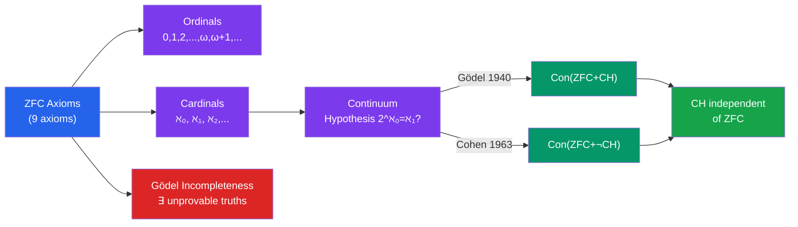

# 🎓 Mathematical Logic and Set Theory

> [!abstract] TL;DR
> Mathematical logic studies the foundations of mathematical reasoning itself: what can be proved, what is true, and the limits of formal systems. ZFC (Zermelo-Fraenkel + Choice) axioms provide the standard foundation for all of mathematics. Gödel's incompleteness theorems (1931) shattered the dream of a complete, consistent foundation: any sufficiently powerful formal system contains true statements it cannot prove. The Continuum Hypothesis — whether there is a set strictly between $\mathbb{N}$ and $\mathbb{R}$ in size — is famously independent of ZFC.

## Intuition — analogy FIRST
Imagine trying to build a perfect rulebook for mathematics — axioms so complete that every mathematical truth follows from them. Gödel showed this is impossible: any honest rulebook either leaves some truths unprovable, or is secretly inconsistent. This is like a language that cannot fully describe itself, or a Turing machine that cannot predict its own behavior. Set theory (ZFC) is the best rulebook we have — powerful enough for all of ordinary mathematics, yet unable to resolve certain deep questions (like the Continuum Hypothesis) one way or the other.

---

## How It Works

---

## Key Concepts

### Formal Systems
A **formal system** consists of:
- A **language** $\mathcal{L}$: symbols, well-formed formulas
- **Axioms**: distinguished sentences
- **Rules of inference**: how to derive new sentences from old ones

**Provability** $T \vdash \phi$: $\phi$ is derivable from $T$ in finitely many steps.
**Truth** $\mathfrak{M} \models \phi$: $\phi$ holds in model $\mathfrak{M}$.

**Completeness theorem (Gödel, 1929):** $T \vdash \phi \iff T \models \phi$ (for first-order logic). Provability and semantic truth coincide — but this is for *valid* sentences, not for sentences independent of $T$.

**Soundness:** If $T \vdash \phi$ then $T \models \phi$ (every proof is a valid argument). Completeness + soundness: proof theory and model theory agree for first-order logic.

### ZFC Axioms
The **Zermelo-Fraenkel with Choice** axioms (standard foundation of mathematics):

1. **Extensionality:** $\forall x \forall y [(\forall z \, z \in x \leftrightarrow z \in y) \to x = y]$ — sets determined by elements
2. **Empty Set:** $\exists x \, \forall y \, y \notin x$ — $\emptyset$ exists
3. **Pairing:** $\exists z \, z = \{x, y\}$ for any $x, y$
4. **Union:** $\exists z \, z = \bigcup x$ for any $x$
5. **Power Set:** $\exists z \, z = \mathcal{P}(x)$ for any $x$
6. **Infinity:** $\exists x \, [\emptyset \in x \wedge \forall y \in x \, (y \cup \{y\} \in x)]$ — $\omega = \mathbb{N}$ exists
7. **Replacement (Schema):** image of a set under a function is a set
8. **Foundation (Regularity):** every nonempty set has a $\in$-minimal element (no infinite descending chains)
9. **Choice (AC):** every family of nonempty sets has a choice function

### Axiom of Choice and Equivalents
**Axiom of Choice (AC):** For any collection $\{A_i\}_{i \in I}$ of nonempty sets, $\exists$ a choice function $f$ with $f(i) \in A_i$ for all $i$.

**Equivalent formulations:**
- **Zorn's Lemma:** Every nonempty partially ordered set in which every chain has an upper bound contains a maximal element
- **Well-Ordering Theorem:** Every set can be well-ordered
- **Tychonoff's theorem:** Arbitrary products of compact spaces are compact
- **Basis theorem:** Every vector space has a Hamel basis

AC is **independent** of ZF (consistent with and without it). It has "strange" consequences: Banach-Tarski paradox (decompose a ball into finitely many pieces, reassemble into two balls of the original size).

### Ordinals
An **ordinal** is a transitive set well-ordered by $\in$.

The ordinals in order:
$$0 = \emptyset, \quad 1 = \{0\}, \quad 2 = \{0,1\}, \quad \ldots, \quad n, \quad \ldots$$
$$\omega = \{0, 1, 2, \ldots\} = \mathbb{N}$$
$$\omega + 1 = \{0,1,2,\ldots,\omega\}, \quad \omega + 2, \quad \ldots$$
$$\omega \cdot 2, \quad \omega^2, \quad \omega^\omega, \quad \omega^{\omega^\omega}, \quad \ldots, \quad \varepsilon_0$$

**Successor ordinal:** $\alpha + 1 = \alpha \cup \{\alpha\}$. **Limit ordinal:** no immediate predecessor (e.g., $\omega$, $\omega \cdot 2$).

Ordinals measure *order types* of well-ordered sets. Transfinite induction and recursion work over all ordinals.

### Cardinals
Two sets have the same **cardinality** if there is a bijection between them.

**Cantor's theorem:** $|A| < |\mathcal{P}(A)|$ for any set $A$ — there is no largest cardinality.

The **aleph numbers** $\aleph_0 < \aleph_1 < \aleph_2 < \ldots$ are the infinite cardinals in order (under AC, every set is well-orderable, so every infinite cardinal is some $\aleph_\alpha$).

- $\aleph_0 = |\mathbb{N}|$ (countable infinity)
- $\aleph_1 = $ smallest uncountable cardinal
- $|\mathbb{R}| = |\mathcal{P}(\mathbb{N})| = 2^{\aleph_0}$

### Continuum Hypothesis
**CH:** $2^{\aleph_0} = \aleph_1$ — there is no set with cardinality strictly between $\mathbb{N}$ and $\mathbb{R}$.

**Generalized CH (GCH):** $2^{\aleph_\alpha} = \aleph_{\alpha+1}$ for all $\alpha$.

**Independence of CH:**
- **Gödel (1940):** Constructed the **constructible universe** $L$ — the smallest model of ZF — and showed $\operatorname{Con}(\mathrm{ZF}) \Rightarrow \operatorname{Con}(\mathrm{ZFC} + \mathrm{GCH})$. So CH cannot be disproved from ZFC.
- **Cohen (1963):** Invented **forcing** — a method to extend a model of ZFC to a larger model where CH fails. Showed $\operatorname{Con}(\mathrm{ZFC}) \Rightarrow \operatorname{Con}(\mathrm{ZFC} + \neg\mathrm{CH})$.

Therefore **CH is independent of ZFC**: neither CH nor $\neg$CH follows from ZFC (assuming ZFC is consistent).

### Gödel's Incompleteness Theorems
Let $T$ be a consistent formal system extending **Peano Arithmetic (PA)** (or any sufficiently strong system).

**First Incompleteness Theorem (1931):** There exists a sentence $G_T$ (the "Gödel sentence") such that:
- $T \nvdash G_T$ (not provable in $T$)
- $T \nvdash \neg G_T$ (not refutable in $T$)
- $G_T$ is **true** in the standard model $\mathbb{N}$

The Gödel sentence $G_T$ essentially says "I am not provable in $T$."

**Second Incompleteness Theorem:** $T \nvdash \operatorname{Con}(T)$ — a consistent system cannot prove its own consistency.

**Proof sketch (first theorem):** Gödel **numbering**: encode formulas/proofs as natural numbers. Define a predicate $\operatorname{Proof}(m, n)$ = "m is a proof of formula n." The sentence $G = \neg \exists m \, \operatorname{Proof}(m, \ulcorner G \urcorner)$ is self-referential. If $T \vdash G$, then $G$ is false (contradiction with soundness). If $T \vdash \neg G$, then $G$ is provable (contradiction). So $T$ proves neither.

### Model Theory
A **model** $\mathfrak{M}$ of a theory $T$ is a structure satisfying all axioms of $T$.

**Löwenheim-Skolem theorem:** Any consistent first-order theory with an infinite model has a countable model ("Skolem's paradox": ZFC has a countable model even though it "proves" uncountable sets exist — they are uncountable from the model's internal view, not externally).

**Compactness theorem:** $T$ has a model iff every finite subset of $T$ has a model. Used to construct non-standard models (e.g., non-standard arithmetic with infinitely large numbers).

### Computability
**Turing machines** provide a formal model of computation. The **halting problem** — given a program $P$ and input $x$, does $P$ halt on $x$? — is **undecidable** (Turing, 1936).

**Church-Turing thesis:** Every "effectively computable" function is Turing-computable.

The undecidability of the halting problem connects directly to Gödel: the Gödel sentence can be interpreted as a statement about the non-termination of a certain computation.

---

## Real-World Notes
- **Automated theorem provers:** Lean 4, Coq, and Isabelle implement formal proof systems based on dependent type theory (CIC/HoTT); the **Lean Mathlib** library has $\approx 150$k formalized theorems.
- **Limits of computation:** Undecidability (halting problem, Hilbert's 10th problem: no algorithm for Diophantine equations) and incompleteness bound what programs can compute or verify.
- **Set-theoretic forcing in computer science:** Forcing techniques appear in semantics (sheaf models, realizability models) and have inspired techniques in proof theory.
- **Large cardinal axioms:** Mathematicians study extensions of ZFC by large cardinal axioms (inaccessibles, measurable cardinals) to decide set-theoretic independence results — an active research area.

---

## Common Pitfalls
- **Gödel's theorem applies to formal systems, not informal mathematics:** Mathematicians freely use intuition and can "see" the truth of $G_T$; the theorem limits formal mechanical derivation.
- **"ZFC is consistent" is an external statement:** ZFC cannot prove its own consistency (by second incompleteness). This is not a paradox — it is expected.
- **Countable model of ZFC is not a contradiction:** Löwenheim-Skolem shows a model can be countable externally while believing it has uncountable sets internally.
- **Forcing does not change truth, only provability:** Cohen's method constructs a new model where CH fails — it shows $\neg$CH is consistent, not that it is "really" false.

---

## Related Concepts
- [[_MOC_Advanced_Topics|↑ Advanced Topics MOC]]
- [[Category_Theory]] — toposes are categorical universes generalizing set theory; the internal logic of a topos is intuitionistic; forcing is equivalent to sheaves over a partial order
- [[Analytic_Number_Theory]] — RH has not been proved independent of ZFC (it likely isn't), but some number-theoretic statements (Goldbach, twin primes) are suspected to be independent
- [[Algebraic_Geometry]] — Grothendieck universes are inaccessible cardinals; their use in algebraic geometry motivated large cardinal axioms in set theory

---

## Review Questions
1. Prove (informally) Cantor's theorem: $|A| < |\mathcal{P}(A)|$ for any set $A$ using a diagonal argument.
2. State Zorn's lemma and use it to prove that every vector space has a Hamel basis.
3. Describe the Gödel numbering idea and how a sentence can refer to its own provability.
4. Explain why the Löwenheim-Skolem theorem does not contradict the fact that ZFC proves $|\mathbb{R}| > |\mathbb{N}|$. (Skolem's paradox.)

---

## Sources
- Enderton, *A Mathematical Introduction to Logic*, Ch. 1–4
- Jech, *Set Theory*, Ch. 1–15
- Kunen, *Set Theory: An Introduction to Independence Proofs*, Ch. 1–7
- Gödel, "On formally undecidable propositions of Principia Mathematica and related systems," *Monatshefte für Mathematik*, 1931

#mathematical-logic #set-theory #zfc #godel-incompleteness #axiom-of-choice #ordinals #cardinals #continuum-hypothesis #forcing
