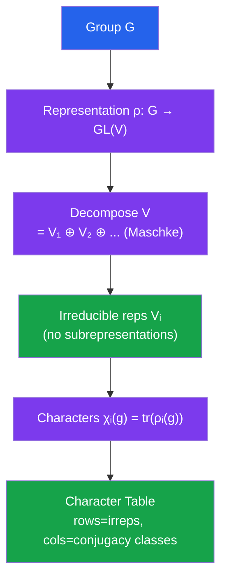

# 🎓 Representation Theory

> [!abstract] TL;DR
> Representation theory asks: how can a group act on a vector space? A representation $\rho: G \to \operatorname{GL}(V)$ makes the abstract group $G$ concrete as linear transformations — linear algebra does the heavy lifting. For finite groups over $\mathbb{C}$, every representation decomposes uniquely into irreducibles (Maschke's theorem), and the character table — a compact square matrix of traces — completely classifies all representations and carries deep number-theoretic information.

## Intuition — analogy FIRST
A group $G$ is abstract: elements and a multiplication rule. A representation lets $G$ "act" by rotating and reflecting a vector space, making the group visible as matrices. Think of the symmetries of a regular triangle ($S_3$, 6 elements) acting on $\mathbb{R}^2$ by rotations and reflections — that is a 2-dimensional representation. Irreducible representations are the indecomposable "atoms" of this action. Characters (traces of the representing matrices) are remarkably powerful invariants: two representations are isomorphic iff they have the same character.

---

## How It Works

---

## Key Concepts

### Representations
A **representation** of a group $G$ over a field $k$ is a group homomorphism:
$$\rho: G \to \operatorname{GL}(V)$$
where $V$ is a $k$-vector space. Equivalently, a **$kG$-module** structure on $V$.

- **Degree** (dimension): $\dim_k V$
- **Faithful:** $\rho$ is injective ($G$ acts without hidden equalities)
- **Trivial representation:** $\rho(g) = I$ for all $g \in G$ (every element acts as identity)
- **Regular representation** $k[G]$: $G$ acts on itself by left multiplication; $\dim = |G|$

### Subrepresentations and Irreducibility
A **subrepresentation** is a $G$-invariant subspace $W \subseteq V$: $\rho(g)w \in W$ for all $g \in G$, $w \in W$.

A representation is **irreducible** (or an **irrep**) if $V \neq 0$ and the only $G$-invariant subspaces are $0$ and $V$.

A representation is **completely reducible** if it is a direct sum of irreducibles.

### Maschke's Theorem
**Theorem:** If $G$ is finite and $\operatorname{char}(k) \nmid |G|$ (in particular, for $k = \mathbb{C}$), then every representation of $G$ is completely reducible.

*Proof sketch:* For any $G$-invariant $W \subseteq V$, find a $G$-invariant complement. Start with any complement $W'$; project $\pi: V \to W$; then $\bar\pi = \frac{1}{|G|}\sum_{g \in G} \rho(g) \circ \pi \circ \rho(g)^{-1}$ is a $G$-equivariant projection onto $W$, and $\ker(\bar\pi)$ is a $G$-invariant complement.

### Schur's Lemma
**Lemma:** Let $V, W$ be irreducible representations of $G$ and $\phi: V \to W$ a $G$-equivariant map ($\phi \circ \rho_V(g) = \rho_W(g) \circ \phi$).
1. Either $\phi = 0$ or $\phi$ is an isomorphism.
2. If $k = \mathbb{C}$ and $V = W$, then $\phi = \lambda I$ for some $\lambda \in \mathbb{C}$.

*Proof:* $\ker\phi$ and $\operatorname{im}\phi$ are subrepresentations; by irreducibility, each is $0$ or the whole space. For (2): $\phi$ has an eigenvalue $\lambda$ (over $\mathbb{C}$); $\phi - \lambda I$ is equivariant and has nontrivial kernel, so $= 0$.

**Corollary:** $\operatorname{End}_G(V) \cong \mathbb{C}$ for complex irreps $V$.

### Characters
The **character** of a representation $(V, \rho)$ is the function:
$$\chi_V: G \to \mathbb{C}, \quad \chi_V(g) = \operatorname{tr}(\rho(g))$$

**Key properties:**
- $\chi_V$ is a **class function**: constant on conjugacy classes ($\chi(hgh^{-1}) = \chi(g)$)
- $\chi_{V \oplus W} = \chi_V + \chi_W$
- $\chi_{V \otimes W} = \chi_V \cdot \chi_W$
- $\chi_{V^*}(g) = \overline{\chi_V(g)}$
- $\chi_V(e) = \dim V$

**Fundamental theorem:** Two complex representations are isomorphic iff they have the same character.

### Orthogonality Relations
Define the inner product on class functions: $\langle f_1, f_2 \rangle = \frac{1}{|G|} \sum_{g \in G} f_1(g)\overline{f_2(g)}$.

**First orthogonality:** For irreps $V_i, V_j$:
$$\langle \chi_{V_i}, \chi_{V_j} \rangle = \delta_{ij}$$

The irreducible characters form an **orthonormal basis** for the space of class functions.

**Second orthogonality:** For conjugacy classes $C_i, C_j$:
$$\sum_k \chi_{V_k}(g) \overline{\chi_{V_k}(h)} = \frac{|G|}{|C_i|} \delta_{ij} \quad (g \in C_i, h \in C_j)$$

### Character Table
The **character table** of $G$ is the square matrix where:
- **Rows** = irreducible representations
- **Columns** = conjugacy classes
- **Entry** = character value $\chi_i(C_j)$

The character table of $S_3$ ($\{e, (12), (123)\}$):

| $S_3$ | $e$ | $(12)$ | $(123)$ |
|--------|-----|--------|---------|
| **Trivial** $\mathbf{1}$ | 1 | 1 | 1 |
| **Sign** $\epsilon$ | 1 | -1 | 1 |
| **Standard** $V$ | 2 | 0 | -1 |

### Fundamental Facts
- **Number of irreps = number of conjugacy classes**
- $\sum_i (\dim V_i)^2 = |G|$ (from regular representation: $\mathbb{C}[G] \cong \bigoplus_i V_i^{\oplus \dim V_i}$)
- **Burnside's lemma:** $|G/G| = \frac{1}{|G|}\sum_{g \in G} |X^g|$ (number of orbits = average number of fixed points)

### Peter-Weyl and Pontryagin Duality
For **compact groups** $G$ (e.g., $\operatorname{SO}(n)$, $\operatorname{SU}(n)$):
- **Peter-Weyl theorem:** $L^2(G) \cong \bigoplus_{\pi} V_\pi \otimes V_\pi^*$ (Hilbert space direct sum over irreps)
- Every irrep is finite-dimensional

For **locally compact abelian groups** $A$:
- **Pontryagin duality:** $\hat{A}$ (group of characters) satisfies $\hat{\hat{A}} \cong A$
- $\widehat{\mathbb{R}} \cong \mathbb{R}$ (Fourier transform), $\widehat{\mathbb{Z}} \cong S^1$ (Fourier series), $\widehat{S^1} \cong \mathbb{Z}$

---

## Real-World Notes
- **Quantum mechanics:** Angular momentum operators $L_x, L_y, L_z$ generate $\mathfrak{so}(3)$; representations of $\operatorname{SO}(3)$ are labeled by integer $l$ with dimension $2l+1$ — these are the atomic orbitals (s, p, d, f shells).
- **Particle physics:** The Standard Model uses representations of $\operatorname{SU}(3) \times \operatorname{SU}(2) \times \operatorname{U}(1)$; quarks transform in the fundamental representation of $\operatorname{SU}(3)$ (color); $\operatorname{SU}(3)$ eightfold way organizes mesons/baryons.
- **Fourier analysis:** Fourier series on $[0, 2\pi]$ are representation theory of $S^1 = \operatorname{U}(1)$; each frequency $n$ corresponds to the 1D irrep $e^{in\theta}$. Fourier analysis on finite groups uses representation theory of finite abelian groups.
- **Signal processing:** Group-equivariant neural networks (G-CNNs) use representation theory to build architectures that are equivariant to symmetry groups, improving sample efficiency.

---

## Common Pitfalls
- **Maschke fails for $\operatorname{char}(k) \mid |G|$:** For $G = \mathbb{Z}/p\mathbb{Z}$ over $\mathbb{F}_p$, the representation $\begin{pmatrix}1 & 1 \\ 0 & 1\end{pmatrix}$ has invariant subspace but no invariant complement — **modular representation theory** is harder.
- **Character determines representation over $\mathbb{C}$ but not over $\mathbb{R}$:** Two non-isomorphic real representations can have the same complexification.
- **Second orthogonality has a normalization factor:** It is $|G|/|C_i|$, not 1 — don't forget the class sizes.
- **Irreps of product groups:** $\operatorname{Irrep}(G \times H) = \{\rho \boxtimes \sigma : \rho \in \operatorname{Irrep}(G), \sigma \in \operatorname{Irrep}(H)\}$ — the external tensor product.

---

## Related Concepts
- [[_MOC_Advanced_Topics|↑ Advanced Topics MOC]]
- [[Category_Theory]] — representations of $G$ form an abelian category $\operatorname{Rep}(G)$; Schur's lemma has a categorical statement
- [[Differential_Geometry]] — Lie group representations arise naturally; tangent space at identity = Lie algebra; representations of $\mathfrak{g}$ integrate to representations of $G$
- [[Algebraic_Geometry]] — geometric representation theory uses $D$-modules, perverse sheaves; Geometric Satake corresponds representations to geometry of affine Grassmannian

---

## Review Questions
1. Decompose the regular representation $\mathbb{C}[S_3]$ into irreducibles and verify that $\sum_i (\dim V_i)^2 = |S_3| = 6$.
2. Use Schur's lemma to prove that any representation of an abelian group over $\mathbb{C}$ decomposes into 1-dimensional irreps.
3. Find the character table of $\mathbb{Z}/4\mathbb{Z}$ and verify both orthogonality relations.
4. The spin-$\frac{1}{2}$ representation of $\operatorname{SU}(2)$ is 2-dimensional. Describe $V_{1/2} \otimes V_{1/2}$ as a direct sum of irreps using the character formula.

---

## Sources
- Serre, *Linear Representations of Finite Groups*, Ch. 1–6
- Fulton & Harris, *Representation Theory: A First Course*, Ch. 1–4
- Bröcker & tom Dieck, *Representations of Compact Lie Groups*, Ch. 1–4

#representation-theory #group-representations #character-theory #maschke-theorem #schur-lemma #irreducible-representations
