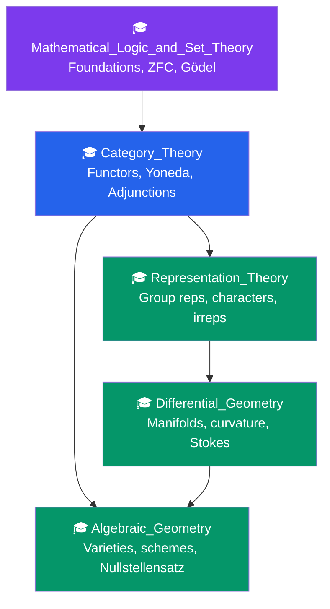

# 🎓 Advanced Topics — Map of Content

> [!abstract] Overview
> PhD-level mathematics: category theory, algebraic geometry, differential geometry, representation theory, and mathematical logic — the research frontier where all of mathematics connects. Category theory provides the unifying language; algebraic geometry merges algebra and geometry through polynomial equations; differential geometry studies curved spaces with calculus; representation theory makes groups visible as linear transformations; mathematical logic examines what is provable and what lies beyond proof. Together they represent the deepest structures human mathematics has uncovered.

---

## Learning Path

**Recommended order:** Begin with [[Mathematical_Logic_and_Set_Theory]] for the foundational bedrock, then [[Category_Theory]] as the universal language. From there, follow your interests: [[Algebraic_Geometry]] if you lean algebraic; [[Differential_Geometry]] if you lean geometric/analytic; [[Representation_Theory]] if you're drawn to symmetry and physics connections. All four eventually converge — geometric representation theory, arithmetic geometry, and higher category theory are where they meet.

---

## Notes in This Section

| Note | Difficulty | Core Ideas |
|------|-----------|------------|
| [[Category_Theory]] | PhD | Categories, functors, natural transformations, Yoneda lemma, adjunctions, monads, abelian categories |
| [[Algebraic_Geometry]] | PhD | Affine varieties, Nullstellensatz, Zariski topology, schemes, coordinate rings, cohomology |
| [[Differential_Geometry]] | Graduate | Smooth manifolds, tangent bundles, differential forms, Stokes' theorem, Riemannian metrics, curvature |
| [[Representation_Theory]] | Graduate | Group representations, irreducibility, Maschke's theorem, Schur's lemma, character tables |
| [[Mathematical_Logic_and_Set_Theory]] | PhD | ZFC axioms, ordinals, cardinals, Axiom of Choice, Continuum Hypothesis, Gödel incompleteness |

---

## Grand Unifying Themes

### The Yoneda Philosophy
In [[Category_Theory]], the Yoneda lemma says an object is determined by its relationships to everything else. This philosophy appears across all sections:
- In [[Algebraic_Geometry]]: a variety is determined by its functor of points (scheme-theoretic)
- In [[Representation_Theory]]: a group is studied through its actions on spaces
- In [[Differential_Geometry]]: a manifold is studied through maps into it (de Rham cohomology via differential forms)

### Symmetry and its Representations
[[Representation_Theory]] and [[Differential_Geometry]] (via Lie groups) are deeply intertwined: the tangent space at the identity of a Lie group is its Lie algebra, whose representations control the group's representations. This thread runs through quantum mechanics and particle physics.

### Geometry from Algebra
[[Algebraic_Geometry]] (varieties from polynomial equations) and [[Differential_Geometry]] (smooth manifolds with calculus) meet in complex geometry: smooth complex algebraic varieties are simultaneously algebraic varieties and complex manifolds. Serre's GAGA theorem makes this precise.

### Foundations and Limits
[[Mathematical_Logic_and_Set_Theory]] reveals the boundaries of what any formal system can prove. Category theory connects: a **topos** is a categorical universe with internal logic, generalizing both set theory and geometry. The independence of CH from ZFC means certain geometric/algebraic questions may have no definitive answer within standard foundations.

---

## Key Theorems at a Glance

**Yoneda Lemma:** $\operatorname{Nat}(\operatorname{Hom}(X,-), F) \cong F(X)$ — objects are determined by their morphisms.

**Hilbert's Nullstellensatz:** $I(V(J)) = \sqrt{J}$ over algebraically closed fields.

**Stokes' Theorem:** $\int_M d\omega = \int_{\partial M} \omega$ — unifies all classical integration theorems.

**Maschke's Theorem:** Every finite group representation over $\mathbb{C}$ decomposes into irreducibles.

**Gödel's First Incompleteness:** Every consistent sufficiently powerful formal system has true unprovable statements.

**Gauss-Bonnet:** $\int_M K \, dA = 2\pi\chi(M)$ — curvature determines topology.

---

## Connections to Other Vault Sections

- **[[_MOC_Number_Theory]]** — Algebraic number theory lives inside algebraic geometry (arithmetic geometry, $\operatorname{Spec}(\mathbb{Z})$); the Langlands program connects representation theory and number theory; analytic number theory uses complex analysis central to differential geometry
- **Algebra** — Modules, Galois theory, and homological algebra are prerequisites; [[Category_Theory]] provides the language for all of them
- **Topology** — Fundamental groups (representation theory), cohomology (differential geometry and algebraic geometry), and homotopy type theory (logic) all connect
- **Physics** — [[Differential_Geometry]] gives general relativity; [[Representation_Theory]] gives quantum mechanics and the Standard Model; [[Category_Theory]] provides the language for topological quantum field theory

---

## Prerequisites by Note

| Note | Prerequisites |
|------|--------------|
| [[Category_Theory]] | Abstract algebra (groups, rings, modules), comfort with abstraction |
| [[Algebraic_Geometry]] | Commutative algebra (Noetherian rings, localizations), topology, [[Category_Theory]] helpful |
| [[Differential_Geometry]] | Multivariable calculus, linear algebra, topology |
| [[Representation_Theory]] | Linear algebra, group theory, complex analysis |
| [[Mathematical_Logic_and_Set_Theory]] | Mathematical maturity; some logic background helpful |

---

## Sources and Further Reading
- Mac Lane, *Categories for the Working Mathematician* — category theory bible
- Hartshorne, *Algebraic Geometry* — the standard algebraic geometry reference
- Lee, *Introduction to Smooth Manifolds* — modern differential geometry
- Serre, *Linear Representations of Finite Groups* — concise, beautiful
- Jech, *Set Theory* — comprehensive set theory reference

#advanced-mathematics #moc #mathematics #phd-level
